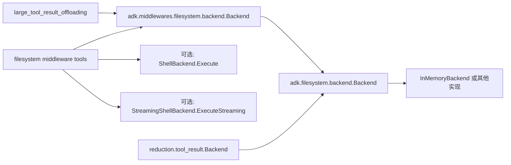

# backend_protocol_and_requests

`backend_protocol_and_requests` 模块本质上是在做一件“看起来简单、实际上很容易失控”的事情：给 Agent 提供统一、可替换、可演进的文件系统与命令执行协议。直觉上你可能会说“直接把 `os` 调用塞进 tool 不就行了”，但那样会把工具层、运行时环境、权限边界和返回格式绑死在一起。这个模块的价值在于，它把“**我要做什么文件操作**”和“**底层怎么做**”彻底解耦，形成了一个稳定协议层，让上层 middleware、tool 注册和 offloading 机制都可以在不关心具体实现（本地磁盘、内存实现、远端沙箱）的情况下工作。

---

## 这个模块要解决的核心问题

在 Agent 系统里，文件操作并不是单一场景：有时要列目录，有时要按行读取，有时要做内容检索，有时还要执行 shell 命令。更麻烦的是，这些能力既要服务交互式工具调用，也要服务“超大结果落盘”这种内部管道逻辑。若没有统一协议，不同调用路径会各自定义一套入参/出参，最后演变为“同一语义，多套格式”，维护成本和错误率都会飙升。

这个模块的设计洞见是：**先定义“能力契约”（interface + request/response struct），再让实现去适配契约**。所以它重点不是“实现文件系统”，而是“定义后端协议”。这也是为什么你看到的核心代码几乎都是接口和数据结构，而不是业务流程。

---

## 心智模型：把它当成“文件系统 RPC 协议层”

可以把这个模块想象成一个“本地化的 RPC IDL（接口描述层）”：

- `Backend` 像服务接口定义，描述了最小闭环能力（ls/read/grep/glob/write/edit）。
- `ShellBackend` 与 `StreamingShellBackend` 是能力扩展接口，相当于在基础协议上增加“命令执行”与“流式命令执行”扩展。
- `LsInfoRequest`、`ReadRequest`、`EditRequest` 等 struct 是稳定的消息格式，承担版本演进缓冲层。
- `adk.middlewares.filesystem.backend.Backend` 则是 middleware 侧的协议镜像（通过 type alias 对齐数据模型），避免上层直接耦合到更底层包路径。

用比喻说，它像一个“机场行李传送标准”：传送带（middleware/tool）只要求箱子的尺寸和标签符合标准，不关心箱子来自哪个航司（in-memory、本地 shell、远程执行器）。

---

## 架构与数据流



从依赖关系看，这个模块扮演的是“协议中枢”：

1. 上游调用方主要是文件系统 middleware 配置层：`adk.middlewares.filesystem.filesystem.Config` 中 `Backend` 字段要求注入该协议实现；并且注释明确了“如果实现了 `ShellBackend`，会额外注册 execute 工具”。这说明 execute 能力是**可选扩展**而非基础能力。
2. `large_tool_result_offloading` 组件依赖同一 `Backend` 协议写入大结果，证明协议不仅给“面向模型的工具”用，也给“内部运行时优化管道”用。
3. 下游实现可以是 `InMemoryBackend`（当前树中可见一个实现），也可以是其他实现。协议本身不关心持久化介质。
4. 另一个旁证是 `adk.middlewares.reduction.tool_result.Backend` 只抽取了 `Write` 能力且复用了 `filesystem.WriteRequest`，说明这个协议的数据结构被当作跨模块共享契约。

一个典型请求路径（以 read 为例）可以描述为：

- 上层工具参数（例如 `readFileArgs`）被反序列化后转成 `ReadRequest`。
- middleware 仅通过 `Backend.Read(ctx, *ReadRequest)` 调用，不感知底层实现。
- 实现返回字符串内容；上层再决定如何拼装 tool result（包括可能的后续 offloading/裁剪）。

关键点：**协议层只定义操作语义，不定义展示语义**。例如 `GrepRaw` 返回结构化匹配结果 `[]GrepMatch`，是否渲染为文件列表、内容片段或计数，是上层策略（见 `grepArgs.OutputMode`）的职责。

---

## 组件深潜：每个核心类型的设计意图

### `adk.filesystem.backend.Backend`

`Backend` 是基础能力集合，覆盖了文件浏览、读取、检索、路径匹配、写入与编辑。方法统一采用 `context.Context + *RequestStruct` 形式，这个选择非常关键：

- `context.Context` 让取消、超时、链路控制可穿透到底层实现；
- 指针请求 struct 而不是离散参数，给后续字段扩展留出空间，减少 breaking change；
- 每个动作一个 request type，避免“万能 map 参数”带来的弱类型和运行时错误。

### `ShellBackend`

`ShellBackend` 通过嵌入 `Backend` 并增加 `Execute(ctx, *ExecuteRequest)`，把“文件协议”扩展到“命令执行协议”。这里选择“扩展接口”而非在 `Backend` 直接加 `Execute`，体现了一个明确 tradeoff：

- 好处：不需要命令能力的实现（如纯只读/受限实现）可以保持最小实现面；
- 代价：调用方需要做 capability check（例如通过 type assertion 判断是否支持 execute）。

### `StreamingShellBackend`

`StreamingShellBackend` 再次以扩展接口形式提供 `ExecuteStreaming`，返回 `*schema.StreamReader[*ExecuteResponse]`。这意味着输出可以分段消费，而不是等待完整结果。

设计上这是对“长命令输出”场景的响应：同步聚合输出在体验和内存上都可能吃亏。流式接口把背压与增量消费能力暴露出来，但也带来更复杂的调用路径（调用方需要处理流生命周期和终止条件）。

### 请求/响应结构体族

这些 struct 的共同模式是“语义明确 + 限制显式写在字段注释中”。重要点如下：

- `LsInfoRequest.Path`：强调绝对路径语义，空串视为根目录。
- `ReadRequest`：引入 `Offset`/`Limit` 做行级窗口读取，避免一次性读取超大文件。
- `GrepRequest`：`Pattern` 明确是**literal substring**（不是 regex），这是一个很重要的正确性/复杂度取舍；`Path` + `Glob` 组合控制搜索范围。
- `GlobInfoRequest`：将路径匹配语义从内容检索中独立出来，避免 grep 承担两种职责。
- `WriteRequest`：注释说明“文件不存在则创建，存在则报错”，体现写入策略偏保守。
- `EditRequest`：`OldString` 非空、`NewString` 可空、`ReplaceAll` 控制替换策略；当 `ReplaceAll=false` 时要求唯一匹配，这是一种防误改保护。
- `ExecuteRequest`/`ExecuteResponse`：`ExitCode` 是 `*int` 而非 `int`，可表达“未知/不可用”状态；`Truncated` 显式标记输出是否被截断，避免调用方误把不完整输出当完整事实。

### `adk.middlewares.filesystem.backend.Backend`

这个接口在方法集上与 `adk.filesystem.backend.Backend` 一致，并通过 type alias 复用同一组 request/response 类型。它的意义不是“再定义一套协议”，而是提供 middleware 包内的稳定抽象边界：

- middleware 代码可以只依赖自己的 backend 子包；
- 数据模型不复制，避免双份 schema 漂移；
- 未来若 middleware 需要增加局部约束，可在不污染底层包的前提下演进。

---

## 依赖关系与契约分析

这个模块对外暴露的是契约，真正的耦合点在“方法语义”和“字段约束”。

它调用谁：从当前代码看，协议定义本身几乎不主动调用其他模块；唯一直接依赖是 `StreamingShellBackend` 的返回类型使用了 [Schema Stream](Schema Stream.md) 中的 `schema.StreamReader`。

谁调用它：

- 文件系统 middleware 配置与工具参数层（见 [filesystem_middleware_and_tool_surface](filesystem_middleware_and_tool_surface.md)）会把用户参数映射到这些 request；
- 大结果落盘链路（见 [large_tool_result_offloading_pipeline](large_tool_result_offloading_pipeline.md)）依赖 `Write`；
- 具体实现层（见 [in_memory_backend_implementation](in_memory_backend_implementation.md)）实现该协议。

数据契约最关键的隐含要求是：**注释中的路径、offset、limit、replace 语义必须由实现严格兑现**。接口层不做校验，意味着“契约执行责任”下放到了实现层与调用层。

---

## 设计取舍与背后原因

第一，选择“接口 + request struct”而不是“函数集合 + 离散参数”，明显偏向长期演进。短期会多一些类型定义，但长期可以更平滑地加字段（例如未来给 `ReadRequest` 增加编码/二进制模式）而不破坏调用签名。

第二，`Backend` 与 `ShellBackend` 分层体现了“能力分级”。这牺牲了一点调用便利（要判断是否支持 execute），换来更强的可部署性：在受限环境中你仍可以提供安全的文件能力而不暴露命令执行。

第三，`GrepRequest.Pattern` 选择 literal match 而非 regex，是把复杂性和性能风险前移控制。regex 更灵活，但代价是实现复杂度、性能不可预测性和潜在安全风险（灾难性回溯）。当前选择更可控，适合作为通用默认协议。

第四，`ExecuteResponse.Truncated` 是一个非常“工程化”的字段：它承认现实里输出可能因为平台或安全策略被截断，并把这个事实变成显式信号。相比隐式截断，这能显著降低上层决策错误。

---

## 使用方式与示例

下面示例展示如何消费协议，而不是依赖具体实现细节。

```go
func readSnippet(ctx context.Context, b filesystem.Backend, file string) (string, error) {
    return b.Read(ctx, &filesystem.ReadRequest{
        FilePath: file,
        Offset:   0,
        Limit:    200,
    })
}
```

如果你需要可选 execute 能力，建议显式做能力检测：

```go
func maybeExecute(ctx context.Context, b filesystem.Backend, cmd string) (*filesystem.ExecuteResponse, error) {
    sb, ok := any(b).(filesystem.ShellBackend)
    if !ok {
        return nil, fmt.Errorf("backend does not support Execute")
    }
    return sb.Execute(ctx, &filesystem.ExecuteRequest{Command: cmd})
}
```

在 middleware 配置侧，`Config.Backend` 是硬依赖，其他是策略项（是否开启大结果 offloading、token 阈值、路径生成器、自定义 tool 描述等）。这意味着：**协议定义稳定，行为策略在上层可配**。

---

## 新贡献者最该注意的坑

最容易踩坑的是“把注释当建议而不是契约”。例如路径应为绝对路径、`ReadRequest.Offset/Limit` 的边界语义、`EditRequest.ReplaceAll=false` 的唯一匹配约束，这些若实现不一致，会在上层表现为非常隐蔽的问题（同一工具在不同 backend 行为不一致）。

另一个常见误区是把 `Execute` 当作基础能力。实际上它只在 `ShellBackend` / `StreamingShellBackend` 中可用，middleware 是否暴露 execute tool 取决于实现能力。写调用方时必须按“可选能力”设计。

最后，`adk.middlewares.filesystem.backend.Backend` 与 `adk.filesystem.backend.Backend` 虽然方法看起来一样，但它们存在于不同包边界。做重构时要保留这种分层，不要为了“少一层”直接把 middleware 全部改为依赖底层包，否则会削弱架构隔离。

---

## 参考

- [filesystem_middleware_and_tool_surface](filesystem_middleware_and_tool_surface.md)
- [in_memory_backend_implementation](in_memory_backend_implementation.md)
- [large_tool_result_offloading_pipeline](large_tool_result_offloading_pipeline.md)
- [ADK Filesystem Middleware](ADK Filesystem Middleware.md)
- [Schema Stream](Schema Stream.md)
