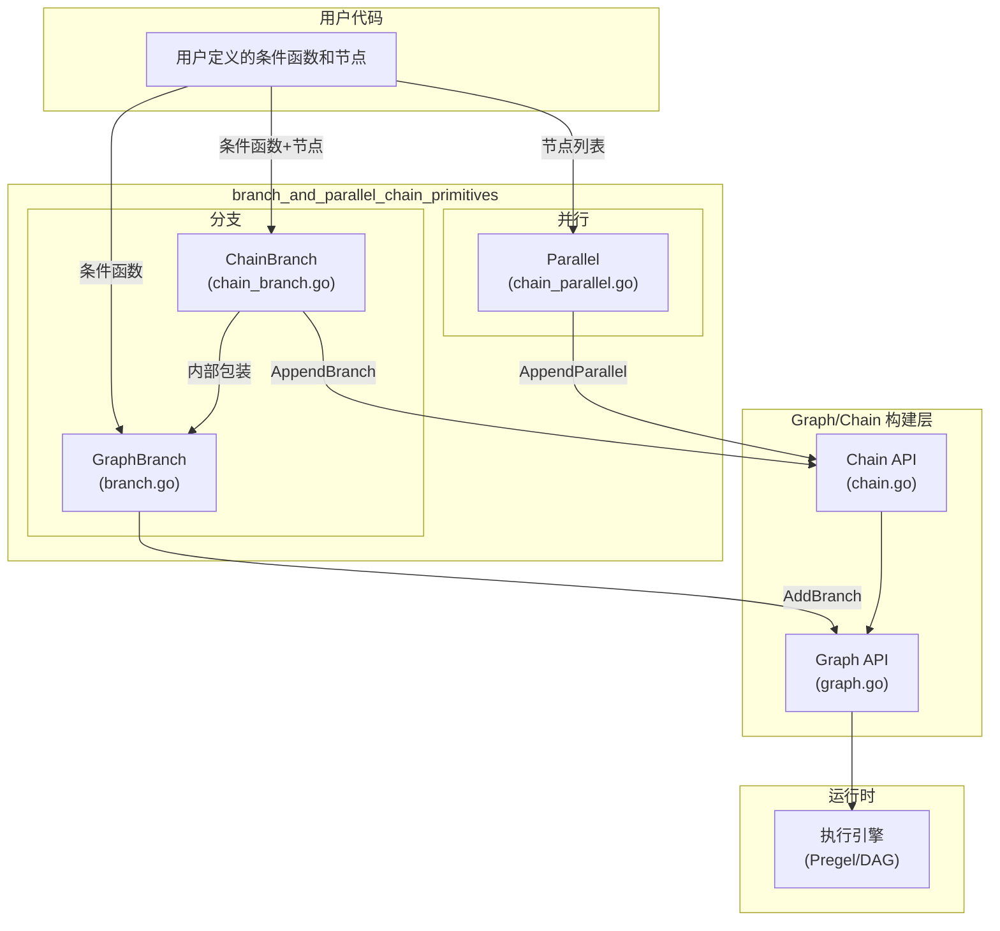
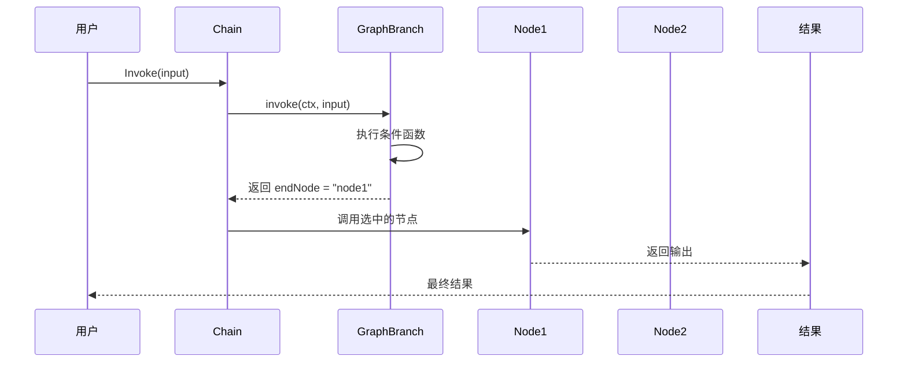
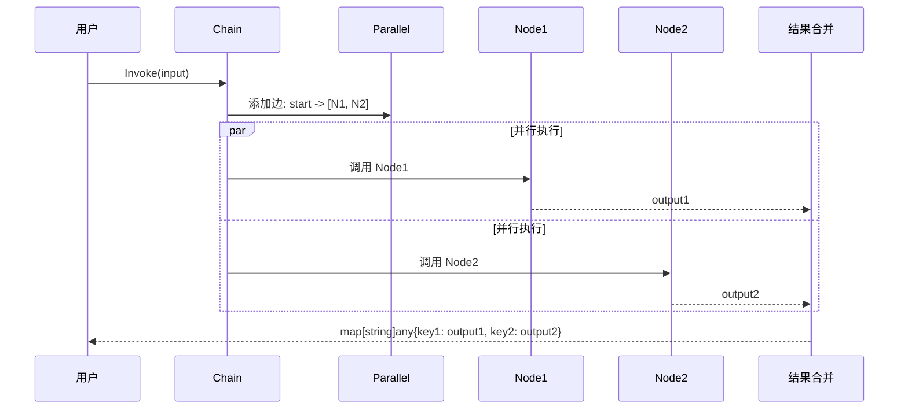

# branch_and_parallel_chain_primitives

## 模块概述

`branch_and_parallel_chain_primitives` 是 Eino 框架中用于构建**条件分支**和**并行执行**工作流的核心抽象层。想象一下一个铁路调度系统：分支就像铁轨的转辙器，根据信号决定列车的行驶方向；并行则像是一个会让站，多列列车可以同时出发、并行行驶。

在 LLM 应用中，这种模式非常常见：

- **分支**：根据用户输入的类型或内容，选择不同的处理路径（如情感分析后决定走"安慰"流程还是"解决问题"流程）
- **并行**：同时调用多个模型或执行多个独立任务以提高吞吐量（如同时调用多个 LLM 生成回复，然后从中选择最佳答案）

这个模块提供了三层抽象：

1. **GraphBranch**（底层）：图级别的分支原语，直接与 Graph API 交互
2. **ChainBranch**（中层）：Chain 风格的分支封装，提供更友好的 Builder 模式
3. **Parallel**（中层）：并行执行封装，让多个节点同时运行

---

## 架构设计



### 设计理念

**为什么需要三层抽象？**

1. **GraphBranch** 是最小原语：它只负责"给定输入，返回下一个要执行的节点"。这让它可以嵌入任何使用 Graph API 的场景。

2. **ChainBranch** 在 GraphBranch 基础上增加了"节点注册"能力：你可以像拼积木一样添加各个分支路径的节点，而无需手动管理节点 key 和连接。

3. **Parallel** 是独立原语：与分支不同，并行不涉及条件判断，它只是简单地将输入广播到多个节点，然后收集所有输出。

这种分层设计遵循了**组合优于继承**的原则：每个抽象都有明确的职责，通过组合而非继承来构建更高级的抽象。

---

## 核心组件

### 1. GraphBranch（branch.go）

**职责**：图级别的条件分支判定器

GraphBranch 是整个模块的基础，它封装了"给定输入，决定下一步去哪个节点"的逻辑：

```go
// 条件函数类型：输入 T，返回下一个节点的名字
type GraphBranchCondition[T any] func(ctx context.Context, in T) (endNode string, err error)

// 多分支条件：输入 T，返回多个可能的节点（map 用于去重）
type GraphMultiBranchCondition[T any] func(ctx context.Context, in T) (endNode map[string]bool, err error)

// 流式条件：在流式场景下，通过读取输入流的前几个 chunk 来决定路径
type StreamGraphBranchCondition[T any] func(ctx context.Context, in *schema.StreamReader[T]) (endNode string, err error)
```

**关键设计决策**：

- **为什么支持 MultiBranch？**：在复杂工作流中，一个条件可能触发多个分支（如"同时执行搜索和数据库查询"）。MultiBranch 返回 `map[string]bool` 而非切片，是为了天然去重并提供 O(1) 的成员检查。
- **为什么要区分 Stream 版本？**：对于长输入（如文档），用户可能希望在完全读完之前就开始分支判定。Stream 版本允许读取输入流的前几个 chunk 就做出决策，这对延迟敏感的场景非常重要。
- **nil 输入的特殊处理**：代码中对 `nil` 输入有特殊处理——当输入是 nil 且目标类型 T 是接口时，会创建一个 typed nil。这是 Go 语言的一个坑：未初始化的接口变量其动态类型信息会丢失，导致类型断言失败。

### 2. ChainBranch（chain_branch.go）

**职责**：Chain API 的分支构建器

ChainBranch 在 GraphBranch 基础上增加了节点注册功能，提供流式 API：

```go
cb := NewChainBranch[string](func(ctx context.Context, in string) (string, error) {
    // 根据输入决定路径
    if strings.HasPrefix(in, "hello") {
        return "greeting", nil
    }
    return "regular", nil
})

// 添加各个分支的节点
cb.AddLambda("greeting", someLambda)
cb.AddChatModel("regular", someChatModel)
```

**支持的节点类型**：

- `AddChatModel` - 添加 ChatModel 节点
- `AddChatTemplate` - 添加 ChatTemplate 节点  
- `AddToolsNode` - 添加 ToolsNode 节点
- `AddLambda` - 添加 Lambda 节点
- `AddEmbedding` - 添加 Embedding 节点
- `AddRetriever` - 添加 Retriever 节点
- `AddLoader` - 添加 Loader 节点
- `AddIndexer` - 添加 Indexer 节点
- `AddDocumentTransformer` - 添加文档转换器节点
- `AddGraph` - 嵌入子图
- `AddPassthrough` - 添加透传节点

**设计权衡**：

- ChainBranch 的 `endNodes` 参数是 nil，这与 GraphBranch（需要显式声明 endNodes）不同。这是因为在 Chain 模式下，分支节点是通过 `AddXXX` 方法动态添加的，endNodes 是隐式确定的。
- 所有 `AddXXX` 方法都返回 `*ChainBranch` 本身，支持链式调用。

### 3. Parallel（chain_parallel.go）

**职责**：并行执行多个节点

Parallel 允许同时执行多个独立节点，并将结果收集为 `map[string]any`（key 是用户指定的 outputKey）：

```go
parallel := NewParallel()
parallel.AddChatModel("openai", model1)  // 结果 key: "openai"
parallel.AddChatModel("claude", model2)  // 结果 key: "claude"

chain.AppendParallel(parallel)
```

**关键设计点**：

- **输出 key 必须唯一**：`outputKeys` map 用于在添加节点时强制检查 key 唯一性，避免结果收集时的歧义。
- **至少需要 2 个节点**：代码中明确检查 `len(p.nodes) <= 1` 会报错，因为没有并行执行的意义。
- **结果收集**：所有并行节点的输出被聚合成 `map[string]any`，下一个节点必须能接受这种 map 类型。

---

## 数据流

### 分支流程



### 并行流程



---

## 设计决策与权衡

### 1. 类型安全 vs 灵活性

**决策**：使用 Go 泛型确保编译时类型安全

```go
func NewGraphBranch[T any](condition GraphBranchCondition[T], endNodes map[string]bool) *GraphBranch
```

**权衡分析**：
- **优点**：类型错误会在编译时捕获，而不是运行时
- **代价**：需要为不同输入类型创建不同的 Branch 实例

### 2. 条件函数 vs 显式配置

**决策**：使用函数作为条件，而非枚举或配置

**权衡分析**：
- **优点**：条件逻辑可以是任意复杂的，可以包含业务逻辑、调用外部服务
- **代价**：条件函数难以序列化，这意味着分支逻辑无法被持久化后在另一台机器恢复（但对于 LLM 应用，这通常不是问题，因为条件逻辑往往与运行时上下文相关）

### 3. 错误处理策略

**决策**：延迟错误报告（Error Accumulation Pattern）

在 ChainBranch 和 Parallel 中，错误被累积在 `err` 字段中，而不是立即返回：

```go
func (cb *ChainBranch) AddLambda(...) *ChainBranch {
    if cb.err != nil {
        return cb  // 有错就短路
    }
    // ... 正常逻辑
    return cb
}
```

**权衡分析**：
- **优点**：用户可以连续添加多个节点，一次性看到所有错误
- **代价**：需要记得在编译前检查 `err` 字段

### 4. Stream 分支的"提前退出"语义

**决策**：Stream 版本允许在读取部分流后就做出分支决策

```go
type StreamGraphBranchCondition[T any] func(ctx context.Context, in *schema.StreamReader[T]) (endNode string, err error)
```

**权衡分析**：
- **优点**：对于长输入（如长文档），可以显著降低首字节延迟（TTFB）
- **代价**：如果条件逻辑需要完整输入才能做出正确决策，会导致 bug

---

## 依赖关系

这个模块位于 `compose_graph_engine/composition_api_and_workflow_primitives` 下，它依赖于：

- **schema** (`github.com/cloudwego/eino/schema`)：用于 `StreamReader` 类型
- **components**：各种组件接口（model, prompt, tools, embedding, retriever, document, indexer）
- **internal/generic**：泛型辅助工具

被以下模块使用：

- [composition_api_and_workflow_primitives](./composition_api_and_workflow_primitives.md) - 作为工作流原语
- [chain.go](./chain.md) - Chain API 的 `AppendBranch` 和 `AppendParallel`
- [graph.go](./graph.md) - Graph API 的 `AddBranch`

---

## 子模块文档

- [compose-branch](./compose-branch.md) - GraphBranch 底层实现详解
- [compose-chain_branch](./compose-chain_branch.md) - ChainBranch 构建器详解
- [compose-chain_parallel](./compose-chain_parallel.md) - Parallel 并行执行详解

---

## 新贡献者注意事项

### 常见陷阱

1. **nil 接口值的类型断言**：在 `branch.go` 中有一个针对 `nil` 输入的特殊处理：

   ```go
   if input == nil && generic.TypeOf[T]().Kind() == reflect.Interface {
       var i T
       in = i
   }
   ```
   
   如果你在编写新的条件函数时要处理 nil 输入，需要理解这个行为。

2. **endNodes 必须包含所有可能的终点**：在 GraphBranch 中，如果条件函数返回了一个不在 `endNodes` 中的节点，会触发错误。这是强制性的安全检查。

3. **ChainBranch 至少需要 2 个分支**：

   ```go
   if len(b.key2BranchNode) == 1 {
       return fmt.Errorf("append branch invalid, nodeList length = 1")
   }
   ```
   
   单分支没有意义——直接线性执行即可。

4. **Parallel 的输出 key 冲突**：添加两个相同 outputKey 的节点会立即报错。

5. **分支和并行不能嵌套在自身**：Chain 不支持嵌套分支（会导致循环依赖检测失败），这在测试用例 `TestChainBranch` 的 "nested chain" 中有体现。

### 扩展点

如果你想添加新的节点类型到 ChainBranch 或 Parallel：

1. 在对应文件中找到 `AddXXX` 方法的模式
2. 使用 `toXXXNode()` 辅助函数将组件转换为 graphNode
3. 添加 `WithOutputKey(outputKey)` 选项（对于 Parallel）
4. 调用内部的 `addNode` 方法