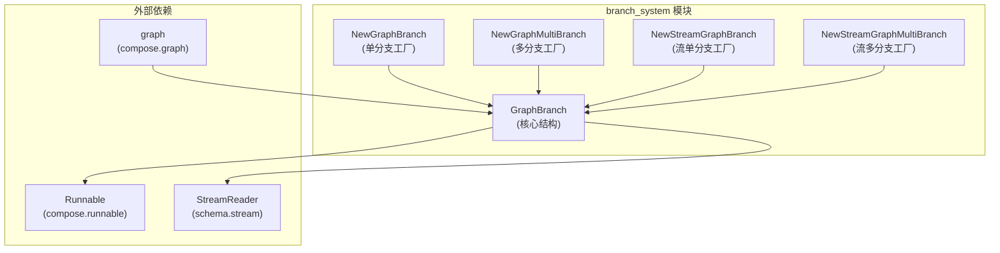

# branch_system 模块技术深入解析

## 1. 核心问题与存在意义

### 问题背景

在构建可组合的数据流图（Graph）系统时，我们经常会面临这样的场景：根据当前处理的数据状态，需要动态决定下一步执行哪个节点或哪些节点。传统的静态图结构只能描述固定的执行路径，无法处理这种条件分支的需求。

一个简单的解决方案是在节点内部直接嵌入条件逻辑，但这种方式会导致：
- 节点职责混杂（既处理业务逻辑，又负责路由决策）
- 图的整体流程不透明（路由逻辑隐藏在节点内部）
- 难以复用和调试（条件逻辑与特定节点强耦合）

### 设计洞察

`branch_system` 模块将路由决策从业务节点中解耦出来，作为一等公民（First-class Citizen）抽象成 `GraphBranch` 概念。这使得图的控制流变得显式和可配置，同时保持了节点的单一职责。

---

## 2. 心智模型与核心抽象

### 核心抽象

`branch_system` 模块的核心抽象是 `GraphBranch`，可以将其想象成**铁路道岔系统**：
- 输入数据是**驶来的列车**
- 分支条件是**道岔控制逻辑**
- 结束节点是**不同的轨道**
- `GraphBranch` 就是**道岔机构**，根据控制逻辑将列车（数据）分发到正确的轨道（后续节点）

### 关键概念

1. **分支条件（Branch Condition）**：决定选择哪些后续节点的函数
2. **结束节点（End Nodes）**：分支可以选择的有效目标节点集合
3. **单分支 vs 多分支**：选择单个目标节点 vs 选择多个目标节点
4. **普通输入 vs 流式输入**：基于完整数据做决策 vs 基于数据流做决策

---

## 3. 架构与数据流

### 组件架构图



### 数据流与执行流程

1. **分支创建阶段**：
   - 调用者通过工厂函数（如 `NewGraphBranch`）创建分支
   - 提供条件函数和允许的结束节点集合
   - 内部通过 `newGraphBranch` 初始化，包装成 `runnablePacker`

2. **图组装阶段**：
   - 通过 `graph.AddBranch()` 将分支附加到特定节点
   - 图系统记录分支的位置和目标节点

3. **运行时决策阶段**：
   - 图执行到分支节点时，调用 `GraphBranch.invoke()` 或 `GraphBranch.collect()`
   - 根据输入数据和条件函数计算出目标节点列表
   - 图系统根据返回的节点列表继续执行

---

## 4. 核心组件深入解析

### GraphBranch 结构体

`GraphBranch` 是整个模块的核心，它封装了分支的所有逻辑和状态。

```go
type GraphBranch struct {
    invoke    func(ctx context.Context, input any) (output []string, err error)
    collect   func(ctx context.Context, input streamReader) (output []string, err error)
    inputType reflect.Type
    *genericHelper
    endNodes   map[string]bool
    idx        int // 用于区分并行中的分支
    noDataFlow bool
}
```

#### 字段解析

- **`invoke`**: 处理非流式输入的条件函数，接收任意类型输入，返回目标节点列表
- **`collect`**: 处理流式输入的条件函数，接收 `streamReader`，返回目标节点列表
- **`inputType`**: 记录期望的输入类型，用于运行时类型检查
- **`genericHelper`**: 提供泛型辅助功能
- **`endNodes`**: 允许的结束节点集合，用于验证条件函数的返回值
- **`idx`**: 用于在并行场景中区分不同分支
- **`noDataFlow`**: 标记是否有数据流向后续节点

#### 关键设计点

`GraphBranch` 不直接暴露条件函数，而是通过 `invoke` 和 `collect` 两个函数字段间接调用，这种设计有两个重要好处：

1. **类型安全与动态调用的平衡**：通过工厂函数的泛型参数保证类型安全，内部通过类型断言处理 `any` 类型
2. **统一的接口**：无论单分支还是多分支，无论流式还是非流式，都通过相同的 `GraphBranch` 结构表示

### 工厂函数详解

#### NewGraphBranch - 单分支选择器

```go
func NewGraphBranch[T any](condition GraphBranchCondition[T], endNodes map[string]bool) *GraphBranch
```

**用途**：创建一个根据输入数据选择单个后续节点的分支。

**参数**：
- `condition`: 条件函数，接收 `T` 类型输入，返回单个节点名称和可能的错误
- `endNodes`: 允许的结束节点集合，用于验证返回值

**实现细节**：内部通过 `NewGraphMultiBranch` 实现，将单个节点包装成 `map[string]bool`。

#### NewGraphMultiBranch - 多分支选择器

```go
func NewGraphMultiBranch[T any](condition GraphMultiBranchCondition[T], endNodes map[string]bool) *GraphBranch
```

**用途**：创建一个根据输入数据选择多个后续节点的分支（并行执行）。

**参数**：
- `condition`: 条件函数，接收 `T` 类型输入，返回节点名称集合和可能的错误
- `endNodes`: 允许的结束节点集合，用于验证返回值

**实现要点**：
- 条件函数返回的每个节点都会被检查是否在 `endNodes` 中
- 只有验证通过的节点才会被包含在返回结果中
- 发现不允许的节点会立即返回错误

#### NewStreamGraphBranch - 流式单分支选择器

```go
func NewStreamGraphBranch[T any](condition StreamGraphBranchCondition[T], endNodes map[string]bool) *GraphBranch
```

**用途**：创建一个根据数据流选择单个后续节点的分支。

**参数**：
- `condition`: 条件函数，接收 `*schema.StreamReader[T]` 类型输入，返回单个节点名称和可能的错误
- `endNodes`: 允许的结束节点集合

**使用场景**：需要根据流的早期数据（如第一个chunk）做决策，而不需要等待整个流结束。

#### NewStreamGraphMultiBranch - 流式多分支选择器

```go
func NewStreamGraphMultiBranch[T any](condition StreamGraphMultiBranchCondition[T], endNodes map[string]bool) *GraphBranch
```

**用途**：创建一个根据数据流选择多个后续节点的分支。

### 类型安全的巧妙处理

在 `newGraphBranch` 函数中，有一段特别值得注意的类型处理逻辑：

```go
invoke: func(ctx context.Context, input any) (output []string, err error) {
    in, ok := input.(T)
    if !ok {
        // 当 nil 作为 'any' 类型传递时，其原始类型信息会丢失，
        // 变成无类型的 nil。这会导致类型断言失败。
        // 所以如果输入是 nil 且目标类型 T 是接口，我们需要显式创建类型 T 的 nil。
        if input == nil && generic.TypeOf[T]().Kind() == reflect.Interface {
            var i T
            in = i
        } else {
            panic(newUnexpectedInputTypeErr(generic.TypeOf[T](), reflect.TypeOf(input)))
        }
    }
    return r.Invoke(ctx, in)
}
```

这段代码处理了 Go 语言中一个常见的陷阱：**无类型 nil 与接口类型 nil 的区别**。当调用者传入一个无类型 nil 时，简单的类型断言会失败，但我们实际上希望它能匹配任何接口类型的 nil。

---

## 5. 依赖关系分析

### 依赖的模块

| 模块 | 用途 | 耦合方式 |
|------|------|----------|
| [compose.runnable](runnable.md) | 提供可运行组件的抽象 | `GraphBranch` 内部使用 `runnablePacker` |
| [schema.stream](schema_stream.md) | 提供流处理基础设施 | 流式分支条件函数的输入类型 |
| [compose.graph](graph_construction_and_compilation.md) | 图的构建和执行 | 图系统使用 `GraphBranch` 来做路由决策 |

### 被依赖的方式

主要被 `compose.graph` 模块使用，通过 `graph.AddBranch()` 方法将分支添加到图中。图在运行时会根据分支的决策结果来路由执行流。

### 数据契约

1. **输入契约**：分支条件函数接收的类型必须与分支节点输出的类型一致
2. **输出契约**：必须返回 `endNodes` 集合中存在的节点名称
3. **错误契约**：条件函数可以返回错误，错误会传播到图执行层

---

## 6. 设计决策与权衡

### 1. 分支作为独立结构 vs 节点的属性

**选择**：将分支设计为独立的 `GraphBranch` 结构，而不是节点的一个属性。

**权衡**：
- ✅ **优点**：解耦了路由逻辑和业务逻辑，一个节点可以有多个分支
- ❌ **缺点**：增加了概念复杂度，图的结构变得更复杂

**原因**：在复杂的工作流中，单个节点后可能需要根据不同维度做多次路由决策，独立的分支结构更灵活。

### 2. 运行时类型检查 vs 编译时类型安全

**选择**：使用泛型工厂函数保证创建时的类型安全，内部使用反射和类型断言做运行时检查。

**权衡**：
- ✅ **优点**：API 层面类型安全，同时保持了内部实现的灵活性
- ❌ **缺点**：类型错误只能在运行时发现（虽然大多在图编译时就能捕获）

**原因**：Go 的泛型还不支持在结构体字段上直接使用，这种设计是在当前语言限制下的最佳实践。

### 3. 允许选择多个节点 vs 仅允许单个节点

**选择**：同时支持单分支和多分支两种模式。

**权衡**：
- ✅ **优点**：表达能力强，可以处理条件并行的场景
- ❌ **缺点**：用户需要理解两种模式的区别，多分支后的合并逻辑也会增加复杂度

**原因**：实际业务场景中确实存在"满足条件A时执行节点X和Y"的需求。

---

## 7. 使用指南与示例

### 基础用法：单分支

```go
// 创建一个根据输入长度选择路径的分支
condition := func(ctx context.Context, in string) (string, error) {
    if len(in) > 100 {
        return "long_text_processor", nil
    }
    return "short_text_processor", nil
}

// 定义允许的结束节点
endNodes := map[string]bool{
    "long_text_processor":  true,
    "short_text_processor": true,
}

// 创建分支
branch := compose.NewGraphBranch(condition, endNodes)

// 添加到图中
graph.AddBranch("input_node", branch)
```

### 高级用法：多分支并行

```go
// 创建一个根据内容类型选择多个处理节点的分支
condition := func(ctx context.Context, in *Document) (map[string]bool, error) {
    result := make(map[string]bool)
    
    if in.HasText {
        result["text_analyzer"] = true
    }
    if in.HasImage {
        result["image_processor"] = true
    }
    if in.HasTable {
        result["table_extractor"] = true
    }
    
    return result, nil
}

endNodes := map[string]bool{
    "text_analyzer":   true,
    "image_processor": true,
    "table_extractor": true,
    "fallback":        true,
}

branch := compose.NewGraphMultiBranch(condition, endNodes)
```

### 流式分支

```go
// 创建一个根据流的第一个数据块做决策的分支
condition := func(ctx context.Context, in *schema.StreamReader[string]) (string, error) {
    // 查看第一个元素但不消耗它（实际使用时需根据 StreamReader API 调整）
    firstChunk, err := in.Peek(ctx)
    if err != nil {
        return "", err
    }
    
    if strings.HasPrefix(firstChunk, "BEGIN_STREAM") {
        return "stream_processor", nil
    }
    return "regular_processor", nil
}

branch := compose.NewStreamGraphBranch(condition, endNodes)
```

---

## 8. 边缘情况与注意事项

### 常见陷阱

1. **忘记在 endNodes 中包含所有可能的返回值**
   - 症状：运行时出现 "branch invocation returns unintended end node" 错误
   - 解决：确保条件函数可能返回的每个节点都在 endNodes 中

2. **无类型 nil 导致的类型断言失败**
   - 症状：即使传入的是 nil，仍然出现类型错误
   - 解决：代码内部已经处理了这种情况，但如果自己实现类似逻辑需要注意

3. **流式分支中消耗了流**
   - 症状：分支后的节点接收不到数据
   - 解决：在流式分支条件函数中，如果查看了流，确保将流重置或不消耗数据

### 性能考虑

- 分支条件函数应该尽量轻量，因为它会在图执行过程中被调用
- 避免在条件函数中做复杂的计算或 IO 操作
- 如果需要基于复杂计算结果做决策，考虑将计算放到单独的节点中

### 错误处理策略

分支条件函数返回的错误会直接导致图执行失败，因此：
- 对于可恢复的错误，考虑在条件函数内部处理并选择一个默认分支
- 对于不可恢复的错误，直接返回错误让上层处理
- 可以通过 `endNodes` 包含一个 "fallback" 或 "error_handler" 节点来处理异常情况

---

## 9. 总结

`branch_system` 模块通过将路由决策抽象为独立的 `GraphBranch` 结构，解决了图系统中动态流程控制的问题。它的设计体现了几个关键原则：

1. **关注点分离**：将路由逻辑与业务逻辑解耦
2. **类型安全**：通过泛型和运行时检查相结合的方式保证类型安全
3. **灵活性**：同时支持单分支、多分支、普通输入和流式输入
4. **显式性**：使图的控制流变得显式和可配置

这个模块虽然代码量不大，但它是整个 [compose](graph_construction_and_compilation.md) 图系统中实现动态工作流的关键基础设施。
