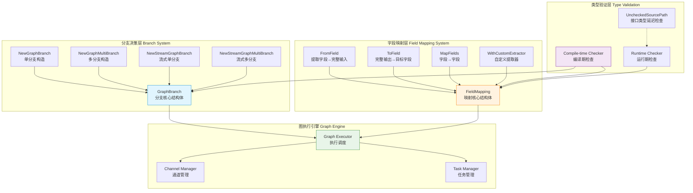
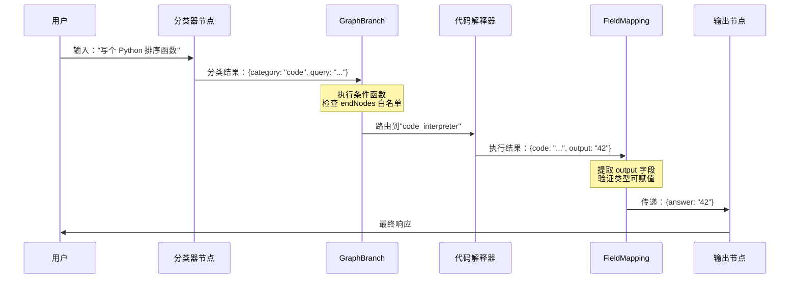
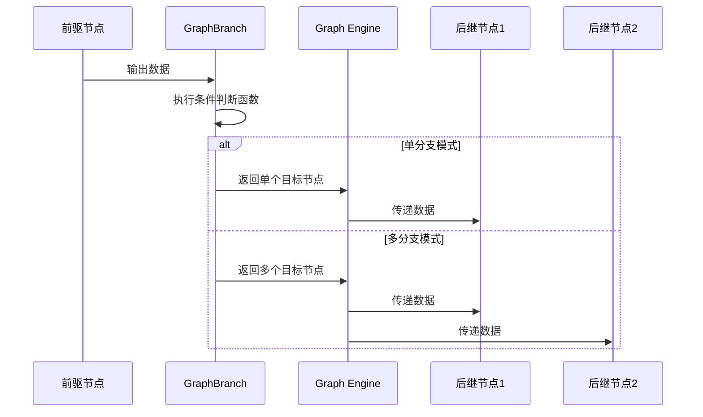
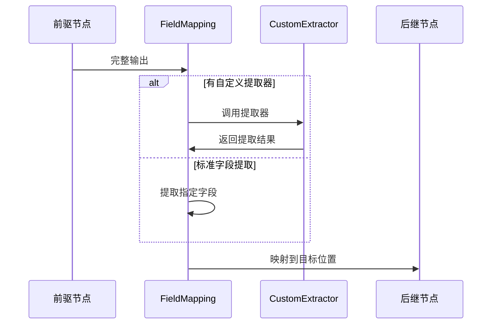

# 分支与字段映射模块 (branching_and_field_mapping)

## 模块概述

想象你正在设计一个智能工作流系统：用户输入一条消息，系统需要决定是调用代码解释器、文档检索器还是对话模型来处理它；处理完成后，又需要把结果中的特定字段提取出来传递给下一个节点。**branching_and_field_mapping** 模块正是解决这两个核心问题的"交通控制系统"——它决定数据走哪条路（分支），以及在路上如何重新打包（字段映射）。

这个模块存在的根本原因是：**在复杂的 AI 工作流中，数据流从来不是线性的**。你需要根据运行时数据动态选择路径，需要在节点之间转换数据结构，需要在流式场景下提前做出决策。如果把这些逻辑硬编码在每个节点里，系统会变得难以维护和组合。本模块将这些通用模式抽象成可复用的原语，让工作流编排变得声明式和可预测。

**核心问题空间**：
- **条件路由**：当分类器输出"这是代码问题"时，如何让数据自动流向代码解释器而非文档检索器？
- **数据转换**：当上游输出 `{result: {answer: "42"}}` 而下游需要 `{question: string, answer: string}` 时，如何声明式地定义转换规则？
- **流式决策**：当 LLM 开始输出时，如何只根据第一个 token 就决定路由，而不必等待完整响应？
- **多路扇出**：如何让同一份数据同时流向翻译服务和摘要服务进行并行处理？

---

## 架构设计

### 架构全景图



### 架构解读

该模块由四个相互协作的层次组成，每一层都有明确的职责边界：

**1. 分支决策层（蓝色）**：这是模块的"决策大脑"
- `GraphBranch` 是核心抽象，封装了条件判断逻辑和目标节点白名单
- 四种构造函数覆盖了两组正交维度：**单选择 vs 多选择** × **批处理 vs 流式处理**
- 关键设计：分支条件函数返回的是**目标节点名称列表**，而非直接执行逻辑，这使得决策与执行解耦

**2. 字段映射层（橙色）**：这是模块的"数据转换器"
- `FieldMapping` 定义了从源字段到目标字段的映射规则
- 支持三种映射模式：`FromField`（提取部分）、`ToField`（注入部分）、`MapFields`（点对点）
- 关键设计：使用反射动态访问字段，支持嵌套路径（如 `user.profile.name`）和 map 键访问

**3. 类型验证层（紫色）**：这是模块的"质量守门员"
- 编译期检查：在图编译阶段验证字段路径存在性和类型可赋值性
- 运行期检查：对于 `interface{}` 类型，延迟到实际执行时验证
- `uncheckedSourcePath` 机制：记录因接口类型无法在编译期验证的路径，在运行时插入 checker

**4. 图执行引擎（绿色）**：这是模块的"消费者"
- 消费分支和映射配置，实际调度数据流动
- `Channel Manager` 处理多分支场景下的数据分发
- `Task Manager` 管理分支后的并行任务执行

### 数据流追踪：端到端示例

让我们追踪一个典型场景的完整数据流：

**场景**：用户输入 → 分类器 → （分支）→ 代码解释器 → 结果提取 → 输出



**关键观察点**：
1. 分支决策发生在分类器完成后，但代码解释器执行前——这是**控制流**的转折点
2. 字段映射发生在代码解释器完成后，但输出节点执行前——这是**数据流**的转换点
3. 每个转换点都有类型检查（编译期或运行期）——这是**安全网**

---

## 核心设计决策与权衡

### 决策 1：为什么区分单分支和多分支？

**设计选择**：模块提供了 `NewGraphBranch`（单选）和 `NewGraphMultiBranch`（多选）两套 API。

```go
// 单分支：返回单个节点名
type GraphBranchCondition[T any] func(ctx context.Context, in T) (endNode string, err error)

// 多分支：返回多个节点名的集合
type GraphMultiBranchCondition[T any] func(ctx context.Context, in T) (endNode map[string]bool, err error)
```

**背后的权衡**：
- **单选分支**语义清晰：数据只走一条路，适合互斥的场景（如"分类为 A 则走路径 A，分类为 B 则走路径 B"）
- **多选分支**支持扇出：数据可以同时走多条路，适合并行处理（如"同时调用翻译服务和摘要服务"）

**为什么不是只用多选分支**：单选分支的 API 更简单（返回 `string` 而非 `map[string]bool`），减少了用户的认知负担和出错概率。这是一种"为常见场景优化，为特殊场景留后门"的设计。

**实现细节**：注意 `NewGraphBranch` 内部实际上调用了 `NewGraphMultiBranch`，将单值包装成 map：
```go
func NewGraphBranch[T any](condition GraphBranchCondition[T], endNodes map[string]bool) *GraphBranch {
    return NewGraphMultiBranch(func(ctx context.Context, in T) (endNode map[string]bool, err error) {
        ret, err := condition(ctx, in)
        if err != nil {
            return nil, err
        }
        return map[string]bool{ret: true}, nil  // 包装成 map
    }, endNodes)
}
```
这种"薄包装"设计减少了代码重复，同时保持了 API 的清晰性。

---

### 决策 2：为什么流式分支需要独立的类型？

**设计选择**：`StreamGraphBranchCondition` 接收 `*schema.StreamReader[T]` 而非普通值。

**背后的原因**：在 LLM 输出场景中，你可能只想消费第一个 token 就决定路由（例如看到"```"就路由到代码解释器），而不必等待完整响应。

```go
// 流式分支条件：可以只读取第一个 chunk 就做决策
condition := func(ctx context.Context, in *schema.StreamReader[T]) (string, error) {
    firstChunk, err := in.Recv()  // 只消费一个 chunk
    if err != nil {
        return "", err
    }
    if strings.HasPrefix(firstChunk, "```") {
        return "code_handler", nil
    }
    return "text_handler", nil
}
```

**代价与陷阱**：
- 一旦消费了 stream，原始数据就被消耗了
- 下游节点将**收不到已被条件函数消费的 chunk**
- 这是有意为之的设计——流式分支的本质就是"提前消费部分数据做决策"

**替代方案**：可以设计一个"peek"接口让用户预览 stream 而不消耗它，但这会增加实现复杂度和内存开销（需要缓冲已 peek 的数据）。当前设计把控制权完全交给用户，假设他们清楚自己在做什么。

---

### 决策 3：字段映射的"全量映射独占"规则

**设计选择**：一旦使用了 `FromField`（将单个字段映射到整个后继输入），就不能再添加其他映射。

**背后的原因**：这是一个逻辑约束——如果你已经把字段 A 的值作为整个输入传递给下一个节点，那么再映射字段 B 就没有意义了（下一个节点只能接收一个输入）。

```go
// 合法：只映射一个字段到整个输入
mapping1 := compose.FromField("result")

// 非法：已经映射了整个输入，不能再映射其他字段
mapping2 := compose.MapFields("metadata", "meta")  // 运行时会冲突
```

这种约束在编译期捕获用户的逻辑错误，避免运行时困惑。

---

### 决策 4：编译期检查 vs 运行期检查的平衡

**设计选择**：模块尽可能在编译期验证字段路径和类型匹配，但对于 `interface{}` 类型会延迟到运行期检查。

```go
// 编译期可以验证：具体结构体类型
type Input struct {
    Name string  // ✓ 可以验证字段存在
}

// 运行期才能验证：接口类型
type Input struct {
    Data interface{}  // ✗ 无法在编译期知道实际类型
}
```

**实现机制**：`validateFieldMapping` 函数会遍历所有映射，尝试解析字段路径。如果遇到 `interface{}`，它会记录 `uncheckedSourcePath`，并在实际执行时插入 runtime checker。

**背后的权衡**：
- **编译期检查**：快速失败，开发体验好，但要求类型信息完整
- **运行期检查**：支持动态类型和接口，但错误发现晚

这是一种"能早则早，不能早则晚"的务实策略。

---

### 决策 5：路径分隔符的选择

**设计选择**：使用 `\x1F`（Unit Separator，ASCII 31）作为字段路径的分隔符，而非更常见的 `.`。

```go
// 内部表示：user\x1Fprofile\x1Fname
// 用户 API：FieldPath{"user", "profile", "name"}
```

**背后的原因**：用户定义的字段名可能包含 `.`（虽然不常见但合法），但几乎不可能包含 ASCII 控制字符。这避免了转义逻辑的复杂性，是一种"选择用户不会用的字符"的简单方案。

**注意事项**：
- 不要直接在字符串中使用 `\x1F` 来构造路径，应该使用 `FieldPath` 类型
- 如果字段名真的包含特殊字符，使用 `WithCustomExtractor` 绕过标准路径解析

---

### 决策 6：endNodes 白名单约束

**设计选择**：创建分支时必须指定允许的 `endNodes` 白名单，条件函数返回的节点必须在这个集合中。

```go
endNodes := map[string]bool{
    "code_interpreter": true,
    "doc_retriever": true,
}
branch := compose.NewGraphBranch(condition, endNodes)
```

**如果条件函数返回了不在白名单中的节点**：
```go
// 条件函数返回了"unknown_node"
// 运行时会报错：branch invocation returns unintended end node: unknown_node
```

**设计意图**：这是安全约束，防止条件函数逻辑错误导致数据路由到意外节点。将白名单声明在分支创建处，使得允许的路径在代码中一目了然。

**替代方案**：可以不设白名单，让条件函数返回任意节点名。但这会增加调试难度——当拼写错误导致路由到不存在的节点时，错误可能在很晚才暴露。

---

## 4. 数据流程解析

### 4.1 分支执行流程



### 4.2 字段映射流程



---

## 5. 设计决策与权衡

### 5.1 分支系统设计

**决策**：将条件判断逻辑封装在 `GraphBranch` 结构体中，而不是直接使用函数

**原因**：
- 提供类型安全的接口
- 支持流式和非流式两种模式
- 便于进行端点验证和编译时检查

**权衡**：
- ✅ 优点：API 更清晰，类型安全，功能完整
- ❌ 缺点：增加了一层抽象，简单场景下可能显得有些冗余

### 5.2 字段路径分隔符选择

**决策**：使用 Unit Separator (`\x1F`) 而不是常见的 `.` 作为路径分隔符

**原因**：
- 避免与包含 `.` 的字段名冲突
- 这是一个标准的 ASCII 控制字符，设计用于分隔数据项

**权衡**：
- ✅ 优点：几乎不会与用户定义的字段名冲突
- ❌ 缺点：不够直观，需要特殊的 API 来构建和解析路径

### 5.3 类型检查时机

**决策**：尽可能在编译时进行类型检查，将无法在编译时检查的部分延迟到运行时

**原因**：
- 提前发现错误，减少运行时故障
- 对于包含接口类型的路径，无法在编译时确定最终类型，必须延迟到运行时

**权衡**：
- ✅ 优点：大部分错误可以在开发阶段发现
- ❌ 缺点：实现复杂，需要维护两套检查逻辑

### 5.4 值合并策略

**决策**：为 map 类型提供默认合并行为，其他类型需要用户注册自定义函数

**原因**：
- map 的合并语义相对明确（合并键值对）
- 其他类型的合并语义高度依赖具体场景，无法提供通用实现

**权衡**：
- ✅ 优点：常见场景开箱即用，特殊场景灵活可定制
- ❌ 缺点：用户需要了解并记住这个机制，否则可能遇到运行时错误

---

## 6. 使用指南与最佳实践

### 6.1 分支使用示例

```go
// 示例：根据输入内容选择不同的处理路径
condition := func(ctx context.Context, in string) (string, error) {
    if strings.HasPrefix(in, "query:") {
        return "query_processor", nil
    }
    return "default_processor", nil
}

endNodes := map[string]bool{
    "query_processor": true,
    "default_processor": true,
}

branch := compose.NewGraphBranch(condition, endNodes)
graph.AddBranch("input_analyzer", branch)
```

### 6.2 字段映射使用示例

```go
// 示例 1：简单字段映射
graph.AddEdge("user_fetcher", "profile_renderer", 
    compose.MapFields("user.profile", "input"))

// 示例 2：嵌套字段路径
graph.AddEdge("order_processor", "notification_sender",
    compose.MapFieldPaths(
        compose.FieldPath{"order", "customer", "email"},
        compose.FieldPath{"recipient", "address"}))

// 示例 3：自定义提取器
graph.AddEdge("data_source", "analytics",
    compose.ToField("data", 
        compose.WithCustomExtractor(func(input any) (any, error) {
            raw := input.(*RawData)
            return processRawData(raw), nil
        })))
```

### 6.3 值合并注册示例

```go
// 示例：为自定义类型注册合并函数
type SearchResult struct {
    Items []Item
    Total int
}

compose.RegisterValuesMergeFunc(func(results []SearchResult) (SearchResult, error) {
    merged := SearchResult{
        Items: make([]Item, 0),
        Total: 0,
    }
    
    for _, r := range results {
        merged.Items = append(merged.Items, r.Items...)
        merged.Total += r.Total
    }
    
    return merged, nil
})
```

### 6.4 常见陷阱与注意事项

1. **分支端点必须预先声明**：确保条件函数返回的所有节点名称都在 `endNodes` 映射中

2. **字段名区分大小写**：Go 的结构体字段名是区分大小写的，映射时要注意

3. **未导出字段无法访问**：确保要映射的字段是导出的（首字母大写）

4. **自定义合并函数线程安全**：如果在并发环境中使用，确保自定义合并函数是线程安全的

5. **接口类型延迟检查**：如果路径中包含接口类型，类型检查会延迟到运行时，要注意处理可能的错误

---

## 7. 子模块与相关组件

该模块由两个核心子系统组成，每个都有详细的专门文档：

- [graph_branch](graph_branch.md)：智能路由系统，详细介绍 `GraphBranch` 的实现机制、条件判断逻辑、流式分支支持和内部工作原理
- [field_mapping](field_mapping.md)：数据结构转换器，深入解析 `FieldMapping` 的字段提取、赋值逻辑、类型检查机制和自定义提取器

该模块也是 [Compose Graph Engine](graph_construction_and_compilation.md) 的核心组成部分，与以下子模块紧密协作：

- [Graph Construction and Compilation](graph_construction_and_compilation.md)：负责图的构建和编译，在编译阶段会验证分支和字段映射的正确性
- [Runtime Execution Engine](runtime_execution_engine.md)：负责图的运行时执行，实际应用分支逻辑和字段映射
- [Channel and Task Management](channel_and_task_management.md)：处理多分支场景下的任务分发和数据传递

---

## 8. 总结

`branching_and_field_mapping` 模块是 Compose Graph Engine 的"神经系统"，它赋予了图计算流程智能决策和灵活数据转换的能力。通过将条件路由和数据映射逻辑从节点内部剥离出来，该模块使节点更加专注于自己的核心职责，提高了整个系统的模块化程度和可复用性。

该模块的设计体现了"关注点分离"和"配置优于实现"的原则：复杂的数据流逻辑通过声明式的配置来定义，而不是硬编码在节点中。这种设计使得图计算流程更加灵活、可维护，也更容易可视化和理解。
