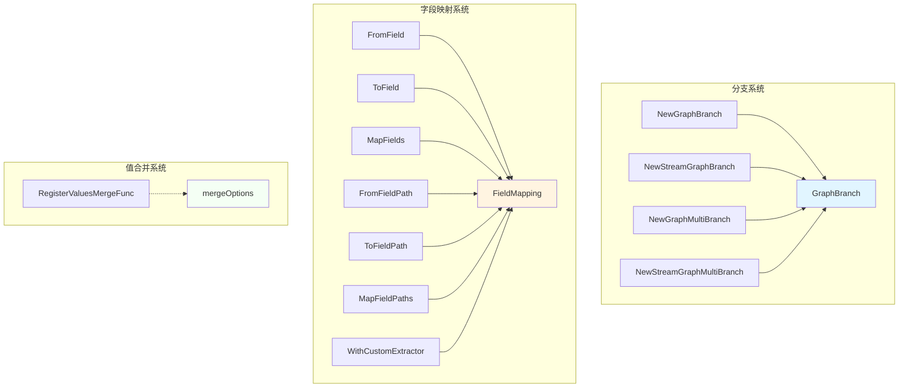
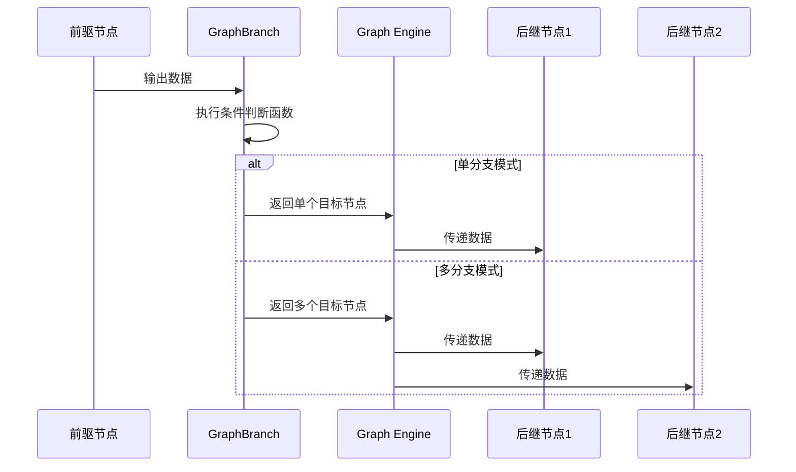
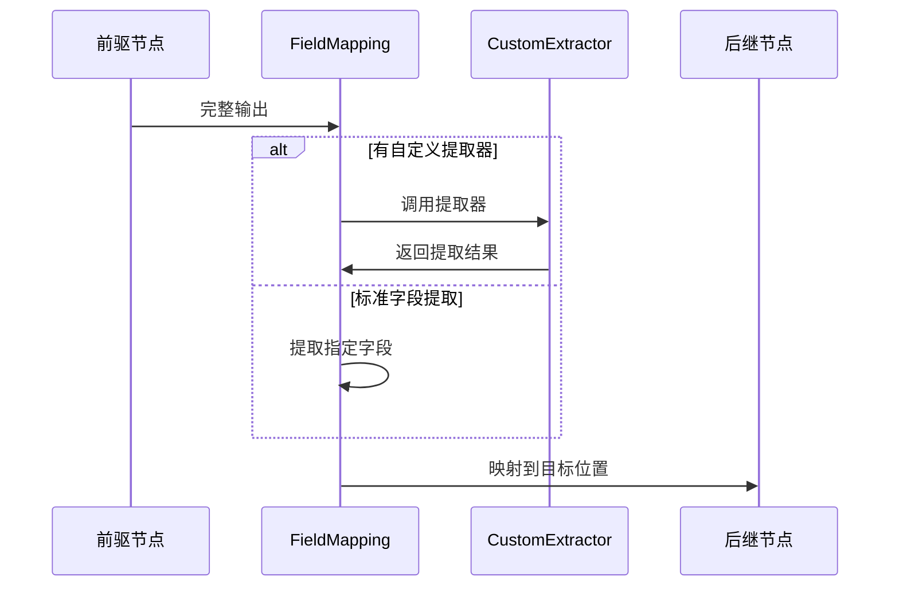

# 分支与字段映射模块 (branching_and_field_mapping)

## 1. 模块概览

在构建复杂的图计算流程时，我们经常面临两个核心问题：
1. **如何根据数据动态选择执行路径**（条件分支）
2. **如何在节点之间灵活地传递数据**（字段映射）

`branching_and_field_mapping` 模块正是为了解决这两个问题而设计的。它为 Compose Graph Engine 提供了动态路由和数据转换的能力，使图结构能够根据输入数据的特性智能地选择执行路径，并在节点之间精确地传递和转换数据。

**核心功能**：
- 支持单分支和多分支条件选择
- 支持流式和非流式数据的分支判断
- 提供灵活的字段映射机制，支持嵌套字段和自定义提取器
- 支持多输入值的合并策略

---

## 2. 架构设计

### 2.1 核心组件关系图



### 2.2 架构解析

该模块由三个相互协作的子系统组成：

1. **分支系统**：由 `GraphBranch` 结构体主导，提供条件路由能力
2. **字段映射系统**：由 `FieldMapping` 结构体主导，处理数据转换
3. **值合并系统**：由 `mergeOptions` 配置和 `RegisterValuesMergeFunc` 组成，处理多输入合并

这些组件共同工作，使图计算引擎能够：
- 根据输入数据动态选择执行路径
- 在节点之间精确传递和转换数据
- 合并来自多个前驱节点的输出

---

## 3. 核心组件详解

### 3.1 GraphBranch - 动态路由核心

`GraphBranch` 是分支系统的核心结构体，它封装了条件判断逻辑和执行路径选择。

#### 设计意图

想象一下图计算流程中的"决策点"：当数据到达某个节点后，我们需要根据数据的内容决定下一步走向哪个节点。`GraphBranch` 就像是这个决策点的"交通信号灯"，它根据预设的条件和输入数据，指挥数据流向下一个或多个节点。

#### 核心特性

1. **类型安全的条件判断**：使用泛型确保条件函数接收正确类型的输入
2. **支持单分支和多分支**：既可以选择单一执行路径，也可以同时选择多个路径
3. **流式与非流式支持**：可以处理完整数据，也可以处理流式数据
4. **端点验证**：确保分支条件返回的节点名称在预定义的允许列表中

#### 关键构造函数

```go
// 单分支选择 - 返回单个节点名称
NewGraphBranch[T any](condition GraphBranchCondition[T], endNodes map[string]bool) *GraphBranch

// 多分支选择 - 返回多个节点名称
NewGraphMultiBranch[T any](condition GraphMultiBranchCondition[T], endNodes map[string]bool) *GraphBranch

// 流式单分支选择
NewStreamGraphBranch[T any](condition StreamGraphBranchCondition[T], endNodes map[string]bool) *GraphBranch

// 流式多分支选择
NewStreamGraphMultiBranch[T any](condition StreamGraphMultiBranchCondition[T], endNodes map[string]bool) *GraphBranch
```

#### 内部实现机制

`GraphBranch` 内部维护了两个核心函数：
- `invoke`：处理非流式输入，返回目标节点列表
- `collect`：处理流式输入，返回目标节点列表

这种设计使得同一个 `GraphBranch` 实例可以同时支持流式和非流式两种执行模式。

---

### 3.2 FieldMapping - 数据转换的桥梁

`FieldMapping` 是字段映射系统的核心，它定义了如何从前驱节点的输出中提取数据，并将其映射到后继节点的输入中。

#### 设计意图

在图计算中，不同节点通常有不同的输入输出格式。如果没有字段映射，我们需要在每个节点内部编写大量的转换代码，这会导致节点耦合度高、复用性差。

`FieldMapping` 就像是节点之间的"适配器"，它将数据转换逻辑从节点内部剥离出来，放在边（Edge）上定义，使节点本身更加专注于自己的核心逻辑。

#### 核心特性

1. **灵活的映射方式**：
   - `FromField`：从前驱节点的某个字段映射到后继节点的整个输入
   - `ToField`：从前驱节点的整个输出映射到后继节点的某个字段
   - `MapFields`：从前驱节点的某个字段映射到后继节点的某个字段

2. **嵌套字段支持**：使用 `FieldPath` 可以访问嵌套的字段，如 `user.profile.name`

3. **自定义提取器**：通过 `WithCustomExtractor` 可以定义复杂的数据提取逻辑

4. **编译时类型检查**：在图编译阶段尽可能验证字段映射的正确性

#### 字段路径表示

`FieldMapping` 使用特殊的 Unit Separator 字符 (`\x1F`) 作为路径分隔符，这是一个极少在用户定义的字段名中出现的字符，避免了与常见分隔符（如 `.`）的冲突。

```go
// 示例：访问嵌套字段
FieldPath{"user", "profile", "name"}  // 表示 user.profile.name
```

#### 内部工作流程

1. **编译时验证**：
   - 检查前驱节点类型是否有指定字段
   - 检查后继节点类型是否有目标字段
   - 验证字段类型是否可赋值

2. **运行时转换**：
   - 从前驱输出中提取指定字段
   - （可选）通过自定义提取器处理数据
   - 将数据赋值到后继输入的指定位置

---

### 3.3 值合并系统 - 多输入协调

当一个节点有多个前驱节点时，我们需要一种机制来合并这些前驱的输出。值合并系统正是为此而设计的。

#### 设计意图

想象一个"汇总节点"，它需要从多个来源收集数据然后进行处理。值合并系统就像是这个汇总节点的"数据整理员"，它按照预设的规则将来自不同来源的数据整合成一个统一的输入。

#### 核心组件

1. **RegisterValuesMergeFunc**：为特定类型注册自定义合并函数
2. **mergeOptions**：配置合并行为，如是否在流式合并中保留来源信息

#### 合并策略

系统支持两种主要的合并场景：

1. **非流式值合并**：当所有前驱都是非流式节点时，直接合并它们的最终输出
2. **流式值合并**：当前驱是流式节点时，合并它们的流数据

对于 map 类型，系统提供了默认的合并行为；对于其他类型，用户需要通过 `RegisterValuesMergeFunc` 注册自定义合并函数。

---

## 4. 数据流程解析

### 4.1 分支执行流程



### 4.2 字段映射流程



---

## 5. 设计决策与权衡

### 5.1 分支系统设计

**决策**：将条件判断逻辑封装在 `GraphBranch` 结构体中，而不是直接使用函数

**原因**：
- 提供类型安全的接口
- 支持流式和非流式两种模式
- 便于进行端点验证和编译时检查

**权衡**：
- ✅ 优点：API 更清晰，类型安全，功能完整
- ❌ 缺点：增加了一层抽象，简单场景下可能显得有些冗余

### 5.2 字段路径分隔符选择

**决策**：使用 Unit Separator (`\x1F`) 而不是常见的 `.` 作为路径分隔符

**原因**：
- 避免与包含 `.` 的字段名冲突
- 这是一个标准的 ASCII 控制字符，设计用于分隔数据项

**权衡**：
- ✅ 优点：几乎不会与用户定义的字段名冲突
- ❌ 缺点：不够直观，需要特殊的 API 来构建和解析路径

### 5.3 类型检查时机

**决策**：尽可能在编译时进行类型检查，将无法在编译时检查的部分延迟到运行时

**原因**：
- 提前发现错误，减少运行时故障
- 对于包含接口类型的路径，无法在编译时确定最终类型，必须延迟到运行时

**权衡**：
- ✅ 优点：大部分错误可以在开发阶段发现
- ❌ 缺点：实现复杂，需要维护两套检查逻辑

### 5.4 值合并策略

**决策**：为 map 类型提供默认合并行为，其他类型需要用户注册自定义函数

**原因**：
- map 的合并语义相对明确（合并键值对）
- 其他类型的合并语义高度依赖具体场景，无法提供通用实现

**权衡**：
- ✅ 优点：常见场景开箱即用，特殊场景灵活可定制
- ❌ 缺点：用户需要了解并记住这个机制，否则可能遇到运行时错误

---

## 6. 使用指南与最佳实践

### 6.1 分支使用示例

```go
// 示例：根据输入内容选择不同的处理路径
condition := func(ctx context.Context, in string) (string, error) {
    if strings.HasPrefix(in, "query:") {
        return "query_processor", nil
    }
    return "default_processor", nil
}

endNodes := map[string]bool{
    "query_processor": true,
    "default_processor": true,
}

branch := compose.NewGraphBranch(condition, endNodes)
graph.AddBranch("input_analyzer", branch)
```

### 6.2 字段映射使用示例

```go
// 示例 1：简单字段映射
graph.AddEdge("user_fetcher", "profile_renderer", 
    compose.MapFields("user.profile", "input"))

// 示例 2：嵌套字段路径
graph.AddEdge("order_processor", "notification_sender",
    compose.MapFieldPaths(
        compose.FieldPath{"order", "customer", "email"},
        compose.FieldPath{"recipient", "address"}))

// 示例 3：自定义提取器
graph.AddEdge("data_source", "analytics",
    compose.ToField("data", 
        compose.WithCustomExtractor(func(input any) (any, error) {
            raw := input.(*RawData)
            return processRawData(raw), nil
        })))
```

### 6.3 值合并注册示例

```go
// 示例：为自定义类型注册合并函数
type SearchResult struct {
    Items []Item
    Total int
}

compose.RegisterValuesMergeFunc(func(results []SearchResult) (SearchResult, error) {
    merged := SearchResult{
        Items: make([]Item, 0),
        Total: 0,
    }
    
    for _, r := range results {
        merged.Items = append(merged.Items, r.Items...)
        merged.Total += r.Total
    }
    
    return merged, nil
})
```

### 6.4 常见陷阱与注意事项

1. **分支端点必须预先声明**：确保条件函数返回的所有节点名称都在 `endNodes` 映射中

2. **字段名区分大小写**：Go 的结构体字段名是区分大小写的，映射时要注意

3. **未导出字段无法访问**：确保要映射的字段是导出的（首字母大写）

4. **自定义合并函数线程安全**：如果在并发环境中使用，确保自定义合并函数是线程安全的

5. **接口类型延迟检查**：如果路径中包含接口类型，类型检查会延迟到运行时，要注意处理可能的错误

---

## 7. 子模块与相关组件

该模块由三个主要子系统组成，每个都有详细的专门文档：

- [分支系统](branch_system.md)：详细介绍 `GraphBranch` 的实现机制、条件判断逻辑和内部工作原理
- [字段映射系统](field_mapping_system.md)：深入解析 `FieldMapping` 的字段提取、赋值逻辑和类型检查机制
- [值合并系统](value_merge_system.md)：解释多输入值合并的策略、自定义合并函数的注册和使用方式

该模块也是 [Compose Graph Engine](compose_graph_engine.md) 的核心组成部分，与以下子模块紧密协作：

- [Graph Construction and Compilation](graph_construction_and_compilation.md)：负责图的构建和编译，在编译阶段会验证分支和字段映射的正确性
- [Runtime Execution Engine](runtime_execution_engine.md)：负责图的运行时执行，实际应用分支逻辑和字段映射
- [Channel and Task Management](channel_and_task_management.md)：处理多分支场景下的任务分发和数据传递

---

## 8. 总结

`branching_and_field_mapping` 模块是 Compose Graph Engine 的"神经系统"，它赋予了图计算流程智能决策和灵活数据转换的能力。通过将条件路由和数据映射逻辑从节点内部剥离出来，该模块使节点更加专注于自己的核心职责，提高了整个系统的模块化程度和可复用性。

该模块的设计体现了"关注点分离"和"配置优于实现"的原则：复杂的数据流逻辑通过声明式的配置来定义，而不是硬编码在节点中。这种设计使得图计算流程更加灵活、可维护，也更容易可视化和理解。
