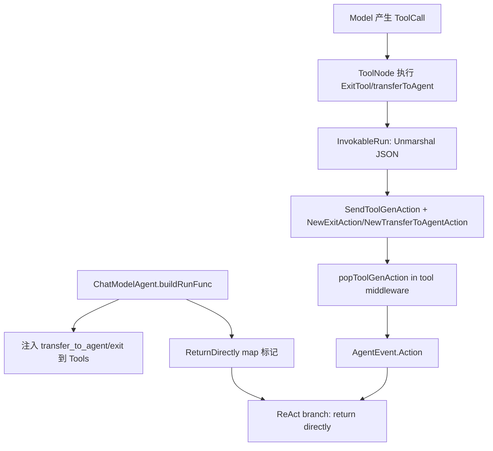

# builtin_control_tools_and_handoff

`builtin_control_tools_and_handoff`（对应 `adk.chatmodel.ExitTool` 与 `adk.chatmodel.transferToAgent`）本质上是在 `ChatModelAgent` 里内置了两个“控制杆”：一个是 **Exit**（结束当前 agent），一个是 **Transfer**（把控制权交给另一个 agent）。它解决的问题不是“工具怎么调用”，而是“如何把控制流决策从不可靠的自然语言，升级为可检查、可恢复、可编排的结构化动作”。如果没有这层，模型只能在文本里说“我结束了”或“我转给 A”，系统并不能可靠地据此改变执行图；而这个模块通过标准 tool call + `AgentAction`，把控制流变成了执行引擎可以消费的硬信号。

## 先看问题空间：为什么必须做成内置控制工具

在多轮 ReAct 里，模型每轮都可能产生 `ToolCall`。普通业务工具（查天气、查文件）只影响数据；但 `exit` / `transfer_to_agent` 影响的是**流程本身**。这两类如果也当普通文本处理，会有三个直接问题：

第一，语义不稳定。模型输出“我已经完成”不等于运行时真正结束；模型输出“转给 billing agent”也不等于路由层真切换。系统需要的是可机读、可校验的动作，而不是语义猜测。

第二，中断恢复不可控。`ChatModelAgent` 运行在 checkpoint/resume 框架上，恢复后需要知道“上次是普通工具结果，还是流程动作”。纯文本无法安全恢复控制意图。

第三，事件流会失真。上层消费的是 `AgentEvent`，动作（`Action.Exit` / `Action.TransferToAgent`）必须跟 tool result 同步输出，才能让 `Runner` 和外层编排器做一致决策。

所以这里的设计洞察是：**把控制流语义封装进最小、固定、内置的工具协议**，并通过 `SendToolGenAction` 绑定到当前工具调用上下文，再由 ReAct 回调桥接为标准 `AgentEvent.Action`。

## 心智模型：把它当成“流程红绿灯”，不是普通业务工具

可以把 `ExitTool` 和 `transferToAgent` 想象成十字路口的两盏控制灯：

- 普通工具是在“同一条路上拿数据再继续开”；
- `exit` 是“红灯，当前车道直接停车并返回”；
- `transfer_to_agent` 是“导流到另一条车道（另一个 agent）”。

关键是：灯本身不负责开车。`InvokableRun` 只做两件事：解析参数 + 发动作信号；真正改变流程的是外层 `buildRunFunc` 的 `ReturnDirectly` 配置，以及 ReAct 图里 `toolsReturnDirectly` 分支逻辑（见 [agent_runtime_and_orchestration](agent_runtime_and_orchestration.md) 与 [ADK React Agent](ADK React Agent.md)）。

## 架构与数据流



端到端看一次 handoff/exit：`ChatModelAgent.buildRunFunc` 在构建期把 `transferToAgent`（当存在可转交目标）和可选 `a.exit` 工具加入 `ToolsNodeConfig.Tools`，并把对应工具名写入 `returnDirectly`。运行时模型发出 tool call，ToolNode 调 `InvokableRun`。`InvokableRun` 解析 JSON 参数后调用 `SendToolGenAction` 存入当前 `State.ToolGenActions`。随后 `newAdkToolResultCollectorMiddleware` 里的 `popToolGenAction` 把动作弹出并附着到 tool event。最后 ReAct 分支检测到 `HasReturnDirectly` 后走“直接返回”路径，不再回到下一轮 ChatModel。

这条路径体现了一个重要契约：**工具返回字符串只是人类可读回执，真正驱动流程的是 `AgentAction` + `ReturnDirectly` 状态位**。

## 组件深潜

## `ExitTool`（`adk.chatmodel.ExitTool`）

`ExitTool` 是零字段 struct，设计上刻意“无配置”。它对应固定 `ToolInfoExit`：`Name: "exit"`，参数 `final_result`（string, required）。

`ExitTool.Info` 直接返回 `ToolInfoExit`，没有动态 schema 逻辑。这保证了模型工具描述稳定，不会因运行态变化导致 prompt/tool schema 抖动。

`ExitTool.InvokableRun` 的内部机制非常短：先用 `sonic.UnmarshalString` 解析 `argumentsInJSON` 到 `final_result`，再调用 `SendToolGenAction(ctx, "exit", NewExitAction())`。这一步是核心：它不靠返回值表达“退出”，而是显式写入 `AgentAction{Exit:true}`。函数最终返回 `final_result` 字符串，供 tool message 内容展示与上游取值。

副作用方面，它会写入 ChatModelAgent 的 ReAct 本地状态（通过 `SendToolGenAction` 间接完成）。若在非 ChatModelAgent 的上下文调用，`SendToolGenAction` 依赖的 `State` 不存在，行为不应被假定为通用可用（源码注释已限定其 intended scope）。

## `transferToAgent`（`adk.chatmodel.transferToAgent`）

`transferToAgent` 同样是无状态 struct，对应常量化 tool schema：工具名 `transfer_to_agent`，必填参数 `agent_name`。

`transferToAgent.Info` 返回预定义 `toolInfoTransferToAgent`，保证模型对 handoff API 的认知稳定。

`transferToAgent.InvokableRun` 解析 `agent_name` 后，调用 `SendToolGenAction(ctx, TransferToAgentToolName, NewTransferToAgentAction(params.AgentName))`，把目标 agent 名编码进 `AgentAction.TransferToAgent.DestAgentName`。其字符串返回值来自 `transferToAgentToolOutput`，格式是 `successfully transferred to agent [%s]`。

这里有个经常被忽略的点：返回字符串不是路由依据，真正的路由依据是 action。字符串更像“回执”。

## `toolInfoTransferToAgent` / `ToolInfoExit`

这两个 `schema.ToolInfo` 是该模块对模型暴露的协议面。它们统一使用 `schema.NewParamsOneOfByParams` 声明参数，减少运行时动态拼 schema 的不确定性。设计取向是“协议刚性优先”，牺牲了按场景动态裁剪参数的灵活性。

## `transferToAgentToolOutput`

这个函数只负责格式化返回文案。它看起来简单，但有实际价值：把回执文本集中到单点，避免同一语义在不同路径产生不同输出，减少测试快照和行为追踪噪声。

## 依赖分析：它调用谁、谁依赖它

从直接调用关系看，这个模块内部方法主要依赖三组能力。第一组是序列化解析：`sonic.UnmarshalString` 负责把 tool arguments JSON 解码成参数对象。第二组是动作构造：`NewExitAction` 和 `NewTransferToAgentAction`（定义在 `adk/interface.go`）把控制意图转成结构化 `AgentAction`。第三组是动作注入：`SendToolGenAction`（定义在 `adk/react.go`）把动作挂到当前 tool 调用上下文，等待后续 `popToolGenAction` 附着到事件。

反向依赖方面，`ChatModelAgent.buildRunFunc` 会在构建运行闭包时注入 `&transferToAgent{}` 和配置的 `a.exit`。同时它会把 `TransferToAgentToolName` 及 `exitInfo.Name` 写入 `returnDirectly`，确保这些控制工具触发短路返回。也就是说，这两个工具本身只负责“发信号”，真正“执行信号”的是外层 orchestrator。

数据契约上有三个关键点：

1. `exit` 的入参 JSON 必须包含 `final_result`。
2. `transfer_to_agent` 的入参 JSON 必须包含 `agent_name`。
3. 二者都依赖 tool call 运行上下文；动作通过 `State.ToolGenActions` 传递，而不是函数返回值传递。

如果上游模型输出的参数字段名与 schema 不一致，会直接在 `Unmarshal` 处报错并以 `AgentEvent.Err` 形式暴露。

## 关键设计取舍

这个模块最核心的取舍是“**控制能力内置而非外部策略化**”。把 `exit`/`transfer` 做成内置工具，带来的好处是行为统一、恢复语义稳定、事件可观察；代价是扩展新的控制动作要改内核（不是简单加一个业务工具就完事）。

第二个取舍是“**动作与结果分离**”：函数返回字符串仅作消息内容，`AgentAction` 才是控制信号。这样做增强了正确性和可恢复性，但增加了理解门槛——新开发者如果只盯返回字符串，会误判真实控制流。

第三个取舍是“**短路由框架决定，不由工具决定**”。工具仅发送 action，不直接终止循环；终止由 `ReturnDirectly` + ReAct 分支判定实现。这种分层让工具保持最小职责，但意味着你必须同时配置好工具注入与 returnDirectly，否则控制语义不完整。

## 如何使用与扩展

典型用法是把 `ExitTool{}` 交给 `ChatModelAgentConfig.Exit`，并通过子 agent 拓扑让系统自动注入 `transfer_to_agent`：

```go
cfg := &adk.ChatModelAgentConfig{
    Name:        "host",
    Description: "route or answer",
    Model:       m,
    Exit:        adk.ExitTool{},
    // ToolsConfig 省略
}
agent, err := adk.NewChatModelAgent(ctx, cfg)
if err != nil { /* handle */ }
```

然后在组装多 agent 时（通过 `OnSetSubAgents` / `OnSetAsSubAgent` 相关流程）使 `buildRunFunc` 看到可转交目标，它会自动追加 transfer instruction 与 `transfer_to_agent` 工具。

如果你要扩展“新的控制动作”，建议复用同一模式：

- 固定 `ToolInfo`（稳定 schema）；
- `InvokableRun` 内做参数解析；
- 用 `SendToolGenAction` 注入结构化 action；
- 在外层图分支里定义该 action 的消费语义。

仅新增工具但不补外层分支消费，通常只会得到“会说不会做”的半成品。

## 边界条件与常见坑

最常见坑是把 `exit`/`transfer_to_agent` 当普通工具看待。若没有被 `returnDirectly` 标记，调用后可能继续回到 ChatModel 循环，和“控制工具”预期不符。

另一个坑是忽略上下文边界：`SendToolGenAction` 的注释明确其依赖 ChatModelAgent 的内部 `State`。把 `ExitTool` 拿到其他 agent runtime 直接复用，行为需要额外验证，不能假定等价。

还要注意并发 tool call 场景下 action 绑定键策略：`SendToolGenAction` 优先使用 `compose.GetToolCallID(ctx)`，否则回退到 `toolName`。这就是为何它能在同名工具并发调用时尽量避免动作串线。

最后，`transfer_to_agent` 的目标名不在该工具内部校验“是否存在”。它只负责发出 transfer action；目标可达性和拓扑合法性由上层 agent 编排关系决定。

## 参考阅读

- [agent_runtime_and_orchestration](agent_runtime_and_orchestration.md)
- [ADK React Agent](ADK React Agent.md)
- [ADK Agent Interface](ADK Agent Interface.md)
- [runner_lifecycle_and_checkpointing](runner_lifecycle_and_checkpointing.md)
- [Compose Tool Node](Compose Tool Node.md)
