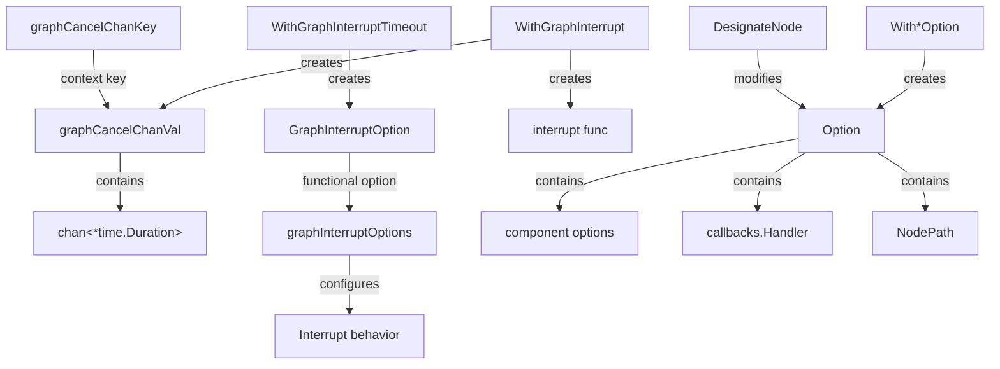
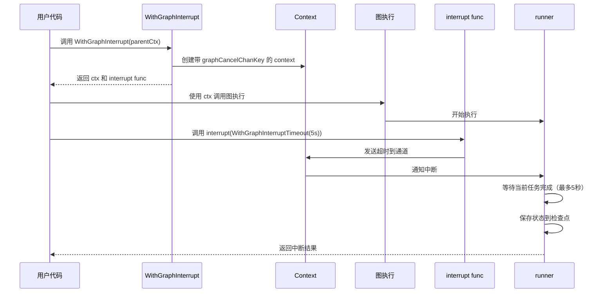

# Call Control 模块技术详解

## 1. 模块概述

Call Control 模块是 Compose Graph Engine 中的核心控制组件，主要解决两个关键问题：**图执行的外部中断机制**和**图调用的参数配置系统**。

### 1.1 为什么需要这个模块？

在实际的 AI 应用开发中，我们经常会遇到以下场景：
- 用户需要取消一个长时间运行的复杂工作流
- 需要优雅地停止图执行，保存状态以便后续恢复
- 需要在图调用时灵活地配置不同节点的行为

简单的 context 取消机制虽然能终止执行，但无法保证状态一致性和可恢复性。而简单的参数传递方式又无法支持复杂的节点选择和子图配置。Call Control 模块通过设计一套完整的中断机制和选项系统，优雅地解决了这些问题。

## 2. 核心抽象与心智模型

### 2.1 中断机制："带安全锁的紧急刹车"

想象一下飞机上的紧急刹车系统：
- 普通的 context 取消就像直接切断电源，会导致所有系统立即停止，但可能留下不一致的状态
- Call Control 的中断机制更像带安全锁的紧急刹车：它会先警告系统准备停止，等待正在执行的任务完成（或超时），然后安全地保存状态，最后才终止执行

### 2.2 选项系统："可寻址的配置路由器"

把选项系统想象成一个智能的邮件分发系统：
- 每个选项就像一封邮件，有收件人（目标节点）
- `DesignateNode` 就像在邮件上写收件人地址
- `NodePath` 可以精确指定子图中的某个节点，就像多层嵌套的地址

## 3. 架构与组件

### 3.1 核心组件



### 3.2 核心结构体详解

#### 3.2.1 中断相关结构体

**`graphCancelChanKey`**  
这是一个空结构体，用作 context 的 key。使用空结构体作为 context key 是 Go 的最佳实践，因为它不会占用内存，并且类型安全。

**`graphCancelChanVal`**  
```go
type graphCancelChanVal struct {
    ch chan *time.Duration
}
```
包含一个用于传递中断超时信息的通道。这是中断机制的核心通信通道。

**`graphInterruptOptions`**  
```go
type graphInterruptOptions struct {
    timeout *time.Duration
}
```
配置中断行为的选项，目前只支持超时配置。这种设计使用了指针类型，允许区分"未设置"和"设置为零值"两种状态。

#### 3.2.2 选项相关结构体

**`Option`**  
这是一个多功能的配置容器，包含：
- `options`: 组件选项的列表
- `handler`: 回调处理器
- `paths`: 目标节点路径
- 其他执行控制参数（最大步数、检查点等）

关键方法是 `deepCopy()`，它确保选项可以安全地传递和修改，而不会影响原始对象。

## 4. 数据流与关键流程

### 4.1 中断流程



### 4.2 选项传递流程


选项传递的过程可以描述为以下步骤：

1. **创建组件选项**：使用 `WithChatModelOption` 等函数创建特定组件的选项
2. **指定目标节点**（可选）：使用 `DesignateNode` 或 `DesignateNodeWithPath` 将选项绑定到特定节点
3. **调用图执行**：将选项传递给 `runnable.Invoke` 等执行方法
4. **检查 NodePath**：执行引擎检查每个选项是否有指定的目标节点
5. **应用选项**：如果找到匹配的节点，选项只应用到该节点；否则选项应用到所有匹配的组件类型


<!-- 临时移除有问题的流程图，改用文字描述
```mermaid
flowchart LR
    A[创建组件选项&lt;br/&gt;WithChatModelOption(...)] --&gt; B[DesignateNode&lt;br/&gt;指定目标节点]
    B --&gt; C[调用图执行&lt;br/&gt;runnable.Invoke(ctx, input, option)]
    C --&gt; D{检查 NodePath}
    D --&gt;|匹配| E[应用到指定节点]
    D --&gt;|不匹配| F[应用到所有节点]
```
--&gt;


```mermaid
flowchart LR
    A[创建组件选项<br/>WithChatModelOption(...)] --> B[DesignateNode<br/>指定目标节点]
    B --> C[调用图执行<br/>runnable.Invoke(ctx, input, option)]
    C --> D{检查 NodePath}
    D -->|匹配| E[应用到指定节点]
    D -->|不匹配| F[应用到所有节点]
```

## 5. 关键设计决策与权衡

### 5.1 自动输入持久化 vs 手动管理

**设计决策**：使用 `WithGraphInterrupt` 时自动持久化所有节点输入，而内部中断（`compose.Interrupt()`）不自动持久化。

**原因分析**：
- 外部中断可能在任何时刻发生，节点无法预知并准备
- 内部中断由节点自身触发，节点有机会在中断前保存必要信息
- 自动持久化会破坏依赖 `input == nil` 判断首次执行的现有代码

**权衡**：
- ✅ 外部中断使用更简单安全
- ❌ 内存/存储开销增加（所有输入都要保存）
- ⚠️ 内部中断需要开发者更小心地管理状态

### 5.2 功能选项模式 vs 结构体配置

**设计决策**：使用功能选项模式（Functional Options Pattern）配置中断和图调用。

**原因分析**：
- 提供了清晰的 API 演化路径，可以轻松添加新选项而不破坏现有代码
- 允许组合多个选项，顺序无关
- 可选参数有明确的默认行为

**权衡**：
- ✅ 灵活性高，向后兼容好
- ❌ 代码稍微冗长
- ❌ 新手可能需要时间适应这种模式

### 5.3 NodePath vs 简单字符串标识

**设计决策**：使用 `NodePath` 而不是简单的字符串来标识节点，支持子图中的节点寻址。

**原因分析**：
- 图可能有多层嵌套的子图
- 简单字符串无法表达层级关系
- 支持精确指向子图中的特定节点

**权衡**：
- ✅ 强大的寻址能力
- ❌ 稍微增加了复杂度
- ⚠️ 需要确保 NodePath 的正确构造

## 6. 使用指南与最佳实践

### 6.1 外部中断的使用

```go
// 创建支持中断的 context
ctx, interrupt := compose.WithGraphInterrupt(parentCtx)

// 在另一个 goroutine 中或根据用户输入调用 interrupt
go func() {
    // 等待用户取消信号
    <-cancelSignal
    // 中断执行，最多等待 10 秒让当前任务完成
    interrupt(compose.WithGraphInterruptTimeout(10 * time.Second))
}()

// 使用支持中断的 context 执行图
result, err := runnable.Invoke(ctx, input)
```

### 6.2 节点级选项配置

```go
// 创建聊天模型选项
modelOption := compose.WithChatModelOption(
    model.WithTemperature(0.7),
    model.WithMaxTokens(1000),
)

// 只应用到特定节点
targetedOption := modelOption.DesignateNode("my_chat_node")

// 或者应用到子图中的节点
subgraphNodePath := compose.NewNodePath("subgraph_node", "inner_chat_node")
subgraphOption := modelOption.DesignateNodeWithPath(subgraphNodePath)

// 执行时传入选项
result, err := runnable.Invoke(ctx, input, targetedOption, subgraphOption)
```

### 6.3 最佳实践

1. **总是使用 `WithGraphInterrupt` 来支持用户取消**：特别是对于长时间运行的工作流
2. **合理设置超时时间**：给当前执行的任务足够时间完成，但也不要太长
3. **内部中断时手动管理状态**：使用 `compose.GetInterruptState()` 来检查是否是恢复执行
4. **小心使用 `DesignateNode`**：确保节点名称正确，否则选项会被忽略
5. **避免过度使用自动持久化**：对于性能敏感的场景，考虑内部中断 + 手动状态管理

## 7. 边缘情况与注意事项

### 7.1 选项设计的注意事项

- **选项不会跨子图自动传播**：除非明确使用 `NodePath` 指定
- **相同类型的多个选项会叠加**：而不是覆盖
- **`DesignateNode` 只在顶层图有效**：注释中明确说明了这一点

### 7.2 中断的注意事项

- **中断是协作式的**：图执行引擎会检查中断信号，但节点本身也应该尊重 context 的取消
- **输入持久化只在使用 `WithGraphInterrupt` 时发生**：不要假设内部中断也会自动保存输入
- **超时后的强制中断可能导致部分状态不一致**：设置合理的超时很重要

### 7.3 内部实现细节（注意不要依赖）

- `graphCancelChanKey` 和 `graphCancelChanVal` 是内部类型，不要直接使用
- `Option` 结构体的字段可能会变化，只使用公开的方法
- 中断通道的缓冲区大小是 1，这是实现细节，不要依赖

## 8. 与其他模块的关系

Call Control 模块与以下模块紧密协作：

- **[Graph Construction](graph_construction_and_compilation.md)**：定义图结构，Call Control 提供执行时的配置
- **[Runtime Execution](runtime_execution_engine.md)**：实际执行图的组件，使用 Call Control 提供的中断机制
- **[State Management](state_management.md)**：处理状态保存和恢复，与中断机制协同工作
- **[Callbacks System](callbacks_system.md)**：Call Control 的 Option 可以包含回调处理器

## 9. 总结

Call Control 模块是 Compose Graph Engine 中的关键控制层，它提供了：

1. **安全可恢复的中断机制**：支持外部中断，自动持久化输入，优雅关闭
2. **灵活强大的选项系统**：支持组件级配置，可精确寻址到子图中的节点
3. **精心设计的 API**：使用功能选项模式，保证向后兼容性

这个模块的设计体现了"简单事情简单做，复杂事情可能做"的原则——常见场景（外部中断、基本配置）非常简单，而复杂场景（子图配置、内部中断）也有相应的解决方案。
