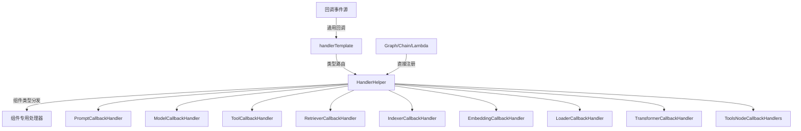

# component_specific_templates 模块技术深度分析

## 1. 模块概述

想象一下，你正在构建一个复杂的 AI 应用系统，其中包含多种不同类型的组件：聊天模型、提示模板、工具、索引器、检索器等等。每个组件在执行过程中都会产生各种事件（开始、结束、错误），你希望能够统一地监听和处理这些事件，但又不想为每个组件编写重复的适配代码。这就是 `component_specific_templates` 模块要解决的问题。

这个模块本质上是一个**类型安全的回调路由器**，它提供了一套结构化的方式来为不同类型的组件注册回调处理器，并在事件发生时将通用的回调事件转换为特定组件类型的专用回调。它解决了两个核心问题：
- **类型安全**：将通用的 `CallbackInput` 和 `CallbackOutput` 转换为特定组件的强类型结构
- **关注点分离**：让开发者可以专注于编写针对特定组件的业务逻辑，而不必处理类型转换和路由细节

## 2. 架构设计

### 2.1 核心架构图



### 2.2 架构角色说明

这个模块的架构可以看作是一个**智能事件分发器**，主要包含以下角色：

1. **HandlerHelper**：构建器（Builder）角色，用于配置和组装各种组件的回调处理器
2. **handlerTemplate**：核心路由器（Router）角色，实现了 `callbacks.Handler` 接口，负责将通用回调事件路由到正确的组件专用处理器
3. **组件专用处理器**：一系列结构体，每个都对应一种组件类型，提供了类型安全的回调函数签名
4. **类型转换器**：隐藏在 `handlerTemplate` 内部的逻辑，负责将通用的 `CallbackInput/Output` 转换为特定组件的类型

### 2.3 数据流向

当一个组件执行时，数据流向如下：

1. **事件触发**：组件执行过程中触发回调事件（OnStart/OnEnd/OnError等）
2. **通用回调**：事件以通用形式传递给 `handlerTemplate`，包含 `RunInfo` 和未类型化的输入/输出
3. **组件识别**：`handlerTemplate` 检查 `RunInfo.Component` 字段确定组件类型
4. **类型转换**：根据组件类型，将通用的 `CallbackInput/Output` 转换为特定组件的专用类型
5. **处理器调用**：调用对应组件专用处理器的相应方法
6. **上下文传递**：处理后的上下文继续传递下去

## 3. 核心组件深度解析

### 3.1 HandlerHelper - 回调处理器构建器

**设计意图**：提供流畅的 API 来配置和组装回调处理器，采用建造者模式让配置过程更加直观和类型安全。

**内部机制**：
- 维护了一组对应不同组件类型的处理器字段
- 使用方法链（Method Chaining）模式，每个设置方法都返回 `*HandlerHelper` 自身
- `composeTemplates` 字段使用 map 存储 Graph/Chain/Lambda 等组合组件的处理器，因为这些组件的类型更多样化

**关键方法**：
- `NewHandlerHelper()`：创建新的构建器实例
- `Prompt()/ChatModel()/Tool()` 等：设置对应组件的处理器
- `Graph()/Chain()/Lambda()`：设置组合组件的处理器
- `Handler()`：构建并返回最终的 `callbacks.Handler` 实例

**使用示例**：
```go
helper := template.NewHandlerHelper().
    ChatModel(&modelCallbackHandler).
    Tool(&toolCallbackHandler).
    Graph(&graphHandler)
handler := helper.Handler()
```

### 3.2 handlerTemplate - 回调事件路由器

**设计意图**：实现 `callbacks.Handler` 接口，作为核心的事件分发中心，负责将通用回调事件路由到正确的组件专用处理器。

**内部机制**：
- 嵌入了 `*HandlerHelper`，可以访问所有配置的处理器
- 使用大型的 `switch` 语句根据 `info.Component` 进行分发
- 在分发过程中进行类型转换，将通用的 `CallbackInput/Output` 转换为特定组件的类型
- 对于流式输出，使用 `schema.StreamReaderWithConvert` 进行流内元素的类型转换

**关键方法解析**：

**OnStart**：
```go
func (c *handlerTemplate) OnStart(ctx context.Context, info *callbacks.RunInfo, input callbacks.CallbackInput) context.Context
```
- 接收组件开始事件
- 根据组件类型选择对应的处理器
- 使用组件包提供的转换函数（如 `prompt.ConvCallbackInput`）进行类型转换
- 调用处理器的 `OnStart` 方法

**OnEndWithStreamOutput**：
```go
func (c *handlerTemplate) OnEndWithStreamOutput(ctx context.Context, info *callbacks.RunInfo, output *schema.StreamReader[callbacks.CallbackOutput]) context.Context
```
- 处理带有流式输出的组件结束事件
- 只有少数组件（ChatModel、Tool、ToolsNode）支持流式输出回调
- 使用 `schema.StreamReaderWithConvert` 创建一个新的流读取器，在读取时进行类型转换
- 这种设计避免了一次性转换整个流，保持了流式处理的特性

**Needed**：
```go
func (c *handlerTemplate) Needed(ctx context.Context, info *callbacks.RunInfo, timing callbacks.CallbackTiming) bool
```
- 检查是否需要处理特定的回调时机
- 这是一个性能优化点，可以避免不必要的回调调用
- 对于组件专用处理器，调用其 `Needed` 方法
- 对于组合组件处理器，检查是否实现了 `callbacks.TimingChecker` 接口

### 3.3 组件专用处理器

这些处理器结构体设计非常相似，都遵循相同的模式：

**通用模式**：
```go
type XxxCallbackHandler struct {
    OnStart func(ctx context.Context, runInfo *callbacks.RunInfo, input *XxxCallbackInput) context.Context
    OnEnd   func(ctx context.Context, runInfo *callbacks.RunInfo, output *XxxCallbackOutput) context.Context
    OnError func(ctx context.Context, runInfo *callbacks.RunInfo, err error) context.Context
    // 某些处理器可能有 OnEndWithStreamOutput
}

func (ch *XxxCallbackHandler) Needed(ctx context.Context, runInfo *callbacks.RunInfo, timing callbacks.CallbackTiming) bool {
    // 检查对应函数是否非空
}
```

**设计意图**：
- 使用函数字段而非接口，提供更大的灵活性（可以只实现需要的回调）
- 强类型的输入输出参数，提供编译时类型检查
- `Needed` 方法提供了性能优化的可能性

**特殊处理器**：

1. **ModelCallbackHandler 和 ToolCallbackHandler**：
   - 额外包含 `OnEndWithStreamOutput` 字段
   - 因为这些组件可能产生流式输出

2. **ToolsNodeCallbackHandlers**：
   - 输入输出类型直接使用 `*schema.Message` 和 `[]*schema.Message`
   - 这是一个组合图中的节点类型，不是独立组件

## 4. 依赖关系分析

### 4.1 输入依赖

这个模块依赖于以下核心包：

1. **github.com/cloudwego/eino/callbacks**：
   - 提供了 `Handler` 接口、`RunInfo` 结构体、`CallbackInput/Output` 类型等
   - 这是整个回调系统的核心契约

2. **各个组件包**（model、prompt、tool、retriever、indexer、embedding、document）：
   - 提供了各自的 `CallbackInput/Output` 类型定义
   - 提供了类型转换函数（如 `model.ConvCallbackInput`）

3. **github.com/cloudwego/eino/compose**：
   - 提供了组合组件（Graph、Chain、Lambda、ToolsNode）的类型定义

4. **github.com/cloudwego/eino/schema**：
   - 提供了 `StreamReader` 类型，用于流式输出处理

### 4.2 输出依赖

这个模块被以下类型的代码使用：

1. **应用层代码**：需要监听组件事件的业务逻辑
2. **中间件**：可能需要通过回调来实现横切关注点（如日志、监控、追踪）
3. **测试代码**：可能需要通过回调来观察组件行为

### 4.3 数据契约

**输入契约**：
- 接收 `*callbacks.RunInfo`，其中 `Component` 字段是关键的路由依据
- 接收通用的 `callbacks.CallbackInput` 和 `callbacks.CallbackOutput`，这些是接口类型
- 对于流式输出，接收 `*schema.StreamReader[callbacks.CallbackOutput]`

**输出契约**：
- 返回 `context.Context`，允许回调处理器在上下文中添加或修改数据
- 对于 `Needed` 方法，返回布尔值表示是否需要处理该回调

## 5. 设计决策与权衡

### 5.1 函数字段 vs 接口

**决策**：使用函数字段而非定义接口

**原因**：
- 灵活性更高：用户可以只实现需要的回调函数，不必实现整个接口
- 更容易使用：不需要定义新的结构体类型，直接赋值函数即可
- 更符合 Go 的组合优于继承的哲学

**权衡**：
- 失去了一些编译时检查（接口实现检查）
- 但 `Needed` 方法在运行时提供了类似的检查

### 5.2 大型 switch 语句 vs 映射表

**决策**：使用大型 switch 语句进行组件类型分发

**替代方案**：使用 `map[components.Component]Handler` 存储所有处理器

**原因**：
- 类型安全：switch 语句可以确保每个分支都有正确的类型转换逻辑
- 内联优化：Go 编译器对 switch 语句有很好的优化
- 清晰性：所有分发逻辑集中在一处，易于阅读和维护

**权衡**：
- 每次添加新的组件类型都需要修改这个 switch 语句
- 但组件类型相对稳定，这个代价是可接受的

### 5.3 流式输出的懒转换

**决策**：使用 `schema.StreamReaderWithConvert` 进行流式输出的类型转换，而不是一次性收集所有元素再转换

**原因**：
- 保持流式处理的特性：不会因为类型转换而破坏流式处理的内存效率
- 延迟转换：只在实际读取时进行转换，符合按需处理的原则
- 组合性：转换后的流仍然是 `StreamReader` 类型，可以继续使用流操作

**权衡**：
- 每次读取都有一次类型转换的开销
- 但这种开销很小，相比流式处理的好处是可接受的

### 5.4 Builder 模式的使用

**决策**：使用 Builder 模式（HandlerHelper）来配置回调处理器

**原因**：
- 流畅的 API：方法链让配置过程更加清晰和易读
- 增量配置：可以逐步添加不同组件的处理器
- 不可变性：一旦通过 `Handler()` 方法构建，就不能再修改

**权衡**：
- 增加了一个额外的抽象层
- 但这个抽象层提供的价值远远超过了复杂性的增加

## 6. 使用指南与示例

### 6.1 基本使用模式

```go
// 1. 创建构建器
helper := template.NewHandlerHelper()

// 2. 定义组件专用处理器
modelHandler := &template.ModelCallbackHandler{
    OnStart: func(ctx context.Context, info *callbacks.RunInfo, input *model.CallbackInput) context.Context {
        // 处理聊天模型开始事件
        log.Printf("Model started: %v", input.Messages)
        return ctx
    },
    OnEnd: func(ctx context.Context, info *callbacks.RunInfo, output *model.CallbackOutput) context.Context {
        // 处理聊天模型结束事件
        log.Printf("Model ended: %v", output.Message)
        return ctx
    },
}

// 3. 配置构建器
helper = helper.ChatModel(modelHandler)

// 4. 构建处理器
handler := helper.Handler()

// 5. 使用处理器
runnable.Invoke(ctx, input, compose.WithCallbacks(handler))
```

### 6.2 多组件回调配置

```go
helper := template.NewHandlerHelper().
    ChatModel(&template.ModelCallbackHandler{
        OnStart: func(ctx context.Context, info *callbacks.RunInfo, input *model.CallbackInput) context.Context {
            // 模型开始回调
            return ctx
        },
    }).
    Tool(&template.ToolCallbackHandler{
        OnStart: func(ctx context.Context, info *callbacks.RunInfo, input *tool.CallbackInput) context.Context {
            // 工具开始回调
            return ctx
        },
        OnEnd: func(ctx context.Context, info *callbacks.RunInfo, output *tool.CallbackOutput) context.Context {
            // 工具结束回调
            return ctx
        },
    }).
    Retriever(&template.RetrieverCallbackHandler{
        OnEnd: func(ctx context.Context, info *callbacks.RunInfo, output *retriever.CallbackOutput) context.Context {
            // 检索器结束回调
            return ctx
        },
    })

handler := helper.Handler()
```

### 6.3 流式输出处理

```go
modelHandler := &template.ModelCallbackHandler{
    OnEndWithStreamOutput: func(ctx context.Context, info *callbacks.RunInfo, output *schema.StreamReader[*model.CallbackOutput]) context.Context {
        // 处理流式输出
        go func() {
            defer output.Close()
            for {
                item, err := output.Next(ctx)
                if err != nil {
                    break
                }
                // 处理每个流式输出项
                log.Printf("Stream item: %v", item)
            }
        }()
        return ctx
    },
}
```

### 6.4 组合组件回调

```go
graphHandler := callbacks.NewHandler(func(ctx context.Context, info *callbacks.RunInfo, input callbacks.CallbackInput) context.Context {
    log.Printf("Graph started: %s", info.Name)
    return ctx
}, nil, nil)

helper := template.NewHandlerHelper().
    Graph(graphHandler).
    ChatModel(modelHandler)

handler := helper.Handler()
```

## 7. 边缘情况与注意事项

### 7.1 类型转换失败

**问题**：虽然设计上保证了类型转换的正确性，但在某些边缘情况下可能会失败。

**处理方式**：
- 转换函数（如 `model.ConvCallbackInput`）在类型不匹配时会返回 nil
- 回调处理器应该对 nil 输入有适当的处理
- 这是一种防御性设计，避免因为回调处理失败而影响主流程

### 7.2 未配置的组件

**问题**：如果某个组件触发了回调，但没有配置对应的处理器，会发生什么？

**处理方式**：
- `handlerTemplate` 的方法会直接返回原始的 ctx
- 不会有错误发生，只是该组件的回调被忽略
- 这是有意设计的，让用户可以只配置关心的组件

### 7.3 Needed 方法的性能影响

**注意**：
- `Needed` 方法在每个回调事件发生前都会被调用
- 虽然实现很简单（只是检查函数指针是否为 nil），但高频调用时仍有微小开销
- 不过，与避免不必要的回调调用带来的性能提升相比，这个开销是值得的

### 7.4 流式输出的资源管理

**注意**：
- 当处理 `OnEndWithStreamOutput` 时，接收的是一个 `StreamReader`
- 你需要负责关闭这个流读取器，否则可能导致资源泄漏
- 通常建议在 goroutine 中处理流式输出，并使用 defer 关闭

### 7.5 上下文传递的重要性

**注意**：
- 回调处理器应该始终返回一个 context.Context
- 如果不需要修改上下文，应该返回传入的 ctx
- 上下文是在组件执行流程中传递数据的主要方式

## 8. 总结

`component_specific_templates` 模块是一个精心设计的回调路由系统，它通过类型安全的方式将通用回调事件转换为特定组件的专用回调。它的核心价值在于：

1. **解耦**：将回调注册和回调路由逻辑与业务逻辑分离
2. **类型安全**：提供强类型的回调函数签名，避免运行时类型错误
3. **灵活性**：使用函数字段而非接口，让用户可以只实现需要的回调
4. **性能**：通过 `Needed` 方法避免不必要的回调调用

这个模块展示了如何在保持类型安全的同时提供灵活的 API，是构建可扩展系统的一个很好的范例。
