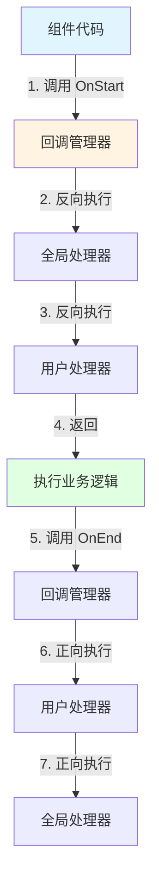

# core_callback_infrastructure 模块深度解析

## 1. 问题空间与解决方案

### 为什么需要这个模块？

在构建复杂的 AI 应用框架时，开发者面临一个共同的挑战：**如何在不侵入核心业务逻辑的情况下，统一处理横切关注点（cross-cutting concerns）？**

想象一下，你正在构建一个由多个组件（模型调用、工具执行、索引检索等）组成的系统。你可能需要：
- 记录所有组件的执行日志
- 收集性能指标
- 实现请求追踪
- 注入安全检查
- 统一处理错误

一个简单的方法是在每个组件中硬编码这些逻辑，但这会导致：
- 代码重复
- 关注点混杂
- 难以维护和扩展
- 组件之间的耦合度高

**core_callback_infrastructure** 模块正是为了解决这个问题而设计的。它提供了一个轻量级、非侵入式的回调机制，让开发者可以在组件的生命周期关键点注入自定义逻辑，同时保持核心代码的纯净。

### 设计洞察

这个模块的核心设计理念是：**将横切关注点与业务逻辑解耦，通过上下文传递实现组件间的无缝协作。**

它不是传统的观察者模式，而是一个更智能的系统：
- 回调处理器通过 `context.Context` 传递，而不是硬编码在组件中
- 支持流式输入输出的特殊处理
- 提供了构建器模式来简化回调处理器的创建
- 包含时机检查机制，避免不必要的回调执行

## 2. 核心架构与心智模型

### 心智模型：洋葱层与管道的结合

把这个回调系统想象成**洋葱层**和**管道**的结合体：

1. **洋葱层**：每个回调处理器就像洋葱的一层，当请求进入时，从外到内依次经过（OnStart 阶段反向执行）；当响应返回时，从内到外依次经过（OnEnd 阶段正向执行）。
   
2. **管道**：对于流式数据，回调处理器就像管道中的过滤器，可以观察、修改甚至替换数据流。

### 架构图



### 核心概念

1. **Handler（回调处理器）**：实现了特定生命周期方法的接口，是用户注入自定义逻辑的地方。
2. **RunInfo（运行信息）**：包含组件的名称、类型等元数据，帮助回调处理器了解当前执行上下文。
3. **CallbackTiming（回调时机）**：定义了 5 个关键的生命周期节点：
   - `TimingOnStart`：组件开始执行前
   - `TimingOnEnd`：组件成功执行后
   - `TimingOnError`：组件执行出错时
   - `TimingOnStartWithStreamInput`：处理流式输入前
   - `TimingOnEndWithStreamOutput`：处理流式输出后
4. **TimingChecker（时机检查器）**：可选接口，让处理器可以声明自己关心哪些时机，优化执行效率。

## 3. 核心组件解析

### 3.1 HandlerBuilder：回调处理器的构建器

`HandlerBuilder` 是一个典型的构建器模式实现，用于简化 `Handler` 接口的创建。

**设计意图**：
- 避免用户为了只实现一个回调方法而定义一个完整的结构体
- 提供流畅的 API 体验
- 自动实现 `TimingChecker` 接口，优化性能

**内部实现**：

```go
type HandlerBuilder struct {
    onStartFn                func(...) context.Context
    onEndFn                  func(...) context.Context
    onErrorFn                func(...) context.Context
    onStartWithStreamInputFn func(...) context.Context
    onEndWithStreamOutputFn  func(...) context.Context
}
```

每个字段都是一个函数类型，对应 `Handler` 接口的一个方法。当调用 `Build()` 时，它返回一个 `handlerImpl` 实例，该实例嵌套了 `HandlerBuilder` 并实现了 `Handler` 接口。

**使用示例**：
```go
handler := NewHandlerBuilder().
    OnStartFn(func(ctx context.Context, info *RunInfo, input CallbackInput) context.Context {
        log.Printf("Component %s started", info.Name)
        return ctx
    }).
    OnEndFn(func(ctx context.Context, info *RunInfo, output CallbackOutput) context.Context {
        log.Printf("Component %s finished", info.Name)
        return ctx
    }).
    Build()
```

### 3.2 handlerImpl：构建器的实际实现

`handlerImpl` 是 `HandlerBuilder.Build()` 返回的实际类型，它内嵌了 `HandlerBuilder` 并实现了 `Handler` 接口。

**关键设计点**：
1. **方法转发**：每个接口方法都简单地调用对应的函数字段（如果存在）
2. **时机检查**：`Needed()` 方法根据函数字段是否为 nil 来判断是否需要执行该处理器

**性能优化**：
`Needed()` 方法是这个设计的亮点之一。它让回调系统可以在执行前快速判断是否需要调用某个处理器，避免了不必要的函数调用开销。

### 3.3 回调注入函数：OnStart, OnEnd 等

这些函数是组件开发者与回调系统交互的主要接口。

**设计意图**：
- 提供简单、类型安全的 API
- 隐藏内部实现细节
- 处理泛型类型转换

**执行顺序的巧妙设计**：
注意这些函数调用 `callbacks.On()` 时的最后一个布尔参数：
- `OnStart` 和 `OnStartWithStreamInput` 传递 `true`（反向执行）
- `OnEnd`、`OnError` 和 `OnEndWithStreamOutput` 传递 `false`（正向执行）

这个设计确保了回调处理器的执行顺序符合洋葱模型：开始时从外到内，结束时从内到外。

### 3.4 上下文管理函数：InitCallbacks, ReuseHandlers, EnsureRunInfo

这些函数负责管理回调处理器在 `context.Context` 中的存储和传递。

**InitCallbacks**：
- 完全初始化一个新的回调上下文
- 会覆盖已有的处理器和 RunInfo
- 适用于顶层组件或需要完全重置的场景

**ReuseHandlers**：
- 保留已有处理器，但使用新的 RunInfo
- 适用于子组件或嵌套调用场景
- 会自动初始化全局处理器（如果需要）

**EnsureRunInfo**：
- 确保上下文中有匹配的 RunInfo
- 如果不匹配，创建新的管理器但保留已有处理器
- 是最安全的上下文准备函数

## 4. 数据流与执行流程

让我们通过一个典型的模型调用场景来追踪数据的流动：

### 标准执行流程

1. **初始化阶段**：
   ```go
   ctx := context.Background()
   ctx = InitCallbacks(ctx, &RunInfo{Name: "MyModel", Type: "model"}, myHandler)
   ```

2. **组件开始执行**：
   ```go
   ctx = OnStart(ctx, modelInput)
   ```
   - 回调管理器从 ctx 中提取
   - 按**反向**顺序执行所有处理器的 OnStart 方法
   - 每个处理器可以修改 ctx 并返回

3. **执行业务逻辑**：
   - 组件执行核心功能
   - 可能产生错误或正常结果

4. **组件执行结束**：
   ```go
   if err != nil {
       ctx = OnError(ctx, err)
   } else {
       ctx = OnEnd(ctx, modelOutput)
   }
   ```
   - 按**正向**顺序执行所有处理器的对应方法
   - 同样可以修改 ctx

### 流式数据处理流程

对于流式数据，流程略有不同：

1. **开始阶段**：
   ```go
   ctx, newStream := OnStartWithStreamInput(ctx, inputStream)
   ```
   - 处理器可以观察甚至替换输入流
   - **重要**：处理器有责任正确关闭流

2. **处理阶段**：
   - 组件从 newStream 读取数据
   - 处理后写入输出流

3. **结束阶段**：
   ```go
   ctx, finalStream := OnEndWithStreamOutput(ctx, outputStream)
   ```
   - 处理器可以观察、过滤或转换输出流
   - 同样需要正确关闭流

## 5. 设计决策与权衡

### 5.1 Context 作为传递机制

**选择**：使用 `context.Context` 来传递回调处理器和 RunInfo

**为什么这样设计**：
- Go 语言的标准做法
- 自动支持请求范围的传递
- 无需修改组件签名

**权衡**：
- ✅ 优点：非侵入式，与现有代码良好兼容
- ❌ 缺点：类型安全性降低（依赖类型断言），性能有微小开销

### 5.2 执行顺序设计

**选择**：OnStart 反向执行，OnEnd 正向执行

**为什么这样设计**：
- 符合洋葱模型/中间件模式的常见做法
- 确保资源的正确获取和释放顺序
- 类似于 defer 语句的执行顺序

**类比**：
想象你穿衣服和脱衣服的顺序：穿的时候先穿内衣再穿外套（反向执行，从外到内），脱的时候先脱外套再脱内衣（正向执行，从内到外）。

### 5.3 泛型的使用

**选择**：在注入函数中使用泛型

**为什么这样设计**：
- 提供类型安全的 API
- 避免用户手动进行类型转换
- 保持内部实现的简洁

**权衡**：
- ✅ 优点：API 更友好，编译时类型检查
- ❌ 缺点：内部实现需要处理类型擦除，增加了一定复杂度

### 5.4 全局处理器与局部处理器的结合

**选择**：支持全局处理器和局部处理器，全局处理器先执行

**为什么这样设计**：
- 满足横切关注点（如日志、追踪）的需求
- 允许组件有特定的回调逻辑
- 灵活的组合方式

**权衡**：
- ✅ 优点：灵活性高，满足不同场景需求
- ❌ 缺点：执行顺序可能让人困惑，全局处理器的修改需要谨慎

## 6. 使用指南与最佳实践

### 6.1 创建回调处理器

**使用 HandlerBuilder（推荐）**：
```go
handler := NewHandlerBuilder().
    OnStartFn(func(ctx context.Context, info *RunInfo, input CallbackInput) context.Context {
        // 处理开始逻辑
        return ctx
    }).
    OnErrorFn(func(ctx context.Context, info *RunInfo, err error) context.Context {
        log.Printf("Error in %s: %v", info.Name, err)
        return ctx
    }).
    Build()
```

**实现完整接口**（如果需要更多控制）：
```go
type MyHandler struct{}

func (h *MyHandler) OnStart(ctx context.Context, info *RunInfo, input CallbackInput) context.Context {
    // 实现
    return ctx
}

// 实现其他方法...

func (h *MyHandler) Needed(ctx context.Context, info *RunInfo, timing CallbackTiming) bool {
    // 自定义时机检查逻辑
    return true
}
```

### 6.2 初始化回调上下文

**顶层组件**：
```go
ctx := InitCallbacks(ctx, &RunInfo{
    Name: "MyComponent",
    Type: "component_type",
    Component: components.SomeComponent,
}, handler1, handler2)
```

**子组件**（重用父组件的处理器）：
```go
ctx := ReuseHandlers(ctx, &RunInfo{
    Name: "SubComponent",
    Type: "subcomponent_type",
})
```

**不确定的情况**（最安全）：
```go
ctx := EnsureRunInfo(ctx, "component_type", components.SomeComponent)
```

### 6.3 在组件中使用回调

**标准模式**：
```go
func (c *MyComponent) DoSomething(ctx context.Context, input Input) (Output, error) {
    // 1. 开始回调
    ctx = OnStart(ctx, input)
    
    var output Output
    var err error
    
    // 2. 确保结束或错误回调被调用
    defer func() {
        if err != nil {
            ctx = OnError(ctx, err)
        } else {
            ctx = OnEnd(ctx, output)
        }
    }()
    
    // 3. 执行业务逻辑
    output, err = c.realBusinessLogic(ctx, input)
    
    return output, err
}
```

**流式模式**：
```go
func (c *MyComponent) StreamProcess(ctx context.Context, input *schema.StreamReader[Input]) (*schema.StreamReader[Output], error) {
    // 1. 处理输入流
    ctx, processedInput := OnStartWithStreamInput(ctx, input)
    
    // 2. 处理数据流
    outputStream, err := c.processStream(ctx, processedInput)
    if err != nil {
        ctx = OnError(ctx, err)
        return nil, err
    }
    
    // 3. 处理输出流
    ctx, finalOutput := OnEndWithStreamOutput(ctx, outputStream)
    
    return finalOutput, nil
}
```

## 7. 常见陷阱与注意事项

### 7.1 流式数据的关闭责任

**陷阱**：忘记在回调处理器中关闭流

```go
// 错误示例
OnStartWithStreamInputFn(func(ctx context.Context, info *RunInfo, input *schema.StreamReader[CallbackInput]) context.Context {
    // 处理数据但不关闭流
    for {
        item, err := input.Recv()
        if err == io.EOF {
            break
        }
        // 处理 item
    }
    return ctx
})
```

**正确做法**：
```go
OnStartWithStreamInputFn(func(ctx context.Context, info *RunInfo, input *schema.StreamReader[CallbackInput]) context.Context {
    defer input.Close() // 确保关闭
    for {
        item, err := input.Recv()
        if err == io.EOF {
            break
        }
        // 处理 item
    }
    return ctx
})
```

### 7.2 回调处理器的执行顺序

**陷阱**：假设处理器总是按添加顺序执行

记住：
- OnStart 和 OnStartWithStreamInput 是**反向**执行的
- OnEnd、OnError 和 OnEndWithStreamOutput 是**正向**执行的
- 全局处理器总是在局部处理器之前执行

### 7.3 上下文修改的影响范围

**陷阱**：在回调中修改 context 后期望它在所有地方都生效

注意：
- 回调返回的新 context 只在后续回调和当前组件中有效
- 如果组件没有正确传递 ctx，修改可能会丢失
- 不要在回调中修改 context 的底层值（除非你完全理解后果）

### 7.4 类型断言的安全性

**陷阱**：对 CallbackInput/CallbackOutput 进行不安全的类型断言

```go
// 危险示例
OnStartFn(func(ctx context.Context, info *RunInfo, input CallbackInput) context.Context {
    modelInput := input.(*model.CallbackInput) // 如果类型不匹配会 panic
    // 使用 modelInput
    return ctx
})
```

**正确做法**：
```go
OnStartFn(func(ctx context.Context, info *RunInfo, input CallbackInput) context.Context {
    modelInput := model.ConvCallbackInput(input) // 使用组件提供的安全转换函数
    if modelInput == nil {
        return ctx // 不是预期类型，安全返回
    }
    // 使用 modelInput
    return ctx
})
```

### 7.5 全局处理器的线程安全

**陷阱**：在运行时修改全局处理器

注意：
- `AppendGlobalHandlers` 不是线程安全的
- 只应该在程序初始化时调用
- 不要在请求处理过程中动态添加全局处理器

## 8. 与其他模块的关系

- **[internal_runtime_and_mocks-internal_runtime_and_mocks.md](internal_runtime_and_mocks-internal_runtime_and_mocks.md)**：包含了实际的回调管理器实现，core_callback_infrastructure 是对它的封装和暴露
- **[schema_models_and_streams-schema_models_and_streams.md](schema_models_and_streams-schema_models_and_streams.md)**：提供了流式处理的基础类型 `StreamReader`
- **[components_core-components_core.md](components_core-components_core.md)**：定义了组件类型，被 `RunInfo` 使用

## 9. 总结

core_callback_infrastructure 模块是一个精心设计的回调系统，它通过巧妙的设计解决了横切关注点的问题。它的主要优势包括：

1. **非侵入式**：通过 context 传递，不修改组件签名
2. **灵活性**：支持多种使用场景和组合方式
3. **性能意识**：通过 TimingChecker 避免不必要的调用
4. **流式友好**：专门为流式数据处理设计了回调点
5. **易于使用**：提供了 Builder 模式简化处理器创建

理解这个模块的关键是掌握洋葱模型的执行顺序、context 的传递机制，以及流式数据处理的特殊注意事项。正确使用这个模块可以让你的代码更加清晰、模块化，并且更容易添加横切关注点。
