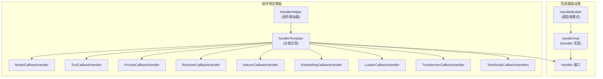
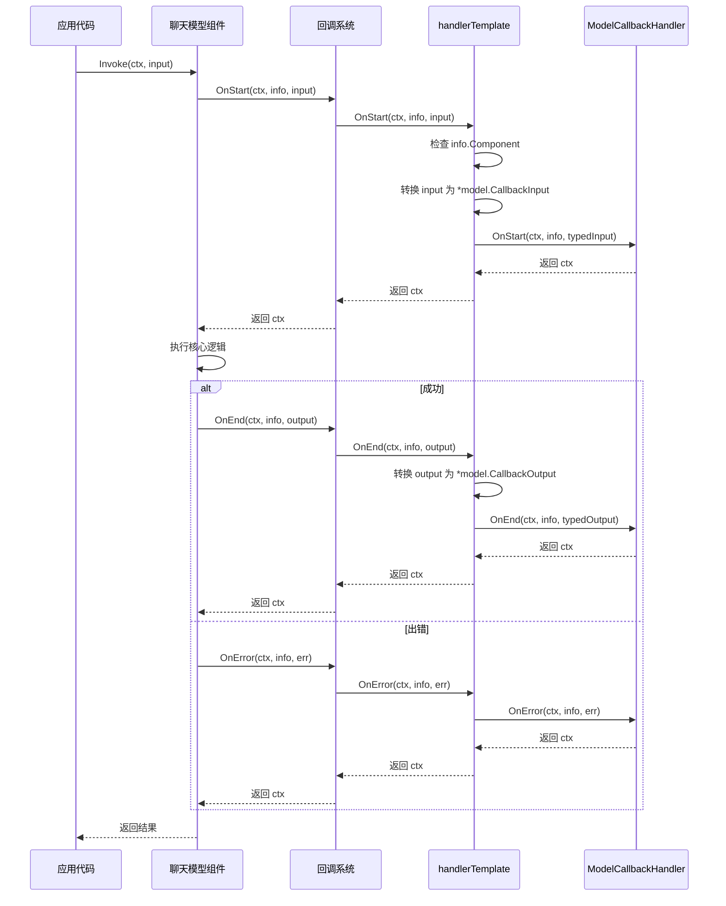
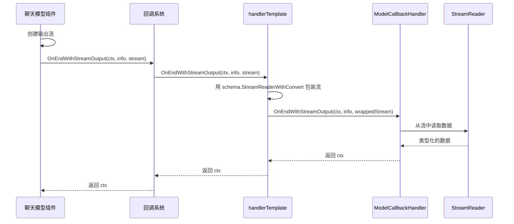

# callbacks_and_handler_templates 模块技术深度文档

## 1. 模块概述

### 1.1 问题空间

在构建复杂的 AI 应用程序时，我们经常需要在各种组件（如模型、提示词、工具、检索器等）的执行过程中插入自定义逻辑。这些逻辑可能包括：
- 性能监控（记录执行时间）
- 日志记录（跟踪输入输出）
- 调试支持（拦截中间状态）
- 安全检查（验证输入输出）
- 指标收集（统计调用次数）

如果没有统一的回调机制，每个组件都需要自己实现这些横切关注点，导致代码重复、维护困难，并且难以在运行时动态配置。

### 1.2 模块定位

`callbacks_and_handler_templates` 模块是整个框架的**横切关注点基础设施**。它提供了一套统一的回调机制，让开发者可以在不修改组件核心逻辑的情况下，为各种组件注入自定义行为。

## 2. 核心设计理念

### 2.1 心智模型

可以把这个模块想象成**组件的"事件监听器系统"**：

- 每个组件在执行的不同阶段（开始、结束、出错）会发出"事件"
- 回调处理器就像"监听器"，可以订阅这些事件
- `HandlerHelper` 是一个"监听器路由器"，根据组件类型将事件分发给对应的处理器

另一个有用的类比是**AOP（面向切面编程）**：
- 组件的核心逻辑是"主业务流程"
- 回调是"切面"，可以在流程的特定点（切点）插入
- 这个模块提供了定义切面和将它们织入组件执行流程的机制

### 2.2 关键抽象

1. **Handler 接口**：定义了回调处理器的契约，包括 `OnStart`、`OnEnd`、`OnError` 等方法
2. **HandlerBuilder**：使用建造者模式创建自定义的 Handler 实现
3. **HandlerHelper**：一个组件感知的回调处理器构建器，可以为不同类型的组件配置不同的回调
4. **组件特定的回调处理器**：如 `ModelCallbackHandler`、`ToolCallbackHandler` 等，它们接收类型化的输入输出

## 3. 架构设计

### 3.1 架构概览



### 3.2 核心组件详解

#### 3.2.1 HandlerBuilder 和 handlerImpl

这对组件使用**建造者模式**，让开发者可以灵活地创建自定义的回调处理器，而不需要实现完整的 Handler 接口。

**设计意图**：
- 提供渐进式的 API，允许只设置需要的回调函数
- 避免了创建空实现的样板代码
- 保持了类型安全

**工作原理**：
1. `HandlerBuilder` 持有各个回调函数的引用
2. 通过链式调用（如 `OnStartFn()`、`OnEndFn()`）设置需要的函数
3. `Build()` 方法返回一个 `handlerImpl` 实例
4. `handlerImpl` 嵌入了 `HandlerBuilder`，并实现了 `Handler` 接口

#### 3.2.2 HandlerHelper 和 handlerTemplate

这是模块中最强大的部分，提供了**组件感知的回调路由**。

**设计意图**：
- 解决一个问题：不同组件的回调输入输出类型不同
- 提供类型安全的回调处理
- 允许为不同组件类型配置不同的回调逻辑

**工作原理**：
1. `HandlerHelper` 是一个建造者，用于配置各种组件类型的回调处理器
2. `handlerTemplate` 是实际的 `Handler` 实现
3. 当回调触发时，`handlerTemplate` 检查 `RunInfo.Component` 字段
4. 根据组件类型，将通用的 `CallbackInput`/`CallbackOutput` 转换为组件特定的类型
5. 调用对应的组件特定回调处理器

**类型转换机制**：
每个组件包（如 `model`、`tool`、`prompt`）都提供了转换函数，如 `model.ConvCallbackInput()`，用于将通用的 `CallbackInput` 转换为组件特定的类型。

#### 3.2.3 组件特定回调处理器

这些结构体（如 `ModelCallbackHandler`、`ToolCallbackHandler`）定义了组件特定的回调函数签名。

**设计意图**：
- 提供类型安全的回调接口
- 让开发者不需要处理类型断言
- 明确每个组件类型的回调契约

**共同模式**：
- 每个处理器都有 `OnStart`、`OnEnd`、`OnError` 字段
- 支持流式输出的处理器还有 `OnEndWithStreamOutput` 字段
- 都实现了 `Needed()` 方法，用于检查是否需要处理特定的回调时机

## 4. 数据流分析

### 4.1 回调触发流程

让我们以一个聊天模型调用为例，追踪完整的回调数据流：



### 4.2 流式输出的回调流程

对于支持流式输出的组件，回调流程略有不同：



关键设计点：
- 使用 `schema.StreamReaderWithConvert` 进行流数据的实时转换
- 转换函数是惰性的，只在读取时执行
- 保持了流的背压特性

## 5. 关键设计决策

### 5.1 建造者模式 vs 完整接口实现

**决策**：使用 `HandlerBuilder` 提供渐进式 API，而不是要求实现完整的 `Handler` 接口。

**权衡分析**：
- ✅ **优点**：减少样板代码，只设置需要的回调
- ✅ **优点**：API 更友好，链式调用清晰
- ❌ **缺点**：失去了一些编译时检查（未设置的函数会是 nil）
- ❌ **缺点**：需要额外的 `Needed()` 方法来检查是否需要处理

**为什么这样选择**：
在实际使用中，大多数场景只需要设置少数几个回调函数。强制实现完整接口会导致大量空实现，降低代码可读性。`Needed()` 方法的存在让运行时可以跳过未设置的回调，避免了 nil 指针恐慌。

### 5.2 组件类型路由 vs 通用回调

**决策**：提供 `HandlerHelper` 进行组件类型路由，而不是只有通用回调。

**权衡分析**：
- ✅ **优点**：类型安全，不需要手动类型断言
- ✅ **优点**：关注点分离，可以为不同组件配置不同逻辑
- ❌ **缺点**：增加了一层抽象，代码更复杂
- ❌ **缺点**：需要为每个新组件类型添加支持

**为什么这样选择**：
类型安全和开发体验是优先考虑的。在 AI 应用开发中，不同组件的输入输出差异很大，类型断言既繁琐又容易出错。这层抽象的成本是值得的。

### 5.3 Context 传递 vs 回调返回值

**决策**：回调函数接收并返回 `context.Context`，而不是通过其他方式传递数据。

**权衡分析**：
- ✅ **优点**：与 Go 语言的惯用法一致
- ✅ **优点**：天然支持上下文的传播和取消
- ❌ **缺点**：只能通过 context 传递数据，有类型限制
- ❌ **缺点**：context 的值是全局的，可能导致意外的耦合

**为什么这样选择**：
Go 语言的 context 是标准的请求范围数据传递机制。回调通常用于横切关注点（如日志、追踪），这些正好是 context 的典型用例。对于更复杂的数据传递，可以考虑通过闭包捕获变量。

### 5.4 流式输出的回调设计

**决策**：流式输出通过 `OnEndWithStreamOutput` 回调传递一个 `StreamReader`，而不是逐个元素回调。

**权衡分析**：
- ✅ **优点**：保持了流的背压特性
- ✅ **优点**：回调可以控制读取速度
- ✅ **优点**：可以进行流转换和包装
- ❌ **缺点**：回调必须自己处理流的读取和关闭
- ❌ **缺点**：不能简单地"观察"流而不消费它

**为什么这样选择**：
背压和流控制是流式处理的关键特性。如果每个元素都触发一个回调，就会失去这些特性。让回调接收完整的 `StreamReader` 给了最大的灵活性。

## 6. 使用指南

### 6.1 基本用法：使用 HandlerBuilder

```go
// 创建一个简单的回调处理器，记录开始和结束时间
handler := callbacks.NewHandlerBuilder().
    OnStartFn(func(ctx context.Context, info *callbacks.RunInfo, input callbacks.CallbackInput) context.Context {
        log.Printf("开始执行 %s (%s)", info.Name, info.Component)
        return context.WithValue(ctx, "startTime", time.Now())
    }).
    OnEndFn(func(ctx context.Context, info *callbacks.RunInfo, output callbacks.CallbackOutput) context.Context {
        startTime := ctx.Value("startTime").(time.Time)
        log.Printf("执行完成 %s，耗时: %v", info.Name, time.Since(startTime))
        return ctx
    }).
    OnErrorFn(func(ctx context.Context, info *callbacks.RunInfo, err error) context.Context {
        log.Printf("执行出错 %s: %v", info.Name, err)
        return ctx
    }).
    Build()

// 使用回调
ctx := callbacks.InitCallbacks(context.Background(), &callbacks.RunInfo{Name: "myComponent"}, handler)
```

### 6.2 高级用法：使用 HandlerHelper

```go
// 为不同组件类型配置不同的回调
helper := template.NewHandlerHelper().
    // 模型回调：记录 token 使用量
    ChatModel(&template.ModelCallbackHandler{
        OnEnd: func(ctx context.Context, runInfo *callbacks.RunInfo, output *model.CallbackOutput) context.Context {
            if output.Usage != nil {
                log.Printf("模型调用: prompt=%d, completion=%d, total=%d", 
                    output.Usage.PromptTokens, 
                    output.Usage.CompletionTokens, 
                    output.Usage.TotalTokens)
            }
            return ctx
        },
    }).
    // 工具回调：记录工具调用
    Tool(&template.ToolCallbackHandler{
        OnStart: func(ctx context.Context, info *callbacks.RunInfo, input *tool.CallbackInput) context.Context {
            log.Printf("调用工具: %s, args: %s", input.Name, input.Args)
            return ctx
        },
    }).
    // 提示词回调：记录生成的提示词
    Prompt(&template.PromptCallbackHandler{
        OnEnd: func(ctx context.Context, runInfo *callbacks.RunInfo, output *prompt.CallbackOutput) context.Context {
            log.Printf("生成的提示词: %+v", output.Messages)
            return ctx
        },
    })

// 获取回调处理器
handler := helper.Handler()

// 在 compose 中使用
result, err := graph.Invoke(ctx, input, compose.WithCallbacks(handler))
```

### 6.3 流式输出回调

```go
helper := template.NewHandlerHelper().
    ChatModel(&template.ModelCallbackHandler{
        OnEndWithStreamOutput: func(ctx context.Context, runInfo *callbacks.RunInfo, output *schema.StreamReader[*model.CallbackOutput]) context.Context {
            // 创建一个新的流，一边读取一边记录
            sr, sw := schema.Pipe[*model.CallbackOutput](1)
            
            go func() {
                defer sw.Close()
                defer output.Close()
                
                for {
                    item, err := output.Recv()
                    if err == io.EOF {
                        break
                    }
                    if err != nil {
                        sw.Send(nil, err)
                        return
                    }
                    
                    // 记录流式输出
                    if len(item.Message.Content) > 0 {
                        fmt.Print(item.Message.Content)
                    }
                    
                    sw.Send(item, nil)
                }
            }()
            
            // 注意：这里我们不能直接返回修改后的流，因为回调只返回 context
            // 在实际使用中，你可能需要通过其他方式传递这个流
            
            return ctx
        },
    })
```

## 7. 注意事项与陷阱

### 7.1 Context 的使用

**陷阱**：回调中修改 context 可能不会如预期般工作。

**原因**：context 是不可变的，回调返回的新 context 只会在后续回调中使用，不会影响组件的核心逻辑。

**建议**：
- 只在回调之间传递数据时使用 context
- 不要试图通过 context 来改变组件的行为
- 如果需要与组件交互，考虑其他机制

### 7.2 流式回调中的资源管理

**陷阱**：忘记关闭 `StreamReader`。

**原因**：`OnEndWithStreamOutput` 接收的 `StreamReader` 需要被正确关闭，否则可能导致资源泄漏。

**建议**：
- 总是在读取完毕后调用 `Close()`
- 使用 `defer` 确保关闭
- 如果转换流，确保转换后的流也能正确关闭原始流

### 7.3 类型断言的安全性

**陷阱**：在 `handlerTemplate` 的转换逻辑失败时返回 nil。

**原因**：`convToolsNodeCallbackInput` 等转换函数在类型不匹配时返回 nil，后续代码可能没有检查。

**建议**：
- 在自定义回调中检查输入是否为 nil
- 确保组件正确设置了回调输入的类型
- 考虑添加日志来帮助调试类型转换问题

### 7.4 Needed() 方法的重要性

**陷阱**：忘记实现或错误实现 `Needed()` 方法。

**原因**：如果 `Needed()` 返回 true 但对应的函数是 nil，会导致恐慌。

**建议**：
- 使用提供的模板结构体，它们已经正确实现了 `Needed()`
- 如果自定义实现，确保 `Needed()` 与实际设置的函数保持一致
- 考虑使用 `HandlerBuilder`，它会自动处理这个问题

### 7.5 全局回调的性能影响

**陷阱**：添加过多的全局回调。

**原因**：全局回调会在每个组件的每个回调时机被调用，可能影响性能。

**建议**：
- 谨慎使用全局回调
- 在全局回调中快速检查是否需要处理，避免不必要的工作
- 考虑使用组件特定的回调而不是全局回调

## 8. 与其他模块的关系

### 8.1 依赖关系

这个模块依赖以下核心模块：
- `schema`：提供 `StreamReader` 和基础类型
- `components`：定义组件接口和回调类型
- `compose`：提供图执行引擎和回调集成点

### 8.2 被依赖关系

几乎所有其他模块都可能依赖这个模块，特别是：
- 具体的组件实现（模型、工具、检索器等）
- `compose_graph_engine`：在图执行中触发回调
- `adk_runtime`：在代理运行时使用回调

## 9. 总结

`callbacks_and_handler_templates` 模块是一个精心设计的横切关注点基础设施，它：

1. **解决了**在不修改组件核心逻辑的情况下注入自定义行为的问题
2. **提供了**从简单到复杂的多种使用方式，适应不同场景
3. **保持了**类型安全，同时提供了足够的灵活性
4. **支持了**流式处理，保持了背压和流控制特性

关键的设计智慧在于：
- 使用建造者模式平衡了灵活性和易用性
- 通过组件类型路由提供了类型安全的回调处理
- 与 Go 语言的 context 机制无缝集成
- 支持流式处理，适应现代 AI 应用的需求

对于新加入的开发者，理解这个模块的设计理念和使用方法，将帮助他们更好地构建可观测、可调试、可扩展的 AI 应用。
