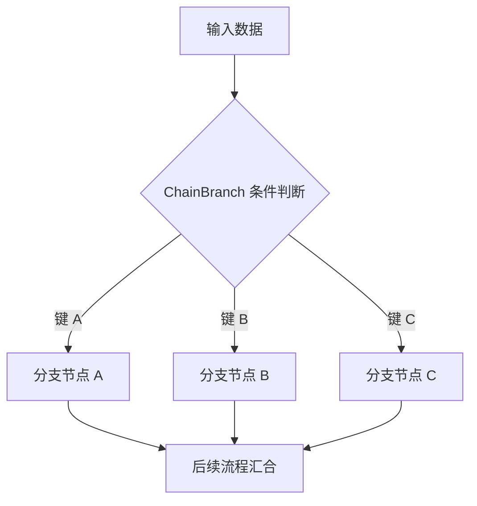

# ChainBranch 模块深度解析

## 概述

`ChainBranch` 模块提供了在链式操作中实现条件分支的机制，允许根据动态条件选择不同的执行路径。这是构建灵活、可决策工作流的核心组件。

## 核心问题与设计目标

在构建复杂的 AI 应用工作流时，我们经常遇到这样的场景：
- 需要根据模型输出决定下一步执行路径（例如：根据用户问题类型选择不同的处理流程）
- 需要基于输入流的内容动态路由执行
- 需要支持多个分支路径的并行选择

简单的 if-else 语句或固定流程无法满足这种动态性和可组合性的需求，这就是 `ChainBranch` 模块要解决的核心问题。

## 核心抽象

### 主要概念

`ChainBranch` 的设计基于以下核心抽象：

1. **条件函数**：决定执行路径的判断逻辑
2. **分支节点**：条件选择后执行的具体操作节点
3. **键映射**：将条件返回的字符串键与实际分支节点关联

可以把 `ChainBranch` 想象成一个铁路道岔系统：
- **条件函数**是道岔控制器，根据列车（数据）类型决定转辙方向
- **分支键**是不同的轨道编号
- **分支节点**是每条轨道通向的目的地

## 架构与数据流程



### 核心组件关系

```
ChainBranch
├── internalBranch (*GraphBranch) - 底层分支实现
├── key2BranchNode (map[string]nodeOptionsPair) - 键到分支节点的映射
└── err (error) - 构建过程中的错误
```

## 核心组件详解

### ChainBranch 结构体

**作用**：作为面向用户的分支构造器，提供流畅的 API 来构建条件分支。

**设计意图**：
- 封装底层 `GraphBranch` 的复杂性
- 提供类型安全的构造函数
- 支持链式调用的 API 风格
- 在构建阶段收集错误（而非运行时）

**关键属性**：
- `internalBranch`：实际执行分支逻辑的核心组件
- `key2BranchNode`：维护条件返回键与分支节点的映射关系
- `err`：构建过程中的错误状态

### 构造函数

#### NewChainBranch

```go
func NewChainBranch[T any](cond GraphBranchCondition[T]) *ChainBranch
```

**作用**：创建单分支选择的条件分支。

**设计特点**：
- 泛型设计，支持任意输入类型
- 类型安全的条件函数
- 内部复用 `NewChainMultiBranch` 实现

**使用场景**：简单的二选一或多选一的分支场景。

#### NewChainMultiBranch

```go
func NewChainMultiBranch[T any](cond GraphMultiBranchCondition[T]) *ChainBranch
```

**作用**：创建支持多分支选择的条件分支。

**设计特点**：
- 条件函数返回 `map[string]bool`，支持同时选择多个路径
- 更灵活的执行路由能力

**使用场景**：需要并行执行多个分支路径的场景。

#### NewStreamChainBranch / NewStreamChainMultiBranch

```go
func NewStreamChainBranch[T any](cond StreamGraphBranchCondition[T]) *ChainBranch
func NewStreamChainMultiBranch[T any](cond StreamGraphMultiBranchCondition[T]) *ChainBranch
```

**作用**：基于流输入创建条件分支。

**设计特点**：
- 条件函数接收 `*schema.StreamReader[T]` 作为输入
- 支持基于流内容的动态决策
- 通常建议仅读取流的第一个块来做决策，以保持性能

**使用场景**：需要根据流式输出的早期内容决定后续处理路径。

### 分支节点添加方法

`ChainBranch` 提供了丰富的方法来添加各种类型的分支节点：

| 方法 | 节点类型 | 说明 |
|------|----------|------|
| `AddChatModel` | 聊天模型 | 添加 LLM 节点 |
| `AddChatTemplate` | 提示模板 | 添加提示工程节点 |
| `AddToolsNode` | 工具节点 | 添加工具调用节点 |
| `AddLambda` | Lambda 函数 | 添加自定义函数节点 |
| `AddEmbedding` | 嵌入模型 | 添加文本嵌入节点 |
| `AddRetriever` | 检索器 | 添加信息检索节点 |
| `AddLoader` | 文档加载器 | 添加文档加载节点 |
| `AddIndexer` | 索引器 | 添加文档索引节点 |
| `AddDocumentTransformer` | 文档转换器 | 添加文档处理节点 |
| `AddGraph` | 子图 | 添加嵌套子图节点 |
| `AddPassthrough` | 透传节点 | 添加简单的数据传递节点 |

**设计模式**：所有添加方法都遵循相同的模式：
1. 转换组件为内部 `graphNode` 表示
2. 通过内部 `addNode` 方法注册
3. 支持可选的 `GraphAddNodeOpt` 配置
4. 返回 `*ChainBranch` 以支持链式调用

### 内部 addNode 方法

```go
func (cb *ChainBranch) addNode(key string, node *graphNode, options *graphAddNodeOpts) *ChainBranch
```

**作用**：核心的节点注册逻辑。

**关键逻辑**：
1. 检查是否已有构建错误（快速失败模式）
2. 确保映射表已初始化
3. 检查键的唯一性（防止重复键）
4. 存储节点和选项
5. 返回自身以支持链式调用

**错误处理策略**：采用"错误累加"模式，在构建阶段捕获所有配置错误，而非等到运行时。

## 依赖关系分析

### 依赖的模块

- **[Compose Graph Engine](Compose Graph Engine.md)**：提供底层 `GraphBranch` 实现
- **[Component Interfaces](Component Interfaces.md)**：各种组件接口（ChatModel、Retriever 等）

### 被依赖的模块

- **[Compose Workflow](Compose Workflow.md)**：`Workflow` 使用 `ChainBranch` 构建工作流分支

## 设计决策与权衡

### 1. 构建时错误收集 vs 运行时错误

**决策**：在构建阶段收集和传播错误。

**理由**：
- 提前发现配置问题，提升开发体验
- 避免运行时才出现的意外错误
- 符合"快速失败"的设计哲学

**权衡**：
- ✅ 优点：更早的错误反馈，更可靠的系统
- ❌ 缺点：需要在每个方法中检查错误状态，增加了一些代码复杂度

### 2. 类型安全的泛型 API vs 动态接口

**决策**：使用泛型提供类型安全的 API。

**理由**：
- 编译时类型检查，减少运行时错误
- 更好的 IDE 支持和代码补全
- 更清晰的代码意图表达

**权衡**：
- ✅ 优点：类型安全，更好的开发体验
- ❌ 缺点：API 稍显复杂，需要理解泛型

### 3. 单分支与多分支的统一实现

**决策**：单分支在内部复用多分支实现。

**理由**：
- 减少代码重复
- 统一的执行模型
- 更容易维护和扩展

**权衡**：
- ✅ 优点：代码复用，一致的行为
- ❌ 缺点：单分支场景有轻微的抽象开销

### 4. 流式与非流式的分离设计

**决策**：为流式和非流式输入提供独立的构造函数。

**理由**：
- 清晰的 API 边界
- 避免用户混淆不同的输入类型
- 各自优化的实现路径

**权衡**：
- ✅ 优点：API 清晰，用途明确
- ❌ 缺点：API 表面稍大，有更多构造函数

## 使用指南

### 基础示例：简单的条件分支

```go
// 创建一个根据输入长度选择路径的分支
branch := compose.NewChainBranch(func(ctx context.Context, in string) (string, error) {
    if len(in) > 100 {
        return "long_text", nil
    }
    return "short_text", nil
})

// 添加分支节点
branch.AddChatTemplate("long_text", longTextTemplate)
branch.AddChatTemplate("short_text", shortTextTemplate)
```

### 高级示例：多分支并行执行

```go
// 创建支持多路径选择的分支
multiBranch := compose.NewChainMultiBranch(func(ctx context.Context, in *UserQuery) (map[string]bool, error) {
    paths := make(map[string]bool)
    
    if in.NeedsSearch {
        paths["search"] = true
    }
    if in.NeedsCalculation {
        paths["calculate"] = true
    }
    
    return paths, nil
})

// 添加多个分支
multiBranch.AddRetriever("search", searchRetriever)
multiBranch.AddLambda("calculate", calculationLambda)
```

### 流式决策示例

```go
// 基于流的分支决策
streamBranch := compose.NewStreamChainBranch(func(ctx context.Context, in *schema.StreamReader[string]) (string, error) {
    // 仅读取第一个块来做决策
    chunk, err := in.Read(ctx)
    if err != nil {
        return "", err
    }
    
    // 将已读取的块放回流中，供后续节点使用
    in.Unread(chunk)
    
    if strings.HasPrefix(chunk, "image:") {
        return "image_path", nil
    }
    return "text_path", nil
})
```

## 常见陷阱与注意事项

### 1. 分支键的一致性

**问题**：条件函数返回的键必须与添加分支时使用的键完全匹配。

**解决**：
- 考虑使用常量定义键
- 在条件函数和添加节点时使用相同的键来源
- 添加测试验证所有可能的条件返回值都有对应的分支

### 2. 流条件函数中的流消费

**问题**：在流式条件函数中读取流后忘记将数据放回。

**解决**：
- 始终使用 `Unread()` 方法将读取的块放回
- 考虑仅读取足够做决策的最小数据量
- 如果需要完整消费流，确保后续节点能处理空流

### 3. 错误处理模式

**问题**：忽略 `ChainBranch` 的错误状态。

**解决**：
- 在构建完分支后始终检查 `err` 字段
- 使用提供的错误检查机制
- 不要假定所有添加操作都成功

### 4. 类型参数匹配

**问题**：条件函数的输入类型与实际数据流类型不匹配。

**解决**：
- 仔细确保类型参数 `T` 与实际数据类型一致
- 在复杂场景中考虑使用中间 Lambda 进行类型转换
- 添加类型断言和适当的错误处理

### 5. 分支的最终收敛

**设计约束**：所有分支路径最终都应该要么结束链，要么重新汇聚到链的某个共同节点。

**理由**：这确保了工作流有明确的执行路径和终点。

## 扩展点与自定义

### 添加自定义节点类型

虽然 `ChainBranch` 已经提供了丰富的节点类型添加方法，但您也可以通过以下方式扩展：

1. 使用 `AddLambda` 封装自定义逻辑
2. 使用 `AddGraph` 嵌入完整的子图
3. （高级）实现 `AnyGraph` 接口创建自定义图组件

## 总结

`ChainBranch` 模块是构建灵活、可决策 AI 工作流的核心组件。它通过优雅的设计解决了动态路由执行路径的问题，提供了类型安全、易于使用的 API，同时保持了高度的灵活性和可扩展性。

其关键价值在于：
- 将条件逻辑与执行路径解耦
- 支持丰富的节点类型
- 提供流式和非流式场景的一致体验
- 采用构建时错误收集提升可靠性

正确使用 `ChainBranch` 可以让您构建出既强大又易于维护的复杂 AI 应用工作流。
