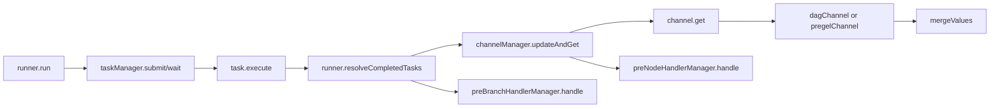

# channel_and_task_management 深入解析

`channel_and_task_management` 模块本质上是图执行引擎里的“调度中枢”：它一边像交通灯一样判断“哪个节点现在可以跑”，一边像作业系统一样管理“任务怎么并发执行、何时取消、何时安全收尾”，还要在分支跳过、流式输入、多路 fan-in 合并、中断恢复这些复杂场景下保持一致性。没有这层中枢，图运行会退化成“节点跑完就直接推给下游”的朴素链式模型——这种模型一遇到多前驱依赖、条件分支和可中断执行就会立刻失控。

---

## 架构角色与数据流



从架构定位上看，这个模块并不直接定义业务节点逻辑（那是 `composableRunnable` 的职责），它做的是**运行时编排**。在 `runner.run` 主循环里，关键节拍是：

1. `taskManager.submit` 把当前批次任务执行起来（并发或同步，取决于模式与取消能力）。
2. `taskManager.wait` 收集一个或多个已完成任务。
3. `runner.resolveCompletedTasks` 把任务输出拆成“数据写入哪个 channel”和“控制依赖更新到哪些节点”。
4. `channelManager.updateAndGet` 更新 channel 状态并拉取所有 ready 节点输入。
5. ready 输入经 `preNodeHandlerManager.handle` 后，重新组装成下一批 `task`。

这使执行引擎形成一个闭环：**Task -> Channel -> Ready Node -> Task**。你可以把它想成一个机场中转系统：任务是航班，channel 是登机口状态板，manager 是塔台。塔台不关心乘客是谁（业务数据细节），但必须保证航班按依赖关系安全起降。

---

## 心智模型：两层门禁 + 两种通道 + 三类处理器

理解这套代码最有效的方式，是记住三个抽象：

第一是“**两层门禁**”。节点触发不是只看数据到没到，还要看控制依赖是否满足。`dagChannel` 里这两层分别是 `ControlPredecessors`（`dependencyStateWaiting/Ready/Skipped`）和 `DataPredecessors`（bool）。两层都通过，`get()` 才会 ready。

第二是“**两种通道语义**”。
`dagChannel` 追求严格依赖（适配 DAG/all-predecessor）；`pregelChannel` 追求快速传播（有值就出，适配循环图和 Pregel 风格）。它们都实现同一个 `channel` 接口，所以 `channelManager` 可以统一调度。

第三是“**三类处理器插桩**”：
`edgeHandlerManager`（边上处理）、`preBranchHandlerManager`（分支前处理）、`preNodeHandlerManager`（节点前处理）。这让类型转换、流处理、字段适配可以在执行路径上按阶段插入，而不污染节点主体逻辑。

---

## 组件深潜

想要更深入了解各个组件的实现细节，请参考以下子模块文档：
- [channel_implementations](channel_implementations.md) - 深入剖析 `channel` 接口及其两种实现（`dagChannel` 和 `pregelChannel`）
- [channel_management](channel_management.md) - 详细解析 `channelManager` 及各类 handler 管理器的设计与实现
- [task_management](task_management.md) - 全面解读 `task` 和 `taskManager` 的任务调度机制

### 1) `channel` 接口：统一状态机协议

`channel` 定义了运行时通道最小契约：
`reportValues`、`reportDependencies`、`reportSkip`、`get`、`convertValues`、`load`、`setMergeConfig`。

设计意图是把“依赖就绪判定”和“值缓存/合并”从 `runner` 中剥离。`runner` 只管推进步骤，不关心具体通道语义；不同执行模型（DAG/Pregel）通过实现 `channel` 来切换行为。这是典型的策略模式：在不改变主循环的前提下切换触发语义。

---

### 2) `channelManager`：通道编排器

`channelManager` 持有全部节点 channel，并负责三件事：

- **写入过滤**：`updateValues` 只接受目标节点声明过的数据前驱，未知来源会被丢弃；如果丢弃值是 `streamReader` 会主动 `close()`，避免流泄漏。
- **控制过滤**：`updateDependencies` 只接受声明过的控制前驱。
- **ready 收敛**：`getFromReadyChannels` 扫描所有 channel，拿到 ready 输入后再走 `preNodeHandlerManager.handle`。

这里的关键“why”是：图运行时，分支和动态路径会产生“看起来合法但不该进入某节点”的中间值；如果不做双重过滤，错误数据会悄悄穿透并造成后续不可解释行为。`channelManager` 把这个责任集中化，避免每个节点都写自己的防御逻辑。

`reportBranch` 是另一个非显而易见设计点。它不仅标记当前分支未选中的节点 skip，还会沿 `successors` 传播“全前驱都被跳过”的状态。这样能让被整段剪枝的子图尽快失活，避免死等未到达依赖。

---

### 3) `dagChannel`：严格依赖、可跳过、可补零

`dagChannel` 来自 `dagChannelBuilder`，内部维护：

- `ControlPredecessors map[string]dependencyState`
- `DataPredecessors map[string]bool`
- `Values map[string]any`
- `Skipped bool`

`get()` 的流程很有代表性：

1. 若 `Skipped`，直接不产出。
2. 只要有 control 仍是 `waiting`，不产出。
3. 只要有 data 仍未 ready，不产出。
4. 全满足后，按来源逐个走 `edgeHandlerManager.handle`。
5. 0 路输入时返回 `zeroValue()` 或 `emptyStream()`；1 路直接透传；多路走 `mergeValues`。
6. `defer` 重置内部状态，进入下一轮。

为什么 0 路还要返回零值/空流？因为在“前驱全部 skip”或无数据输入但控制通过的场景里，节点仍可能需要被触发以维持图推进一致性。

---

### 4) `pregelChannel`：值驱动触发

`pregelChannel` 不维护 control/data 前驱状态，`reportDependencies` 和 `reportSkip` 基本无效化；只要 `Values` 非空，`get()` 就 ready。

这牺牲了“严格等待所有前驱”的语义，但换来循环图中的高吞吐推进能力，符合 Pregel 风格“超步内消息驱动”的运行心智。它和 `dagChannel` 共用 `edgeHandlerManager` 与 `mergeValues`，确保转换与合并逻辑一致。

---

### 5) `task`：单次节点执行上下文

`task` 封装一次节点执行所需全部运行态：`ctx`、`nodeKey`、`call *chanCall`、`input/output`、`option`、`err`、`skipPreHandler`，以及中断恢复所需的 `originalInput`。

`originalInput` 的存在是为了解决外部中断（`WithGraphInterrupt`）的“任意时刻打断”问题：当任务可被异步取消时，恢复阶段必须能重新喂给节点原始输入。

---

### 6) `taskManager`：并发执行与中断收敛器

`taskManager` 是运行时最热路径之一。核心机制：

- `submit()`：预处理（`runPreHandler`）后把任务放入执行池；某些条件下会同步执行一个任务（`num==0 && (len(tasks)==1 || needAll) && cancelCh==nil`），减少 goroutine 调度成本。
- `execute()`：真正调用 `runWrapper`；统一 `panic` 捕获并封装为 `safe.NewPanicErr`；完成后发到 `done` (`internal.UnboundedChan[*task]`)。
- `wait()/waitOne()/waitAll()`：根据 `needAll` 决定“等一个”还是“等全体”，并内建取消/超时感知。
- `receive()/receiveWithListening()/receiveWithDeadline()`：把“监听取消信号、进入超时窗口、最终强制返回 canceled”这套状态机封装起来。

一个很关键的取舍：它选择了**正确性优先于最短路径性能**。例如取消后仍可能等待一段 deadline 收尾，而不是立刻粗暴终止；这让 checkpoint 和 rerun 输入持久化更可靠。

---

### 7) `edgeHandlerManager` / `preNodeHandlerManager` / `preBranchHandlerManager`

三者都用 `handlerPair`（`invoke` + `transform`）统一非流与流式处理。`isStream` 为 true 时走 `transform(streamReader)`，否则走 `invoke(any)`。

非显然点在于：这层把“类型与形态适配”变成了可组合管道，节点代码不需要知道上游是否来自分支、是否需要字段变换、是否流式。这是将耦合从业务节点迁移到运行时编排层。

---

### 8) `mergeOptions` 与 `mergeValues`：fan-in 合并策略

`mergeOptions` 当前包含：

- `streamMergeWithSourceEOF`
- `names`（来源节点名）

`mergeValues` 的逻辑：

1. 先按具体类型查 `internal.GetMergeFunc`（可通过 `RegisterValuesMergeFunc[T]` 注册）。
2. 若是 `streamReader`，检查 chunk type 是否有 merge 函数、是否一致。
3. 流合并时根据 `streamMergeWithSourceEOF` 选择 `mergeWithNames` 或 `merge`。
4. 都不满足则报 unsupported type。

这体现了“默认保守 + 显式扩展”：框架不猜测如何合并任意自定义类型，避免 silent corruption；需要时由开发者注册合并函数。

---

## 依赖关系与契约

从调用关系看，本模块的上游主要是 [`runtime_execution_engine`](runtime_execution_engine.md) 中的 `runner`：

- `runner.initChannelManager()` 构建 `channelManager`，并把 `r.successors / r.dataPredecessors / r.controlPredecessors` 注入。
- `runner.initTaskManager()` 构建 `taskManager`，并根据 `getGraphCancel(ctx)` 决定是否开启取消监听与输入持久化。
- `runner.calculateNextTasks()` 依赖 `channelManager.updateAndGet()` 产出下一批可执行节点。
- `runner.calculateBranch()` 调用 `preBranchHandlerManager.handle()`，并通过 `channelManager.reportBranch()` 传播 skip。

向下依赖方面：

- `taskManager` 依赖 `internal.UnboundedChan` 做完成队列。
- panic 统一通过 `internal/safe.NewPanicErr` 封装。
- 合并逻辑依赖 `internal.RegisterValuesMergeFunc / GetMergeFunc` 注册中心。
- 流语义依赖 `streamReader` 协议（`copy/merge/mergeWithNames/close`）。

隐含数据契约包括：

- `edgeHandlerManager.handle` 在流模式下会做 `value.(streamReader)` 断言，意味着编译阶段必须保证边处理器与数据形态一致。
- `mergeValues` 要求 fan-in 各输入类型一致；流模式还要求 chunk type 一致。
- `channelManager.updateValues` 会丢弃非声明前驱数据，这要求图编译结果中的 predecessor 映射必须准确。

---

## 关键设计决策与权衡

这个模块最重要的设计权衡是“**统一执行循环 + 可替换通道语义**”。`runner` 主循环固定，`channel` 可替换。相比为 DAG/Pregel 各写一套执行器，这样减少了重复与状态分叉，但代价是 `channel` 接口承担了较多语义负担（skip/dependency/merge/load 都要覆盖）。

第二个权衡是“**可中断恢复能力 vs 运行时额外成本**”。当启用 `WithGraphInterrupt` 时，`taskManager.submit` 会持久化 `originalInput`（流会 `copy(2)`）。这会增加内存/拷贝成本，但换来外部中断后可正确 rerun 的确定性。

第三个权衡是“**强类型安全 vs 灵活扩展**”。合并策略要求显式 `RegisterValuesMergeFunc`，短期看使用门槛高一些，但能避免隐式拼接导致的数据污染；对基础框架这是更稳健的选择。

第四个权衡是“**快速失败 vs 尽量推进**”。pre-handler 出错被视为该任务失败并立即上报；post-handler 出错则在主任务成功后覆盖 `ta.err`。这让错误定位更直接，但也意味着后处理链条是执行语义的一部分，不是“可忽略装饰”。

---

## 使用方式与示例

### 示例 1：为 fan-in 自定义合并函数

```go
// 假设你的节点输出类型是 MyState
compose.RegisterValuesMergeFunc(func(items []MyState) (MyState, error) {
    // 自定义 merge 逻辑
    merged := MyState{}
    for _, it := range items {
        merged.MergeFrom(it)
    }
    return merged, nil
})
```

如果不注册且类型无内置 merge，`mergeValues` 会报 `unsupported type`。

### 示例 2：启用外部中断（触发 taskManager 的取消路径）

```go
ctx, interrupt := compose.WithGraphInterrupt(context.Background())

go func() {
    // 可选：设置超时窗口
    interrupt(compose.WithGraphInterruptTimeout(2 * time.Second))
}()

_, err := runnable.Invoke(ctx, input)
// err 可能为 interrupt 相关错误，随后可基于 checkpoint 恢复
```

这会让 `initTaskManager` 注入 `cancelCh`，并开启 `persistRerunInput`。

---

## 新贡献者最容易踩的坑

第一，**流对象生命周期**。被过滤掉的输入（非合法 data predecessor）会在 `updateValues` 中 `close()`；恢复流程里 `originalInput` 也会在非中断成功路径被关闭。新增逻辑时如果复制/复用 `streamReader`，要明确所有权，避免 double-close 或泄漏。

第二，**skip 传播不是局部行为**。`reportBranch` 会沿 `successors` 传播，修改分支语义时必须同步检查 skip 链式影响，否则容易出现节点永远不触发或错误触发。

第三，**pre/post handler 会改变语义，不只是“hook”**。`runPreHandler` 直接替换 `task.input`，`runPostHandler` 直接替换 `task.output`。如果你假设它们只是日志钩子，会在类型或值语义上踩坑。

第四，**DAG 与 Pregel 行为差异很大**。在 `pregelChannel` 下 `reportDependencies/reportSkip` 不参与就绪判定；把 DAG 的“全前驱等待”直觉带进来会误判 bug。

第五，**取消与 timeout 是两阶段**。收到 cancel 后不一定立刻返回 canceled；若带 timeout，会先进入 deadline 等待窗口。改动 `wait/receive` 逻辑时要保持这个行为，否则会破坏中断一致性。

---

## 扩展建议

如果你要扩展这个模块，优先考虑以下安全边界：

- 想改触发语义：新增 `channel` 实现，而不是在 `runner.run` 里分叉主循环。
- 想改输入输出适配：优先扩展 handler 管理器，不要把转换逻辑塞入节点 runnable。
- 想改 fan-in：先看能否用 `RegisterValuesMergeFunc`，不要在 channel 内写业务类型判断。

---

## 参考阅读

### 子模块深入
- [channel_implementations](channel_implementations.md) - 深入剖析 `channel` 接口及其两种实现
- [channel_management](channel_management.md) - 详细解析 `channelManager` 及各类 handler 管理器
- [task_management](task_management.md) - 全面解读 `task` 和 `taskManager` 的任务调度机制

### 相关模块
- [runtime_execution_engine](runtime_execution_engine.md)：`runner.run` 主循环与本模块的集成点
- [graph_construction_and_compilation](graph_construction_and_compilation.md)：前驱关系、分支和 handler 如何在编译期生成
- [state_and_call_control](state_and_call_control.md)：`WithGraphInterrupt`、取消语义与恢复控制
- [Compose Checkpoint](compose_checkpoint.md)：checkpoint 结构及持久化流程
