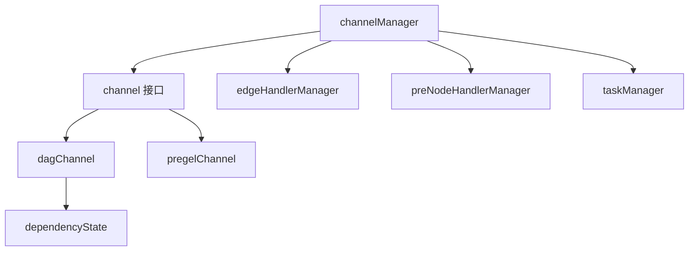

# channel_implementations 模块技术深度解析

## 概述

`channel_implementations` 模块是 Compose Graph Engine 的核心组件，它提供了两种不同的数据流协调机制：`dagChannel` 和 `pregelChannel`。这些通道实现负责在图节点之间传递数据、管理依赖关系，并确保图的正确执行顺序。

## 目录

1. [问题空间与解决方案](#问题空间与解决方案)
2. [核心抽象与心智模型](#核心抽象与心智模型)
3. [架构设计与数据流程](#架构设计与数据流程)
4. [组件深度解析](#组件深度解析)
5. [依赖分析](#依赖分析)
6. [设计决策与权衡](#设计决策与权衡)
7. [使用指南与示例](#使用指南与示例)
8. [边缘情况与注意事项](#边缘情况与注意事项)

---

## 问题空间与解决方案

### 问题背景

在构建复杂的数据流图时，我们面临几个关键挑战：

1. **依赖管理**：如何确保节点在所有依赖就绪后才执行？
2. **数据传递**：如何高效地在节点之间传递数据？
3. **分支处理**：如何处理条件分支导致的节点跳过？
4. **执行模型**：如何支持不同的图执行范式（如 DAG 和状态机）？

### 解决方案

`channel_implementations` 模块通过定义统一的 `channel` 接口，并提供两种不同的实现来解决这些问题：

- **`dagChannel`**：用于有向无环图（DAG）执行模型，支持复杂的依赖管理和分支跳过
- **`pregelChannel`**：用于 Pregel 风格的状态机执行模型，简化了数据传递机制

---

## 核心抽象与心智模型

### 统一通道接口

`channel` 接口是整个模块的核心抽象，它定义了通道必须实现的基本操作：

```go
type channel interface {
    reportValues(map[string]any) error
    reportDependencies([]string)
    reportSkip([]string) bool
    get(bool, string, *edgeHandlerManager) (any, bool, error)
    convertValues(fn func(map[string]any) error) error
    load(channel) error
    setMergeConfig(FanInMergeConfig)
}
```

### 心智模型

可以将通道想象成**节点之间的邮箱系统**：

- 每个节点有一个专属邮箱（channel）
- 其他节点将数据投递到这个邮箱（`reportValues`）
- 节点会检查邮箱是否有足够的信件（依赖）来执行任务（`get`）
- 如果某些寄件人被跳过，邮箱会处理这种情况（`reportSkip`）

不同的邮箱实现有不同的投递和检查规则：
- **dagChannel**：像严格的行政邮箱，必须收到所有指定寄件人的信件才能处理
- **pregelChannel**：像开放的社区邮箱，收到任何信件都可以处理，处理完清空

---

## 架构设计与数据流程

### 组件关系图



### 数据流程

#### dagChannel 的执行流程

1. **初始化**：创建时设置控制依赖和数据依赖
2. **数据接收**：通过 `reportValues` 接收来自前驱节点的数据
3. **依赖更新**：通过 `reportDependencies` 更新控制依赖状态
4. **就绪检查**：`get` 方法检查所有依赖是否就绪
5. **数据合并**：如果有多个输入，将它们合并
6. **状态重置**：消费后重置状态，等待下一轮

#### pregelChannel 的执行流程

1. **初始化**：创建一个简单的空通道
2. **数据接收**：通过 `reportValues` 接收数据并覆盖旧值
3. **就绪检查**：只要有数据就视为就绪
4. **数据消费**：`get` 方法返回数据并清空通道
5. **下一轮**：准备接收下一轮迭代的数据

---

## 组件深度解析

### channel 接口

**设计意图**：定义统一的通道操作抽象，使不同的执行模型可以无缝集成到同一个图引擎中。

**核心方法**：
- `reportValues`：报告来自其他节点的数据值
- `reportDependencies`：报告控制依赖的完成情况
- `reportSkip`：报告某些节点被跳过的情况
- `get`：获取通道中的值（如果就绪）
- `convertValues`：转换通道中的值
- `load`：从另一个通道加载状态
- `setMergeConfig`：设置多输入合并配置

---

### dagChannel 实现

**设计意图**：为 DAG 图执行提供严格的依赖管理，支持条件分支和节点跳过。

**核心字段**：
```go
type dagChannel struct {
    zeroValue   func() any
    emptyStream func() streamReader
    ControlPredecessors map[string]dependencyState
    Values              map[string]any
    DataPredecessors    map[string]bool
    Skipped             bool
    mergeConfig         FanInMergeConfig
}
```

**关键机制解析**：

1. **双重依赖系统**：
   - **控制依赖**：决定节点是否应该执行
   - **数据依赖**：提供节点执行所需的数据

2. **依赖状态管理**：
   ```go
   type dependencyState uint8
   
   const (
       dependencyStateWaiting dependencyState = iota  // 等待中
       dependencyStateReady                            // 已就绪
       dependencyStateSkipped                          // 已跳过
   )
   ```

3. **分支跳过传播**：
   - `reportSkip` 方法处理节点跳过情况
   - 如果所有控制依赖都被跳过，当前节点也会被跳过
   - 跳过状态会传递给后继节点

4. **惰性状态重置**：
   - `get` 方法在成功返回值后重置所有状态
   - 确保通道可以在多轮执行中复用

**使用场景**：
- 具有复杂依赖关系的工作流
- 需要条件分支的图执行
- 要求严格执行顺序的场景

---

### pregelChannel 实现

**设计意图**：为 Pregel 风格的迭代计算提供简单高效的数据传递机制。

**核心字段**：
```go
type pregelChannel struct {
    Values      map[string]any
    mergeConfig FanInMergeConfig
}
```

**关键机制解析**：

1. **简化的依赖模型**：
   - 不跟踪依赖状态
   - 只要有值就视为就绪

2. **覆盖式数据更新**：
   - `reportValues` 直接覆盖现有值
   - 不需要区分控制依赖和数据依赖

3. **一次性消费**：
   - `get` 方法返回值后立即清空通道
   - 为下一轮迭代做准备

**使用场景**：
- 迭代算法（如图算法、机器学习训练）
- 状态机式的执行模型
- 不需要复杂依赖管理的场景

---

## 依赖分析

### 内部依赖

`channel_implementations` 模块与以下模块紧密协作：

1. **[graph_manager](graph_manager.md)**：
   - `channelManager` 管理所有通道实例
   - 协调通道之间的数据流动
   - 调用通道的各种方法

2. **[graph_run](graph_run.md)**：
   - 图运行时使用通道传递节点输入输出
   - 依赖通道的就绪机制来调度任务

3. **[values_merge](values_merge.md)**：
   - 通道使用 `mergeValues` 函数合并多个输入

### 数据契约

通道模块依赖以下关键数据结构：

1. **`FanInMergeConfig`**：配置多输入合并行为
2. **`edgeHandlerManager`**：处理节点间的数据转换
3. **`streamReader`**：处理流式数据

---

## 设计决策与权衡

### 1. 统一接口 vs 专用实现

**决策**：定义统一的 `channel` 接口，但提供两种不同的实现。

**权衡**：
- ✅ **优点**：图引擎可以用相同的方式处理不同的执行模型
- ✅ **优点**：易于添加新的通道实现
- ❌ **缺点**：接口可能包含某些实现不需要的方法（如 `pregelChannel` 的 `reportSkip`）

**原因**：灵活性和可扩展性优先于接口的纯粹性。

---

### 2. 双重依赖系统（dagChannel）

**决策**：将依赖分为控制依赖和数据依赖。

**权衡**：
- ✅ **优点**：可以精确控制节点的执行条件和数据来源
- ✅ **优点**：支持复杂的分支逻辑
- ❌ **缺点**：增加了概念复杂度
- ❌ **缺点**：需要更多的状态管理

**原因**：DAG 执行模型需要这种精细的控制来处理条件分支和依赖关系。

---

### 3. 覆盖式更新（pregelChannel）

**决策**：`pregelChannel` 的 `reportValues` 直接覆盖现有值。

**权衡**：
- ✅ **优点**：简单高效，符合迭代计算的语义
- ✅ **优点**：不需要处理复杂的依赖跟踪
- ❌ **缺点**：可能会意外丢失数据
- ❌ **缺点**：不适合需要累积历史数据的场景

**原因**：Pregel 模型通常每轮迭代只关心最新状态，覆盖式更新更符合这种语义。

---

### 4. 消费即重置

**决策**：`get` 方法在成功返回值后重置通道状态。

**权衡**：
- ✅ **优点**：自动管理状态，减少外部管理负担
- ✅ **优点**：支持多轮执行
- ❌ **缺点**：如果需要多次消费同一个值，必须在外部缓存
- ❌ **缺点**：增加了 `get` 方法的副作用

**原因**：图执行通常是一次性消费，自动重置简化了使用。

---

## 使用指南与示例

### 基本使用模式

#### 创建通道

```go
// 创建 dagChannel
controlDeps := []string{"node1", "node2"}
dataDeps := []string{"node3"}
dagCh := dagChannelBuilder(controlDeps, dataDeps, 
    func() any { return map[string]any{} },
    func() streamReader { return emptyStream{} },
)

// 创建 pregelChannel
pregelCh := pregelChannelBuilder(nil, nil, nil, nil)
```

#### 使用通道

```go
// 报告数据
dagCh.reportValues(map[string]any{"node3": "data"})

// 报告依赖完成
dagCh.reportDependencies([]string{"node1"})

// 检查是否就绪
value, ready, err := dagCh.get(false, "targetNode", edgeHandler)
if ready && err == nil {
    // 使用 value
}
```

### 高级用法

#### 处理跳过的节点

```go
// 报告某些节点被跳过
skipped := dagCh.reportSkip([]string{"node1"})
if skipped {
    // 当前节点也被跳过了
}
```

#### 加载通道状态

```go
// 从另一个通道加载状态
err := dagCh.load(savedChannel)
if err != nil {
    // 处理错误
}
```

---

## 边缘情况与注意事项

### 1. 空依赖的通道

**问题**：如果一个通道没有任何依赖，它永远不会被视为就绪。

**影响**：连接到这种通道的节点永远不会执行。

**解决**：确保每个通道至少有一个依赖，或者在图设计中避免这种情况。

---

### 2. 流数据的关闭

**问题**：如果向通道报告了流数据但没有被消费，需要手动关闭流。

**代码位置**：在 `channelManager.updateValues` 中可以看到这种处理：

```go
if _, ok = dps[from]; ok {
    nFromMap[from] = fromMap[from]
} else {
    if sr, okk := value.(streamReader); okk {
        sr.close()
    }
}
```

**注意**：如果自己直接使用通道，需要确保未消费的流被正确关闭。

---

### 3. 加载状态的类型安全

**问题**：`load` 方法要求传入的通道必须是相同类型。

**代码位置**：
```go
func (ch *dagChannel) load(c channel) error {
    dc, ok := c.(*dagChannel)
    if !ok {
        return fmt.Errorf("load dag channel fail, got %T, want *dagChannel", c)
    }
    // ...
}
```

**注意**：不要尝试将 `dagChannel` 的状态加载到 `pregelChannel` 中，反之亦然。

---

### 4. 多输入合并的顺序

**问题**：当有多个输入时，合并的顺序可能会影响结果。

**注意**：虽然代码会保留输入的来源名称，但顺序可能不确定。如果合并顺序很重要，需要在合并配置中明确指定。

---

### 5. 跳过状态的传播

**问题**：在 `dagChannel` 中，如果一个节点被跳过，它的所有后继节点也可能被跳过。

**注意**：设计图时要考虑到这种连锁反应，确保有备用路径或适当的错误处理。

---

## 总结

`channel_implementations` 模块是 Compose Graph Engine 的核心组件，它通过统一的接口和两种不同的实现，为图执行提供了灵活高效的数据传递和依赖管理机制。理解这个模块的设计思想和实现细节，对于正确使用和扩展 Compose Graph Engine 至关重要。

无论是构建复杂的 DAG 工作流还是实现迭代算法，`channel_implementations` 都提供了必要的抽象和工具，让开发者可以专注于业务逻辑而不是底层的数据流管理。
