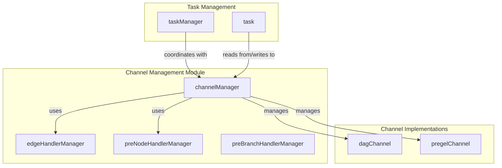

# Channel Management 模块深度解析

## 1. 引言

在复杂的图计算引擎中，如何高效地管理节点间的数据流动、处理依赖关系以及协调任务执行是一个核心挑战。`channel_management` 模块正是为了解决这一问题而设计的，它充当了图引擎中的"交通枢纽"，负责协调数据在不同节点间的传输、处理边和节点级别的数据转换，并确保任务按照正确的依赖顺序执行。

本模块是 [Compose Graph Engine](compose_graph_engine.md) 的核心组成部分，与 [Task Management](task_management.md) 和 [Channel Implementations](channel_implementations.md) 模块紧密协作，共同构成了图执行引擎的基础架构。

## 2. 问题空间与设计洞察

### 2.1 核心问题

在构建一个通用的图计算引擎时，我们面临以下关键挑战：

1. **数据路由与聚合**：如何将上游节点的输出正确地路由到下游节点，并在需要时聚合多个上游节点的数据？
2. **依赖管理**：如何处理数据依赖（节点需要其他节点的输出作为输入）和控制依赖（节点需要等待其他节点执行完成）？
3. **数据转换**：如何在数据流经边或进入节点时进行灵活的转换？
4. **分支处理**：当图执行过程中出现分支选择时，如何正确处理被跳过的节点及其下游节点？
5. **流式与批处理统一**：如何在同一套架构中同时支持流式数据和批处理数据？

### 2.2 设计洞察

`channel_management` 模块的核心设计洞察是将图的执行过程抽象为一个**基于通道的数据流系统**：

- 每个节点都有一个对应的 `channel`，作为该节点的输入缓冲区和状态管理器
- 数据通过边在节点间流动，边可以携带转换器来修改流经的数据
- 节点在执行前可以有预处理逻辑，执行后可以有后处理逻辑
- 通过显式跟踪数据依赖和控制依赖，实现精确的节点就绪判断
- 采用统一的接口设计，使得流式数据和批处理数据可以在同一套机制下处理

这种设计类似于现代微服务架构中的消息总线系统，但针对图计算的特定需求进行了优化，提供了更丰富的依赖管理和数据转换能力。

## 3. 核心抽象与架构

### 3.1 核心抽象

让我们首先理解模块中的几个核心抽象：

#### 3.1.1 Channel（通道）
`channel` 是一个接口，代表了图中节点的输入缓冲区和状态管理器。它负责：
- 存储来自上游节点的数据
- 跟踪节点的依赖关系
- 判断节点是否准备好执行
- 处理数据的合并和转换

#### 3.1.2 Handler Managers（处理器管理器）
有三种处理器管理器，分别负责不同层次的数据转换：
- `edgeHandlerManager`：管理边级别的处理器，在数据从一个节点流向另一个节点时起作用
- `preNodeHandlerManager`：管理节点级别的预处理器，在数据进入节点执行前起作用
- `preBranchHandlerManager`：管理分支级别的预处理器，在数据进入分支节点的不同分支时起作用

#### 3.1.3 Channel Manager（通道管理器）
`channelManager` 是整个模块的核心协调者，它：
- 管理所有节点的通道
- 维护节点间的依赖关系图
- 协调数据的更新和获取
- 处理分支执行时的节点跳过逻辑

### 3.2 架构图



### 3.3 数据流向

数据在 `channel_management` 模块中的典型流向如下：

1. **数据更新阶段**：上游节点执行完成后，其输出通过 `channelManager.updateValues()` 被写入到下游节点的通道中
2. **依赖更新阶段**：节点的控制依赖通过 `channelManager.updateDependencies()` 被更新
3. **就绪检查阶段**：`channelManager.getFromReadyChannels()` 检查所有通道，找出所有就绪的节点
4. **数据获取与处理阶段**：对于就绪节点，先应用边处理器，再应用节点预处理器，然后将数据传递给任务管理器执行

## 4. 核心组件深度解析

### 4.1 channelManager

`channelManager` 是整个模块的大脑，负责协调所有通道的操作和节点间的交互。

#### 4.1.1 结构定义

```go
type channelManager struct {
    isStream bool
    channels map[string]channel

    successors          map[string][]string
    dataPredecessors    map[string]map[string]struct{}
    controlPredecessors map[string]map[string]struct{}

    edgeHandlerManager    *edgeHandlerManager
    preNodeHandlerManager *preNodeHandlerManager
}
```

**字段解析**：
- `isStream`：标识当前图是否以流式模式运行，影响处理器的选择
- `channels`：存储所有节点的通道，键是节点键
- `successors`：存储每个节点的后继节点列表
- `dataPredecessors`：存储每个节点的数据前驱节点（提供输入数据的节点）
- `controlPredecessors`：存储每个节点的控制前驱节点（需要等待其完成的节点）
- `edgeHandlerManager`：边处理器管理器
- `preNodeHandlerManager`：节点预处理器管理器

#### 4.1.2 核心方法

##### updateValues

```go
func (c *channelManager) updateValues(_ context.Context, values map[string]map[string]any) error
```

**功能**：将上游节点的输出更新到下游节点的通道中。

**参数解析**：
- `values`：一个双层 map，外层键是目标节点键，内层键是源节点键，值是要传递的数据

**工作流程**：
1. 遍历每个目标节点
2. 过滤掉不属于该节点数据前驱的源节点数据
3. 对于被过滤掉的源节点数据，如果是流，关闭它
4. 将过滤后的数据报告给目标节点的通道

**设计要点**：
- 这里的过滤机制非常重要，它确保了节点只接收它实际需要的数据，避免了数据污染
- 对于不再需要的流数据进行关闭，防止资源泄漏

##### updateDependencies

```go
func (c *channelManager) updateDependencies(_ context.Context, dependenciesMap map[string][]string) error
```

**功能**：更新节点的控制依赖关系。

**参数解析**：
- `dependenciesMap`：键是目标节点键，值是该节点依赖的节点列表

**工作流程**：
1. 遍历每个目标节点
2. 过滤掉不属于该节点控制前驱的依赖
3. 将过滤后的依赖报告给目标节点的通道

**设计要点**：
- 与 `updateValues` 类似，这里也有过滤机制，确保节点只跟踪它实际应该依赖的节点
- 控制依赖通常用于实现图中的同步点，确保某些节点在其他节点完成后再执行

##### getFromReadyChannels

```go
func (c *channelManager) getFromReadyChannels(_ context.Context) (map[string]any, error)
```

**功能**：获取所有就绪节点的数据。

**工作流程**：
1. 遍历所有节点的通道
2. 对每个通道，调用 `get` 方法检查是否就绪
3. 如果就绪，先应用边处理器，再应用节点预处理器
4. 收集所有就绪节点的数据并返回

**设计要点**：
- 这里体现了处理器的应用顺序：先边处理器，再节点预处理器
- 这种顺序设计是合理的，因为边处理器处理的是特定节点对之间的数据转换，而节点预处理器处理的是所有进入该节点的数据

##### updateAndGet

```go
func (c *channelManager) updateAndGet(ctx context.Context, values map[string]map[string]any, dependencies map[string][]string) (map[string]any, error)
```

**功能**：一站式更新数据和依赖，然后获取就绪节点的数据。

**工作流程**：
1. 调用 `updateValues` 更新数据
2. 调用 `updateDependencies` 更新依赖
3. 调用 `getFromReadyChannels` 获取就绪节点的数据

**设计要点**：
- 这是一个便利方法，将常用的操作序列封装在一起
- 它体现了图执行引擎的一个典型循环：更新状态 → 检查就绪 → 执行节点

##### reportBranch

```go
func (c *channelManager) reportBranch(from string, skippedNodes []string) error
```

**功能**：报告分支执行情况，处理被跳过的节点。

**参数解析**：
- `from`：分支节点的键
- `skippedNodes`：被跳过的节点列表

**工作流程**：
1. 对每个被跳过的节点，报告其被跳过的情况
2. 如果一个节点被跳过，递归地处理它的所有后继节点
3. 收集所有实际上被跳过的节点

**设计要点**：
- 这里使用了 BFS（广度优先搜索）来传播跳过状态
- 这种设计确保了如果一个节点被跳过，它的所有下游节点也会被正确地处理
- 这对于实现条件分支和可选路径非常重要

### 4.2 edgeHandlerManager

`edgeHandlerManager` 管理边级别的处理器，在数据从一个节点流向另一个节点时进行转换。

#### 4.2.1 结构定义

```go
type edgeHandlerManager struct {
    h map[string]map[string][]handlerPair
}
```

**字段解析**：
- `h`：一个三层 map，第一层键是源节点键，第二层键是目标节点键，值是处理器对列表

#### 4.2.2 核心方法

##### handle

```go
func (e *edgeHandlerManager) handle(from, to string, value any, isStream bool) (any, error)
```

**功能**：应用边处理器转换数据。

**参数解析**：
- `from`：源节点键
- `to`：目标节点键
- `value`：要转换的数据
- `isStream`：是否是流式数据

**工作流程**：
1. 检查是否有从 `from` 到 `to` 的边处理器
2. 如果有，根据 `isStream` 选择不同的处理方式
   - 对于流式数据，调用 `transform` 方法
   - 对于非流式数据，调用 `invoke` 方法
3. 按顺序应用所有处理器
4. 返回转换后的数据

**设计要点**：
- 处理器是按顺序应用的，这种设计允许我们构建复杂的转换管道
- 流式和非流式数据使用不同的处理方法，这是因为流式数据需要特殊的处理（如延迟转换、背压等）

### 4.3 preNodeHandlerManager

`preNodeHandlerManager` 管理节点级别的预处理器，在数据进入节点执行前进行转换。

#### 4.3.1 结构定义

```go
type preNodeHandlerManager struct {
    h map[string][]handlerPair
}
```

**字段解析**：
- `h`：一个 map，键是节点键，值是处理器对列表

#### 4.3.2 核心方法

##### handle

```go
func (p *preNodeHandlerManager) handle(nodeKey string, value any, isStream bool) (any, error)
```

**功能**：应用节点预处理器转换数据。

**工作流程**：
1. 检查是否有该节点的预处理器
2. 如果有，根据 `isStream` 选择不同的处理方式
3. 按顺序应用所有处理器
4. 返回转换后的数据

**设计要点**：
- 与 `edgeHandlerManager` 类似，但作用范围是整个节点而非特定的边
- 这允许我们对进入节点的所有数据应用统一的转换逻辑

### 4.4 preBranchHandlerManager

`preBranchHandlerManager` 管理分支级别的预处理器，在数据进入分支节点的不同分支时进行转换。

#### 4.4.1 结构定义

```go
type preBranchHandlerManager struct {
    h map[string][][]handlerPair
}
```

**字段解析**：
- `h`：一个 map，键是节点键，值是处理器对列表的列表（每个分支对应一个处理器对列表）

#### 4.4.2 核心方法

##### handle

```go
func (p *preBranchHandlerManager) handle(nodeKey string, idx int, value any, isStream bool) (any, error)
```

**功能**：应用分支预处理器转换数据。

**参数解析**：
- `nodeKey`：分支节点键
- `idx`：分支索引
- `value`：要转换的数据
- `isStream`：是否是流式数据

**工作流程**：
1. 检查是否有该节点的分支预处理器
2. 检查指定索引的分支是否有预处理器
3. 如果有，根据 `isStream` 选择不同的处理方式
4. 按顺序应用所有处理器
5. 返回转换后的数据

**设计要点**：
- 这种设计允许我们对分支节点的不同分支应用不同的转换逻辑
- 它是实现条件逻辑和多路分支的重要基础设施

## 5. 依赖关系分析

### 5.1 内部依赖

`channel_management` 模块内部的依赖关系非常清晰：

- `channelManager` 依赖于 `edgeHandlerManager`、`preNodeHandlerManager` 和 `channel` 接口
- 三个处理器管理器（`edgeHandlerManager`、`preNodeHandlerManager`、`preBranchHandlerManager`）是独立的，彼此之间没有依赖

### 5.2 外部依赖

`channel_management` 模块与外部模块的交互主要通过以下方式：

1. **与 Channel Implementations 模块**：
   - 依赖 `dagChannel` 和 `pregelChannel` 实现 `channel` 接口
   - 这些实现负责实际的状态管理和就绪判断逻辑

2. **与 Task Management 模块**：
   - `taskManager` 使用 `channelManager` 来获取节点输入数据
   - `task` 执行完成后，其输出通过 `channelManager` 传递给下游节点

3. **与 Graph Construction 模块**：
   - 图构建模块负责初始化 `channelManager`，设置所有通道、依赖关系和处理器

### 5.3 数据契约

`channel_management` 模块与其他模块之间的数据契约主要包括：

1. **channel 接口**：所有通道实现必须遵守的接口，定义了数据报告、依赖管理和就绪判断的方法
2. **handlerPair 接口**：处理器对必须遵守的接口，定义了 `invoke` 和 `transform` 方法
3. **数据格式**：在通道中传递的数据通常是 `map[string]any` 类型，其中键是源节点键，值是实际数据

## 6. 设计决策与权衡

### 6.1 统一通道抽象 vs 专用通道

**决策**：采用统一的 `channel` 接口，允许不同的通道实现（如 `dagChannel` 和 `pregelChannel`）。

**权衡**：
- **优点**：提供了灵活性，可以根据不同的图执行模型（如 DAG 执行、Pregel 模型）使用不同的通道实现
- **缺点**：增加了抽象层次，可能会有轻微的性能开销
- **为什么这么做**：图执行引擎需要支持多种执行模型，统一的通道抽象使得这变得容易

### 6.2 三层处理器架构 vs 单层处理器

**决策**：采用边、节点、分支三层处理器架构。

**权衡**：
- **优点**：提供了更细粒度的控制，可以在不同层次应用不同的转换逻辑
- **缺点**：增加了复杂性，需要理解不同层次处理器的应用顺序和作用范围
- **为什么这么做**：在实际应用中，我们经常需要在不同层次应用转换逻辑，例如：
  - 在边级别：对特定节点对之间的数据进行转换
  - 在节点级别：对进入节点的所有数据进行统一转换
  - 在分支级别：对分支节点的不同分支应用不同的转换

### 6.3 显式依赖跟踪 vs 隐式依赖推导

**决策**：采用显式依赖跟踪，分别维护 `dataPredecessors` 和 `controlPredecessors`。

**权衡**：
- **优点**：
  - 更精确的控制，可以区分数据依赖和控制依赖
  - 更容易调试和理解图的执行流程
  - 可以支持更复杂的依赖模式
- **缺点**：
  - 需要更多的内存来存储依赖关系
  - 增加了图构建的复杂性
- **为什么这么做**：在复杂的图计算中，区分数据依赖和控制依赖是非常有用的，它允许我们实现更灵活的执行模式

### 6.4 同步执行优化 vs 纯异步执行

**决策**：在 `taskManager` 中实现了同步执行优化，当满足一定条件时，会同步执行一个任务。

**权衡**：
- **优点**：
  - 减少了 goroutine 的创建和调度开销
  - 对于简单的图，可以提高性能
  - 降低了延迟
- **缺点**：
  - 增加了代码复杂性
  - 可能会导致某些情况下的执行顺序不可预测
- **为什么这么做**：在实际应用中，很多图都是简单的或者有明显的热点路径，同步执行优化可以带来显著的性能提升

## 7. 使用指南与示例

### 7.1 初始化 channelManager

```go
// 创建通道映射
channels := map[string]channel{
    "node1": newDAGChannel(),
    "node2": newDAGChannel(),
    // ...
}

// 创建依赖关系
successors := map[string][]string{
    "node1": {"node2"},
    // ...
}

dataPredecessors := map[string]map[string]struct{}{
    "node2": {"node1": struct{}{}},
    // ...
}

controlPredecessors := map[string]map[string]struct{}{
    // ...
}

// 创建处理器管理器
edgeHM := &edgeHandlerManager{
    h: map[string]map[string][]handlerPair{
        "node1": {
            "node2": []handlerPair{
                // 边处理器
            },
        },
    },
}

preNodeHM := &preNodeHandlerManager{
    h: map[string][]handlerPair{
        "node2": []handlerPair{
            // 节点预处理器
        },
    },
}

// 创建 channelManager
cm := &channelManager{
    isStream:             false,
    channels:             channels,
    successors:           successors,
    dataPredecessors:     dataPredecessors,
    controlPredecessors:  controlPredecessors,
    edgeHandlerManager:   edgeHM,
    preNodeHandlerManager: preNodeHM,
}
```

### 7.2 典型执行流程

```go
// 1. 更新数据和依赖
values := map[string]map[string]any{
    "node2": {
        "node1": someOutput,
    },
}

dependencies := map[string][]string{
    // ...
}

// 2. 获取就绪节点的数据
readyData, err := cm.updateAndGet(ctx, values, dependencies)
if err != nil {
    // 处理错误
}

// 3. 处理就绪节点
for nodeKey, data := range readyData {
    // 创建任务并执行
    // ...
}
```

## 8. 边缘情况与注意事项

### 8.1 流数据的管理

**问题**：当处理流数据时，需要特别注意流的关闭，否则可能导致资源泄漏。

**解决方案**：
- 在 `updateValues` 方法中，对于被过滤掉的流数据，会自动关闭它
- 在 `taskManager` 中，对于不再需要的原始输入流，也会在适当的时候关闭
- 使用者应该确保自己创建的流在不再需要时被关闭

### 8.2 处理器中的 panic

**问题**：如果处理器中发生 panic，可能会导致整个图执行崩溃。

**解决方案**：
- 在 `runPreHandler` 和 `runPostHandler` 方法中，已经有 panic 恢复机制
- 对于边处理器和节点预处理器，虽然没有显式的 panic 恢复，但它们通常在 `getFromReadyChannels` 中调用，而 `getFromReadyChannels` 又在图执行引擎的主循环中调用，通常会有 panic 恢复机制
- 尽管如此，建议在处理器中避免可能导致 panic 的操作，或者自行恢复 panic

### 8.3 循环依赖

**问题**：如果图中存在循环依赖，可能会导致死锁或无限循环。

**解决方案**：
- 图构建模块应该在构建图时检测循环依赖
- `channel_management` 模块本身不检测循环依赖，它假设输入的图是有效的
- 如果需要支持循环图，应该使用支持循环的通道实现（如 `pregelChannel`），并正确设置超步数

### 8.4 分支跳过的传播

**问题**：当一个节点被跳过时，需要确保它的所有下游节点也被正确处理。

**解决方案**：
- `reportBranch` 方法使用 BFS 来传播跳过状态
- 但是，它假设图是静态的，分支结构在编译时就已经确定
- 如果图的结构在运行时动态变化，可能需要额外的处理

## 9. 总结

`channel_management` 模块是 Compose Graph Engine 的核心组成部分，它提供了一个灵活、高效的框架来管理图执行过程中的数据流、依赖关系和任务协调。通过将图执行抽象为基于通道的数据流系统，并提供多层次的处理器机制，它使得构建复杂的图计算应用变得更加容易。

该模块的设计体现了几个重要的软件设计原则：
- **关注点分离**：将通道管理、处理器管理和任务管理分开
- **接口抽象**：通过 `channel` 接口支持不同的通道实现
- **灵活性与可扩展性**：通过多层次的处理器机制提供了丰富的扩展点

虽然该模块的设计相对复杂，但它为上层应用提供了强大的功能和灵活性，是构建复杂图计算应用的坚实基础。

## 10. 参考链接

- [Compose Graph Engine](compose_graph_engine.md)
- [Channel Implementations](channel_implementations.md)
- [Task Management](task_management.md)
- [Graph Construction and Compilation](graph_construction_and_compilation.md)
