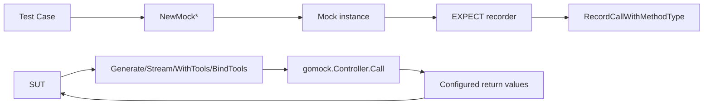

# chat_model_mocks 深度解析

`chat_model_mocks` 模块本质上是“给 ChatModel 接口做的可编程替身工厂”。在真实工程里，`BaseChatModel` / `ToolCallingChatModel` 往往会触发网络请求、流式 I/O、token 计费和外部服务不稳定性；如果测试直接依赖真实模型，测试会变慢、变脆、且难以精确断言调用行为。这个模块通过 GoMock 生成三组 mock（`MockBaseChatModel`、`MockChatModel`、`MockToolCallingChatModel`），把“模型输出是什么”“是否被正确调用”“参数是否正确传递”变成可控、可验证、可复现实验。

## 架构角色与数据流

从架构定位看，这不是业务逻辑模块，而是**测试边界层（test seam）**：它夹在“被测代码（SUT）”和“模型接口”之间，负责截获调用并交给 `gomock.Controller` 进行匹配与回放。



可以把它想象成“航班黑匣子 + 自动应答机”：
测试先告诉黑匣子“我期待你收到哪些调用（EXPECT）”；运行时 SUT 一旦真的调用 mock，对应方法就把调用事件上报给 `Controller`，由后者判断是否符合预期，并返回预配置结果。

关键端到端路径是这样的：测试通过 `NewMock*` 创建 mock，然后通过 `mock.EXPECT().Generate(...)`（或 `Stream` / `WithTools` / `BindTools`）登记预期；SUT 在执行时调用同名方法，mock 将参数（含可变参数）封装成 `[]any` 转发给 `m.ctrl.Call`；`gomock` 根据之前登记的规则匹配并返回结果；mock 再做类型断言，交还给 SUT。

## 组件级深挖

### `MockBaseChatModel`

`MockBaseChatModel` 对应 [components.model.interface.BaseChatModel](model_and_tool_interfaces.md) 这条最基础契约：`Generate` 与 `Stream`。它内部只有三块状态：`ctrl`（调度中心）、`recorder`（期望录制器）、`isgomock`（GoMock 约定标记字段）。

设计意图很直接：mock 本身不做任何业务行为，不缓存、不推理、不构造响应，它只是把方法调用“转运”给 `gomock.Controller`。这让它非常轻量，也保证行为统一（所有复杂匹配逻辑都在 GoMock 框架层）。

`Generate` 和 `Stream` 的实现有一个值得注意的细节：它们显式遍历 `opts ...model.Option`，将可变参数拼进 `varargs := []any{ctx, input}`。这一步不是样板噪音，而是为了把 Go 的 variadic 参数在 runtime 里变成可统一匹配的调用序列，避免丢失参数顺序与数量信息。

### `MockBaseChatModelMockRecorder`

这个 recorder 是“声明期望”的入口。`Generate(ctx, input, opts ...any)` 与 `Stream(...)` 都调用 `RecordCallWithMethodType`，其中 `reflect.TypeOf((*MockBaseChatModel)(nil).Generate)` 这一写法用于精确绑定方法签名。

为什么要带 method type？因为它能让 gomock 在重载感知（Go 无重载但接口组合很多）和参数检查上更稳定，避免仅靠字符串方法名导致的歧义与弱校验。

### `MockChatModel`

`MockChatModel` 在 `Generate`/`Stream` 基础上多了 `BindTools(tools []*schema.ToolInfo) error`。这对应“可绑定工具但不一定强调不可变复制语义”的模型接口版本。对于使用 [Schema Core Types](Schema Core Types.md) 中 `schema.ToolInfo` 的调用方，这个 mock 允许断言“工具是否按预期绑定”。

这里的非显而易见点在于：`BindTools` 是直接调用 `m.ctrl.Call(m, "BindTools", tools)`，没有 variadic 处理，因为签名本身不是 variadic。mock 严格复刻接口面貌，这对接口变更检测很有价值：一旦接口签名变化，生成代码会变化，测试编译期就会暴露断裂。

### `MockChatModelMockRecorder`

与上一个 recorder 同构，但新增 `BindTools(tools any)` 的期望录制能力。它的参数类型是 `any`，这不是放松类型安全，而是为了支持 gomock matcher（如 `gomock.Any()`、自定义 matcher）。类型检查推迟到匹配阶段执行。

### `MockToolCallingChatModel`

`MockToolCallingChatModel` 对应 [components.model.interface.ToolCallingChatModel](model_and_tool_interfaces.md)。这个接口强调 `WithTools(tools []*schema.ToolInfo) (ToolCallingChatModel, error)` 的“返回新实例”语义（接口注释明确说明不修改当前实例，以并发安全为目标）。

mock 层并不会主动实现“新实例”语义；它只是把 `WithTools` 调度给 controller 并返回配置值。也就是说，**语义正确性由测试用例配置保障**：如果你要验证不可变行为，应在期望里返回另一个 mock 实例，而不是同一个对象。

### `MockToolCallingChatModelMockRecorder`

与前述 recorder 模式一致，提供 `Generate` / `Stream` / `WithTools` 的录制入口。该结构让测试可以覆盖两类核心行为：

- 对话生成行为（`Generate` / `Stream`）
- 工具绑定链式行为（`WithTools`）

## 依赖与契约分析

该模块对外部依赖非常集中，耦合面清晰。

从代码可直接验证的 `depends_on` 关系看，mock 方法的核心下游几乎都指向 `gomock.Controller`：`m.ctrl.Call(...)` 负责执行调用匹配与返回值回放，`RecordCallWithMethodType(...)` 负责在 recorder 里登记期望，`reflect.TypeOf(...)` 提供方法签名锚点。除此之外，它依赖接口与数据契约：`model.Option`、`model.ToolCallingChatModel`、`schema.Message`、`schema.ToolInfo`、`schema.StreamReader[*schema.Message]`。这些契约分别定义在 [model_and_tool_interfaces](model_and_tool_interfaces.md)、[Schema Core Types](Schema Core Types.md)、[Schema Stream](Schema Stream.md)。

从 `depended_by` 视角，当前提供的模块树能确认它属于 `Mock Utilities` 里的 `chat_model_mocks` 子模块，主要服务测试代码（单元测试/集成测试中的 mock 注入），而不是运行时业务链路。由于给定组件代码里不包含具体测试文件调用点，这里无法逐条列出“哪些测试函数调用了它”，但其架构角色是明确的：它是被动适配层，上游测试驱动它，下游 gomock 引擎执行匹配。

数据契约里最热路径是 `Generate` 与 `Stream`：`ctx` + `[]*schema.Message` + `opts ...model.Option` 进入 mock；mock 打包后进入 `Controller.Call`；返回值再被断言为 `*schema.Message` 或 `*schema.StreamReader[*schema.Message]` + `error`。如果测试配置返回类型错误，会在类型断言处出现零值/失败风险，这也是常见坑点。

## 设计决策与权衡

这个模块几乎完全采用“代码生成 + 框架约定”策略，而不是手写 fake/stub。核心权衡是：

- 选择了**一致性与维护成本低**，牺牲了“手写 mock 的可读业务语义”。
- 选择了**运行时匹配灵活性**（`any` + matcher），牺牲了 recorder 方法层面的强类型约束。
- 选择了**薄封装**（mock 不嵌业务逻辑），牺牲了“开箱即用默认行为”；测试必须显式配置期望与返回。

在这个上下文里，这些选择是合理的：测试基础设施的首要目标是稳定、可再生成、接口漂移可感知，而不是承载业务智能。

## 使用方式与示例

典型用法是：创建 controller -> 创建 mock -> 设 EXPECT -> 注入 SUT -> 执行断言。

```go
ctrl := gomock.NewController(t)
defer ctrl.Finish()

m := model.NewMockToolCallingChatModel(ctrl)

m.EXPECT().
    WithTools(gomock.Any()).
    Return(m, nil)

m.EXPECT().
    Generate(gomock.Any(), gomock.Any(), gomock.Any()).
    Return(&schema.Message{Content: "ok"}, nil)

// 将 m 注入你的被测组件，然后触发调用
```

如果你要测流式链路：

```go
m := model.NewMockBaseChatModel(ctrl)
reader := &schema.StreamReader[*schema.Message]{} // 通常会替换成测试构造的可读流

m.EXPECT().
    Stream(gomock.Any(), gomock.Any(), gomock.Any()).
    Return(reader, nil)
```

## 新贡献者最容易踩的坑

第一，别手改 `ChatModel_mock.go`。文件头已经写明 `Code generated by MockGen. DO NOT EDIT.`，正确流程是修改接口后重新运行 `mockgen`。

第二，注意 variadic 参数匹配。`Generate` / `Stream` 的 `opts ...model.Option` 在 recorder 侧是 `...any`；如果你的断言写成固定参数个数，实际调用多一个 option 就会 mismatch。常见做法是对 opts 使用 `gomock.Any()` 或更细粒度 matcher。

第三，`WithTools` 的返回值是 `model.ToolCallingChatModel`。测试里若返回 `nil, nil`，后续链式调用可能 panic；若要继续链式行为，通常返回同一个 mock 或另一个已配置 mock。

第四，`Stream` 返回的是 `*schema.StreamReader[*schema.Message]`。如果你只关心“是否调用”，可以返回 `nil, someErr`；如果关心消费逻辑，请确保返回 reader 的生命周期和读取行为与你的测试场景一致。

## 边界与限制

该模块不负责模拟真实 LLM 语义，不负责 token 统计，也不负责 tool call 解析。它只模拟“接口调用行为”。因此当你要验证复杂消息拼接、流拼接、tool result 序列化时，应该联动查看并测试相关模块，而不是期望在这里得到高保真行为模拟。

## 相关文档

- [model_and_tool_interfaces](model_and_tool_interfaces.md)
- [Schema Core Types](Schema Core Types.md)
- [Schema Stream](Schema Stream.md)
- [Mock Utilities](Mock Utilities.md)
