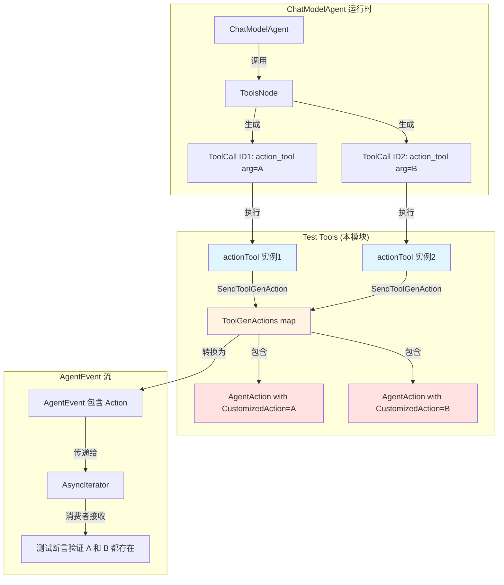

# ChatModel Agent Test Tools and Behaviors

## 问题域：为什么需要测试工具和行为模块？

想象你正在测试一个复杂的烹饪机器 —— 这个机器可以调用各种"工具"（搅拌器、烤箱、切菜器等）来完成烹饪任务。在编写自动化测试时，你不会使用真实的搅拌器和烤箱，而是使用**模拟版本**：这些模拟工具可以模拟各种边界情况、失败模式和特殊行为，同时不需要实际运行真实的硬件。

`chatmodel_agent_test_tools_and_behaviors` 模块正是这样一个"工具箱" —— 它提供了一系列精心设计的**测试工具实现（test double tools）**，用于验证 ChatModelAgent 在各种场景下的行为正确性。这些工具不是为生产环境设计的，而是专门为测试不同工具集成场景而构建的，包括流式输出、动作生成、中间件拦截、并发调用等复杂场景。

这些测试工具的价值在于：它们让测试能够**覆盖真实工具难以触发的边界条件**，比如模拟工具发送自定义动作、测试中间件如何修改工具结果、验证并发调用时工具调用 ID 的正确传递等。如果没有这些精心设计的测试工具，开发者可能需要编写大量额外的 mock 设置代码，甚至无法测试某些关键的行为。

## 核心心智模型：测试场景的"演员表"

要理解这个模块，可以把它想象成一个**话剧团的演员表**。每个测试工具都是一个"演员"，它们在测试中扮演特定的角色，展示 ChatModelAgent 与工具交互的某个特定方面：

- **`myTool`** 是一个"标准演员" —— 最基础的工具实现，用于测试工具调用的基本流程
- **`actionTool`** 是一个"动作演员" —— 在执行时会发送自定义的 `AgentAction`，用于测试工具生成的动作如何传播到上层
- **`streamActionTool`** 是一个"流式动作演员" —— 结合了流式输出和动作生成，测试更复杂的场景
- **`legacyStreamActionTool`** 是一个"怀旧演员" —— 使用旧版的 API（`compose.ProcessState`），确保向后兼容性
- **`simpleToolForMiddlewareTest`** 是一个"中间件测试演员" —— 专门用于验证工具中间件能否正确拦截和修改工具返回值

这些工具不是独立的实体，它们在测试中协同工作，通过组合不同的场景来验证 ChatModelAgent 的行为。例如，`TestConcurrentSameToolSendToolGenActionUsesToolCallID` 测试用例就使用了两个 `actionTool` 实例来验证并发调用时工具调用 ID 是否被正确使用。

## 架构与数据流



### 数据流详解

当 ChatModelAgent 需要调用工具时，数据流经历以下阶段：

1. **模型生成阶段**：ChatModel 生成包含工具调用的响应，每个工具调用都有一个唯一的 `ID` 和参数（`Arguments`）

2. **工具执行阶段**：ToolsNode 根据工具调用的 `ID` 和 `Function.Name` 分发到对应的工具实现。对于本模块的工具：
   - `actionTool` 的 `InvokableRun` 被调用
   - `streamActionTool` 的 `StreamableRun` 被调用
   - 工具接收到的 `argumentsInJSON` 参数就是模型生成的工具调用参数

3. **动作生成阶段**（关键）：
   - 工具在执行过程中调用 `SendToolGenAction(ctx, toolName, &AgentAction{...})`
   - 这个函数将 `AgentAction` 存储到执行上下文的 `ToolGenActions` map 中
   - **关键点**：map 的 key 使用工具调用 ID，而非工具名称。当同一个工具被并发调用多次时，每个调用有唯一的 ID，确保它们各自的动作不会相互覆盖

4. **事件发射阶段**：
   - 执行完成后，`ToolGenActions` map 被转换为 `AgentEvent` 流
   - 每个 `AgentAction` 包装在一个 `AgentEvent` 中
   - 这些事件通过 `AsyncIterator` 返回给调用者

5. **测试验证阶段**：
   - 测试代码从迭代器中读取所有事件
   - 检查是否收到了预期的动作（例如，检查 `A` 和 `B` 两个参数都被捕获）

### 并发调用的特殊处理

模块中的一个重要设计是支持**同一工具的并发调用**。测试 `TestConcurrentSameToolSendToolGenActionUsesToolCallID` 验证了以下场景：

```go
cm.EXPECT().Generate(gomock.Any(), gomock.Any(), gomock.Any()).
    Return(schema.AssistantMessage("tools", []schema.ToolCall{
        {ID: "id1", Function: schema.FunctionCall{Name: "action_tool", Arguments: "A"}},
        {ID: "id2", Function: schema.FunctionCall{Name: "action_tool", Arguments: "B"}},
    }), nil).Times(1)
```

这里，`action_tool` 被调用了两次，但每次有不同的 ID（`id1` 和 `id2`）和参数（`A` 和 `B`）。如果使用工具名称作为 key，第二次调用的动作会覆盖第一次的。但通过使用工具调用 ID 作为 key，两个动作都能被正确存储和传递。

## 组件深度解析

### myTool：最基础的测试工具

`myTool` 是一个可配置的基础工具，用于测试基本的工具调用流程。

```go
type myTool struct {
    name     string      // 工具名称
    desc     string      // 工具描述
    waitTime time.Duration  // 模拟执行延迟
}
```

**设计意图**：`myTool` 提供了一种方式来模拟工具执行需要时间的场景。`waitTime` 参数允许测试代码控制工具执行的耗时，这对于测试并发行为、超时处理、工具调用顺序等场景非常有用。在 `TestParallelReturnDirectlyToolCall` 测试中，三个 `myTool` 实例分别设置了 1ms、10ms、100ms 的延迟，用于验证 `ReturnDirectly` 配置是否真的会在第一个工具完成时立即返回。

**参数与返回值**：
- `Info(ctx)`: 返回工具的元信息（名称和描述）
- `InvokableRun(ctx, argumentsInJSON, opts)`: 返回固定的字符串 `"success"`，并等待 `waitTime` 指定的时长

**副作用**：
- 模拟耗时操作（通过 `time.Sleep`）
- 没有修改外部状态

**使用场景**：
- 测试工具调用的基本流程
- 测试并发工具调用的行为
- 验证 `ReturnDirectly` 配置的及时返回特性

### actionTool：可发送自定义动作的工具

`actionTool` 是一个关键测试工具，用于验证工具如何向 Agent 传递自定义动作。

```go
type actionTool struct{}

func (a actionTool) InvokableRun(ctx context.Context, argumentsInJSON string, _ ...tool.Option) (string, error) {
    _ = SendToolGenAction(ctx, "action_tool", &AgentAction{CustomizedAction: argumentsInJSON})
    return "ok", nil
}
```

**设计意图**：在生产环境中，工具可能需要向 Agent 发送特定的动作指令，例如"中断"、"转移控制"等。`actionTool` 通过 `SendToolGenAction` 函数演示了这个机制。关键在于，工具的参数（`argumentsInJSON`）被直接包装在 `AgentAction.CustomizedAction` 中，这意味着工具可以将任意数据传递给 Agent 的控制流。

**内部机制**：
- 调用 `SendToolGenAction(ctx, toolName, &AgentAction{CustomizedAction: argumentsInJSON})`
- 这个函数将 `AgentAction` 存储到执行上下文的 `ToolGenActions` map 中
- map 的 key 是工具调用 ID，确保并发调用的正确性
- 返回值 `"ok"` 是固定的，测试通常不关注它

**使用场景**：
- 测试工具生成的动作是否正确传递到 `AgentEvent.Action` 字段
- 验证并发调用时动作不会相互覆盖（见 `TestConcurrentSameToolSendToolGenActionUsesToolCallID`）
- 演示自定义动作的发送模式

### streamActionTool：流式动作工具

`streamActionTool` 结合了流式输出和动作生成，测试更复杂的交互场景。

```go
type streamActionTool struct{}

func (s streamActionTool) StreamableRun(ctx context.Context, argumentsInJSON string, _ ...tool.Option) (*schema.StreamReader[string], error) {
    _ = SendToolGenAction(ctx, "action_tool_stream", &AgentAction{CustomizedAction: argumentsInJSON})
    sr, sw := schema.Pipe[string](1)
    go func() {
        defer sw.Close()
        _ = sw.Send("o", nil)
        _ = sw.Send("k", nil)
    }()
    return sr, nil
}
```

**设计意图**：流式工具（`StreamableTool`）与普通工具（`InvokableTool`）的主要区别在于前者返回一个流，后者返回单个值。`streamActionTool` 演示了流式工具同样可以发送自定义动作，这是因为在动作生成后，流才开始发送数据。测试需要验证：动作在流输出之前被处理，且动作的传播不受流式输出的影响。

**内部机制**：
- 首先调用 `SendToolGenAction` 发送动作（同步操作）
- 然后创建一个流管道（`schema.Pipe`）
- 启动一个 goroutine 向流发送 `"o"` 和 `"k"` 两个字符串
- 返回流的读取端给调用者

**流式输出的处理**：
- 流数据通过 `StreamReader` 传递给调用者
- 在测试中，流数据通常被验证（例如检查是否收到 `"ok"`）
- 动作通过 `AgentEvent.Action` 字段传递

**使用场景**：
- 测试流式工具的动作生成能力（见 `TestConcurrentSameStreamToolSendToolGenActionUsesToolCallID`）
- 验证动作和流数据的传递是独立的两个通道
- 确保并发流式工具调用的动作正确性

### legacyStreamActionTool：向后兼容的工具

`legacyStreamActionTool` 使用旧版的 API，用于确保向后兼容性。

```go
type legacyStreamActionTool struct{}

func (s legacyStreamActionTool) StreamableRun(ctx context.Context, argumentsInJSON string, _ ...tool.Option) (*schema.StreamReader[string], error) {
    _ = compose.ProcessState(ctx, func(ctx context.Context, st *State) error {
        st.ToolGenActions["legacy_action_tool_stream"] = &AgentAction{CustomizedAction: argumentsInJSON}
        return nil
    })
    sr, sw := schema.Pipe[string](1)
    go func() {
        defer sw.Close()
        _ = sw.Send("o", nil)
        _ = sw.Send("k", nil)
    }()
    return sr, nil
}
```

**设计意图**：这个工具展示了旧版本的 API 如何使用 `compose.ProcessState` 直接修改 React state 的 `ToolGenActions` map。新版本推荐使用 `SendToolGenAction` 函数，但旧代码仍然需要能够工作。测试 `TestStreamToolLegacyNameKeyFallback` 验证了旧 API 的兼容性。

**新旧 API 的对比**：

| 特性 | 旧 API (`compose.ProcessState`) | 新 API (`SendToolGenAction`) |
|------|--------------------------------|------------------------------|
| 调用方式 | 传递回调函数给 `compose.ProcessState` | 直接调用函数 |
| 状态修改 | 直接修改 `st.ToolGenActions` map | 函数内部处理状态修改 |
| Key 处理 | 需要手动指定 key（工具名称） | 自动使用工具调用 ID |
| 错误处理 | 需要手动返回错误 | 函数返回错误 |

**内部机制**：
- 调用 `compose.ProcessState(ctx, callback)` 获取并修改 React state
- 在回调中直接设置 `st.ToolGenActions["legacy_action_tool_stream"]`
- 注意：这里使用的是工具名称作为 key，而不是工具调用 ID
- 创建流并返回数据

**潜在的兼容性问题**：
- 旧 API 使用工具名称作为 key，在并发调用时可能导致动作覆盖
- 测试 `TestStreamToolLegacyNameKeyFallback` 只测试了单个工具调用的场景
- 如果需要支持旧 API 的并发调用，需要额外的机制

**使用场景**：
- 确保使用旧 API 的代码仍然能够正常工作
- 验证新旧 API 的行为一致性
- 演示如何迁移到新 API

### simpleToolForMiddlewareTest：中间件测试工具

`simpleToolForMiddlewareTest` 专门用于测试工具中间件的行为。

```go
type simpleToolForMiddlewareTest struct {
    name   string
    result string  // 原始结果
}

func (s *simpleToolForMiddlewareTest) InvokableRun(_ context.Context, _ string, _ ...tool.Option) (string, error) {
    return s.result, nil
}

func (s *simpleToolForMiddlewareTest) StreamableRun(_ context.Context, _ string, _ ...tool.Option) (*schema.StreamReader[string], error) {
    return schema.StreamReaderFromArray([]string{s.result}), nil
}
```

**设计意图**：工具中间件是一种强大的机制，允许在工具执行前后插入自定义逻辑，例如日志记录、结果修改、权限检查等。`simpleToolForMiddlewareTest` 提供了一个可预测的工具，测试代码可以配置它的原始结果，然后验证中间件是否正确地修改了这个结果。

**内部机制**：
- `InvokableRun` 返回预设的 `s.result` 字符串
- `StreamableRun` 返回包含单个元素 `s.result` 的流
- 两个方法都实现了相同的接口，允许测试不同的执行路径

**中间件的拦截和修改**：

在 `TestChatModelAgent_ToolResultMiddleware_EmitsFinalResult` 测试中，定义了一个中间件：

```go
resultModifyingMiddleware := compose.ToolMiddleware{
    Invokable: func(next compose.InvokableToolEndpoint) compose.InvokableToolEndpoint {
        return func(ctx context.Context, input *compose.ToolInput) (*compose.ToolOutput, error) {
            output, err := next(ctx, input)
            if err != nil {
                return nil, err
            }
            output.Result = modifiedResult  // 修改结果
            return output, nil
        }
    },
    Streamable: func(next compose.StreamableToolEndpoint) compose.StreamableToolEndpoint {
        return func(ctx context.Context, input *compose.ToolInput) (*compose.StreamToolOutput, error) {
            output, err := next(ctx, input)
            if err != nil {
                return nil, err
            }
            output.Result = schema.StreamReaderFromArray([]string{modifiedResult})
            return output, nil
        }
    },
}
```

这个中间件会拦截工具的执行，将结果替换为 `modifiedResult`。测试验证了：
- 原始结果（`"original_result"`）被中间件修改为 `modifiedResult`
- 修改后的结果被正确地包含在 `AgentEvent` 中
- 中间件在调用模式（Invoke）和流式模式（Stream）下都正确工作

**使用场景**：
- 测试工具中间件能否拦截和修改工具结果
- 验证中间件在不同执行模式下的行为
- 演示中间件的编写模式

## 依赖关系分析

### 被依赖方：测试框架如何使用本模块

本模块的工具被 `adk/chatmodel_test.go` 文件中的各种测试用例使用。主要的调用者包括：

1. **`TestConcurrentSameToolSendToolGenActionUsesToolCallID`**：
   - 使用两个 `actionTool` 实例
   - 验证并发调用时工具调用 ID 的正确使用
   - 验证两个不同的动作参数（`"A"` 和 `"B"`）都被正确捕获

2. **`TestConcurrentSameStreamToolSendToolGenActionUsesToolCallID`**：
   - 使用两个 `streamActionTool` 实例
   - 验证流式工具的并发调用
   - 检查流式输出和动作生成的独立性

3. **`TestStreamToolLegacyNameKeyFallback`**：
   - 使用 `legacyStreamActionTool`
   - 验证旧 API 的兼容性
   - 确保使用工具名称作为 key 的旧代码仍然工作

4. **`TestChatModelAgent_ToolResultMiddleware_EmitsFinalResult`**：
   - 使用 `simpleToolForMiddlewareTest`
   - 验证中间件的拦截和修改能力
   - 测试调用模式和流式模式两种场景

5. **`TestParallelReturnDirectlyToolCall`**：
   - 使用三个 `myTool` 实例，配置不同的延迟时间
   - 验证 `ReturnDirectly` 配置的及时返回特性

### 数据契约：工具与 Agent 之间的接口

本模块的工具与 ChatModelAgent 之间遵循以下数据契约：

1. **工具元信息（ToolInfo）**：
   - 每个工具必须实现 `Info(ctx) (*schema.ToolInfo, error)` 方法
   - 返回工具的名称、描述和参数定义
   - ChatModelAgent 使用这些信息向模型注册工具

2. **工具输入（ToolCall）**：
   - 模型生成的工具调用包含：`ID`（唯一标识）、`Function.Name`（工具名称）、`Arguments`（JSON 格式的参数）
   - 工具的执行方法（`InvokableRun` 或 `StreamableRun`）接收 `argumentsInJSON` 参数

3. **工具输出（ToolResult）**：
   - 调用模式：返回字符串
   - 流式模式：返回 `*schema.StreamReader[string]`
   - 工具输出被包装在 `schema.ToolResult` 消息中

4. **自定义动作（AgentAction）**：
   - 工具通过 `SendToolGenAction(ctx, toolName, action)` 发送
   - 动作被存储在执行上下文的 `ToolGenActions` map 中
   - 动作最终被包装在 `AgentEvent.Action` 字段中返回

### 调用其他组件：本模块的依赖

本模块的代码主要依赖以下组件：

1. **`schema` 包**：
   - `schema.ToolInfo`：工具元信息
   - `schema.StreamReader`：流式输出
   - `schema.Pipe`：创建流管道
   - `schema.StreamReaderFromArray`：从数组创建流
   - 这些是 eino 框架的核心数据结构

2. **`tool` 包**：
   - `tool.Option`：工具执行的选项
   - 这是工具接口定义的一部分

3. **`compose` 包**（仅 `legacyStreamActionTool`）：
   - `compose.ProcessState`：旧版的状态访问 API
   - `compose.State`：React 状态结构
   - 这些是 compose 图执行引擎的部分

4. **Agent 相关组件**：
   - `AgentAction`：自定义动作结构
   - `SendToolGenAction`：发送动作的函数（推测）
   - 这些是 Agent 运行时的核心组件

## 设计决策与权衡

### 测试工具 vs 真实 Mock

**决策**：提供具体的工具实现（`actionTool`、`streamActionTool` 等），而不是使用通用的 mock 框架。

**理由**：
- 具体的工具实现更直观地展示了 API 的使用方式
- 测试代码更易读，开发者可以清楚地看到工具如何与 Agent 交互
- 这些工具可以在多个测试用例中复用，减少重复代码
- 具体的实现更容易调试和修改

**权衡**：
- 增加了一些额外的代码量
- 需要维护这些测试工具的实现

### 工具调用 ID vs 工具名称作为 Key

**决策**：使用工具调用 ID 作为 `ToolGenActions` map 的 key，而不是工具名称。

**理由**：
- 支持同一工具的并发调用，避免动作覆盖
- 每个工具调用都有唯一的 ID，这是模型生成的
- 符合工具调用的语义 —— 每次调用都是独立的

**权衡**：
- 旧 API 使用工具名称作为 key，导致兼容性问题
- 需要在测试中验证 ID 的正确传递

**历史包袱**：`legacyStreamActionTool` 仍然使用工具名称作为 key，这是旧版 API 的遗留问题。测试 `TestStreamToolLegacyNameKeyFallback` 专门验证了这种情况。

### 流式工具的动作生成时机

**决策**：在流式工具中，动作生成在流数据发送之前。

**理由**：
- 动作和流数据是两个独立的通道，它们的顺序不影响语义
- 在流数据之前发送动作可以确保 Agent 尽早处理动作
- 简化了代码结构 —— 不需要在流发送过程中等待动作生成完成

**权衡**：
- 如果动作生成失败，流可能已经部分发送
- 需要确保错误处理的一致性

### 并发测试的确定性

**决策**：在并发测试中，使用固定的工具调用参数（`"A"` 和 `"B"`），并使用 map 验证结果。

**理由**：
- 并发测试容易失败，因为执行顺序是不确定的
- 使用 map 验证可以忽略事件的接收顺序
- 确保测试的稳定性和可重复性

**权衡**：
- 测试代码需要手动收集所有事件
- 需要使用 map 或 set 来验证所有预期的结果都存在

## 使用指南与最佳实践

### 编写新的测试工具

如果你需要添加新的测试工具，遵循以下模式：

```go
// 定义工具结构体
type myNewTool struct {
    // 配置字段
}

// 实现工具元信息
func (t *myNewTool) Info(ctx context.Context) (*schema.ToolInfo, error) {
    return &schema.ToolInfo{
        Name: "my_new_tool",
        Desc: "Description of the tool",
        ParamsOneOf: schema.NewParamsOneOfByParams(...),
    }, nil
}

// 实现调用模式（可选）
func (t *myNewTool) InvokableRun(ctx context.Context, argumentsInJSON string, opts ...tool.Option) (string, error) {
    // 如果需要发送动作
    _ = SendToolGenAction(ctx, "my_new_tool", &AgentAction{...})
    // 返回结果
    return "result", nil
}

// 实现流式模式（可选）
func (t *myNewTool) StreamableRun(ctx context.Context, argumentsInJSON string, opts ...tool.Option) (*schema.StreamReader[string], error) {
    // 如果需要发送动作
    _ = SendToolGenAction(ctx, "my_new_tool", &AgentAction{...})
    // 创建并返回流
    return schema.StreamReaderFromArray([]string{"chunk1", "chunk2"}), nil
}
```

### 测试并发工具调用

测试并发调用时，使用 map 来验证所有预期的动作都被捕获：

```go
// 设置期望：模型生成两个工具调用，使用同一个工具但不同的 ID
cm.EXPECT().Generate(gomock.Any(), gomock.Any(), gomock.Any()).
    Return(schema.AssistantMessage("tools", []schema.ToolCall{
        {ID: "id1", Function: schema.FunctionCall{Name: "my_tool", Arguments: "A"}},
        {ID: "id2", Function: schema.FunctionCall{Name: "my_tool", Arguments: "B"}},
    }), nil).Times(1)

// 运行 agent 并收集事件
seen := map[string]bool{}
for {
    e, ok := iterator.Next()
    if !ok {
        break
    }
    // 检查动作
    if e.Action != nil && e.Action.CustomizedAction != nil {
        if s, ok := e.Action.CustomizedAction.(string); ok {
            seen[s] = true  // 记录看到的动作参数
        }
    }
}

// 验证所有预期的动作都被捕获
assert.True(t, seen["A"])
assert.True(t, seen["B"])
```

### 测试工具中间件

测试中间件时，使用一个简单的工具返回可预测的结果，然后验证中间件是否正确修改了结果：

```go
// 定义中间件
middleware := compose.ToolMiddleware{
    Invokable: func(next compose.InvokableToolEndpoint) compose.InvokableToolEndpoint {
        return func(ctx context.Context, input *compose.ToolInput) (*compose.ToolOutput, error) {
            output, err := next(ctx, input)
            if err != nil {
                return nil, err
            }
            output.Result = "modified"  // 修改结果
            return output, nil
        }
    },
}

// 创建 agent 并配置中间件
agent, _ := NewChatModelAgent(ctx, &ChatModelAgentConfig{
    Model: cm,
    ToolsConfig: ToolsConfig{
        ToolsNodeConfig: compose.ToolsNodeConfig{
            Tools: []tool.BaseTool{&simpleToolForMiddlewareTest{result: "original"}},
            ToolCallMiddlewares: []compose.ToolMiddleware{middleware},
        },
    },
})

// 验证修改后的结果
assert.Equal(t, "modified", event.Output.MessageOutput.Message.Content)
```

## 边界情况与注意事项

### 1. 工具调用 ID 的唯一性

**问题**：在并发调用时，如果模型生成了重复的工具调用 ID，会导致动作覆盖。

**验证**：测试用例确保模型生成的每个工具调用都有唯一的 ID。这是模型的职责，不是本模块的职责。

**影响**：如果测试失败，可能是模型的 bug，而不是 ChatModelAgent 或工具的问题。

### 2. 流式工具的清理

**问题**：流式工具创建的 goroutine 必须正确清理，否则会导致资源泄漏。

**实现**：所有流式工具都使用 `defer sw.Close()` 确保流的关闭。

**注意事项**：如果工具执行过程中出现 panic，`defer` 仍然会执行，但需要确保 panic 不会泄露到测试框架中。

### 3. 动作发送的上下文要求

**问题**：`SendToolGenAction` 和 `SendEvent` 函数必须在 ChatModelAgent 的执行上下文中调用，否则会返回错误。

**验证**：`TestSendEvent` 测试用例专门验证了这个错误场景。

**错误消息**：`"SendEvent failed: must be called within a ChatModelAgent Run() or Resume() execution context"`

**注意事项**：如果工具在独立的上下文中执行（例如，使用 `context.Background()`），将无法发送动作。

### 4. 中间件的顺序

**问题**：如果配置了多个中间件，它们的执行顺序会影响最终结果。

**当前行为**：中间件按照配置的顺序执行，每个中间件包装前一个中间件（类似洋葱模型）。

**注意事项**：测试应该验证中间件的正确执行顺序，特别是当中间件之间有依赖关系时。

### 5. 旧 API 的限制

**问题**：`legacyStreamActionTool` 使用的旧 API（`compose.ProcessState`）在并发调用时可能导致动作覆盖。

**限制**：旧 API 使用工具名称作为 key，而不是工具调用 ID。

**迁移建议**：新代码应该使用 `SendToolGenAction` 函数，而不是直接操作 `State.ToolGenActions`。

### 6. 流式输出的消费

**问题**：流式输出的消费者必须正确处理流的结束和错误。

**实现**：测试中的流消费模式：

```go
for {
    msg, err := stream.Recv()
    if err != nil {
        break  // 流结束或出错
    }
    // 处理消息
}
```

**注意事项**：如果流没有被完全消费，可能导致 goroutine 泄漏或死锁。

### 7. ReturnDirectly 配置的及时性

**问题**：`ReturnDirectly` 配置应该在第一个配置的工具完成时立即返回，而不是等待所有工具完成。

**验证**：`TestParallelReturnDirectlyToolCall` 测试用例使用了不同延迟的工具来验证这一点。

**注意事项**：如果测试失败，可能是工具调用的调度或事件发射逻辑有问题。

## 相关文档

- [ChatModel Agent Core Runtime](chatmodel_agent_core_runtime.md)：ChatModelAgent 的核心运行时实现
- [React Runtime State and Tool Result Flow](react-runtime-state-and-tool-result-flow.md)：React 状态和工具结果流的详细说明
- [Tool Node Execution and Interrupt Control](tool-node-execution-and-interrupt-control.md)：工具节点执行和中断控制的机制
- [Agent Contracts and Handoff](agent-contracts-and-handoff.md)：Agent 接口和状态管理的约定

## 总结

`chatmodel_agent_test_tools_and_behaviors` 模块是一个精心设计的测试工具箱，它通过一系列模拟工具来验证 ChatModelAgent 与工具交互的各种场景。这些工具不是生产代码，而是测试基础设施的一部分，它们的价值在于：

1. **提高测试覆盖率**：能够测试真实工具难以触发的边界条件
2. **降低测试复杂度**：提供可复用的测试工具，减少 mock 设置代码
3. **文档化 API 使用**：通过示例展示如何正确使用工具接口
4. **验证向后兼容性**：确保旧版 API 仍然能够正常工作

理解这个模块的关键在于理解它的"演员角色"心智模型 —— 每个工具都在测试中扮演特定的角色，通过组合不同的场景来验证 ChatModelAgent 的行为。新加入的开发者可以通过阅读这些工具的实现和相关的测试用例，快速掌握如何编写自己的工具和中间件。
