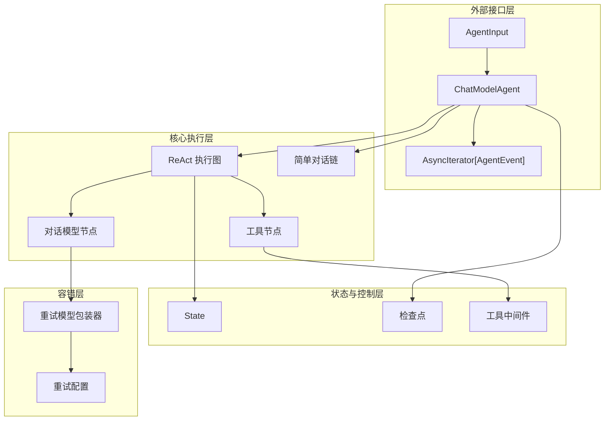
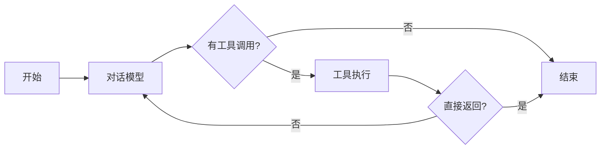

# chatmodel_react_and_retry_runtime 模块

## 概述

`chatmodel_react_and_retry_runtime` 模块是一个智能代理执行引擎，它将三个关键能力编织成一个统一的运行时：

1. **ReAct 模式执行** - 让模型能够思考、行动、观察，形成循环推理链
2. **工具调用与编排** - 安全地执行工具调用，处理多工具并行调用和结果聚合
3. **智能重试机制** - 自动处理模型调用失败，包括流式输出中的错误恢复

想象一下，这个模块就像一个"智能指挥中心"：它接收用户请求，让模型思考下一步该做什么，执行相应的工具，观察结果，然后继续这个循环，直到任务完成。如果模型在思考过程中遇到了临时故障，指挥中心会优雅地重试，而不是让整个任务失败。

## 架构概览



这个架构的核心思想是**分层职责分离**：

1. **外部接口层**提供简洁的 API，隐藏内部复杂性
2. **核心执行层**根据是否有工具选择不同的执行路径
3. **状态与控制层**管理执行过程中的状态和中间结果
4. **容错层**透明地处理模型调用失败

### 核心执行流程

当用户调用 `ChatModelAgent.Run()` 时，执行流程如下：

1. **初始化阶段**：构建执行图（ReAct 图或简单链），设置检查点存储
2. **输入处理阶段**：将 `AgentInput` 转换为模型可理解的消息格式
3. **执行循环阶段**：
   - 如果有工具：进入 ReAct 循环（模型 → 工具 → 模型...）
   - 如果没有工具：直接调用模型一次
4. **结果收集阶段**：通过 `AsyncIterator` 流式返回事件

## 核心组件详解

### ChatModelAgent：智能代理的门面

`ChatModelAgent` 是整个模块的核心门面类，它封装了所有复杂的执行逻辑，提供简洁的 API。

**设计意图**：
- 作为用户与复杂执行逻辑之间的"中间人"
- 统一处理有工具和无工具两种场景
- 管理状态持久化和恢复

**关键特性**：
- 支持流式和非流式输出
- 内置检查点机制，支持中断和恢复
- 可配置的重试策略
- 中间件扩展点

### ReAct 执行模式

当配置了工具时，`ChatModelAgent` 会构建一个 ReAct 执行图：



**设计决策**：
- 使用图结构而不是简单循环，提供更大的灵活性
- 支持"直接返回"工具，优化某些场景的性能
- 内置迭代次数限制，防止无限循环

### 重试机制

重试机制是这个模块的一大亮点，它不仅处理简单的调用失败，还能处理流式输出中间的错误。

**设计思路**：
- 透明包装原始模型，不改变调用接口
- 区分可重试和不可重试错误
- 支持自定义退避策略
- 流式输出时先消费整个流检查错误，再返回成功的流

**关键实现细节**：
- `retryChatModel` 包装原始模型
- `WillRetryError` 通知调用方即将重试
- `RetryExhaustedError` 表示重试次数用尽

## 设计决策与权衡

### 1. 图执行 vs 简单循环

**选择**：使用 compose 图执行引擎
- **优点**：灵活性高，可扩展性强，内置检查点支持
- **缺点**：复杂度增加，学习曲线陡峭

**为什么这样选择**：
团队预期未来会有更复杂的执行模式需求，图结构为这些扩展预留了空间。

### 2. 流式输出的重试策略

**选择**：先完全消费流检查错误，再返回成功的流
- **优点**：确保返回给用户的流不会中途失败
- **缺点**：增加延迟，内存占用可能增加

**权衡考虑**：
用户体验的一致性比轻微的延迟增加更重要。对于大多数应用场景，这种权衡是可接受的。

### 3. 状态管理方式

**选择**：使用 compose 引擎的本地状态机制
- **优点**：与检查点机制无缝集成
- **缺点**：状态类型固定，扩展需要修改核心代码

**设计意图**：
将状态管理委托给底层 compose 引擎，避免重复实现检查点逻辑。

## 子模块说明

### chatmodel_agent_core_runtime
提供 ChatModelAgent 的核心执行逻辑，包括 Run/Resume 方法的实现和事件流管理。

[chatmodel_agent_core_runtime](adk_runtime-chatmodel_react_and_retry_runtime-chatmodel_agent_core_runtime.md)

### react_runtime_state_and_tool_result_flow
管理 ReAct 模式中的状态流转和工具结果收集，是实现"思考-行动-观察"循环的核心。

[react_runtime_state_and_tool_result_flow](adk_runtime-chatmodel_react_and_retry_runtime-react_runtime_state_and_tool_result_flow.md)

### chatmodel_retry_runtime
实现智能重试机制，包括同步和流式调用的重试策略，以及错误类型区分。

[chatmodel_retry_runtime](adk_runtime-chatmodel_react_and_retry_runtime-chatmodel_retry_runtime.md)

## 与其他模块的关系

### 依赖关系
- **agent_contracts_and_context**：提供 Agent 接口定义和运行上下文
- **compose_graph_engine**：提供图执行引擎和检查点机制
- **components_core**：提供模型、工具等基础组件接口

### 被依赖关系
- **flow_runner_interrupt_and_transfer**：使用 ChatModelAgent 作为底层执行引擎
- **adk_prebuilt_agents**：基于 ChatModelAgent 构建预定义代理

## 使用指南

### 基本使用

```go
agent, err := adk.NewChatModelAgent(ctx, &adk.ChatModelAgentConfig{
    Name:        "我的助手",
    Description: "一个有用的AI助手",
    Instruction: "你是一个有帮助的助手。",
    Model:       myChatModel,
    ToolsConfig: adk.ToolsConfig{
        ToolsNodeConfig: compose.ToolsNodeConfig{
            Tools: []tool.BaseTool{myTool},
        },
    },
})

iterator := agent.Run(ctx, &adk.AgentInput{
    Messages: []adk.Message{schema.UserMessage("你好")},
})

for {
    event, ok := iterator.Next()
    if !ok {
        break
    }
    // 处理事件
}
```

### 配置重试

```go
agent, err := adk.NewChatModelAgent(ctx, &adk.ChatModelAgentConfig{
    // ... 其他配置
    ModelRetryConfig: &adk.ModelRetryConfig{
        MaxRetries: 3,
        IsRetryAble: func(ctx context.Context, err error) bool {
            return isTransientError(err)
        },
        BackoffFunc: func(ctx context.Context, attempt int) time.Duration {
            return time.Second * time.Duration(attempt)
        },
    },
})
```

## 注意事项与陷阱

1. **流式输出重试的延迟**：当启用重试时，流式输出会有额外延迟，因为需要先消费整个流检查错误。

2. **中间件中的状态修改**：在 `AfterChatModel` 中间件中修改状态会影响后续执行，但不会改变已发出的事件。

3. **工具并发调用**：当多个工具并发调用时，`SendToolGenAction` 使用 `toolCallID` 而不是工具名来匹配动作。

4. **检查点序列化**：使用 Gob 序列化，确保所有状态类型都注册了 Gob 名称。

5. **最大迭代次数**：默认 20 次，对于复杂任务可能需要增加，但要注意防止无限循环。
