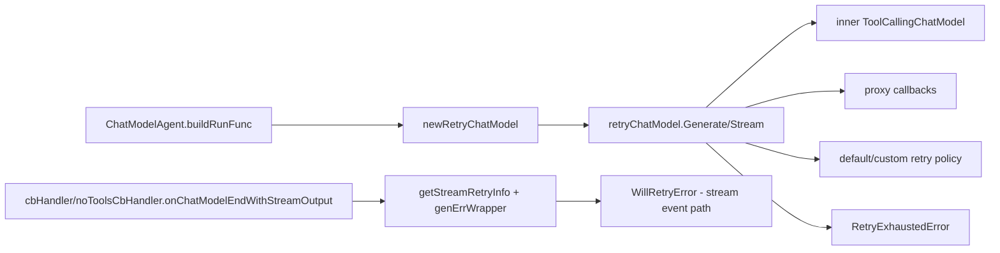

# chatmodel_retry_wrapper（`adk/retry_chatmodel.go`）深度解析

`chatmodel_retry_wrapper` 的存在，本质上是在给 `ChatModel` 调用加一个“减震器”。大模型调用在真实生产环境里经常会遇到瞬时失败：网络抖动、上游限流、流式中途断流、短暂 5xx。若直接把错误抛给上层，Agent 会变得脆弱；但如果“盲目重试”，又会污染回调事件、破坏流式语义、让错误不可观测。这个模块的价值就在于：它把“可恢复失败”封装成可配置、可观测、与现有 callback/stream 体系兼容的重试层，让调用方几乎不用改业务逻辑就能获得更高鲁棒性。

---

## 架构角色与数据流

从架构角色看，`retryChatModel` 是一个**装饰器（Decorator）**：它实现 `model.ToolCallingChatModel`，内部持有真实模型 `inner`，在 `Generate` / `Stream` 路径上增加重试控制、退避等待和错误包装，而把工具绑定（`WithTools`）与类型信息（`GetType`）继续透传。



在调用链上，它主要被 [`agent_runtime_and_orchestration`](agent_runtime_and_orchestration.md) 中的 `ChatModelAgent.buildRunFunc` 接入：当 `ChatModelAgentConfig.ModelRetryConfig != nil` 时，`a.model` 会被 `newRetryChatModel` 包装后再挂到 compose chain。随后，运行期 callback 处理器（`cbHandler` / `noToolsCbHandler`）又会通过 `getStreamRetryInfo` + `genErrWrapper`，把“本次流错误是否会重试”编码为 `WillRetryError`，用于事件侧实时可观测。

这形成了两条互补通路：

1. **执行通路**：`retryChatModel` 决定“要不要重试、何时重试、何时最终失败”。
2. **观测通路**：callback handler 借助同一份重试上下文，把“将重试”错误信号发给上层事件消费方。

---

## 这个模块解决的核心问题（以及为什么朴素方案不够）

朴素方案通常是“在 Agent 外层套 for 循环重试”。问题在于：

- 它无法精细区分 `Generate` 与 `Stream` 的失败形态。流式调用可能在拿到 stream 句柄后才报错（例如 Recv 中途失败）。
- 它容易破坏 callback 语义。若底层模型没实现 callbacks，外层重试看不到统一的 `OnStart/OnEnd/OnError` 生命周期。
- 它难以把“将重试”这个状态传给终端用户（事件系统通常只看到 error，不知道后续是否继续）。
- 它往往与工具绑定（`WithTools`）生命周期脱节，导致重试包装在 `WithTools` 后丢失。

`chatmodel_retry_wrapper` 的设计洞见是：**把重试做成模型接口同构的包装层**，并把“重试状态”通过 `context`（`streamRetryKey`）与错误包装（`WillRetryError`）向 callback 面扩散，而不是在更外层硬拦。

---

## 心智模型：把它想成“带黑匣子的自动重拨器”

可以把 `retryChatModel` 想成电话系统里的自动重拨器：

- 你拨号一次（`Generate` / `Stream` 调用）；
- 若占线（可重试错误），它按策略等待后重拨（`BackoffFunc`）；
- 若确认是永久错误（`IsRetryAble == false`），立刻停止；
- 如果重拨次数耗尽，返回一个带“最后一次失败原因”的结构化错误（`RetryExhaustedError`）；
- 并且在流式场景里，系统还能告诉监听者“这次断线会继续重拨”（`WillRetryError`）。

这个“黑匣子”就是 `streamRetryInfo` + `genErrWrapper`：它把 attempt 信息放进 `context`，让事件处理层能知道当前错误处于第几次尝试。

---

## 核心组件深潜

### `ModelRetryConfig`

`ModelRetryConfig` 是策略注入点，包含三件事：最大次数、可重试判定、退避函数。

- `MaxRetries` 是“重试次数”，不是“总调用次数”。代码里 for 循环是 `attempt := 0; attempt <= MaxRetries`，所以总尝试数 = `1 + MaxRetries`。
- `IsRetryAble` 为 nil 时走 `defaultIsRetryAble`（`err != nil` 即可重试），偏向“默认保守恢复”。
- `BackoffFunc` 为 nil 时走 `defaultBackoff`：100ms 起步、指数增长、10s 封顶，并加入 0~50% jitter，避免并发实例同步重试造成 herd effect。

这个配置是“少参数覆盖大多数场景”的取舍：默认好用，但也允许业务注入细粒度策略（例如仅对 `429/5xx` 重试）。

### `retryChatModel`

`retryChatModel` 持有：

- `inner model.ToolCallingChatModel`：被包装模型；
- `config *ModelRetryConfig`：策略；
- `innerHandlesCallbacks bool`：底层模型是否已实现 callback 生命周期。

`newRetryChatModel` 通过 `components.Checker` 的 `IsCallbacksEnabled()` 检测第三项。这个布尔位看似小，但很关键：

- 若 `inner` 已处理 callbacks，wrapper 不重复打点；
- 若 `inner` 不处理，wrapper 用 `generateWithProxyCallbacks` / `streamWithProxyCallbacks` 补齐生命周期。

这避免了“重复回调”与“无回调”两种极端。

### `Generate`

`Generate` 的循环逻辑非常直接：

1. 解析策略函数（用户配置或默认）。
2. 每次尝试调用 `inner.Generate`（或代理 callback 版本）。
3. 成功即返回。
4. 失败时先过 `IsRetryAble`；不可重试立刻返回。
5. 可重试且还有次数，`log.Printf` 后 `time.Sleep(backoff)`。
6. 次数耗尽，返回 `&RetryExhaustedError{LastErr, TotalRetries}`。

注意这里用的是 `time.Sleep`，没有 `select ctx.Done()`。这意味着在 backoff 等待期间取消信号不会立即中断 sleep，这是一个有意的简化（实现简单）与响应性之间的 tradeoff。

### `Stream`

`Stream` 比 `Generate` 复杂，关键在“流错误可能延迟出现”。

流程是：

1. 创建 `retryInfo := &streamRetryInfo{}` 并写入 context（key 为 `streamRetryKey{}`）。
2. 每轮尝试更新 `retryInfo.attempt`。
3. 调 `inner.Stream`（或代理 callback 版本）。
   - 若直接返回 error：按重试策略处理。
4. 若拿到 stream，不立即返回给调用方，而是 `stream.Copy(2)`：
   - `checkCopy`：内部消费，用 `consumeStreamForError` 全量读到 EOF 或错误；
   - `returnCopy`：若 `checkCopy` 无错，才返回给上层。
5. 若 `checkCopy` 出错，关闭 `returnCopy`，按策略进入下一轮。

这个设计优先保证“返回给上层的 stream 已经通过完整性检查”，提高 correctness，但代价是**流式首 token 延迟**和**额外复制/消费开销**。也就是说，它更像“可重试的伪流式”：对上层仍是 `StreamReader` 接口，但内部为保证可重试性，会先探测整条流是否报错。

### `RetryExhaustedError` 与 `ErrExceedMaxRetries`

`RetryExhaustedError` 保存 `LastErr` 与 `TotalRetries`，`Unwrap()` 返回哨兵错误 `ErrExceedMaxRetries`。这让调用方同时获得：

- 稳定分类（`errors.Is(err, ErrExceedMaxRetries)`）；
- 细节追踪（`errors.As(err, *RetryExhaustedError)` 取最后错误）。

这是 Go 错误设计里“分类 + 细节”双层契约的典型写法。

### `WillRetryError`、`streamRetryInfo`、`genErrWrapper`

这三者构成“重试意图信号通道”：

- `streamRetryInfo` 存 attempt；
- `genErrWrapper` 根据 `config + attempt` 决定：若当前错误可重试且还有剩余次数，把 error 包装成 `WillRetryError`；否则原样透传；
- `WillRetryError` 导出 `ErrStr`（可序列化）和 `RetryAttempt`，并保留运行时 `err` 以支持 `Unwrap()`。

尤其值得注意的是 `WillRetryError` 的字段设计：`ErrStr` 导出、`err` 非导出，配合 `init()` 里的 `schema.RegisterName[*WillRetryError]`，目的是兼容 checkpoint/gob 序列化。恢复后 `err` 可能为空，但错误字符串仍可用于用户可见事件。这是非常务实的“运行时能力 vs 持久化兼容”折中。

---

## 依赖关系与契约分析

### 它调用了谁（下游依赖）

`chatmodel_retry_wrapper` 直接依赖以下模块能力：

- `components/model`：`ToolCallingChatModel` 接口（核心被包装对象）。
- `callbacks`：`EnsureRunInfo`、`OnStart`、`OnEnd`、`OnError`、`OnEndWithStreamOutput`（代理 callback 生命周期）。
- `schema`：`Message`、`StreamReader`、`StreamReaderWithConvert`、`RegisterName`（流转换与错误包装）。
- `components`：`Checker` / `Typer`（能力探测与类型标识）。
- `internal/generic.ParseTypeName` + `reflect`（兜底类型名）。

契约上最关键的是：`inner` 必须满足 `ToolCallingChatModel`，且 `WithTools` 返回的新模型仍要可被再次包装（代码已在 `WithTools` 中重新检测 callbacks 能力并回包）。

### 谁调用它（上游依赖）

已确认的直接调用点是 `ChatModelAgent.buildRunFunc`（见 [`agent_runtime_and_orchestration`](agent_runtime_and_orchestration.md)）：

- 在无工具路径，`chatModel` 会被替换为 `newRetryChatModel(a.model, a.modelRetryConfig)`；
- ReAct 有工具路径中，`reactConfig.modelRetryConfig` 被传入 callback handler，handler 再通过 `getStreamRetryInfo` + `genErrWrapper` 感知重试状态。

这说明它不是孤立“工具函数”，而是 Agent 运行时可靠性的核心拼图之一。

### 数据契约（特别是错误契约）

- 最终耗尽：返回 `RetryExhaustedError`（`Is` 到 `ErrExceedMaxRetries`）。
- 流事件中“将重试”：`WillRetryError`（可序列化 `ErrStr` + 运行时 `Unwrap`）。
- 非可重试错误：保持原错误，不二次包装。

如果上游对错误分类逻辑做变更（例如只按字符串匹配），会破坏这一契约优势；推荐统一使用 `errors.Is` / `errors.As`。

---

## 关键设计取舍

### 1）组合优先而非继承（Decorator）

选择包装 `ToolCallingChatModel`，而不是改每个模型实现。优点是接入成本低、可复用；代价是对接口稳定性更敏感（若 `ToolCallingChatModel` 方法签名变化，wrapper 必须同步更新）。

### 2）默认“几乎所有错误都重试”

`defaultIsRetryAble(err!=nil)` 强恢复导向，能覆盖多数临时故障；但也可能对永久错误做无意义重试。框架把精确判断留给业务注入函数，体现“默认可用，策略可插拔”。

### 3）Stream 路径偏 correctness 而非实时性

通过 `Copy + consume` 先验证再返回，确保不会把“马上失败的坏流”直接交给调用方；但牺牲了真实流式低延迟特性。这个选择适合“稳定优先”的 Agent 编排层。

### 4）callback 兼容策略：探测 + 代理

`innerHandlesCallbacks` 避免重复埋点，同时补齐无埋点模型。这是对多实现生态（不同模型适配器能力不一）的现实适配。

### 5）序列化友好错误对象

`WillRetryError` 的导出/非导出字段拆分，使 checkpoint 恢复后仍保留用户可读信息。代价是恢复后 `Unwrap()` 可能为 nil（文档注释已明确）。

---

## 使用方式与示例

最常见入口不是直接实例化 `retryChatModel`，而是在 `ChatModelAgentConfig` 里设置 `ModelRetryConfig`：

```go
agent, err := NewChatModelAgent(ctx, &ChatModelAgentConfig{
    Name:        "assistant",
    Description: "general assistant",
    Model:       myToolCallingModel,
    ModelRetryConfig: &ModelRetryConfig{
        MaxRetries: 3,
        IsRetryAble: func(ctx context.Context, err error) bool {
            // 示例：按业务错误类型判断
            return err != nil
        },
        BackoffFunc: func(ctx context.Context, attempt int) time.Duration {
            return time.Duration(attempt) * 200 * time.Millisecond
        },
    },
})
```

错误处理建议：

```go
msg, err := someModel.Generate(ctx, input)
if err != nil {
    if errors.Is(err, ErrExceedMaxRetries) {
        var re *RetryExhaustedError
        if errors.As(err, &re) {
            log.Printf("retry exhausted, last err=%v, retries=%d", re.LastErr, re.TotalRetries)
        }
    }
}
_ = msg
```

---

## 新贡献者最容易踩的坑

第一，`MaxRetries` 是“重试次数”不是“总次数”。`MaxRetries=0` 仍会执行一次初始调用。改循环边界时要非常小心，容易引入 off-by-one。

第二，`Stream` 的实现不是“边产出边重试”。它会先内部消费校验再决定是否返回，因此若你在这里追求首 token 延迟，必须重新审视整个重试模型和事件语义。

第三，`generateWithProxyCallbacks` / `streamWithProxyCallbacks` 仅在 `inner` 未启用 callbacks 时使用。若你改动 `IsCallbacksEnabled` 相关逻辑，可能造成 callback 重复触发或缺失。

第四，`defaultBackoff` 使用全局 `math/rand`，没有注入 RNG。对可重现测试不友好；若你要做严格 deterministic 测试，建议传入自定义 `BackoffFunc`。

第五，当前 backoff 等待用 `time.Sleep`，不响应 context cancel。若要改为可取消等待（例如 `select { case <-time.After(...); case <-ctx.Done(): }`），要评估与现有行为兼容性。

第六，`WillRetryError` 在 checkpoint restore 后 `Unwrap()` 可能为 nil（设计使然）。不要依赖恢复后还能拿到原始 concrete error。

---

## 可扩展点与改造建议

当前最自然的扩展点是 `ModelRetryConfig`：

- 在 `IsRetryAble` 中接入错误分类（HTTP code、provider error code、`errors.Is` 栈）。
- 在 `BackoffFunc` 中做分层退避（例如前几次快重试，后续慢退避）。

如果要做更深改造，优先关注两处：

- `Stream` 的“先验消费”策略是否符合你的产品延迟目标；
- backoff 等待是否需要 context-aware cancellation。

这两处是该模块“正确性、体验、复杂度”三者平衡的主战场。

---

## 参考文档

- ChatModel Agent 运行时与装配：[`agent_runtime_and_orchestration`](agent_runtime_and_orchestration.md)
- 回调系统总览：[`Callbacks System`](Callbacks System.md)
- 模型接口定义：[`model_and_tool_interfaces`](model_and_tool_interfaces.md)
- Schema 流模型：[`Schema Stream`](Schema Stream.md)
