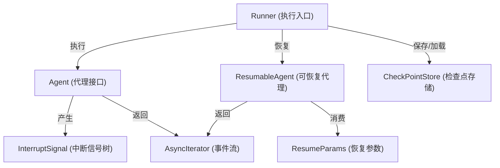

# 检查点与恢复（Checkpoint and Resume）模块技术深度解析

## 1. 问题背景与设计目标

在构建复杂的多代理（Multi-Agent）系统时，一个核心挑战是**处理执行过程中的中断和恢复**。想象一下：

- 你正在运行一个由多个子代理组成的工作流，其中某个子代理需要人工确认才能继续
- 一个长时间运行的任务被用户暂停，稍后需要从暂停点精确恢复
- 代理执行过程中遇到需要外部信息的情况，必须暂停并在获取信息后继续

传统的解决方案往往是将状态完全序列化后重新启动，但这种方法有几个致命缺陷：
1. **无法处理部分恢复**：要么全部重来，要么完全恢复，没有中间选项
2. **缺乏精确控制**：无法针对特定中断点提供不同的恢复数据
3. **组合性差**：在嵌套代理结构中，恢复逻辑会变得极其复杂

`checkpoint_and_resume` 模块的设计目标是解决这些问题，提供一个**灵活、可组合、支持精确控制**的中断-恢复机制。

## 2. 核心设计思想与心智模型

### 2.1 关键洞察

这个模块的核心洞察是：**中断不是单一事件，而是一个结构化的信号树**。在复杂的代理系统中，一个中断可能由多个子代理的中断组合而成，而恢复时我们需要能够：
- 精确地寻址到任何中断点
- 选择性地为不同中断点提供恢复数据
- 让代理自行决定如何处理未被明确恢复的中断

### 2.2 心智模型：中断的"地址空间"

你可以把整个代理执行过程想象成一个**内存地址空间**，每个可能中断的组件都有一个唯一的"地址"。当发生中断时：

1. 系统记录下所有中断点的地址和状态（形成一个"中断快照"）
2. 这个快照被持久化到检查点存储
3. 恢复时，你可以像"内存写入"一样，精确地向特定地址"写入"恢复数据
4. 未被"写入"的地址由组件自行决定是继续中断还是继续执行

这种设计类似于虚拟内存系统——你有一个完整的地址空间，可以选择性地修改某些页，而让其他页保持原样。

## 3. 架构与数据流程

### 3.1 核心组件架构图



### 3.2 关键数据流程

#### 3.2.1 正常执行与中断流程

1. **启动执行**：调用 `Runner.Run()`，传入初始消息
2. **创建执行上下文**：设置 `runCtx`，管理会话状态
3. **转换代理**：将普通 `Agent` 转换为内部流代理
4. **事件监听**：启动 `handleIter` 协程监听事件流
5. **中断捕获**：当代理发出中断信号时：
   - 捕获 `InterruptSignal`（可能是一个树结构）
   - 将内部中断上下文转换为可导出的 `InterruptContexts`
   - **先保存检查点，再发送中断事件**（关键设计点）
6. **用户接收中断**：用户收到中断事件，此时检查点已安全保存

#### 3.2.2 恢复流程

1. **启动恢复**：调用 `Runner.Resume()` 或 `Runner.ResumeWithParams()`
2. **加载检查点**：从 `CheckPointStore` 加载保存的状态
3. **重建上下文**：恢复 `runCtx` 和会话状态
4. **设置恢复数据**：如果使用 `ResumeWithParams`，通过 `core.BatchResumeWithData` 设置目标恢复数据
5. **执行恢复**：调用代理的 `Resume` 方法
6. **继续监听**：同样的 `handleIter` 逻辑处理新的事件流

## 4. 核心组件深度解析

### 4.1 Runner：执行与恢复的协调者

`Runner` 是整个模块的核心入口点，它的职责是：
- 管理代理的生命周期（启动、恢复）
- 协调检查点的保存与加载
- 处理中断事件流
- 维护执行上下文

```go
type Runner struct {
    a Agent              // 要执行的代理
    enableStreaming bool // 是否启用流式输出
    store CheckPointStore // 检查点存储（可选）
}
```

**设计亮点**：
- `store` 是可选的——如果为 nil，系统仍能工作但不持久化检查点
- 分离了"执行"和"恢复"两个入口，但内部共享核心逻辑
- 流式处理是一等公民，从一开始就被设计进去

### 4.2 ResumeParams：灵活的恢复参数容器

```go
type ResumeParams struct {
    Targets map[string]any // 键：组件地址，值：对应恢复数据
    // 未来可扩展字段
}
```

这个结构体的设计非常精妙：
- 使用 `map[string]any` 允许指向执行图中的任何组件
- 为未来扩展留有空间，不会破坏 API 兼容性
- 明确了"地址-数据"的对应关系，支持精确恢复

### 4.3 CheckPointStore：抽象的持久化接口

```go
type CheckPointStore interface {
    Get(ctx context.Context, checkPointID string) ([]byte, bool, error)
    Set(ctx context.Context, checkPointID string, checkPoint []byte) error
}
```

这个接口极其简洁，但足够强大：
- 只定义了最核心的操作，不限制实现方式
- 可以是内存、文件、数据库、云存储等任何实现
- 返回 `bool` 区分"不存在"和"错误"两种情况

### 4.4 两种恢复策略：Resume vs ResumeWithParams

这个模块提供了两种恢复方式，反映了两种不同的使用场景：

#### 4.4.1 Resume：隐式全恢复

```go
func (r *Runner) Resume(ctx context.Context, checkPointID string, opts ...AgentRunOption) (...)
```

**使用场景**：简单的确认模式，恢复本身就意味着"继续"。

**行为特点**：
- 所有中断组件收到 `isResumeFlow = false`
- 适用于只需要知道 `wasInterrupted = true` 就能继续的代理
- 实现简单，但控制粒度较粗

#### 4.4.2 ResumeWithParams：显式目标恢复

```go
func (r *Runner) ResumeWithParams(ctx context.Context, checkPointID string, params *ResumeParams, opts ...AgentRunOption) (...)
```

**使用场景**：复杂场景，需要向特定中断点提供数据。

**行为特点**：
- `Targets`  map 中的组件收到 `isResumeFlow = true`
- **关键约定**：
  - 叶子组件（实际中断源）如果不在 `Targets` 中，必须重新中断自己
  - 组合代理（如 SequentialAgent）应该继续执行，让恢复信号流向子组件
- 提供了最大的灵活性，但需要理解中断树结构

## 5. 关键设计决策与权衡

### 5.1 先保存检查点，再发送中断事件

在 `handleIter` 中，你会看到：

```go
// 先保存检查点，再发送中断事件
if checkPointID != nil {
    err := r.saveCheckPoint(ctx, *checkPointID, ...)
    // ...
}
gen.Send(event)
```

**为什么这样设计？**

想象一下如果顺序反过来会发生什么：
1. 发送中断事件给用户
2. 用户立即尝试恢复
3. 但检查点还没保存好——恢复失败

**权衡分析**：
- ✅ **正确性优先**：确保用户收到中断时，一定有可恢复的检查点
- ⚠️ **延迟增加**：用户收到中断的时间会稍微晚一点
- 结论：在这种场景下，正确性远重于微小的延迟

### 5.2 中断信号是一棵树，不是单一事件

从 `InterruptSignal` 的定义可以看到：

```go
type InterruptSignal struct {
    // ...
    Subs []*InterruptSignal
}
```

**设计洞察**：
- 在组合代理系统中，一个"顶层中断"往往由多个子中断组成
- 树结构能准确反映中断的因果关系
- 恢复时可以针对树中的任意节点进行操作

**权衡分析**：
- ✅ **表达力强**：能准确建模复杂的中断场景
- ✅ **精确控制**：支持对任意中断点的独立恢复
- ⚠️ **复杂度增加**：使用者需要理解中断树的结构才能有效使用 `ResumeWithParams`
- 结论：对于构建复杂系统，增加的复杂度是值得的

### 5.3 让组件自己决定未明确恢复的中断

在 `ResumeWithParams` 的文档中，有一个关键约定：

> 叶子组件如果不在 `Targets` 中，必须重新中断自己；组合代理应该继续执行

**为什么不采用"全有或全无"的策略？

这个设计体现了对"责任分离"的深刻理解：
- **Runner** 只负责传递恢复信号，不理解具体组件的语义
- **组件自己**最了解自己应该如何处理未被恢复的中断

**权衡分析**：
- ✅ **灵活性最高**：不同组件可以有不同的策略
- ✅ **责任清晰**：组件对自己的行为负责
- ⚠️ **需要约定**：组件开发者必须遵守这个隐式契约
- 结论：在可组合系统中，这是正确的选择

### 5.4 检查点存储接口的极简设计

`CheckPointStore` 只有两个方法，这是有意为之的：

```go
type CheckPointStore interface {
    Get(ctx context.Context, checkPointID string) ([]byte, bool, error)
    Set(ctx context.Context, checkPointID string, checkPoint []byte) error
}
```

**设计理念**：
- 只定义核心能力，不做过度设计
- 序列化/反序列化在调用方完成，存储层只处理字节
- 足够简单，任何存储系统都能实现

**权衡分析**：
- ✅ **易于实现**：甚至一个 `map[string][]byte` 都能满足接口
- ✅ **灵活性高**：调用方可以选择任何序列化格式
- ⚠️ **部分功能上移**：过期清理、版本管理等功能需要在其他地方实现
- 结论：极简接口带来的灵活性远超过损失的便利性

## 6. 实际使用指南

### 6.1 基本使用模式：带检查点的代理执行

```go
// 创建一个带文件系统检查点存储的 Runner
store := NewFileCheckpointStore("./checkpoints")
runner := NewRunner(ctx, RunnerConfig{
    Agent:           myAgent,
    EnableStreaming: true,
    CheckPointStore: store,
})

// 执行代理
iter := runner.Run(ctx, messages, WithCheckPointID("session-123"))

// 处理事件
for {
    event, ok := iter.Next()
    if !ok {
        break
    }
    
    if event.Action != nil && event.Action.Interrupted != nil {
        // 收到中断，此时检查点已保存
        fmt.Println("Interrupted at:", event.Action.Interrupted.InterruptContexts)
        // 可以在这里处理中断，然后稍后恢复
        break
    }
}

// 稍后恢复
resumeIter, err := runner.Resume(ctx, "session-123")
// 处理恢复后的事件...
```

### 6.2 高级模式：针对特定中断点的恢复

```go
// 假设我们知道中断点的地址（从中断上下文获取）
targetAddress := "agent:subagent:tool-1"

// 准备恢复参数
params := &ResumeParams{
    Targets: map[string]any{
        targetAddress: map[string]any{
            "confirmation": "yes",
            "extra_data":   "some value",
        },
    },
}

// 使用参数恢复
resumeIter, err := runner.ResumeWithParams(ctx, "session-123", params)
```

### 6.3 组件开发者须知：实现可恢复的组件

如果你正在开发一个可能中断的组件，需要遵守这些约定：

1. **叶子组件**：
   ```go
   // 如果不在恢复目标中，重新中断自己
   resumeCtx := GetResumeContext(ctx)
   if !resumeCtx.IsResumeFlow() {
       // 不是针对我的恢复，重新中断
       return InterruptAgain(ctx)
   }
   ```

2. **组合组件**：
   ```go
   // 继续执行，让恢复信号流向子组件
   // 如果子组件重新中断，你会收到新的中断信号
   // 此时你应该将这个中断传递上去
   ```

## 7. 常见陷阱与注意事项

### 7.1 检查点 ID 的管理

**陷阱**：忘记设置 `checkPointID` 或者使用重复的 ID

**后果**：要么无法保存检查点，要么覆盖重要的检查点

**建议**：
- 使用有意义的 ID，如 `session-{uuid}`
- 确保 ID 的唯一性
- 考虑实现检查点的版本管理和清理策略

### 7.2 恢复数据的序列化

**陷阱**：在 `ResumeParams.Targets` 中放入不可序列化的数据

**后果**：虽然 `ResumeParams` 本身不序列化，但数据最终会通过 `core.BatchResumeWithData` 传递，可能遇到问题

**建议**：
- 使用简单、可序列化的数据结构
- 避免传递函数、通道等不可序列化的类型
- 如果需要复杂状态，考虑在外部存储中引用，只传递 ID

### 7.3 中断事件的顺序

**陷阱**：假设中断事件是唯一的

**注意**：代码中有一个 `panic` 保护：
```go
if interruptSignal != nil {
    panic("multiple interrupt actions should not happen in Runner")
}
```

这表明系统设计假设最多只有一个中断动作。如果你看到这个 panic，说明某个组件违反了约定。

### 7.4 流式资源的清理

**陷阱**：忘记关闭流式资源

**建议**：
- 文档中提到："建议对 AgentEvent 的 MessageStream 使用 SetAutomaticClose()"
- 即使不处理事件，也应该确保迭代器被完全消费或正确关闭
- 利用 `defer` 和上下文取消来确保资源清理

## 8. 与其他模块的关系

`checkpoint_and_resume` 模块不是孤立的，它与以下模块紧密协作：

1. **[ADK Agent Interface](adk_agent_interface.md)**：定义了 `Agent` 和 `ResumableAgent` 接口
2. **[Internal Core](internal_core.md)**：提供了底层的中断信号、地址管理和状态处理
3. **[Compose Graph Engine](compose_graph_engine.md)**：利用这个模块实现图执行的中断和恢复
4. **[ADK ChatModel Agent](adk_chatmodel_agent.md)**：一个具体的可恢复代理实现

## 9. 总结

`checkpoint_and_resume` 模块展示了一个深思熟虑的中断-恢复机制设计。它的核心价值在于：

1. **灵活性**：支持从简单到复杂的各种恢复场景
2. **可组合性**：在嵌套代理结构中优雅地工作
3. **精确控制**：允许针对特定中断点提供恢复数据
4. **责任分离**：让组件自己决定如何处理未明确恢复的中断

这个模块的设计体现了"机制与策略分离"的原则——它提供了强大的机制，而将具体策略留给组件实现者。这种设计使得系统既能满足简单场景的需求，又能支持极其复杂的多代理协作场景。

对于新加入的团队成员，理解这个模块的关键是：
1. 先掌握"中断地址空间"的心智模型
2. 理解两种恢复策略的适用场景
3. 记住组件开发者需要遵守的隐式约定
4. 重视代码中体现的"正确性优先"设计原则
