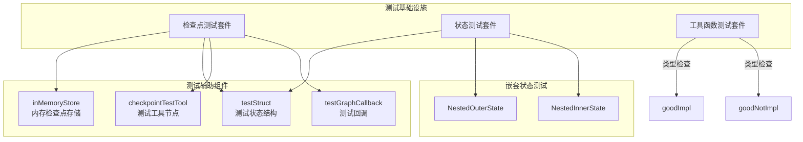

# Checkpoint State and Utils Test Harnesses 模块

## 概述

这个模块是 `compose_graph_engine` 系统的测试基础设施核心，专门为验证检查点（checkpointing）、状态管理和工具函数的正确性而设计。它提供了一套完整的测试脚手架，帮助开发者确保图形执行引擎在各种复杂场景下的可靠性。

想象一下，你正在开发一个复杂的图形执行引擎，它需要支持：
- 在任意节点中断和恢复执行
- 持久化和恢复复杂的状态结构
- 处理嵌套子图中的状态继承
- 确保类型安全的节点连接

这个测试模块就像是这个引擎的"体检中心"，通过精心设计的测试用例，全面检查引擎的各项功能是否正常工作。

## 架构概览



这个模块由三个主要的测试套件组成：

1. **检查点测试套件** (`checkpoint_test.go`)：测试中断/恢复、检查点存储、子图中断等核心功能
2. **状态测试套件** (`state_test.go`)：测试状态链、嵌套状态、流式状态处理等
3. **工具函数测试套件** (`utils_test.go`)：测试类型兼容性检查等底层工具

## 核心设计理念

### 1. 测试即文档

这个模块的设计理念是"测试即文档"。每个测试函数都不仅仅是验证功能，更是一个使用示例。例如，`TestSimpleCheckPoint` 展示了基本的检查点使用流程，`TestNestedSubGraph` 展示了复杂嵌套场景下的中断恢复。

### 2. 可组合的测试基础设施

模块提供了一系列可重用的测试组件：
- `inMemoryStore`：内存中的检查点存储，用于快速测试
- `testGraphCallback`：用于验证回调执行次数的测试回调
- `checkpointTestTool`：通用的测试工具节点，可注入自定义逻辑

### 3. 全面的场景覆盖

测试套件覆盖了从简单到复杂的各种场景：
- 基本的单节点中断恢复
- 复杂的多节点 DAG 中断
- 多层嵌套子图的状态管理
- 并发场景下的状态访问
- 流式执行的检查点处理

## 子模块详解

这个测试模块被组织成三个主要的子测试套件，每个都有专门的文档：

### 1. [检查点测试](compose_graph_engine-checkpoint_state_and_utils_test_harnesses-checkpoint_testing.md)
这个子模块包含了所有与检查点和中断恢复相关的测试。它提供了测试基础设施组件如 `inMemoryStore`、`checkpointTestTool` 和 `testGraphCallback`，并通过全面的测试用例验证检查点机制在各种场景下的正确性。

### 2. [状态测试](compose_graph_engine-checkpoint_state_and_utils_test_harnesses-state_testing.md)
这个子模块专注于状态管理功能的测试，特别是复杂的嵌套状态场景。它定义了 `NestedOuterState` 和 `NestedInnerState` 等测试状态结构，并测试状态链、状态继承、并发状态访问等高级特性。

### 3. [工具函数测试](compose_graph_engine-checkpoint_state_and_utils_test_harnesses-utils_testing.md)
这个子模块测试底层工具函数，特别是类型兼容性检查。它定义了一系列接口和实现如 `good`、`goodImpl`、`goodNotImpl` 等，用于验证 `checkAssignable` 函数的正确性，这个函数是图形引擎类型安全的基础。

## 关键组件详解

### 检查点存储抽象

```go
type inMemoryStore struct {
    m map[string][]byte
}
```

`inMemoryStore` 是一个简单但完整的检查点存储实现。它使用内存 map 来存储检查点数据，提供了 `Get` 和 `Set` 方法。这个组件的设计体现了一个重要的原则：**测试基础设施应该尽可能简单，以便于调试和理解**。

### 测试状态结构

```go
type testStruct struct {
    A string
}

type NestedOuterState struct {
    Value   string
    Counter int
}

type NestedInnerState struct {
    Value string
}
```

这些状态结构是专门为测试设计的。它们简单但足够复杂，可以验证：
- 基本的状态序列化/反序列化
- 嵌套状态的继承和访问
- 状态在中断恢复后的正确性

### 类型检查工具

```go
type good interface {
    ThisIsGood() bool
}

type goodImpl struct{}
func (g *goodImpl) ThisIsGood() bool { return true }

type goodNotImpl struct{}
```

这些接口和实现用于测试 `checkAssignable` 函数，这个函数是图形引擎类型安全的基础。它验证节点之间的输入输出类型是否兼容，确保图形在编译时就能发现类型错误。

## 数据流程分析

### 基本检查点流程

让我们以 `TestSimpleCheckPoint` 为例，追踪数据流程：

1. **图形构建**：创建一个包含两个节点的简单图形
2. **编译配置**：配置检查点存储、中断点等
3. **首次执行**：执行到中断点，保存检查点
4. **中断提取**：从错误中提取中断信息
5. **状态恢复**：使用恢复的状态继续执行
6. **结果验证**：验证最终结果是否正确

这个流程展示了检查点机制的核心价值：**允许在长时间运行的流程中安全地中断和恢复**。

### 嵌套子图状态流程

`TestNestedGraphStateAccess` 展示了更复杂的状态流程：

1. **外层状态创建**：外层图形创建自己的状态
2. **内层状态创建**：内层图形创建自己的状态
3. **状态访问**：内层节点可以访问内层和外层状态
4. **状态隔离**：内层状态会遮蔽同名的外层状态

这个测试验证了状态链机制的正确性，这是一个关键的设计特性，允许在复杂的嵌套场景中正确管理状态。

## 设计权衡分析

### 内存存储 vs 持久化存储

**选择**：测试使用内存存储 (`inMemoryStore`) 而不是真实的持久化存储。

**权衡**：
- ✅ 优点：测试速度快，不需要外部依赖，易于调试
- ❌ 缺点：无法测试真实的持久化场景（如数据库故障、并发访问等）

**原因**：对于单元测试来说，速度和可重复性比真实性更重要。真实的持久化测试可以在集成测试中进行。

### 全面测试 vs 测试性能

**选择**：测试套件包含大量复杂场景，如 `TestNestedSubGraph`。

**权衡**：
- ✅ 优点：覆盖了各种边界情况，确保系统的健壮性
- ❌ 缺点：测试运行时间较长，某些测试可能很脆弱

**原因**：对于核心基础设施来说，正确性比测试速度更重要。这些测试作为系统的"安全网"，确保修改不会破坏现有功能。

## 新贡献者指南

### 需要注意的关键点

1. **测试的顺序依赖性**：某些测试（如 `TestNestedSubGraph`）内部有多个执行步骤，这些步骤是顺序依赖的。修改其中一个步骤可能会影响后续步骤。

2. **状态注册**：自定义状态类型需要通过 `schema.Register` 注册，否则序列化会失败。查看 `testStruct` 的 `init` 函数作为示例。

3. **检查点 ID 的作用**：检查点 ID 不仅仅是一个标识符，它还决定了检查点的存储和检索。在测试中使用不同的 ID 以避免干扰。

4. **回调的执行次数**：`testGraphCallback` 记录的回调次数是精确的，如果你修改了图形结构，这些数字可能会变化。

### 常见陷阱

1. **忘记注册状态类型**：如果你添加了新的状态类型但忘记注册，测试会以神秘的序列化错误失败。

2. **检查点 ID 冲突**：在同一个测试中重用检查点 ID 可能会导致测试之间的干扰。

3. **状态修改的时机**：在状态预处理器中修改输入时要小心，因为这会影响节点的执行。

4. **嵌套子图的中断点**：在嵌套子图中设置中断点时，要注意中断信息的结构，它包含在 `SubGraphs` 字段中。

## 与其他模块的关系

这个测试模块与以下模块紧密相关：

### 被测试的核心模块
- **[checkpointing_and_rerun_persistence](compose_graph_engine-checkpointing_and_rerun_persistence.md)**：这是被测试的核心模块，提供检查点和持久化功能。本模块中的[检查点测试](compose_graph_engine-checkpoint_state_and_utils_test_harnesses-checkpoint_testing.md)子模块主要针对这个模块进行测试。

### 相关测试基础设施
- **[graph_and_workflow_test_harnesses](compose_graph_engine-graph_and_workflow_test_harnesses.md)**：提供更通用的图形测试基础设施，与本模块互补。
- **[tool_node_and_resume_test_harnesses](compose_graph_engine-tool_node_and_resume_test_harnesses.md)**：专注于工具节点的测试，与本模块的[检查点测试](compose_graph_engine-checkpoint_state_and_utils_test_harnesses-checkpoint_testing.md)有部分重叠但各有侧重。

### 内部子模块依赖
- [检查点测试](compose_graph_engine-checkpoint_state_and_utils_test_harnesses-checkpoint_testing.md)有时会使用[状态测试](compose_graph_engine-checkpoint_state_and_utils_test_harnesses-state_testing.md)中定义的状态结构
- [工具函数测试](compose_graph_engine-checkpoint_state_and_utils_test_harnesses-utils_testing.md)是相对独立的，但它测试的类型检查功能被整个图形引擎使用

## 总结

`checkpoint_state_and_utils_test_harnesses` 模块是 `compose_graph_engine` 的"质量保障部门"。它通过精心设计的测试用例和可重用的测试组件，确保了检查点、状态管理和工具函数的正确性。理解这个模块不仅有助于编写更好的测试，还能深入理解图形引擎的核心设计理念。
