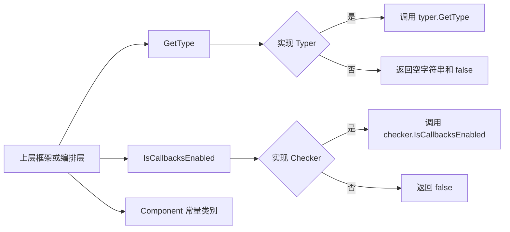

# component_introspection_and_callback_switch（components.types）深度解析

这个模块看起来很小，实际上它像框架里的“身份证识别 + 安检分流”闸机：它不负责执行模型、工具或回调逻辑本身，而是用两条极轻量的接口约定（`Typer` 与 `Checker`）告诉上层框架两件关键事实——“我是谁（类型名）”和“回调由谁掌控（默认框架还是组件自己）”。没有这层约定，系统只能靠硬编码或反射猜测组件行为，最终会在可观测性、一致命名和回调插桩控制上迅速失控。

---

## 1. 这个模块在解决什么问题？

在一个可组合的 AI 组件框架里（ChatModel、Tool、Retriever、Embedding 等并存），上层通常必须做两类横切工作：

1. **统一命名与识别**：日志、trace、callback 事件里需要稳定、可读、可聚合的组件名称。
2. **统一回调插桩**：框架往往有默认 callback aspect（例如执行前后打点、token usage 注入）。但某些高级组件希望“自己接管 callback 触发时机与注入内容”。

天真的方案通常是：

- 通过 `reflect.TypeOf(...)` 推导名字；
- 默认对所有组件强制套一层 callback；
- 对特殊组件写白名单分支。

这在 demo 阶段可行，但在真实系统里会失败：

- 反射名不稳定（包路径、wrapper、泛型实例化、mock 等都会污染可读性）；
- 强制默认 callback 会和组件内部的精细回调逻辑冲突，出现重复事件或错误粒度；
- 白名单扩展成本高，新增组件类型会不断侵蚀架构整洁性。

`components/types.go` 的设计洞察是：**把“识别权”和“回调接管权”下放给组件实现本身，并保持接口极小化**。这让框架端仍然保持统一入口，但不再强耦合具体实现细节。

---

## 2. 心智模型：两位“门卫” + 一张“组件类别字典”

你可以把本模块想象成一个入口闸机：

- `Typer` 是“身份门卫”：问组件“你叫什么类型？”
- `Checker` 是“安检分流员”：问组件“回调由框架默认处理，还是你自己处理？”
- `Component` 常量集是“类别字典”：`ChatModel`、`Tool`、`Embedding` 等标准类别名，便于拼接或约束命名。

与其让框架猜，不如让组件**显式声明意图**。这是一种典型的 capability-based 设计：

- 实现了某接口，就声明你具备某种能力；
- 没实现，就走默认保守路径。

这种模式在 Go 里非常自然，因为 type assertion 成本低、语义直观、向后兼容性好。

---

## 3. 架构与数据流

> 说明：当前提供的材料包含模块树和源码，但没有逐函数级 `depends_on/depended_by` 边清单。下面的数据流基于源码中公开 API 与模块职责进行“可验证范围内”的架构解释；我不会虚构具体调用点。



从执行路径看，这个模块的“热路径”非常清晰：

- **类型识别路径**：`GetType(component any)` → type assertion 到 `Typer` → 返回 `(string, bool)`。
- **回调分流路径**：`IsCallbacksEnabled(i any)` → type assertion 到 `Checker` → 返回 `bool`。

两条路径都具备“失败即降级默认值”的特性：

- 没实现 `Typer`：返回 `"", false`；
- 没实现 `Checker`：返回 `false`（即不声明接管 callback）。

这意味着上层可以放心地“先探测再决策”，而无需先验知道组件具体类型。

---

## 4. 组件级深潜

### 4.1 `type Typer interface { GetType() string }`

`Typer` 的目的不是做 runtime 类型系统，而是给组件作者一个**可控且稳定的语义名**。源码注释里有两个重要意图：

- 如果存在 `Typer`，组件实例默认全名可由 `{Typer}{Component}` 组成；
- 推荐 Camel Case，说明这个值预期会直接暴露到用户可见层（日志、回调标签、UI 观察面板等）。

设计上它故意只返回 `string`，不引入复杂元数据结构。好处是：

- 接入门槛极低；
- 适合跨模块传播；
- 不绑死上层命名策略（上层仍可拼接 `Component` 类别后缀）。

代价是：

- 缺乏结构化约束（拼写、冲突、版本语义需靠约定治理）；
- 无法直接表达多维标签（例如 vendor、variant、capabilities）。

### 4.2 `func GetType(component any) (string, bool)`

这是 `Typer` 的安全探测器。它做了一件事：

```go
if typer, ok := component.(Typer); ok {
    return typer.GetType(), true
}
return "", false
```

`(string, bool)` 这个返回签名是关键选择：

- `string` 表示值；
- `bool` 表示“是否存在能力”。

相比只返回字符串（空串代表无），这个设计避免了歧义：空串可能是合法值，也可能是缺失能力。

### 4.3 `type Checker interface { IsCallbacksEnabled() bool }`

`Checker` 的语义容易误读。根据注释，它不是“是否开启 callback 功能”的全局开关，而是：

- 当实现 `Checker` 且返回 `true` 时，**框架不再启动默认 aspect**；
- 改由组件自己决定 callback 执行位置与注入信息。

也就是说它更接近“callback 接管声明（opt-out of default aspect）”。

这是一种很实用的控制反转：默认路径保持简单统一；只有高级组件才显式接管。

### 4.4 `func IsCallbacksEnabled(i any) bool`

该函数是 `Checker` 的探测器：

```go
if checker, ok := i.(Checker); ok {
    return checker.IsCallbacksEnabled()
}
return false
```

默认 `false` 的含义是保守且安全的：

- 不实现 `Checker` 的组件不会意外跳过框架默认 callback；
- 兼容老组件（向后兼容）。

### 4.5 `type Component string` 与组件类别常量

该类型及常量（`ComponentOfPrompt`、`ComponentOfChatModel`、`ComponentOfEmbedding`、`ComponentOfIndexer`、`ComponentOfRetriever`、`ComponentOfLoader`、`ComponentOfTransformer`、`ComponentOfTool`）提供了一个统一类别命名基线。

它们的价值不在“技术复杂度”，而在“跨模块一致性”：

- callback 标签拼接时减少自由发挥；
- 避免同义词泛滥（如 `DocTransformer` vs `DocumentTransformer`）；
- 支撑统计面板按类别聚合。

---

## 5. 依赖关系与契约分析

从代码本身看，本模块几乎没有外部依赖，属于**底层基础契约层**。它的 architectural role 更像“协议定义与分流辅助函数”，不是业务执行器。

结合模块树，它位于 `Component Interfaces -> component_introspection_and_callback_switch`，语义上与以下模块关系最紧：

- [model_and_tool_interfaces](model_and_tool_interfaces.md)：实际组件接口定义层，可能是 `Typer/Checker` 的主要实现方。
- [model_options_and_callback_extras](model_options_and_callback_extras.md)：callback 输入输出扩展结构承载层，`Checker` 的接管语义会影响这些结构何时、由谁注入。
- [Callbacks System](callbacks_system.md)：默认 aspect 的执行体系；`Checker` 的 `true` 语义本质上是对这一体系的分流开关。

> 注意：由于当前未提供精确调用图，我不能断言某个具体函数“直接调用了 `GetType` 或 `IsCallbacksEnabled`”。但从接口语义和模块分层上，这些模块是最直接的契约关联面。

隐式数据契约主要有三条：

1. `GetType()` 返回值应稳定且可读（通常 Camel Case）。
2. `IsCallbacksEnabled()==true` 意味着组件要承担 callback 注入职责，不能只“关掉默认”却不补齐关键信息。
3. `Component` 常量应作为类别名基线，避免在上层散落硬编码字符串。

---

## 6. 关键设计取舍

这个模块的设计几乎是“极简主义”，但每个极简点都有代价与收益。

首先是**接口粒度：极小接口优先**。`Typer` 与 `Checker` 都是一方法接口，极易被任意组件实现。收益是低耦合、低侵入、便于增量迁移；代价是能力表达维度有限，需要上层靠额外约定补充语义。

其次是**默认保守策略**。两个 helper 在“未实现接口”时都返回安全默认值。收益是向后兼容与行为可预测；代价是如果组件作者忘记实现接口，系统不会报错，而是悄悄走默认路径（可能导致可观测性信息不足）。

再者是**字符串命名而非结构化元数据**。这让跨边界传递非常轻便，但也牺牲了强约束和可验证性。对于大型团队，这通常需要配套 lint 或测试约束来防止命名漂移。

最后是**回调控制的“声明式接管”**。`Checker` 以布尔开关表达是否接管，简单直接；但布尔值无法表达“部分接管”或“仅接管某阶段”，若未来需求精细化，可能需要演进为策略对象或分阶段 capability。

---

## 7. 使用方式与示例

一个典型组件可以同时实现 `Typer` 和 `Checker`：

```go
package mytool

type SmartTool struct{}

func (t *SmartTool) GetType() string {
    return "Smart"
}

// 返回 true 表示：由组件自己决定 callback 执行与注入位置
func (t *SmartTool) IsCallbacksEnabled() bool {
    return true
}
```

上层探测逻辑：

```go
var c any = &SmartTool{}

typeName, ok := components.GetType(c)
if ok {
    // 可用于拼接例如: Smart + Tool
    _ = typeName
}

if components.IsCallbacksEnabled(c) {
    // 跳过默认 callback aspect，走组件自定义回调路径
}
```

如果组件不实现这两个接口，上层 helper 依然可安全调用，不会 panic。

---

## 8. 新贡献者最容易踩的坑

第一，`Checker` 的命名容易让人以为“返回 true = 开启框架 callback”。实际语义恰好相反：**true 表示框架默认 aspect 不再自动启动**，你要自己负责回调时机与数据注入。

第二，`GetType()` 返回值是运营面资产，不只是内部字符串。随意修改会影响日志聚合、监控分组、历史对比连续性。建议把它当成对外契约来管理。

第三，helper 的默认降级不会报错。你如果忘了实现接口，系统常常“能跑但不对味”。实践上建议配套：

- 组件级单测断言 `GetType`/`IsCallbacksEnabled` 期望；
- 回调链路集成测试验证事件是否重复、缺失或错序。

第四，`Component` 常量与 `GetType` 拼接策略虽然在注释中被提及，但具体拼接发生点不在本文件。修改命名策略前应先审阅调用侧实现，避免破坏兼容。

---

## 9. 参考阅读

- [model_and_tool_interfaces](model_and_tool_interfaces.md)：查看各组件接口如何承载 `Typer/Checker` 的实现策略。
- [model_options_and_callback_extras](model_options_and_callback_extras.md)：理解 callback 输入输出扩展结构，与 `Checker` 接管语义的配合。
- [callbacks_system](callbacks_system.md)：理解默认 callback aspect 的构建与执行机制（与本模块的分流语义互补）。

---

从架构位置看，`component_introspection_and_callback_switch` 不是“做很多事”的模块，而是“让其他模块以更低耦合做对事”的模块。它用两个 capability 接口把“识别”和“回调控制”从框架硬编码中解耦出来，这种设计在系统扩大后会持续放大价值。