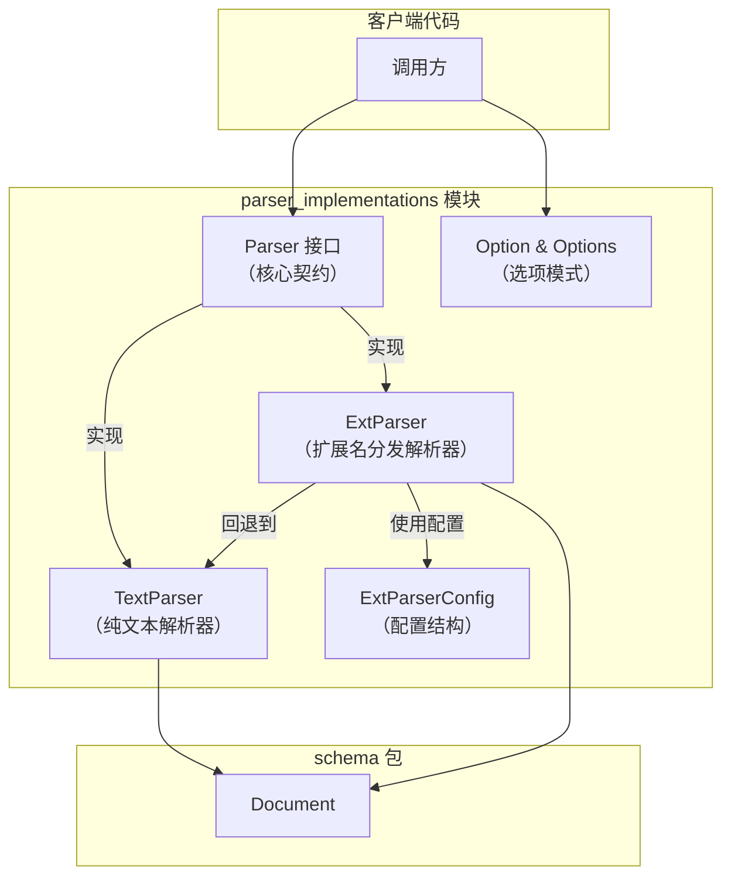
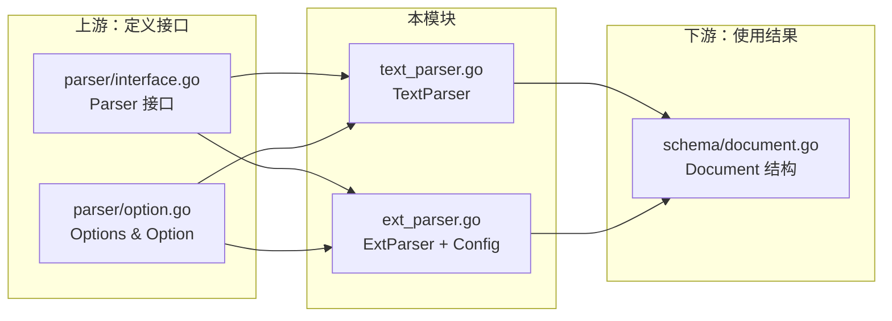

# parser_implementations 模块

## 概述

`parser_implementations` 模块是 EINO 文档处理流水线中的"第一站"——它负责将原始输入数据（`io.Reader`）转换为结构化的 `Document` 对象。正如一条制造业流水线需要先将原材料加工成零件才能进行组装，这个模块将各种格式的原始内容（文本、PDF、Markdown 等）解析成统一的数据结构，为后续的转换、索引和检索做好准备。

## 问题空间：为什么需要文档解析器？

在构建 RAG（检索增强生成）系统或其他需要处理非结构化数据的 AI 应用时，我们面对的数据源格式多种多样：
- 用户上传的 PDF 报告
- 从网页抓取的 Markdown 文档
- CSV/JSON 格式的结构化数据
- 纯文本日志或配置文件

如果没有统一的解析层，每个下游组件都需要自己处理这些格式差异，导致代码重复和维护负担。`parser_implementations` 模块的核心价值在于：**它定义了一个统一的契约（`Parser` 接口），让上游的数据加载和下游的数据处理可以解耦**。

## 架构设计

### 核心组件



### 数据流分析

当用户调用解析器时，数据流向如下：

```
用户调用
    │
    ▼
┌─────────────────────────────────────────────────────────────┐
│ ExtParser.Parse(ctx, reader, WithURI("./doc.pdf"),        │
│                  WithExtraMeta(map[string]any))            │
└─────────────────────────────────────────────────────────────┘
    │
    ▼
提取 URI 中的扩展名（filepath.Ext） → ".pdf"
    │
    ▼
在配置好的 Parsers 映射中查找 → 找到 PDFParser
    │
    ▼
调用 PDFParser.Parse(ctx, reader, opts...) → 返回 []*Document
    │
    ▼
合并 ExtraMeta 到每个文档的 MetaData
    │
    ▼
返回解析后的文档列表
```

## 设计决策与权衡

### 1. TextParser：简单性优先

`TextParser` 是最简单的实现，它将整个输入流读取为单个字符串。这看似简陋，但背后有深思熟虑的考量：

- **单一职责**：它的任务就是"把内容变成文本"，不关心格式解析
- **默认回退**：当 `ExtParser` 找不到对应扩展名的解析器时，`TextParser` 作为安全的默认值
- **最小化依赖**：不需要引入额外的第三方解析库

** tradeoff**：如果你的场景需要解析 Markdown、PDF 等格式，不应使用 `TextParser`，而应使用 `ExtParser` 并注册对应的专用解析器。

### 2. ExtParser：基于扩展名的分发策略

`ExtParser` 采用了一个非常务实的设计——通过文件扩展名（`.pdf`、`.md`、`.txt`）来选择合适的解析器。这不是最优雅的方案（有更智能的 MIME 类型检测），但在实际场景中非常有效：

**优点**：
- 实现简单，性能开销极低
- 用户行为可预测——扩展名决定了解析方式
- 易于扩展——只需注册新的解析器映射

**缺点/注意点**：
- **强依赖 URI**：调用方必须通过 `WithURI` 传入有效的文件路径
- **扩展名解析依赖 filepath.Ext**：这意味着 `.pdf` 和 `.PDF` 可能被视为不同的扩展名（取决于操作系统）
- **无内容探测**：无法根据文件内容自动判断类型

### 3. Option 模式：平衡灵活性和接口简洁性

模块使用了函数式选项（Functional Options）模式：

```go
// 统一入口
func WithURI(uri string) Option
func WithExtraMeta(meta map[string]any) Option

// 扩展点：允许 Parser 实现者定义自己的选项
func WrapImplSpecificOptFn[T any](optFn func(*T)) Option
func GetImplSpecificOptions[T any](base *T, opts ...Option) *T
```

这个设计允许：
- 保持公开接口的简洁（只有 URI 和 ExtraMeta）
- 为特定解析器实现保留扩展能力（如 PDFParser 可能需要密码选项）

**设计权衡**：选择将实现特定选项作为"escape hatch"而非核心 API，避免了接口膨胀，但增加了实现复杂度。

### 4. 元数据合并策略

`ExtParser` 在分发解析后，会将调用方的 `ExtraMeta` 合并到每个返回的文档中。这是一个**防御性设计**：

- 确保调用方传入的上下文信息（如"来源系统"、"采集时间"）不会丢失
- 即使某个下游解析器没有正确设置 MetaData，调用方的元数据仍然存在

## 使用指南

### 基本用法

```go
// 1. 使用 TextParser 解析纯文本
docs, err := TextParser{}.Parse(ctx, strings.NewReader("hello world"))

// 2. 使用 ExtParser 根据文件类型自动选择解析器
extParser, _ := NewExtParser(ctx, &ExtParserConfig{
    Parsers: map[string]Parser{
        ".pdf":  &PDFParser{},  // 需要自行实现或引入
        ".md":   &MarkdownParser{},
    },
    FallbackParser: &TextParser{},  // 可选，默认就是 TextParser
})

file, _ := os.Open("document.pdf")
defer file.Close()

docs, err := extParser.Parse(ctx, file, 
    parser.WithURI("document.pdf"),  // 关键：必须传入 URI
    parser.WithExtraMeta(map[string]any{
        "ingest_time": time.Now().Unix(),
    }),
)
```

### 扩展 ExtParser

如果你需要添加新的文件格式支持，只需：

```go
// 实现 Parser 接口
type MyParser struct{}

func (p *MyParser) Parse(ctx context.Context, reader io.Reader, opts ...Option) ([]*schema.Document, error) {
    // 实现解析逻辑
}

// 注册到 ExtParser
extParser, _ := NewExtParser(ctx, &ExtParserConfig{
    Parsers: map[string]Parser{
        ".myformat": &MyParser{},
    },
})
```

## 注意事项与陷阱

### 1. URI 参数是强制的

对于 `ExtParser`，如果你不传 `WithURI`，`filepath.Ext("")` 会返回空字符串，这通常会触发 fallback 到 `TextParser`。这可能不是预期行为。

```go
// ⚠️ 错误示例：没有传 URI
docs, err := extParser.Parse(ctx, file)  // 会退回到 TextParser

// ✅ 正确示例
docs, err := extParser.Parse(ctx, file, parser.WithURI("file.pdf"))
```

### 2. 扩展名大小写敏感

`filepath.Ext` 在不同操作系统行为可能不同。在 Linux 上，`filepath.Ext("file.PDF")` 返回 `".PDF"`（大写），而你注册的解析器映射可能是 `".pdf"`（小写）。建议：

- 在注册解析器时同时注册大小写变体：`".pdf"` 和 `".PDF"`
- 或者在配置层面做 normalize

### 3. Document 列表可能为空但不应返回 nil

查看 `ExtParser.Parse` 实现，当解析成功但没有找到对应解析器时：

```go
if !ok {
    parser = p.fallbackParser
}

if parser == nil {
    return nil, errors.New("no parser found for extension " + ext)
}
```

这里有一个微妙的行为：如果你既没有配置 Parsers，也没有配置 FallbackParser（并且它被设为 nil），会返回错误。但正常情况下，fallback 会被默认设置为 `TextParser{}`，所以不会发生。

### 4. 元数据合并是浅拷贝

`ExtraMeta` 会直接写入每个文档的 `MetaData` map。如果你传入的 `map[string]any` 包含引用类型（如 slice、map），所有文档会共享同一个引用。这在大多数场景下没问题，但如果你需要修改元数据，注意这一点。

## 模块依赖关系



**关键依赖**：
- [parser_contracts_and_option_types](./parser_contracts_and_option_types.md) - 定义 Parser 接口和 Option 类型
- [document_schema](./document_schema.md) - Document 数据结构定义
- [document_loader_contracts_and_options](./document_loader_contracts_and_options.md) - Loader 接口（Parser 的上游消费者）

## 相关文档

- [文档加载器与解析器概述](./document_ingestion_and_parsing.md)
- [Parser 接口定义](./parser_contracts_and_option_types.md)
- [Document 数据结构](./document_schema.md)