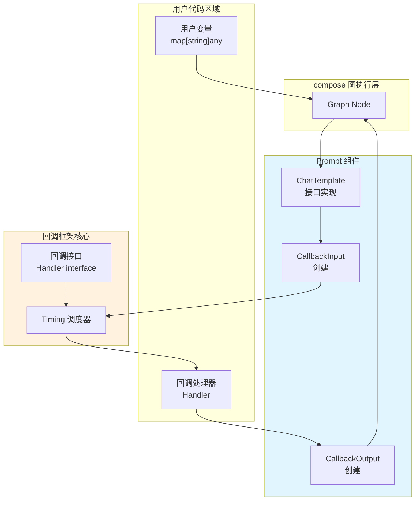

# prompt_callback_io 模块技术深度解析

## 概述

`prompt_callback_io` 模块是 Eino 框架中定义 Prompt 组件回调载荷（Callback Payload）的核心模块。在一个 LLM 应用中，Prompt 组件负责将用户提供的变量（Variables）格式化（Format）为符合大语言模型要求的对话消息（Messages）。这个模块解决的问题是：**如何在不修改核心组件逻辑的情况下，观察、拦截、甚至修改 Prompt 组件的输入输出数据流**。

这个问题类似于生活中的"海关检查站"：货物（数据）从一处运往另一处时，海关（回调机制）可以检查货物内容、记录通关信息、或者在必要时拦截货物。`prompt_callback_io` 定义了这个"检查站"需要记录的具体信息结构——哪些货物（变量）需要检查、最终组装成什么货物（格式化后的消息）、以及附带什么通关文件（Extra 信息）。

---

## 架构定位与数据流



### 组件职责

从架构图中可以看出，`prompt_callback_io` 模块处于 **Prompt 组件层** 与 **回调框架层** 的交汇处。它的核心职责是：

1. **定义契约**：为 Prompt 组件的回调提供类型安全的输入输出数据结构
2. **类型桥接**：通过转换函数（`ConvCallbackInput` / `ConvCallbackOutput`）将通用回调类型转换为 Prompt 组件的特定类型
3. **数据承载**：携带格式化过程中所需的模板（Templates）、变量（Variables）和结果（Result）

---

## 核心组件详解

### CallbackInput 结构体

```go
type CallbackInput struct {
    Variables map[string]any       // 变量：用户传入的原始输入
    Templates []schema.MessagesTemplate  // 模板：消息模板定义
    Extra map[string]any           // 额外信息：上下文传递的扩展数据
}
```

**设计意图**：这个结构体捕获了 Prompt 组件 `Format` 方法调用时的完整输入状态。

- **Variables** 存放用户提供的原始变量，例如 `{ "name": "Alice", "query": "今天天气如何" }`。这使得回调处理器可以在格式化前检查或修改这些变量——比如添加默认值、记录日志、或者根据变量内容动态决定是否跳过某些处理步骤。

- **Templates** 是消息模板的集合。在 Eino 中，消息模板（`schema.MessagesTemplate`）是实现 Prompt 工程的核心抽象，它可以是简单的系统消息（`SystemMessage("you are helpful")`），也可以是带有占位符的复杂模板（`MessagesPlaceholder("history", false)`）。将模板暴露给回调使得高级用例成为可能：例如，分析 Prompt 的复杂度、验证是否包含某些指令、或在调试时打印完整的模板结构。

- **Extra** 是一个自由扩展的键值对容器。这体现了框架的 extensibility（可扩展性）设计原则——当框架需要传递额外信息而不想修改核心结构体时，可以通过 `Extra` 传递。例如，追踪请求的 trace ID、传递认证上下文、或记录性能指标。

### CallbackOutput 结构体

```go
type CallbackOutput struct {
    Result []*schema.Message  // 结果：格式化后的消息列表
    Templates []schema.MessagesTemplate  // 模板：可能已修改的模板
    Extra map[string]any      // 额外信息：上下文传递的扩展数据
}
```

**设计意图**：这个结构体捕获了 Prompt 组件完成格式化后的完整输出状态。

- **Result** 是最终生成的消息列表——这是回调处理器最关心的数据。回调可以在这里检查模型将接收到的完整消息上下文，或者修改消息内容（例如在消息注入安全过滤器、添加水印、或替换敏感占位符）。

- **Templates 字段的存在** 是一个有趣的设计选择。它允许回调处理器不仅检查结果，还可以影响模板本身。这支持一些高级场景，比如根据运行时条件动态调整系统提示词（System Prompt）。

### 转换函数：类型安全的桥梁

```go
func ConvCallbackInput(src callbacks.CallbackInput) *CallbackInput
func ConvCallbackOutput(src callbacks.CallbackOutput) *CallbackOutput
```

**为什么需要转换函数？** 这是 Eino 回调框架的一个巧妙设计。

回调框架的核心接口使用 Go 的空接口（`any`）来定义通用的输入输出：

```go
type CallbackInput any
type CallbackOutput any

type Handler interface {
    OnStart(ctx context.Context, info *RunInfo, input CallbackInput) context.Context
    OnEnd(ctx context.Context, info *RunInfo, output CallbackOutput) context.Context
    // ...
}
```

这种设计带来了极大的灵活性——任何类型都可以作为回调的输入输出。但这同时也带来了一个问题：**回调处理器如何知道它处理的是什么类型的回调？**

Eino 的解决方案是让每个组件提供类型转换函数。以 `model.ConvCallbackInput` 为例：

```go
func ConvCallbackInput(src callbacks.CallbackInput) *CallbackInput {
    switch t := src.(type) {
    case *CallbackInput:
        return t  // 组件内部触发的回调，已经是正确的类型
    case []*schema.Message:
        return &CallbackInput{ Messages: t }  // 图节点注入的回调，是接口的原始输入类型
    default:
        return nil  // 不是有效的 prompt 回调类型
    }
}
```

这段代码展示了两种回调触发路径：

1. **组件内部触发**：当 Prompt 组件实现本身调用回调时，传入的已经是具体类型 `*CallbackInput`
2. **图节点注入**：当回调由 Graph 节点层面的机制注入时，传入的可能是接口的原始输入类型（如 `map[string]any`）

这种双重处理使得回调系统既能支持细粒度的组件级拦截，也能支持粗粒度的图级监控。

---

## 依赖分析与集成点

### 依赖关系

```
prompt_callback_io
    ├── github.com/cloudwego/eino/callbacks      ← 定义通用回调接口
    └── github.com/cloudwego/eino/schema         ← 定义消息和模板类型
```

该模块直接依赖两个包：

- **callbacks 包**：提供了通用的 `CallbackInput` 和 `CallbackOutput` 类型别名，以及 `Handler` 接口定义。这些是整个回调系统的基石。
- **schema 包**：提供了 `schema.Message` 和 `schema.MessagesTemplate` 类型，这些是 Prompt 组件输入输出的核心数据类型。

### 被依赖关系

```
其他模块 → prompt_callback_io
    ├── Prompt 组件实现 (如 DefaultChatTemplate)
    ├── Graph 节点执行层
    └── 用户回调处理器
```

- **Prompt 组件实现**：当组件调用回调时，会创建 `CallbackInput` 和 `CallbackOutput` 实例并传递给回调框架。
- **Graph 节点执行层**：compose 包的执行器会在调用组件前后触发相应的回调时机（Timing），并传入组件提供的输入输出数据。
- **用户回调处理器**：开发者编写的回调处理器通过转换函数将通用的 `callbacks.CallbackInput` 转换为具体的 `*prompt.CallbackInput`，然后访问其中的字段。

---

## 设计决策与权衡

### 1. 空接口 vs 具体类型的权衡

**选择**：回调框架使用空接口（`any`）作为通用的输入输出类型，而非泛型或具体类型。

**理由**：
- **解耦**：回调框架不需要了解各个组件的具体数据结构，实现了框架与组件的松耦合
- **可扩展性**：新增组件类型不需要修改回调框架本身
- **简洁性**：避免了 Go 泛型在复杂场景下的类型推断问题

**代价**：
- 回调处理器需要使用类型断言或转换函数来访问具体数据
- 编译时无法捕获类型错误，只能在运行时发现

### 2. 双向 Template 字段的设计

**选择**：在 `CallbackInput` 和 `CallbackOutput` 中都保留了 `Templates` 字段。

**理由**：
- **对称性**：输入和输出使用相同的结构，便于回调处理器编写一致的逻辑
- **可变性**：允许回调处理器不仅检查结果，还可以根据需要对模板进行修改后传递下去
- **调试友好**：在日志和调试场景中，可以同时看到模板和结果的对应关系

### 3. Extra 字段的 Extensibility 设计

**选择**：使用 `map[string]any` 类型的 `Extra` 字段而非固定的扩展接口。

**理由**：
- **零成本抽象**：对于不需要扩展的场景，`Extra` 可以是 nil，不会造成额外开销
- **无接口依赖**：不需要定义额外的接口来扩展回调数据
- **JSON 友好**：`map[string]any` 可以直接序列化为 JSON，便于日志和调试

---

## 使用场景与示例

### 基本用法：监控 Prompt 生成

```go
import (
    "github.com/cloudwego/eino/callbacks"
    "github.com/cloudwego/eino/components/prompt"
    "github.com/cloudwego/eino/schema"
)

// 创建一个回调处理器来监控 Prompt 生成
handler := &promptsMonitorHandler{}

func main() {
    // 注册全局回调处理器
    callbacks.AppendGlobalHandlers(handler)
    
    // 后续所有图节点执行都会触发这个回调
}
```

```go
type promptsMonitorHandler struct{}

func (h *promptsMonitorHandler) OnStart(ctx context.Context, info *callbacks.RunInfo, input callbacks.CallbackInput) context.Context {
    // 使用转换函数获取 Prompt 特定的输入
    promptInput := prompt.ConvCallbackInput(input)
    if promptInput == nil {
        return ctx // 不是 Prompt 组件的回调，跳过
    }
    
    // 记录输入的变量
    fmt.Printf("[Prompt] Node=%s, Variables=%v\n", info.Name, promptInput.Variables)
    
    return ctx
}

func (h *promptsMonitorHandler) OnEnd(ctx context.Context, info *callbacks.RunInfo, output callbacks.CallbackOutput) context.Context {
    promptOutput := prompt.ConvCallbackOutput(output)
    if promptOutput == nil {
        return ctx
    }
    
    // 检查生成的消息
    for i, msg := range promptOutput.Result {
        fmt.Printf("[Prompt] Node=%s, Message[%d] Role=%s, Content=%s\n", 
            info.Name, i, msg.Role, msg.Content)
    }
    
    return ctx
}
```

### 高级用法：修改 Prompt 内容

```go
type promptInjector struct{}

func (h *promptInjector) OnStart(ctx context.Context, info *callbacks.RunInfo, input callbacks.CallbackInput) context.Context {
    promptInput := prompt.ConvCallbackInput(input)
    if promptInput == nil {
        return ctx
    }
    
    // 在变量中注入额外的上下文
    promptInput.Variables["session_id"] = getSessionID(ctx)
    promptInput.Extra["trace_id"] = getTraceID(ctx)
    
    return ctx
}

func (h *promptInjector) OnEnd(ctx context.Context, info *callbacks.RunInfo, output callbacks.CallbackOutput) context.Context {
    promptOutput := prompt.ConvCallbackOutput(output)
    if promptOutput == nil {
        return ctx
    }
    
    // 在系统消息前添加安全警告
    if len(promptOutput.Result) > 0 && promptOutput.Result[0].Role == schema.System {
        warning := schema.SystemMessage("[Security Notice] This is an automated system.")
        promptOutput.Result = append([]*schema.Message{warning}, promptOutput.Result...)
    }
    
    return ctx
}
```

---

## 注意事项与陷阱

### 1. 类型安全的隐式假设

回调处理器在调用转换函数时，**隐式假设**输入确实是对应组件的回调类型。如果传入错误类型的回调，转换函数会返回 `nil`。因此，回调处理器应该**始终检查转换结果是否为 nil**：

```go
// 错误做法：不做 nil 检查可能导致 panic
promptInput := prompt.ConvCallbackInput(input)
fmt.Println(promptInput.Variables["key"]) // 如果 promptInput 是 nil，这里 panic

// 正确做法：先检查再使用
promptInput := prompt.ConvCallbackInput(input)
if promptInput != nil {
    fmt.Println(promptInput.Variables["key"])
}
```

### 2. 回调执行时机与副作用

回调是在组件执行的**关键时机**被调用的。在 `OnStart` 阶段修改 `CallbackInput` 的内容**可能**会影响后续的组件执行（取决于组件实现是否使用原始引用还是复制后的数据）。建议：

- **仅读取**：如果只需要监控，优先使用 `OnEnd` 阶段
- **谨慎修改**：如果在 `OnStart` 阶段修改输入，确保了解组件的实现行为
- **幂等性**：回调逻辑应该是幂等的，多次执行不应产生副作用

### 3. 全局 Handler 的线程安全

`AppendGlobalHandlers` 文档明确说明**不是线程安全的**：

> Note: This function is not thread-safe and should only be called during process initialization.

这意味着全局回调处理器应该在 `main` 函数的开始阶段注册，而不是在并发执行的goroutine中注册。

### 4. Extra 字段的生命周期

`Extra` 字段的生命周期与回调对象相同。当回调对象被垃圾回收时，`Extra` 中的数据也会丢失。如果需要在回调之间传递数据，应该：

1. 通过 context 传递（返回修改后的 ctx）
2. 使用外部存储（如结构体字段持有数据）

### 5. 与其他组件回调的区别

Eino 框架中每个组件都有类似的回调定义：

| 组件 | 输入关键字段 | 输出关键字段 |
|------|-------------|-------------|
| model | Messages, Config | Message, TokenUsage |
| prompt | Variables, Templates | Result, Templates |
| retriever | Query, Config | Documents |
| indexer | Documents, Config | - |

理解这个模式后，学习其他组件的回调就会更容易。

---

## 相关文档

- [回调框架核心接口](../callbacks_handler.md) - 了解 `Handler` 接口和各回调时机
- [model 模块回调定义](../components-model-and-prompting-model_callback_extra.md) - 对比 model 组件的回调结构
- [schema 消息类型](../message_schema_and_templates.md) - 了解 `Message` 和 `MessagesTemplate` 的定义
- [Graph 节点执行与回调注入](./graph_node_execution_and_runnable_abstractions.md) - 了解回调如何在图节点层面被触发

---

## 总结

`prompt_callback_io` 模块虽然代码量不大，但它是 Eino 框架可观测性（Observability）和可扩展性（Extensability）的关键组成部分。通过定义清晰的回调载荷结构，它实现了：

1. **无侵入式监控**：无需修改 Prompt 组件代码即可观察其行为
2. **灵活的扩展机制**：通过 Extra 字段支持自定义扩展
3. **类型安全的桥接**：通过转换函数在通用回调框架和组件特定类型之间建立桥梁

理解这个模块的设计，有助于更好地使用 Eino 框架的回调机制来构建可观测、可调试的 LLM 应用。