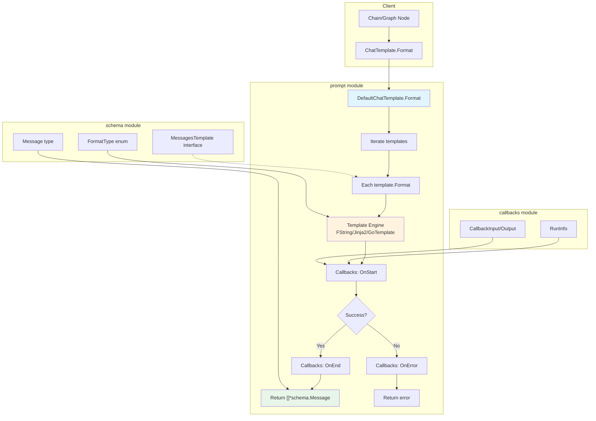

# prompt_template_contract_and_default 模块详解

## 概述

`prompt_template_contract_and_default` 模块是 Eino 框架中负责**提示词模板化**的核心组件。想象一下，当你在构建一个 LLM 应用时，用户输入的数据（如姓名、问题、上下文）需要被组织成特定格式的消息序列才能发送给模型——这个过程就是"模板渲染"。

**这个模块解决的问题**：在 LLM 应用中，开发者通常需要将动态变量（如用户问题、对话历史、系统指令）拼接成结构化的消息列表。手动拼接容易出错，且难以维护。该模块提供了一个统一的接口，将带有占位符的模板渲染为标准的 `[]*schema.Message` 格式，支持多种模板语法，并且与框架的回调系统集成以实现可观测性。

## 架构概览



### 核心组件与职责

| 组件 | 类型 | 职责 |
|------|------|------|
| `ChatTemplate` | 接口 | 定义模板的契约：`Format(ctx, variables) -> []*Message` |
| `DefaultChatTemplate` | 结构体 | 默认实现，遍历模板列表并调用各模板的 Format 方法 |
| `FromMessages` | 工厂函数 | 创建 DefaultChatTemplate 实例的便捷方法 |
| `Option` | 结构体 | 组件调用选项，用于传递实现特定的配置参数 |

## 设计理念与心智模型

### 类比：模板引擎就像"邮件合并"

想象你有一封标准格式的信件（模板），需要根据不同的收件人填写不同的信息（变量）：

```
尊敬的 {name} 先生/女士：

{content}

祝好！
```

这个模块做的事情就像 Office 的"邮件合并"功能：输入变量 map（如 `{"name": "张三", "content": "您的订单已发货"}`），输出格式化的消息列表。不同之处在于，它不仅支持简单的文本替换，还支持：
- **多模板组合**：系统消息 + 历史消息 + 用户消息 → 组合成一个消息列表
- **占位符**：`MessagesPlaceholder("history", true)` 可以从变量中直接注入历史消息
- **多种模板语法**：Python f-string、Go template、Jinja2

### 关键设计决策

1. **为什么用接口而非具体类型？**
   - `ChatTemplate` 定义了一个抽象契约，允许框架在任何需要模板的地方使用它
   - 这使得单元测试可以轻松注入 mock 实现
   - 未来可以支持更多模板引擎实现（如 Mustache、Tera）

2. **为什么要支持多种模板格式？**
   - 不同团队有不同偏好：Python 背景的团队喜欢 f-string/Jinja2，Go 背景的更喜欢 Go 原生 template
   - 这降低了学习成本，让开发者可以用熟悉的语法

3. **回调系统集成的作用**
   - 模板渲染虽然是"纯逻辑"，但在实际应用中可能需要追踪（如调试、日志、监控）
   - 通过回调，开发者可以记录每次渲染的输入/输出，而不改变核心逻辑

## 核心代码分析

### ChatTemplate 接口

```go
// components/prompt/interface.go
type ChatTemplate interface {
    Format(ctx context.Context, vs map[string]any, opts ...Option) ([]*schema.Message, error)
}
```

这是整个模块的核心契约。参数说明：
- `ctx`：上下文，用于传递请求级别的信息，特别是用于回调系统
- `vs`：变量映射表，键是模板中的占位符，值是实际数据
- `opts`：可选参数，用于实现特定的配置

### DefaultChatTemplate 实现

```go
// components/prompt/chat_template.go
type DefaultChatTemplate struct {
    templates  []schema.MessagesTemplate  // 模板列表
    formatType schema.FormatType           // 格式化类型
}
```

内部包含一个 `templates` 列表，这允许开发者将多个模板组合成一个整体。例如：

```go
prompt.FromMessages(
    schema.FString,
    schema.SystemMessage("你是一个助手，你的名字是 {assistant_name}"),
    schema.MessagesPlaceholder("history", true),  // 动态注入历史
    schema.UserMessage("我的问题是: {question}"),
)
```

### Format 方法的执行流程

```go
func (t *DefaultChatTemplate) Format(ctx context.Context,
    vs map[string]any, _ ...Option) (result []*schema.Message, err error) {
    
    // 1. 初始化回调
    ctx = callbacks.EnsureRunInfo(ctx, t.GetType(), components.ComponentOfPrompt)
    ctx = callbacks.OnStart(ctx, &CallbackInput{
        Variables: vs,
        Templates: t.templates,
    })
    defer func() {
        if err != nil {
            _ = callbacks.OnError(ctx, err)
        }
    }()

    // 2. 遍历模板并格式化
    result = make([]*schema.Message, 0, len(t.templates))
    for _, template := range t.templates {
        msgs, err := template.Format(ctx, vs, t.formatType)
        if err != nil {
            return nil, err
        }
        result = append(result, msgs...)
    }

    // 3. 完成回调
    _ = callbacks.OnEnd(ctx, &CallbackOutput{
        Result:    result,
        Templates: t.templates,
    })

    return result, nil
}
```

### Option 设计：实现特定的灵活性

```go
// components/prompt/option.go
type Option struct {
    implSpecificOptFn any  // 函数指针，存储实现特定的配置函数
}

func WrapImplSpecificOptFn[T any](optFn func(*T)) Option {
    return Option{
        implSpecificOptFn: optFn,
    }
}

func GetImplSpecificOptions[T any](base *T, opts ...Option) *T {
    // 提取并应用所有特定于实现的选项
}
```

这个设计的巧妙之处在于：
- 它是一个**类型擦除**的选项模式
- 框架代码不需要知道具体的选项类型，只要调用方和实现方约定好即可
- 这避免了为每个实现创建大量接口方法的膨胀

## 数据流分析

### 端到端流程

```
用户输入 (map[string]any)
        │
        ▼
┌─────────────────────────┐
│  Chain/Graph 调用      │
│  chatTemplate.Format() │
└─────────────────────────┘
        │
        ▼
┌─────────────────────────┐
│  DefaultChatTemplate   │
│  .Format()              │
│  - 触发 OnStart 回调    │
└─────────────────────────┘
        │
        ▼
┌─────────────────────────┐
│  遍历 templates 列表    │
│  ┌───────────────────┐  │
│  │ SystemMessage    │  │
│  │ → Format()       │  │
│  │ → FString/Jinja  │──┼──▶ 替换 {变量}
│  └───────────────────┘  │
│  ┌───────────────────┐  │
│  │ MessagesPlacehold│  │
│  │ → Format()       │──┼──▶ 直接从 map 取值
│  └───────────────────┘  │
│  ┌───────────────────┐  │
│  │ UserMessage       │  │
│  │ → Format()       │  │
│  │ → FString/Jinja  │──┼──▶ 替换 {变量}
│  └───────────────────┘  │
└─────────────────────────┘
        │
        ▼
┌─────────────────────────┐
│  合并所有消息           │
│  - 触发 OnEnd 回调     │
└─────────────────────────┘
        │
        ▼
   []*schema.Message
        │
        ▼
┌─────────────────────────┐
│  发送给 ChatModel       │
└─────────────────────────┘
```

### 与其他模块的交互

| 上游模块 | 交互方式 | 说明 |
|---------|---------|------|
| [compose/chain](./compose-graph.md) | 调用 `ChatTemplate.Format` | Chain 节点调用模板进行渲染 |
| [schema](./schema_message.md) | 使用 `Message`, `MessagesTemplate`, `FormatType` | 输入输出类型定义 |
| [callbacks](./callbacks_handler_templates.md) | 回调 hooks | 实现可观测性 |

| 下游模块 | 交互方式 | 说明 |
|---------|---------|------|
| [model](./model_interfaces_and_options.md) | 输出 `[]*schema.Message` | 模板输出作为模型输入 |

## 设计权衡分析

### 1. 同步 vs 异步

**选择**：采用同步设计（`Format` 方法是同步的）

**分析**：
- 模板渲染本身是 CPU 密集型（字符串处理），不是 I/O 密集型
- 异步化带来的复杂度提升与收益不成正比
- 如果未来需要流式渲染（streaming template），可以扩展接口

### 2. 接口 vs 具体类型

**选择**：通过接口抽象

**分析**：
- 优点：便于测试、便于扩展
- 缺点：运行时有一定的抽象开销
- 结论：对于这个层级，接口的灵活性更重要

### 3. 多种模板格式的支持

**选择**：支持 FString、GoTemplate、Jinja2 三种

**分析**：
- FString：Python 开发者最熟悉，语法简洁
- GoTemplate：Go 原生，无额外依赖
- Jinja2：功能最强大，支持循环、条件等

**权衡**：增加了代码复杂度（三个不同的渲染路径），但大大提升了开发者体验。

## 注意事项与陷阱

### 1. 占位符匹配

模板中的变量占位符必须与 `Format` 方法传入的 `map` 键完全匹配：

```go
// ❌ 错误：键不匹配（name vs username）
template := prompt.FromMessages(schema.FString, 
    schema.UserMessage("Hello, {name}!"))
template.Format(ctx, map[string]any{"username": "Alice"})  // 报错

// ✅ 正确
template.Format(ctx, map[string]any{"name": "Alice"})
```

### 2. 占位符不存在时的行为

- `MessagesPlaceholder(key, false)`：如果键不存在，会返回错误
- `MessagesPlaceholder(key, true)`：如果键不存在，返回空消息列表

```go
// ✅ 可选占位符，不会报错
schema.MessagesPlaceholder("history", true)  // 第二个参数 true 表示可选
```

### 3. 模板格式的选择

不同格式的占位符语法不同：

| 格式 | 占位符语法 | 示例 |
|------|-----------|------|
| FString | `{variable}` | `"Hello, {name}!"` |
| Jinja2 | `{{variable}}` | `"Hello, {{name}}!"` |
| GoTemplate | `{{.variable}}` | `"Hello, {{.name}}!"` |

### 4. 多媒体内容模板化

`Message` 支持多模态内容（图片、音频、视频），模板引擎会尝试替换这些内容中的 URL：

```go
&schema.Message{
    Role: schema.User,
    UserInputMultiContent: []schema.MessageInputPart{
        {Type: schema.ChatMessagePartTypeText, Text: "看这张图: {image_desc}"},
        {Type: schema.ChatMessagePartTypeImageURL, Image: &schema.MessageInputImage{
            MessagePartCommon: schema.MessagePartCommon{
                URL: toPtr("{image_url}"),  // 变量会在这里被替换
            },
        }},
    },
}
```

### 5. 回调的副作用

虽然 `Format` 方法设计为"纯函数"（给定相同输入总是产生相同输出），但回调可能会产生副作用（写入日志、发送监控数据等）。如果你的应用对幂等性有严格要求，请注意这一点。

## 使用示例

### 基本用法

```go
// 创建模板
template := prompt.FromMessages(
    schema.FString,
    schema.SystemMessage("你是一个有帮助的助手。"),
    schema.UserMessage("请问 {question}？"),
)

// 渲染模板
msgs, err := template.Format(ctx, map[string]any{
    "question": "今天天气怎么样",
})
// msgs[0]: system message "你是一个有帮助的助手。"
// msgs[1]: user message "请问 今天天气怎么样 ？"
```

### 带历史消息的用法

```go
template := prompt.FromMessages(
    schema.FString,
    schema.SystemMessage("你是一个有帮助的助手。"),
    schema.MessagesPlaceholder("history", true),  // 动态注入
    schema.UserMessage("我的问题是: {question}"),
)

history := []*schema.Message{
    schema.UserMessage("你好"),
    schema.AssistantMessage("你好！有什么可以帮助你的吗？"),
}

msgs, err := template.Format(ctx, map[string]any{
    "history":  history,
    "question": "今天天气怎么样",
})
// 最终消息：[system, user(hello), assistant(hi), user(question)]
```

### 在 Chain 中使用

```go
chain := compose.NewChain[map[string]any, []*schema.Message]()
chain.AppendChatTemplate(template)  // 自动调用 Format
chain.AppendChatModel(chatModel)

result, err := chain.Invoke(ctx, map[string]any{
    "question": "今天天气怎么样",
})
```

## 相关文档

- [schema/Message](./schema_message.md) - 消息类型定义
- [callbacks/interface](./callbacks_handler_templates.md) - 回调系统
- [compose/chain](./compose_graph.md) - 链式调用
- [model](./model_interfaces_and_options.md) - 模型接口