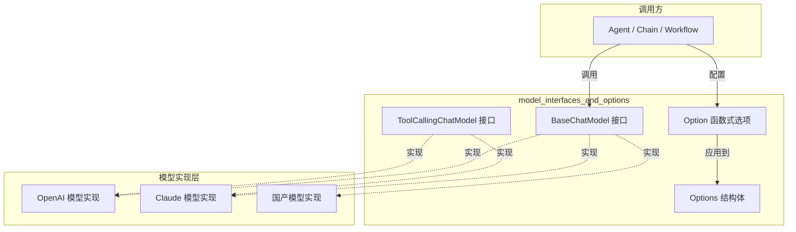

# model_interfaces_and_options 模块

> **模块定位**：ChatModel 组件的接口定义与配置选项系统

## 模块概述

`model_interfaces_and_options` 模块是 Eino 框架中 LLM（大型语言模型）交互层的核心抽象层。想象一座发电厂的涡轮机接口——无论上游是水力、风力还是核能，涡轮机的接口是统一的，这样下游设备不需要关心能源来自哪里。这个模块正是扮演着类似的角色：它定义了与各类 LLM 提供商（OpenAI、Claude、国产大模型等）交互的统一接口，使得上层的 Agent、Chain、Workflow 等编排组件可以无差别地调用任何兼容的模型实现。

模块包含两个核心子模块：
- **[model_interface](model_interface.md)**：定义了 `BaseChatModel`、`ToolCallingChatModel` 等核心接口，规定了模型交互的契约
- **[model_option](model_option.md)**：实现了函数式选项（Functional Options）模式，提供了灵活的配置机制

---

## 架构设计

### 核心组件关系



### 数据流分析

当一个 Agent 请求模型生成回复时，数据流如下：

1. **选项组装阶段**：调用方使用 `WithTemperature(0.7)`、`WithMaxTokens(1000)` 等函数式选项构建 `Option` 列表
2. **选项解析阶段**：通过 `GetCommonOptions()` 提取通用配置，通过 `GetImplSpecificOptions()` 提取实现特定的配置
3. **模型调用阶段**：将解析后的 `Options` 传递给 `Generate()` 或 `Stream()` 方法
4. **结果返回阶段**：模型返回 `*schema.Message`（完整输出）或 `*schema.StreamReader[*schema.Message]`（流式输出）

---

## 核心设计决策

### 1. 接口分层的智慧：BaseChatModel vs ToolCallingChatModel

**问题背景**：最初的 `ChatModel` 接口使用 `BindTools()` 方法来绑定工具，但这种方法存在两个严重问题：

- **并发安全问题**：多个 goroutine 共享同一个模型实例，一个 goroutine 调用 `BindTools` 可能会影响正在另一个 goroutine 中进行的生成请求
- **状态覆盖问题**：连续调用两次 `BindTools` 会导致第一次绑定的工具被覆盖，而非累积

**解决方案**：`ToolCallingChatModel` 接口使用 `WithTools()` 方法返回**一个新的模型实例**，而不是修改原实例。这是一种"不可变式"设计——类似于函数式编程中的纯函数，调用 `WithTools` 不会产生副作用。

```go
// 旧方式（有并发问题）
model.BindTools(tools1)
model.BindTools(tools2)  // tools1 被覆盖了！

// 新方式（线程安全）
model1 := model.WithTools(tools1)  // 返回新实例
model2 := model.WithTools(tools2)  // 另一个新实例，不影响 model1
```

**设计权衡**：
- 优点：完全避免状态共享和并发问题
- 缺点：每次调用都会创建新实例，理论上有一定的内存开销，但 Go 的垃圾回收机制使这种开销在实际使用中可以忽略不计

### 2. 函数式选项模式 vs 传统 Builder 模式

**选项设计**：Eino 选择了函数式选项（Functional Options）而非传统的 Builder 模式，原因如下：

| 特性 | Builder 模式 | 函数式选项 |
|------|-------------|-----------|
| API 美观度 | `NewModel().WithTemperature(0.7).WithMaxTokens(1000)` | `model.Generate(ctx, msgs, WithTemperature(0.7), WithMaxTokens(1000))` |
| 可选参数 | 需要指针或变长参数 | 天然支持任意数量可选参数 |
| 扩展性 | 修改 Builder 需要改接口 | 新增 Option 函数即可 |
| 零值语义 | 需要额外标志位判断"未设置" | 使用指针，`nil` 表示"未设置" |

**指针类型的深意**：在 `Options` 结构体中，所有字段都是指针类型（`*float32`、`*int`、`*string` 等）。这是有意为之的设计——它允许我们区分"用户没有设置温度"和"用户明确设置温度为 0"这两种情况。如果使用非指针类型，我们将无法判断一个零值是用户主动设置的还是默认的。

### 3. 通用选项 vs 实现特定选项的分离

模块提供了两套选项提取机制：

```go
// 提取所有模型都支持的通用选项
commonOpts := model.GetCommonOptions(&model.Options{
    Temperature: float32Ptr(0.7),  // 默认值
}, opts...)

// 提取特定实现的选项（如 OpenAI 的 extra_headers）
specificOpts := model.GetImplSpecificOptions[MyCustomOptions](nil, opts...)
```

这种设计实现了两个目标：
- **解耦**：通用层不依赖特定实现的扩展字段
- **扩展性**：各模型实现可以自由定义自己的选项而不影响核心接口

---

## 依赖关系分析

### 上游依赖

| 模块 | 依赖内容 | 说明 |
|------|---------|------|
| `schema` | `Message`, `ToolInfo`, `ToolChoice`, `StreamReader` | 定义了模型输入输出的数据结构 |
| `callbacks` | 回调机制 | 用于模型调用前后的拦截和监控 |

### 下游依赖

| 模块 | 依赖内容 | 说明 |
|------|---------|------|
| `adk/react` | `BaseChatModel` 接口 | Agent 运行时依赖模型接口进行对话 |
| `compose/chain` | `Generate` 方法 | 链式调用中的模型节点 |
| 各模型实现 | 接口定义 | OpenAI、Claude 等具体实现 |

---

## 使用指南

### 基本用法

```go
// 1. 创建模型实例（假设使用 OpenAI）
model := openai.NewChatModel(openai.WithAPIKey("your-key"))

// 2. 准备输入
msgs := []*schema.Message{
    schema.SystemMessage("You are a helpful assistant."),
    schema.UserMessage("What is the capital of France?"),
}

// 3. 调用生成（使用函数式选项）
resp, err := model.Generate(context.Background(), msgs,
    model.WithTemperature(0.7),
    model.WithMaxTokens(500),
)

// 4. 处理响应
fmt.Println(resp.Content)
```

### 带工具调用的用法

```go
// 定义工具
tools := []*schema.ToolInfo{
    {
        Name: "weather",
        Desc: "Get weather information for a city",
        Params: schema.NewParamsOneOfByParams(map[string]*schema.ParameterInfo{
            "city": {Type: schema.String, Desc: "City name", Required: true},
        }),
    },
}

// 使用 WithTools 获得新的模型实例
toolModel, err := model.WithTools(tools)
if err != nil {
    // 处理错误
}

// 使用绑定了工具的模型
resp, err := toolModel.Generate(ctx, msgs,
    model.WithToolChoice(schema.ToolChoiceForced),  // 强制调用工具
)
```

---

## 常见陷阱与注意事项

1. **不要在并发场景下使用已废弃的 `BindTools`**：虽然接口仍然存在，但文档明确标注为 Deprecated，新代码不应再使用

2. **Options 指针字段的边界情况**：如果你想清除一个已设置的选项（如清除 temperature），直接传递 `WithTemperature(0)` 是不够的——需要重新创建没有该字段的 Options

3. **流式输出的资源管理**：`Stream()` 返回的 `StreamReader` 必须被正确消费或关闭，否则可能导致资源泄漏

4. **工具绑定的时机**：`WithTools()` 返回的新实例是独立的，建议在创建 Agent 或 Chain 时绑定一次，而不是每次调用时都重新绑定

---

## 相关文档

- [model_interface 模块](model_interface.md) - 接口定义详解
- [model_option 模块](model_option.md) - 选项系统详解
- [schema/message.go](../schema/message.md) - 消息结构定义
- [schema/tool.go](../schema/tool.md) - 工具定义