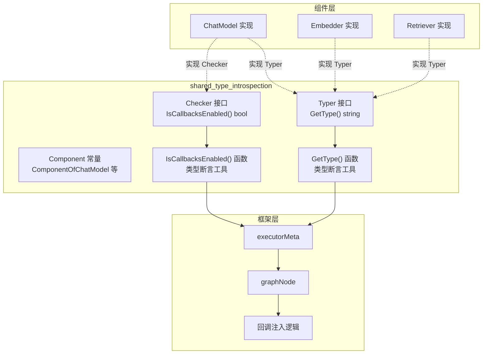

# shared_type_introspection 模块技术深度解析

## 概述

`shared_type_introspection` 模块是 Eino 框架中的**类型自省基础设施**。它定义了两个核心接口 —— `Typer` 和 `Checker` —— 用于让组件向框架“自我介绍”：我是谁（类型标识），我有什么能力（是否自行处理回调）。这个模块解决的问题看似简单 —— 只需给组件打个“标签” —— 但它背后的设计意图却涉及到框架的可观测性、扩展性和解耦原则。

在 Eino 这样的 AI 应用框架中，一个 graph 可能由数十个组件组成（ChatModel、Embedder、Retriever、Tool 等），这些组件可能来自不同的实现（OpenAI、Azure、Anthropic、本地模型等）。框架需要知道每个节点的“真实身份”才能正确地进行日志记录、指标收集、回调注入和错误追踪。如果没有这个自省机制，框架只能看到一堆实现了相同接口的“黑盒”，无法区分 "OpenAI ChatModel" 和 "本地 ChatModel"，可观测性将大打折扣。

## 问题空间：为什么需要组件自省？

想象一下你正在构建一个复杂的 AI 工作流，graph 里有 5 个 ChatModel 节点、3 个 Retriever 节点和若干 Tool 节点。当你在调试工具中看到一个失败的请求时，你最关心的问题是什么？“是哪个 ChatModel 失败的？是配置问题还是模型本身的问题？”

在没有类型自省的情况下，所有 ChatModel 在框架眼中都是一样的。你只能看到“ChatModel 节点 3 失败了”，但无法快速定位到具体是 "OpenAI ChatModel" 还是 "Azure OpenAI ChatModel"。更糟糕的是，如果你想为不同类型的模型配置不同的回调策略（比如为 OpenAI 配置 Token 统计回调，为本地模型配置延迟监控），框架也无从下手。

这就是 `Typer` 接口要解决的问题：它为每个组件实例提供了一个**稳定的、可读的、机器可解析的类型标识符**。

另一个相关的问题是**回调控制**。Eino 的回调机制（详见 [callbacks/interface](callbacks-interface.md)）允许用户在组件执行前后注入自定义逻辑（如日志、监控、指标上报）。但有些组件实现本身已经包含了回调逻辑（比如封装好的 SDK），如果框架再注入一份默认回调，就会造成重复调用甚至冲突。`Checker` 接口让组件可以声明：“我自己处理回调，你们别掺和”。

## 架构设计

### 核心组件



### 组件角色

| 组件 | 职责 | 关键设计 |
|------|------|----------|
| `Typer` 接口 | 定义 `GetType() string` 方法，组件实现此接口以返回类型名称 | 采用**接口实现模式**，组件自行决定返回什么字符串（如 "OpenAI"、"Azure"、"Claude"） |
| `Checker` 接口 | 定义 `IsCallbacksEnabled() bool` 方法，组件返回 true 表示自行处理回调 | 采用**声明式控制**，组件主动声明能力而非被动配置 |
| `Component` 常量 | 定义组件类别常量（ChatModel、Embedding、Retriever 等） | 采用**枚举式分类**，框架内部用于标识组件大类 |
| `GetType()` 函数 | 泛型类型断言工具，尝试从任意对象中提取 Typer 接口 | 采用**安全的类型断言**，找不到接口时返回空字符串而非 panic |
| `IsCallbacksEnabled()` 函数 | 泛型类型断言工具，检查对象是否实现了 Checker | 同上，强调**零panic原则** |

## 设计意图与核心抽象

### Typer 接口：组件的“身份证”

```go
type Typer interface {
    GetType() string
}
```

这个接口的设计哲学是**最小化干预**。框架不要求组件返回特定格式的字符串，而是让组件完全自主。推荐使用 CamelCase 命名风格（如 "OpenAI"、"DeepSeek"），但框架不做强制校验。

**为什么这样设计？**

想象你正在开发一个企业内部组件库，你们使用 "InternalGPT-4" 作为模型标识。如果框架强制要求特定格式（如必须以 "chatmodel/" 开头），你的代码就会变得不优雅。通过让组件自行返回字符串，框架既获得了必要的元信息，又保持了足够的灵活性。

框架在生成完整的组件实例名称时，会将 `Typer` 返回的值与组件类别组合。`parseExecutorInfoFromComponent` 函数（在 `compose/graph_node.go` 中）会尝试调用 `components.GetType(executor)`，如果组件实现了 Typer，就使用返回的值；否则回退到通过反射解析类型名的方案。

### Checker 接口：回调控制权移交

```go
type Checker interface {
    IsCallbacksEnabled() bool
}
```

这个接口解决了一个微妙的**职责边界**问题。在典型的 AI 应用中，回调（callbacks）用于：

1. **可观测性**：记录请求输入、输出、耗时、token 消耗
2. **扩展点**：在组件执行前后注入自定义逻辑（如缓存结果、修改参数）
3. **合规审计**：记录 AI 生成的每一条内容以满足监管要求

但如果你使用的组件已经封装了这些逻辑（比如通过 SDK 内置的监控），框架再注入一份就会造成：

- 重复记录（同样的日志出现两次）
- 状态不一致（SDK 内部状态与框架统计冲突）
- 性能开销（无意义的函数调用）

`Checker` 接口让组件可以优雅地声明：“我自己的回调机制是开启的，你们的默认 aspect 注入可以停了”（When the Checker interface is implemented and returns true, the framework will not start the default aspect）。这个设计体现了**控制反转（IoC）**的思想：不是框架强行注入回调，而是组件告诉框架“让我自己来”。

### Component 常量：分类体系

```go
type Component string

const (
    ComponentOfPrompt         Component = "ChatTemplate"
    ComponentOfChatModel      Component = "ChatModel"
    ComponentOfEmbedding      Component = "Embedding"
    ComponentOfIndexer        Component = "Indexer"
    ComponentOfRetriever      Component = "Retriever"
    ComponentOfLoader         Component = "Loader"
    ComponentOfTransformer    Component = "DocumentTransformer"
    ComponentOfTool           Component = "Tool"
)
```

这些常量定义了 Eino 框架支持的**组件大类**。注意它们是 string 类型的别名，这使得它们可以直接用于日志、指标标签等字符串拼接场景，而无需额外的转换。

这个分类体系与 graph 的节点类型系统对应。在 `compose/graph_node.go` 中，`executorMeta.component` 字段存储的是 `component` 类型（虽然代码中显示为 `component` 小写，但实际引用的是 `components.Component` 常量）。

## 数据流分析

### 典型路径：组件加入 Graph

当用户将一个 ChatModel 节点添加到 Graph 时，数据流如下：

```
用户代码: graph.AddNode("llm", compose.ToChatModelNode(myChatModel))

         │
         ▼
compose.ToChatModelNode(node, componentType, invoke, ...)

         │
         ▼
toComponentNode(node, componentType, invoke, ...)

         │
         ▼
parseExecutorInfoFromComponent(componentType, node)
   │
   ├── components.GetType(node)  → 尝试获取 Typer 接口
   │   └── 如果实现: 返回 "OpenAI" 等字符串
   │   └── 如果未实现: 返回 ""
   │
   └── components.IsCallbacksEnabled(node)  → 尝试获取 Checker 接口
       └── 如果实现且返回 true: isComponentCallbackEnabled = true
       └── 如果未实现或返回 false: isComponentCallbackEnabled = false

         │
         ▼
返回 executorMeta 结构体，包含:
   - component: ComponentOfChatModel
   - isComponentCallbackEnabled: (由 Checker 决定)
   - componentImplType: (由 Typer 决定，或通过反射回退)
```

这个 `executorMeta` 最终会被挂载到 `graphNode.executorMeta` 字段，并在图编译阶段影响回调注入逻辑。

### 回调注入决策点

在 `compose/runnable.go` 的 `newRunnablePacker` 函数中，你会看到关键逻辑：

```go
func newRunnablePacker[I, O, TOption any](i Invoke[I, O, TOption], s Stream[I, O, TOption],
    c Collect[I, O, TOption], t Transform[I, O, TOption], enableCallback bool) *runnablePacker[I, O, TOption] {

    r := &runnablePacker[I, O, TOption]{}

    if enableCallback {  // 关键判断点
        if i != nil {
            i = invokeWithCallbacks(i)  // 注入框架回调包装
        }
        // ... 对 s, c, t 同样处理
    }
    // ...
}
```

这里的 `enableCallback` 参数正是由 `!meta.isComponentCallbackEnabled` 决定。如果组件通过 `Checker` 接口声明自己处理回调，框架就不会包装这层回调代理，而是直接使用组件的原方法。

### 回调执行时的上下文传递

当图运行时，组件方法被调用，回调通过 context 传播。在 `callbacks/aspect_inject.go` 中定义了 `EnsureRunInfo` 函数：

```go
func EnsureRunInfo(ctx context.Context, typ string, comp components.Component) context.Context {
    return callbacks.EnsureRunInfo(ctx, typ, comp)
}
```

这个函数确保运行时的 context 中包含组件的元信息（类型和类别），回调处理器可以据此区分不同组件并执行不同的逻辑。

## 设计决策与权衡

### 1. 接口实现 vs 显式注册

**决策**：采用接口实现模式（Go  duck typing），而非显式注册或配置。

**权衡分析**：
- **优点**：组件只需实现接口即可被框架识别，无需额外交配置。这种方式符合 Go 的惯用风格，且天然支持第三方组件（只需在第三方包中实现接口即可）。
- **缺点**：依赖运行时类型断言，存在一定的性能开销（尽管在启动阶段，影响可忽略）。如果组件未实现接口，框架只能通过反射回退，反射的性能略差且无法保证准确性。

**适用场景判断**：在 AI 框架这种以运行时为主要场景的应用中，接口实现模式的开发体验优势远大于其性能劣势。启动时的一次性类型检查开销在毫秒级，对整体吞吐量影响可以忽略。

### 2. 空字符串回退策略

**决策**：`GetType()` 函数在找不到 Typer 接口时返回空字符串，而非抛出异常。

```go
func GetType(component any) (string, bool) {
    if typer, ok := component.(Typer); ok {
        return typer.GetType(), true
    }
    return "", false  // 不是 panic，而是返回 false 表示“未找到”
}
```

**权衡分析**：
- **优点**：完全符合 Go 的错误处理习惯（用第二个返回值表示成功与否），不会因为某个组件未实现接口就导致整个程序崩溃。
- **Trade-off**：调用方需要检查第二个返回值来确定是否获取到了有效的类型名称。在 `parseExecutorInfoFromComponent` 中，你可以看到这行代码：

```go
componentImplType, ok := components.GetType(executor)
if !ok {
    componentImplType = generic.ParseTypeName(reflect.ValueOf(executor))  // 回退到反射
}
```

这种设计给了框架**优雅降级**的能力：优先使用组件自描述，失败则回退到机器推断。

### 3. Checker 的布尔语义

**决策**：`IsCallbacksEnabled()` 返回 `bool`，而非更复杂的配置结构。

**权衡分析**：
- **优点**：简单直观。组件只需回答“是”或“否”，框架据此决定是否注入默认回调。
- **局限**：无法表达“部分回调由我处理，部分由框架处理”的精细场景。如果组件需要这种精细控制，可能需要扩展此接口。

**设计意图**：当前的回调注入机制是全有或全无的（all-or-nothing）。如果组件返回 true，整个回调包装就会被跳过。这对于大多数场景是合理的（因为通常使用 SDK 的用户不关心底层回调细节），也为未来扩展留出了空间（比如可以改为返回 enum 或配置对象）。

### 4. Component 常量的字符串本质

**决策**：使用 `type Component string` 而非自定义整数枚举。

**权衡分析**：
- **优点**：可直接用于字符串拼接、打印、日志输出，无需转换。如 `fmt.Sprintf("Using %s component", ComponentOfChatModel)`。
- **对比传统枚举**：传统 Go 做法是使用 `iota` 定义整数常量，但使用时常需类型转换，且打印时显示为数字而非语义化的字符串。

## 依赖关系

### 上游：谁调用了这个模块？

| 调用方 | 调用的函数/接口 | 目的 |
|--------|----------------|------|
| `compose/graph_node.go` | `parseExecutorInfoFromComponent()` | 解析组件的元信息（类型、回调能力） |
| `compose/component_to_graph_node.go` | `toComponentNode()` | 将组件转换为图节点时提取元数据 |
| `compose/runnable.go` | 直接使用 `executorMeta.isComponentCallbackEnabled` | 决定是否包装回调代理 |

### 下游：这个模块依赖了什么？

`components/types.go` 是纯接口定义，**不依赖任何其他模块**。这是框架基础设施模块的典型特征：定义契约而非实现。

### 被这个模块服务的对象

通过 `Typer` 接口，框架可以：

1. **日志和追踪**：在日志中打印 "OpenAI ChatModel failed" 而非 "ChatModel node-3 failed"
2. **指标收集**：按组件类型聚合 token 消耗、延迟等指标
3. **调试工具**：在可视化工具中显示每个节点的实现类型
4. **条件分支**：根据组件类型执行不同的处理逻辑

通过 `Checker` 接口，框架可以：

1. **避免重复回调**：不重复包装已经包含回调逻辑的组件
2. **尊重组件意愿**：让组件开发者有控制权

## 使用指南

### 为自定义组件添加类型标识

如果你开发了一个自定义的 ChatModel 实现（例如企业内部模型），并希望它在框架中有更好的可观测性，只需实现 `Typer` 接口：

```go
import "github.com/cloudwego/eino/components"

type MyChatModel struct {
    modelName string
    endpoint  string
}

// 实现 Typer 接口
func (m *MyChatModel) GetType() string {
    return "MyEnterprise"  // 框架会生成 "MyEnterpriseChatModel" 作为完整名称
}

func (m *MyChatModel) Generate(ctx context.Context, input []*schema.Message, opts ...Option) (*schema.Message, error) {
    // 实现 Generate 方法
}
```

现在，当这个组件被添加到 Graph 中时，日志和调试工具会显示 "MyEnterpriseChatModel" 而非仅仅是 "ChatModel"。

### 控制回调行为

如果你不希望框架为你的组件注入默认回调，而是希望自行处理，可以实现 `Checker` 接口：

```go
func (m *MyChatModel) IsCallbacksEnabled() bool {
    return true  // 告诉框架："我自己处理回调，你们别管"
}
```

当 `IsCallbacksEnabled()` 返回 `true` 时，框架会跳过回调包装步骤。这意味着：

- `callbacks.OnStart()`、`callbacks.OnEnd()` 等函数不会被自动调用
- 组件需要自行在合适的位置调用这些函数来触发回调（如果需要）
- 组件的调用方（在 Graph 外部）将不会收到该组件的回调事件

**注意**：这是一个**高级选项**，只有在你充分理解回调机制并确实需要自行处理时才应启用。误用可能导致可观测性丢失。

### 组件类别常量使用场景

当你需要手动指定组件类别（而非通过 `compose.ToChatModelNode()` 等便捷函数）时，可以使用 `Component` 常量。例如，在自定义节点构建逻辑中：

```go
import "github.com/cloudwego/eino/components"

meta := &executorMeta{
    component:         components.ComponentOfChatModel,
    componentImplType: "CustomChatModel",
    // ...
}
```

## 边缘情况与陷阱

### 1. Typer 返回空字符串

如果组件实现了 `Typer` 但 `GetType()` 返回空字符串，框架会将其视为“未实现”并回退到反射。建议返回有意义的非空字符串。

### 2. 反射回退的不确定性

当组件未实现 `Typer` 时，框架使用 `generic.ParseTypeName()` 通过反射获取类型名。这会返回 Go 类型的名称（如 "*github.com/my/pkg.MyChatModel"），可能包含完整包路径，不是人类友好的格式，但保证不会 crash。

### 3. Checker 与回调注入的交互

如果组件返回 `IsCallbacksEnabled() = true`，框架**完全不会**为该节点注入回调包装。这意味着：

- Graph 级别的全局回调处理器不会在该节点执行
- 通过 CallOption 传入的回调处理器也不会生效
- 组件内部的回调逻辑（如果有）可以正常工作

这是一把双刃剑：它给予了组件完全的控制权，但也可能导致用户预期的回调行为失效。在启用此选项之前，请确保你的文档和错误提示足够清晰。

### 4. 并发安全

`Typer` 和 `Checker` 方法都可能被并发调用（在 Graph 并行执行节点时）。确保这些方法是**幂等的**（多次调用返回相同结果）且**无状态的**（不修改组件内部状态）。

### 5. 子类化的组件

如果你的组件嵌入了另一个组件（如组合模式），确保 `GetType()` 返回的是**当前组件的类型**，而非父组件的类型。框架会正确组合类型名称。

## 相关文档

- [callbacks 回调机制](callbacks-interface.md)：了解框架的回调注入原理
- [compose graph 构建](compose-graph.md)：了解组件如何被组装成 Graph
- [components/model/interface ChatModel 接口定义](components-model-interface.md)：ChatModel 组件的核心接口
- [components/embedding/interface Embedder 接口定义](components-embedding-interface.md)：Embedding 组件的核心接口
- [compose/runnable.go 可运行对象抽象](compose-runnable.md)：了解 Graph 节点如何执行组件