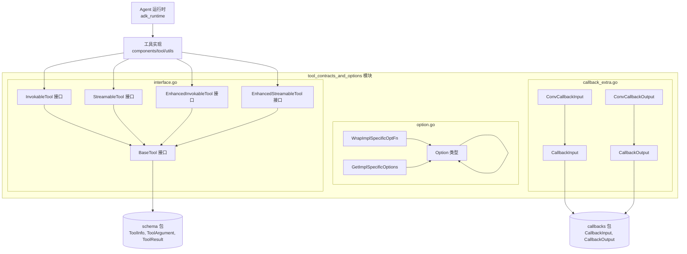

# Tool Contracts and Options 模块

## 模块概述

**tool_contracts_and_options** 是 Eino 框架中的核心模块，它定义了 AI Agent 系统中"工具"（Tool）的抽象契约。这个模块解决的问题是：**如何在保持框架核心接口稳定的同时，允许开发者自由实现各种各样的工具**。

想象一下：一个 AI Agent 需要调用外部系统来完成实际工作——可能是查询数据库、调用 REST API、执行计算、或者与文件系统交互。如果没有统一的抽象，每种工具的实现都会是不同的接口，Agent 运行时就需要针对每种工具编写专门的调用逻辑。`tool_contracts_and_options` 提供了一套统一的"接口规范"（contracts），让任何遵循这些规范的工具都能被 Agent 无缝调用。

这个模块的核心价值在于**解耦**：它将"工具是什么"（接口定义）与"工具怎么实现"（具体功能）完全分开。框架只需要理解接口，不需要关心实现细节。

## 架构概览



### 组件职责

| 组件 | 文件 | 职责描述 |
|------|------|----------|
| **BaseTool** | interface.go | 最基础的工具接口，只提供工具元信息（ToolInfo），用于让 ChatModel 理解工具的用途 |
| **InvokableTool** | interface.go | 同步可调用的工具接口，在 BaseTool 基础上增加 `InvokableRun` 方法，返回字符串结果 |
| **StreamableTool** | interface.go | 流式工具接口，在 BaseTool 基础上增加 `StreamableRun` 方法，返回流式读取器 |
| **EnhancedInvokableTool** | interface.go | 增强型同步工具，返回结构化的多模态输出（`*schema.ToolResult`），支持文本、图像、音频、视频、文件 |
| **EnhancedStreamableTool** | interface.go | 增强型流式工具，返回结构化的多模态流式输出 |
| **Option** | option.go | 类型擦除的选项封装器，让工具实现可以接受自定义选项而不暴露具体类型 |
| **CallbackInput/Output** | callback_extra.go | 工具执行回调的输入输出结构，适配通用回调系统 |

## 核心设计决策

### 1. 为什么要设计多层接口，而不是一个统一的 Tool 接口？

这是一个经典的 API 设计问题。**答案在于正交分解**：执行方式（同步 vs 流式）和输出格式（纯文本 vs 多模态）是两个独立的维度。

- `InvokableTool` = 同步 + 纯文本
- `StreamableTool` = 流式 + 纯文本  
- `EnhancedInvokableTool` = 同步 + 多模态
- `EnhancedStreamableTool` = 流式 + 多模态

如果只提供一个 `Tool` 接口，强迫所有工具都实现所有方法，那么一个简单的同步文本工具也要实现 `StreamableRun`（返回 nil 或空流），这增加了不必要的负担。更重要的是，**强制流式返回会排除那些无法流式输出的工具**（比如某些需要完整结果才能返回的 API）。

这种设计让每个工具只需要实现它真正需要的接口。

### 2. 为什么要用 Option 类型而不是直接传递具体选项类型？

`Option` 是 Go 中一种常见的**函数式选项模式**（Functional Options Pattern）的变体。使用 `Option` 而不是直接传递具体选项结构体，有几个关键原因：

**第一，类型安全的类型擦除**。Go 没有泛型接口（直到 Go 1.18+才有有限的泛型），直接传递 `interface{}` 会丢失类型信息。而 `Option` 通过泛型函数 `WrapImplSpecificOptFn[T]` 包装，在运行时保持类型安全，编译时也能获得一定的类型检查。

**第二，接口与实现的完全解耦**。工具接口定义在 `components/tool` 包中，但具体工具实现可能在不同的包（如 `components/tool/utils`）。如果让接口直接依赖具体选项类型，会造成循环依赖或强耦合。使用 `Option` 这种"隧道"类型，接口只关心"有选项要传递"，不关心选项是什么。

**第三，向后兼容**。框架可以给工具接口增加新的选项，而不影响已有实现——只要工具实现不关心那些选项即可。

### 3. CallbackInput/Output 的设计意图

这个模块并不定义新的回调机制，而是**适配**已有的通用回调系统（`callbacks` 包）。工具执行时需要将自己的输入输出转换为通用回调格式，这样才能与框架的监控、追踪、日志等系统集成。

注意这里的转换函数 `ConvCallbackInput` 和 `ConvCallbackOutput` 使用了类型 switch 来处理多种输入形式，比如：
- `CallbackInput` 本身
- `string`（直接传递 JSON 字符串）
- `*schema.ToolArgument`（结构化的工具参数）

这种多态设计让不同来源的工具调用（可能是从模型解析而来，可能是从代码直接调用）都能统一进入回调流程。

## 数据流向

### 场景一：Agent 调用工具

```
ChatModel (生成 ToolCall)
    │
    ▼
agent_runtime.ToolsNode
    │
    ├── 加载工具列表 ──▶ BaseTool.Info() ──▶ schema.ToolInfo (用于模型意图识别)
    │
    └── 执行工具调用 ──▶ InvokableTool.InvokableRun() / StreamableTool.StreamableRun()
                            │
                            ▼
                       工具实现 (如 components/tool/utils 中的工具)
                            │
                            ▼
                       返回结果 (string / StreamReader[string] / *schema.ToolResult)
                            │
                            ▼
                       转换并触发回调 (CallbackOutput)
```

### 场景二：工具选项传递

```
开发者定义自定义选项
    │
    ▼
tool.WithXxx(...) ──▶ tool.Option (通过 WrapImplSpecificOptFn 包装)
    │
    ▼
InvokableTool.InvokableRun(ctx, args, ...Option)
    │
    ▼
工具实现内部：GetImplSpecificOptions[MyOptions](defaultOpts, opts...)
    │
    ▼
获得自定义选项值，执行逻辑
```

## 与其他模块的关系

### 上游依赖

- **schema 包**：提供 `ToolInfo`、`ToolArgument`、`ToolResult`、`StreamReader` 等核心数据类型
- **callbacks 包**：提供通用的回调机制接口

### 下游使用者

- **agent_runtime（特别是 ToolsNode）**：执行工具调用的运行时
- **tool_function_adapters**：工具适配器，将函数转换为工具接口
- **compose_graph_engine（ToolNode）**：图执行引擎中的工具节点

### 子模块说明

| 子模块 | 描述 |
|--------|------|
| [callback_extra](components-tool-callback-extra.md) | 工具回调输入输出的具体定义和类型转换 |
| [interface](components-tool-interface.md) | 工具接口的核心契约定义 |
| [option](components-tool-option.md) | 统一的选项封装机制详解 |

## 新贡献者需要注意的要点

1. **接口与实现的分离**：这个模块只定义**契约**（接口），不实现具体工具。实现都在 `components/tool/utils` 中。

2. **Enhanced vs 非 Enhanced 的选择**：如果你的工具只需要返回文本字符串，用 `InvokableTool` 或 `StreamableTool`；如果需要返回图片、文件等多模态内容，必须用 `EnhancedInvokableTool` 或 `EnhancedStreamableTool`。

3. **Option 的类型参数**：使用 `GetImplSpecificOptions[T]` 时，`T` 必须是你的工具自定义的选项结构体类型。如果类型不匹配，选项不会被应用（不会报错，而是静默跳过）。

4. **Callback 转换的边界情况**：`ConvCallbackInput` 和 `ConvCallbackOutput` 对于无法识别的类型会返回 `nil`，调用方需要处理这种边界情况。

5. **StreamReader 必须被正确关闭**：在使用 `StreamableTool` 时，返回的 `*schema.StreamReader` 必须被调用方关闭，否则可能导致资源泄漏。