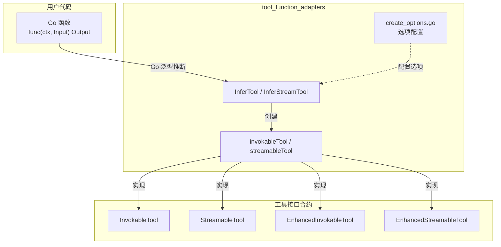
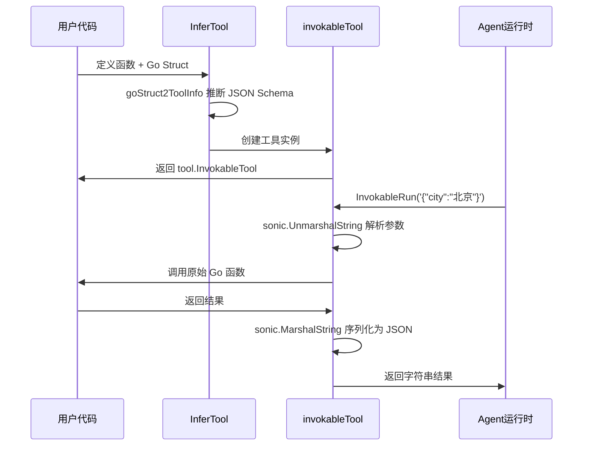

# tool_function_adapters 模块

## 模块概述

`tool_function_adapters` 模块是 Eino 框架中的**适配器层**，它的核心使命是：**将普通的 Go 函数自动转换为 AI Agent 运行时所需的标准工具接口**。

### 解决的问题

在构建 AI Agent 时，我们需要让大语言模型（LLM）能够调用外部工具来扩展其能力。然而，存在一个关键 mismatch：

- **LLM/Agent 侧**：期望工具是结构化的、有元数据的，输入输出都是 JSON 字符串
- **开发者侧**：更愿意写普通的 Go 函数，有强类型、有 IDE 智能提示

举一个具体的例子：如果你的 Agent 需要调用一个"获取天气"的工具，理想情况下你希望这样写：

```go
func GetWeather(ctx context.Context, city string) (string, error) {
    // 调用天气 API
    return "晴天，25°C", nil
}
```

但 Agent 运行时期望的是：

1. 工具的元数据（名称、描述、参数 JSON Schema）
2. 一个 `InvokableRun(arguments string) (string, error)` 方法

**这个模块就是这两者之间的桥梁**——它自动完成：
- 从 Go 函数签名推断参数类型
- 将 Go struct tags 转换为 JSON Schema
- 自动处理 JSON 的序列化/反序列化

---

## 架构概览



### 核心组件

| 文件 | 职责 |
|------|------|
| `create_options.go` | 定义工具选项：自定义反序列化、序列化、Schema 修改器 |
| `invokable_func.go` | 将 Go 函数转换为 `InvokableTool` 和 `EnhancedInvokableTool` |
| `streamable_func.go` | 将 Go 函数转换为 `StreamableTool` 和 `EnhancedStreamableTool` |

---

## 设计决策与权衡

### 1. 为什么使用 Go 泛型而非运行时反射？

**选择**：使用 Go 1.18+ 的泛型来捕获类型信息

```go
func InferTool[T, D any](name, desc string, fn InvokeFunc[T, D]) (tool.InvokableTool, error)
```

**权衡分析**：
- **优点**：编译期类型安全、更好的性能、无需运行时常规反射
- **限制**：必须是具体类型，不能使用 `interface{}`

> 这符合 Go 社区"尽可能在编译期解决问题"的哲学。

### 2. 为什么同时提供"Basic"和"Optionable"两种变体？

**观察**：用户的使用场景差异很大：
- 简单场景：只想把函数包装成工具，不需要额外配置
- 高级场景：需要自定义序列化逻辑、注入依赖

**选择**：提供两组 API
- `InferTool` - 基础版，不接受选项
- `InferOptionableTool` - 高级版，支持 `WithUnmarshalArguments`、`WithMarshalOutput` 等选项

**权衡**：
- 增加 API 复杂度，但避免给简单用户带来不必要的认知负担

### 3. Enhanced vs Basic 工具的区别

| 特性 | Basic 工具 | Enhanced 工具 |
|------|-----------|--------------|
| 输出类型 | `string` (JSON) | `*schema.ToolResult` (多模态) |
| 适用场景 | 纯文本返回 | 返回图片/音频/文件等 |
| 接口 | `InvokableTool` | `EnhancedInvokableTool` |

**设计意图**：`ToolResult` 可以包含多种内容类型（text、image、audio、video、file），这是为了支持更丰富的工具输出场景。

### 4. Schema 推断 vs 手动定义

**自动推断**：从 Go struct 的 `json` 和 `jsonschema` tag 自动生成 JSON Schema

```go
type User struct {
    Name string `json:"name" jsonschema:"required,description=用户名称"`
    Age  int    `json:"age" jsonschema:"description=用户年龄"`
}
```

**手动覆盖**：通过 `WithSchemaModifier` 选项深度定制

**权衡**：
- 自动推断覆盖 80% 场景，但无法处理复杂验证规则
- 提供 `SchemaModifierFn` 扩展点，但增加了复杂度

---

## 数据流分析

### 场景：创建并调用一个工具

```go
// 1. 定义输入类型
type GetWeatherInput struct {
    City string `json:"city" jsonschema:"description=城市名称"`
}

// 2. 创建工具
tool, err := utils.InferTool(
    "get_weather",
    "获取指定城市的天气",
    func(ctx context.Context, input GetWeatherInput) (string, error) {
        // 实际业务逻辑
        return "晴天", nil
    },
)

// 3. Agent 调用工具
result, err := tool.InvokableRun(ctx, `{"city": "北京"}`)
```

**数据流追踪**：



---

## 子模块文档

本模块包含三个紧密协作的子模块：

1. **[tool-options 配置选项](components-tool-function-adapters-tool-options.md)** - 工具创建的可选配置（自定义序列化、Schema 修改）
2. **[invokable-func 可调用工具](components-tool-function-adapters-invokable-func.md)** - 将 Go 函数转换为同步调用工具
3. **[streamable-func 流式工具](components-tool-function-adapters-streamable-func.md)** - 将 Go 函数转换为流式工具

---

## 与其他模块的关系

### 上游依赖

| 模块 | 关系 |
|------|------|
| `components/tool` | 定义工具接口契约 (`InvokableTool`, `StreamableTool` 等) |
| `schema` | 定义 `ToolInfo`, `ToolResult`, `ParamsOneOf` 等数据结构 |
| `internal/generic` | 提供 `NewInstance[T]()` 用于创建类型的零值实例 |
| `github.com/eino-contrib/jsonschema` | 用于从 Go struct 推断 JSON Schema |

### 下游使用

- **[agent_tool_adapter](adk-runtime-agent-tool-adapter.md)** - Agent 运行时使用这些适配器将用户函数转换为标准工具
- **[compose_graph_engine](./compose-graph-engine.md)** - 工作流图中的 ToolNode 使用这些适配器
- **ChatModel 绑定工具** - 当模型需要结构化输出时，使用 `GoStruct2ToolInfo` 推断参数 Schema

---

## 常见陷阱与注意事项

### 1. 泛型类型推断失败

**问题**：如果你写的函数签名与泛型参数不匹配，编译会失败。

```go
// 错误：input 应该是 GetWeatherInput，不是 *GetWeatherInput
func Bad(ctx context.Context, input *GetWeatherInput) (string, error)

// 正确
func Good(ctx context.Context, input GetWeatherInput) (string, error)
```

### 2. Struct Tag 格式错误

**问题**：`jsonschema` tag 的格式必须正确，否则推断会失败。

```go
// 正确：多个属性用逗号分隔
Name string `json:"name" jsonschema:"required,description=名称"`

// 错误：会按字面量解析
Name string `json:"name" jsonschema:"required description=名称"`
```

### 3. Enhanced 工具的类型断言

**问题**：`EnhancedInvokableTool` 返回 `*schema.ToolResult`，不是字符串。

```go
// Basic 工具
resp, _ := tool.InvokableRun(ctx, args)  // resp 是 string

// Enhanced 工具
resp, _ := enhancedTool.InvokableRun(ctx, toolArg)  // resp 是 *schema.ToolResult
```

### 4. Stream 工具的关闭逻辑

**问题**：流式工具返回的 `*schema.StreamReader` 需要正确关闭以释放资源。

```go
stream, _ := streamTool.StreamableRun(ctx, args)
defer stream.Close()

for {
    chunk, err := stream.Recv()
    if err == io.EOF { break }
    // 处理 chunk
}
```

---

## 扩展阅读

- [工具接口定义](../components-tool-interface.md)
- [Schema ToolInfo 定义](../schema-tool.md)
- [Agent 工具适配器](../adk-runtime-agent-tool-adapter.md)