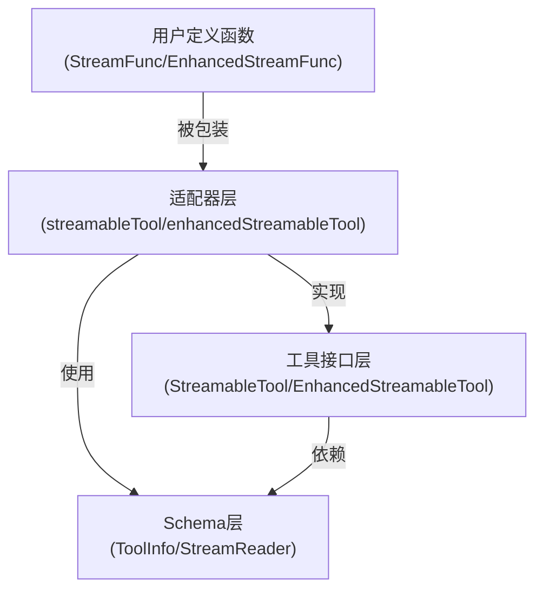

# streamable-func 模块技术深度解析

## 1. 概述

在构建 AI 代理系统时，工具调用（tool calling）是连接大语言模型与外部能力的关键桥梁。然而，传统的工具调用通常采用"请求-响应"的同步模式，对于耗时较长的操作（如文件处理、复杂计算、网络请求）会导致用户体验不佳。`streamable-func` 模块正是为了解决这个问题而设计的——它提供了一种类型安全的方式，将普通 Go 函数包装成支持流式输出的工具，让 AI 代理能够逐步处理和展示结果，而不必等待整个操作完成。

### 解决的核心问题
1. **类型安全与反射开销的平衡**：既想利用 Go 的强类型系统，又要避免在运行时使用大量反射
2. **同步函数到流式工具的适配**：如何将普通函数转换为符合 `StreamableTool` 接口的实现
3. **JSON 序列化的灵活性**：允许自定义输入反序列化和输出序列化逻辑
4. **工具元数据的自动推断**：从函数参数类型自动生成工具描述信息

---

## 2. 架构与核心抽象

### 核心组件图



### 心智模型

可以把 `streamable-func` 想象成一个**"类型安全的电源适配器"**：
- 一端是你熟悉的普通 Go 函数（带类型参数的输入输出）
- 另一端是 AI 代理系统需要的标准化工具接口
- 适配器负责处理类型转换、JSON 序列化、流式数据适配等繁琐工作
- 用户只需要关注业务逻辑，而不必操心与工具系统的集成细节

### 核心类型层次

模块围绕两个主要的工具实现展开：

1. **`streamableTool[T, D]`**：基础流式工具，输出字符串流
2. **`enhancedStreamableTool[T]`**：增强流式工具，输出 `ToolResult` 流

两者都遵循相同的设计模式，只是在输出类型和处理逻辑上有所区别。

---

## 3. 核心组件深度解析

### 3.1 streamableTool - 基础流式工具实现

```go
type streamableTool[T, D any] struct {
    info *schema.ToolInfo
    um   UnmarshalArguments
    m    MarshalOutput
    Fn   OptionableStreamFunc[T, D]
}
```

#### 设计意图
这是模块的核心类型，它通过**泛型**实现了类型安全的工具包装。`T` 是输入参数类型，`D` 是输出流的元素类型。

#### 关键字段解析
- `info`: 工具的元数据，包含名称、描述、参数 schema 等
- `um`: 自定义的参数反序列化函数（可选）
- `m`: 自定义的输出序列化函数（可选）
- `Fn`: 实际执行的业务函数

#### StreamableRun 方法 - 数据流的心脏

```go
func (s *streamableTool[T, D]) StreamableRun(
    ctx context.Context, 
    argumentsInJSON string, 
    opts ...tool.Option
) (*schema.StreamReader[string], error)
```

这个方法是整个组件的核心，让我们一步一步分析它的工作流程：

1. **参数反序列化阶段**
   - 首先尝试使用自定义的 `um` 函数（如果提供）
   - 否则使用默认的 JSON 反序列化（通过 sonic 库）
   - 进行类型断言，确保反序列化后的对象符合类型 `T`

2. **业务函数调用阶段**
   - 将反序列化后的参数传递给 `s.Fn`
   - 获得类型为 `*schema.StreamReader[D]` 的输出流

3. **输出转换阶段**
   - 使用 `schema.StreamReaderWithConvert` 将 `D` 类型的流转换为 `string` 类型的流
   - 转换逻辑优先使用自定义的 `m` 函数，否则使用默认的 JSON 序列化

**设计亮点**：通过 `StreamReaderWithConvert` 实现了流式数据的懒转换——只有当消费者从流中读取数据时，转换逻辑才会执行，这避免了不必要的内存开销。

### 3.2 enhancedStreamableTool - 增强流式工具实现

```go
type enhancedStreamableTool[T any] struct {
    info *schema.ToolInfo
    um   UnmarshalArguments
    Fn   OptionableEnhancedStreamFunc[T]
}
```

#### 与 streamableTool 的区别
- 输出直接是 `*schema.StreamReader[*schema.ToolResult]`，不需要额外的序列化步骤
- 输入参数是 `*schema.ToolArgument` 而不是原始 JSON 字符串
- 没有自定义的 `MarshalOutput` 字段，因为 `ToolResult` 已经包含了完整的结果信息

#### 适用场景
当你需要对工具输出有更细粒度的控制时（例如返回多个结果片段、附带元数据、处理错误状态等），`enhancedStreamableTool` 是更好的选择。

### 3.3 构造函数体系

模块提供了多层次的构造函数，满足不同的使用场景：

| 构造函数 | 用途 | 是否支持选项 |
|---------|------|------------|
| `InferStreamTool` | 从函数推断工具信息 | 否 |
| `InferOptionableStreamTool` | 从函数推断工具信息 | 是 |
| `NewStreamTool` | 使用自定义 ToolInfo | 否 |
| `newOptionableStreamTool` | 使用自定义 ToolInfo | 是 |

同样的模式也适用于增强版工具。

**设计洞察**：这种"4合一"的构造函数设计看似冗余，实则是为了在便利性和灵活性之间取得平衡。`Infer*` 函数适合快速上手，而 `New*` 函数则提供了完全的控制权。

---

## 4. 数据流分析

让我们通过一个典型的使用场景来追踪数据的完整流动路径：

### 示例场景：创建一个流式文件读取工具

```go
// 1. 用户定义业务函数
func readFileStream(ctx context.Context, path string) (*schema.StreamReader[string], error) {
    // 实现流式文件读取逻辑
}

// 2. 创建工具
tool, _ := utils.InferStreamTool("read_file", "读取文件内容", readFileStream)

// 3. 代理调用工具
stream, _ := tool.StreamableRun(ctx, `{"path": "/tmp/data.txt"}`)
```

### 详细数据流

```
┌─────────────────────────────────────────────────────────────────┐
│ 1. 代理层调用 StreamableRun，传入 JSON 字符串参数                 │
└──────────────────────────────┬──────────────────────────────────┘
                               │
                               ▼
┌─────────────────────────────────────────────────────────────────┐
│ 2. streamableTool.StreamableRun 接收参数                          │
│    ├─> 使用默认 JSON 反序列化器解析参数到类型 T                   │
│    └─> 验证类型是否匹配                                           │
└──────────────────────────────┬──────────────────────────────────┘
                               │
                               ▼
┌─────────────────────────────────────────────────────────────────┐
│ 3. 调用用户定义的 Fn 函数，传入类型 T 的参数                       │
│    └─> 返回 *schema.StreamReader[D]                              │
└──────────────────────────────┬──────────────────────────────────┘
                               │
                               ▼
┌─────────────────────────────────────────────────────────────────┐
│ 4. 使用 StreamReaderWithConvert 包装流                            │
│    └─> 每个 D 类型元素通过 MarshalOutput 转换为 string            │
└──────────────────────────────┬──────────────────────────────────┘
                               │
                               ▼
┌─────────────────────────────────────────────────────────────────┐
│ 5. 返回 *schema.StreamReader[string] 给代理层                     │
│    └─> 代理层可以逐步读取流中的数据                                │
└─────────────────────────────────────────────────────────────────┘
```

---

## 5. 依赖关系分析

### 上游依赖
- **[tool 接口](components-tool-interface.md)**：定义了 `StreamableTool` 和 `EnhancedStreamableTool` 接口
- **[schema 包](schema.md)**：提供 `ToolInfo`、`StreamReader`、`ToolResult` 等核心类型
- **[generic 包](internal-generic.md)**：用于创建类型实例（`generic.NewInstance[T]()`）
- **sonic**：高性能 JSON 序列化库

### 下游调用者
- **[tool_function_adapters](components-tool-function-adapters.md)**：可能是此模块的直接消费者
- **[chatmodel_agent_core_runtime](adk_runtime-chatmodel_react_and_retry_runtime-chatmodel_agent_core_runtime.md)**：运行时可能会使用这些工具
- **[graph_execution_runtime](compose_graph_engine-graph_execution_runtime.md)**：图执行引擎可能包含工具节点

### 关键数据契约

模块与外部系统之间的关键契约：
1. **输入**：JSON 格式的字符串（对于 `streamableTool`）或 `ToolArgument`（对于 `enhancedStreamableTool`）
2. **输出**：`StreamReader[string]` 或 `StreamReader[*ToolResult]`
3. **元数据**：通过 `Info()` 方法返回的 `ToolInfo` 必须包含有效的名称、描述和参数 schema

---

## 6. 设计决策与权衡

### 6.1 泛型 vs 反射

**选择**：使用泛型实现类型安全

**原因**：
- 编译时类型检查，减少运行时错误
- 更好的性能，避免反射开销
- 更清晰的代码意图

**权衡**：
- API 略显复杂，需要理解泛型概念
- 在 Go 1.18+ 才可用（不过这已经是现代 Go 的标准）

### 6.2 自定义序列化 vs 默认序列化

**选择**：同时支持两者

**原因**：
- 默认 JSON 序列化满足 90% 的使用场景
- 自定义序列化提供了处理特殊情况的灵活性（如加密、压缩、格式转换等）

**实现方式**：通过选项模式注入自定义的 `UnmarshalArguments` 和 `MarshalOutput` 函数

### 6.3 流式转换的懒执行

**选择**：使用 `StreamReaderWithConvert` 实现懒转换

**原因**：
- 内存效率：只在需要时转换数据
- 可以提前中断流，避免处理不必要的数据
- 符合流式处理的哲学

**权衡**：
- 转换错误会延迟到读取时才暴露
- 需要确保转换函数是可重入的

### 6.4 构造函数的多重性

**选择**：提供 `Infer*` 和 `New*` 两组构造函数

**原因**：
- 降低入门门槛：`Infer*` 函数自动处理工具信息推断
- 保留完全控制权：`New*` 函数允许自定义 `ToolInfo`

**洞察**：这是"约定优于配置"和"显式配置"之间的平衡

---

## 7. 使用指南与最佳实践

### 7.1 基本用法示例

```go
// 1. 定义你的输入类型
type SearchInput struct {
    Query  string `json:"query" jsonschema:"description=搜索关键词"`
    Limit  int    `json:"limit" jsonschema:"description=返回结果数量,default=10"`
}

// 2. 定义流式处理函数
func searchStream(ctx context.Context, input SearchInput) (*schema.StreamReader[string], error) {
    // 实现你的流式搜索逻辑
    // 返回一个字符串流，每个元素是一个搜索结果片段
}

// 3. 创建工具
searchTool, err := utils.InferStreamTool(
    "web_search", 
    "在互联网上搜索信息", 
    searchStream,
)

// 4. 使用工具
stream, err := searchTool.StreamableRun(ctx, `{"query": "Go 泛型教程", "limit": 5}`)
```

### 7.2 使用自定义序列化

```go
// 自定义反序列化
customUnmarshal := func(ctx context.Context, args string) (any, error) {
    // 你的自定义反序列化逻辑
}

// 自定义序列化
customMarshal := func(ctx context.Context, output MyType) (string, error) {
    // 你的自定义序列化逻辑
}

// 创建工具时传入选项
tool, err := utils.InferStreamTool(
    "my_tool",
    "工具描述",
    myFunc,
    utils.WithUnmarshalArguments(customUnmarshal),
    utils.WithMarshalOutput(customMarshal),
)
```

### 7.3 最佳实践

1. **始终为结构体字段添加 `jsonschema` 标签**：这有助于生成更准确的工具描述
2. **考虑上下文取消**：在你的流式函数中正确处理 `ctx.Done()` 信号
3. **错误处理**：尽早验证输入参数，在流开始前返回明显的错误
4. **资源清理**：如果你的流打开了文件或网络连接，确保在流关闭时清理资源
5. **类型安全**：利用 Go 的类型系统，避免使用 `interface{}` 作为输入或输出类型

---

## 8. 注意事项与常见陷阱

### 8.1 类型断言错误

```go
// 错误示例：如果自定义 UnmarshalArguments 返回的类型不是 T，会导致运行时错误
customUnmarshal := func(ctx context.Context, args string) (any, error) {
    return "not a SearchInput", nil // 这会导致类型断言失败
}
```

**解决方法**：确保自定义反序列化函数返回的类型与工具的输入类型完全匹配。

### 8.2 JSON 标签不匹配

如果你的结构体字段没有正确的 JSON 标签，或者标签与实际传入的 JSON 不匹配，反序列化会失败。

**解决方法**：始终使用 `json` 标签明确指定字段名称，并确保它们与 `ToolInfo` 中的 schema 一致。

### 8.3 流处理中的错误延迟

由于使用了懒转换，如果序列化函数有错误，它只会在从流中读取数据时才会暴露，而不是在 `StreamableRun` 调用时。

**解决方法**：
- 在流式函数中尽早验证数据
- 实现健壮的错误处理逻辑
- 考虑在流的开头发送一个"健康检查"消息

### 8.4 工具名称的限制

工具名称会通过 `snakeToCamel` 转换用于 `GetType()` 方法的返回值，确保你的工具名称遵循合理的命名约定。

---

## 9. 总结

`streamable-func` 模块是连接 Go 函数与 AI 代理工具系统的优雅桥梁。它通过泛型实现了类型安全，通过选项模式提供了灵活性，通过流式处理提升了用户体验。

模块的设计体现了几个重要的软件工程原则：
- **关注点分离**：业务逻辑与集成逻辑分离
- **开闭原则**：对扩展开放（自定义序列化），对修改关闭（核心流程稳定）
- **方便性与灵活性平衡**：提供简单的 API 满足常见需求，同时保留高级定制能力

对于新加入团队的开发者，理解这个模块的关键是掌握其**泛型设计**和**流式处理模型**——一旦你理解了这两个核心概念，就能充分利用这个模块构建强大的 AI 工具生态系统。
