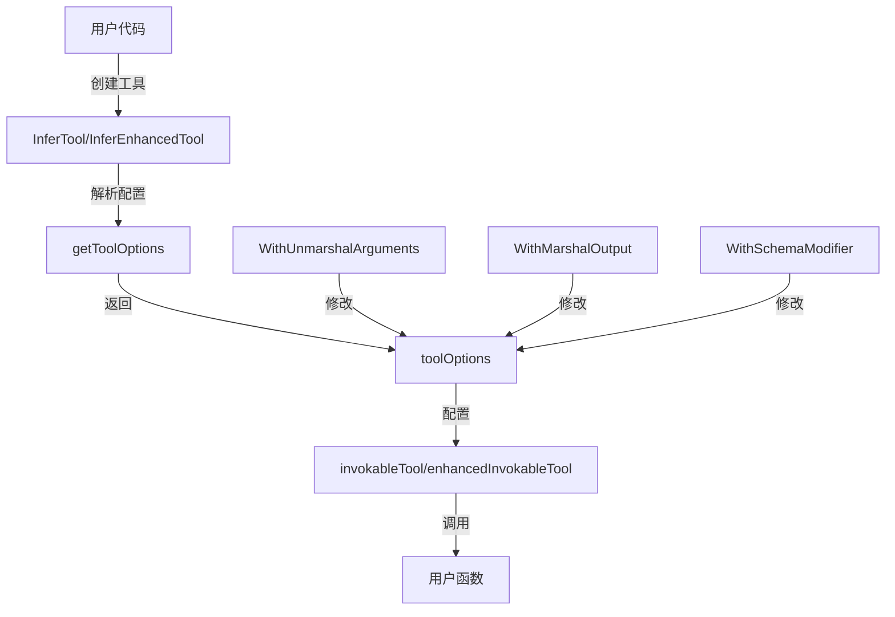

# `tool-options` 模块技术深度解析

## 1. 概述

`tool-options` 模块是 `components/tool/utils` 包下的核心组件，它负责为工具函数适配器提供灵活的配置机制。该模块解决了一个关键问题：如何让开发者在将普通 Go 函数转换为 AI 可用的工具时，能够自定义参数解析、输出序列化以及 Schema 生成的行为，而不需要修改适配器的核心代码。

### 核心价值

想象一下你正在构建一个 AI 代理框架，需要让 AI 能够调用各种 Go 函数。最简单的做法是强制所有函数都使用固定的 JSON 序列化方式和 Schema 生成规则，但这会严重限制开发者的灵活性。`tool-options` 模块就像一个"配置开关面板"，让开发者可以在保持适配器核心逻辑不变的情况下，根据自己的需求定制这些关键行为。

## 2. 架构设计

### 组件关系图



### 核心数据结构

`toolOptions` 是整个模块的核心，它封装了三个关键的自定义点：

```go
type toolOptions struct {
    um         UnmarshalArguments  // 自定义参数反序列化
    m          MarshalOutput        // 自定义输出序列化
    scModifier SchemaModifierFn     // 自定义Schema修改
}
```

这种设计采用了**函数式选项模式**（Functional Options Pattern），这是 Go 语言中一种优雅的配置方式，它允许：
1. 可选参数的灵活组合
2. 向后兼容的 API 演进
3. 清晰的默认行为

### 数据流向

1. **配置阶段**：用户通过 `WithXxx` 函数创建选项
2. **收集阶段**：`getToolOptions` 函数收集并应用这些选项
3. **使用阶段**：工具适配器在运行时使用这些配置来处理参数和输出

## 3. 核心组件详解

### 3.1 选项定义

#### `Option` 类型
```go
type Option func(o *toolOptions)
```

这是一个函数类型，它接收一个 `*toolOptions` 指针并对其进行修改。这种设计是函数式选项模式的核心，它允许我们将配置逻辑封装在一个个小的函数中。

#### 核心选项函数

##### `WithUnmarshalArguments`
```go
func WithUnmarshalArguments(um UnmarshalArguments) Option
```

**设计意图**：允许用户自定义如何将 AI 生成的 JSON 参数字符串转换为 Go 函数的输入类型。

**为什么需要它**：
- 默认情况下使用 sonic JSON 库进行反序列化
- 但有时你可能需要处理特殊的格式（如 YAML、XML）
- 或者需要在反序列化前进行预处理（如解密、验证）
- 或者需要处理非标准的 JSON 格式

##### `WithMarshalOutput`
```go
func WithMarshalOutput(m MarshalOutput) Option
```

**设计意图**：允许用户自定义如何将 Go 函数的输出转换为 AI 能理解的字符串格式。

**为什么需要它**：
- 默认情况下使用 sonic JSON 库进行序列化
- 但有时你可能需要特殊的输出格式
- 或者需要在序列化后进行后处理（如过滤敏感信息、截断长输出）
- 或者需要添加额外的元数据

##### `WithSchemaModifier`
```go
func WithSchemaModifier(modifier SchemaModifierFn) Option
```

**设计意图**：允许用户自定义如何从 Go 结构体生成 JSON Schema，特别是处理自定义的 struct tag。

**为什么需要它**：
- 默认情况下使用标准的 JSON tag
- 但你可能有自己的自定义 tag（如 `description:"..."`、`minimum:"0"`）
- 或者需要修改自动生成的 Schema（如添加示例、设置默认值）
- 或者需要处理特殊的类型映射

**SchemaModifierFn 签名详解**：
```go
type SchemaModifierFn func(
    jsonTagName string,        // JSON tag 中的名称，根结构体固定为 "_root"
    t reflect.Type,            // 当前字段的类型
    tag reflect.StructTag,     // 当前字段的 struct tag
    schema *jsonschema.Schema  // 要修改的 JSON Schema 对象
)
```

**重要注意事项**：
- 对于数组字段，字段本身和数组元素都会触发此函数
- 数组元素会使用与数组字段相同的 struct tag
- 最后访问的 `jsonTagName` 固定为 `_root`，表示整个结构体

### 3.2 配置收集器

#### `getToolOptions` 函数
```go
func getToolOptions(opt ...Option) *toolOptions
```

**设计意图**：收集并应用所有选项，返回一个配置好的 `toolOptions` 对象。

**工作原理**：
1. 创建一个带有默认值的 `toolOptions` 对象（`um` 和 `m` 为 `nil`）
2. 依次调用每个选项函数，修改这个对象
3. 返回最终配置好的对象

**默认行为**：
- 当 `um` 为 `nil` 时，使用默认的 sonic JSON 反序列化
- 当 `m` 为 `nil` 时，使用默认的 sonic JSON 序列化
- 当 `scModifier` 为 `nil` 时，使用默认的 Schema 生成逻辑

## 4. 与其他模块的关系

### 依赖关系

`tool-options` 模块被以下模块使用：
- `components/tool/utils/invokable_func.go` - 核心工具适配器
- `components/tool/utils/streamable_func.go` - 流式工具适配器

它依赖的模块：
- `github.com/eino-contrib/jsonschema` - JSON Schema 生成库
- 标准库 `reflect` - 反射功能

### 数据契约

#### 输入契约
- 选项函数必须是纯函数，只修改传入的 `toolOptions` 对象
- `UnmarshalArguments` 函数必须返回一个与工具函数输入类型兼容的值
- `MarshalOutput` 函数必须返回一个有效的字符串

#### 输出契约
- `getToolOptions` 永远不会返回 `nil`
- 配置后的 `toolOptions` 对象是不可变的（在使用过程中不会被修改）

## 5. 设计决策与权衡

### 5.1 为什么选择函数式选项模式？

**选择**：使用函数式选项模式而不是配置结构体。

**原因**：
1. **向后兼容性**：添加新选项不需要修改现有代码
2. **灵活性**：选项可以以任意顺序组合，可选参数变得真正可选
3. **可读性**：`WithXxx` 的命名方式让代码更清晰
4. **零值安全**：默认行为明确，不需要检查零值

**权衡**：
- 优点：灵活、可扩展、可读性好
- 缺点：对于简单的配置可能显得过度设计，创建选项函数需要一些样板代码

### 5.2 为什么使用 `nil` 表示默认行为？

**选择**：在 `toolOptions` 中使用 `nil` 表示使用默认实现。

**原因**：
1. **懒加载**：只有在需要时才创建默认实现
2. **零值安全**：Go 的零值机制自然支持这种模式
3. **清晰区分**：明确区分"用户自定义"和"使用默认"

**权衡**：
- 优点：简单、高效、符合 Go 语言习惯
- 缺点：需要在使用点检查 `nil`，增加了一些条件判断

### 5.3 为什么将 Schema 修改作为一个选项？

**选择**：提供 `WithSchemaModifier` 而不是要求用户直接提供完整的 Schema。

**原因**：
1. **渐进式定制**：用户可以只修改他们关心的部分，而不需要重新定义整个 Schema
2. **自动生成优先**：利用自动生成的 Schema 作为基础，减少重复工作
3. **灵活性**：可以处理复杂的自定义 tag 和类型映射

**权衡**：
- 优点：灵活、减少重复、渐进式定制
- 缺点：`SchemaModifierFn` 的参数和行为相对复杂，需要仔细理解

## 6. 使用指南与最佳实践

### 6.1 基本使用模式

```go
// 创建工具时使用选项
tool, err := utils.InferTool(
    "my_tool",
    "A description of my tool",
    myFunction,
    utils.WithUnmarshalArguments(customUnmarshal),
    utils.WithMarshalOutput(customMarshal),
    utils.WithSchemaModifier(customSchemaModifier),
)
```

### 6.2 最佳实践

1. **保持选项函数简洁**：选项函数应该只做一件事，并且做得好
2. **提供合理的默认值**：不要让选项成为必需的，默认行为应该适用于大多数情况
3. **错误处理要清晰**：在自定义的 `UnmarshalArguments` 和 `MarshalOutput` 中，提供有意义的错误信息
4. **注意性能**：`SchemaModifierFn` 会在 Schema 生成时被多次调用，避免在其中做昂贵的操作
5. **文档化自定义行为**：如果使用了自定义选项，确保在代码中注释清楚为什么需要这样做

## 7. 注意事项与常见陷阱

### 7.1 类型安全

**陷阱**：在 `UnmarshalArguments` 中返回错误的类型，这会在运行时导致类型断言失败。

**解决方法**：确保返回的类型与工具函数的输入类型完全匹配，或者使用类型断言并在失败时返回清晰的错误。

### 7.2 SchemaModifier 的调用次数

**陷阱**：假设 `SchemaModifierFn` 只会被调用一次。实际上，它会被调用多次：对于结构体的每个字段，对于数组字段和数组元素，最后一次用于根结构体。

**解决方法**：确保你的 `SchemaModifierFn` 是幂等的，并且能够处理所有这些情况。

### 7.3 数组元素的 tag

**陷阱**：不知道数组元素会使用与数组字段相同的 tag。

**解决方法**：如果需要区分数组字段和数组元素，可以通过 `t.Kind()` 来判断当前处理的是什么类型。

## 8. 总结

`tool-options` 模块是一个小而强大的组件，它通过函数式选项模式为工具适配器提供了灵活的配置机制。它的设计体现了几个重要的软件工程原则：

1. **开闭原则**：对扩展开放，对修改关闭 - 通过选项而不是修改核心代码来扩展功能
2. **关注点分离**：将配置逻辑与核心逻辑分离
3. **默认配置合理**：提供良好的默认行为，让简单的事情变得简单
4. **渐进式复杂度**：让复杂的事情变得可能

虽然这个模块相对简单，但它在整个工具适配器体系中扮演着关键的角色，为开发者提供了在保持简单性的同时处理复杂场景的能力。

## 9. 相关模块

- [tool-function-adapters-invokable-func](components-tool-utils-invokable-func.md) - 核心工具适配器实现
- [tool-contracts-and-options-interface](components-tool-interface.md) - 工具接口定义
