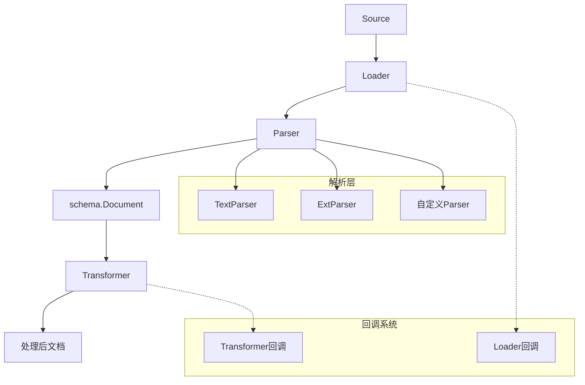

# 文档摄取与解析模块

## 概述

**文档摄取与解析模块** 是 EINO 框架中负责将各种格式的文档转换为统一处理结构的核心组件。它解决了 AI 应用开发中一个常见难题：**多源文档格式的归一化处理**。

想象一下，你正在构建一个智能文档助手：用户可以上传 PDF、Markdown、Word 文档，也可以直接粘贴文本，甚至提供网页 URL。这个模块就像是文档处理的"海关"——无论文档从哪里来、是什么格式，它都能将其转换为系统内部统一的 `schema.Document` 结构，让后续的检索、分析、生成等操作能以一致的方式处理所有内容。

## 架构概览



这个模块的设计遵循了**清晰的责任分离**原则：

1. **Source**：定义文档来源（URI）
2. **Loader**：负责从 Source 读取原始数据
3. **Parser**：将原始数据解析为 `schema.Document`
4. **Transformer**：对已解析的文档进行转换（分割、过滤等）
5. **回调系统**：提供可观测性和扩展点

数据流向通常是：`Source → Loader → Parser → schema.Document → Transformer → 处理后文档`。

## 核心概念

### 1. Source：文档来源

`Source` 是一个简单但关键的概念，它用 URI 标识文档的位置。可以是：
- 本地文件路径：`./data/report.pdf`
- 网络 URL：`https://example.com/doc.md`
- 自定义协议：`s3://bucket/document.txt`

这个设计遵循了**位置透明性**原则——后续组件不需要知道文档实际在哪里，只需要通过 URI 引用它。

### 2. Parser：文档解析器

Parser 是模块的核心，负责将原始字节流转换为结构化文档。接口定义非常简洁：

```go
type Parser interface {
    Parse(ctx context.Context, reader io.Reader, opts ...Option) ([]*schema.Document, error)
}
```

这种设计允许极大的灵活性：
- **TextParser**：简单的文本解析器，将输入流作为纯文本处理
- **ExtParser**：扩展解析器，根据文件扩展名选择合适的解析器
- 你可以实现自己的 Parser 来处理 PDF、Word、HTML 等格式

### 3. 选项模式：统一的扩展机制

模块大量使用了**选项模式**，这是一个值得注意的设计决策。每个组件（Loader、Transformer、Parser）都有自己的选项类型，但它们共享相同的模式：

```go
// 通用选项结构
type Option struct {
    apply func(opts *Options)  // 应用到通用选项
    implSpecificOptFn any       // 实现特定的选项函数
}
```

这种设计允许：
1. **统一的接口**：所有组件都使用 `...Option` 可变参数
2. **实现特定的扩展**：每个实现可以有自己的选项类型，不会影响接口
3. **向后兼容**：添加新选项不会破坏现有代码

## 关键设计决策

### 1. 分离 Loader 和 Parser 的职责

**设计选择**：将"读取数据"（Loader）和"解析数据"（Parser）分离为两个独立的概念。

**为什么这样设计**：
- **单一职责原则**：Loader 只关心"从哪里读"，Parser 只关心"怎么解析"
- **组合灵活性**：同一个 Loader 可以搭配不同的 Parser，反之亦然
- **测试友好**：可以独立测试 Loader（从各种来源读取）和 Parser（解析各种格式）

**替代方案考虑**：
- 合并 Loader 和 Parser：会导致每个组合都需要一个新实现（如 PDFS3Loader、MarkdownFileLoader 等），组合爆炸
- 使用单一接口：不够灵活，难以适应不同的数据源和格式

### 2. 基于文件扩展名的解析器选择

**设计选择**：`ExtParser` 根据文件扩展名选择解析器，而不是基于内容检测。

**为什么这样设计**：
- **性能**：不需要读取文件内容就能选择解析器
- **简单性**：扩展名映射是明确的、可预测的
- **可控性**：用户可以通过 URI 明确指定解析器

**隐含的契约**：
- URI 必须包含扩展名（通过 `parser.WithURI` 传入）
- 扩展名必须与 `filepath.Ext` 兼容（如 `.pdf`、`.md`）

**注意事项**：
- 如果需要基于内容的解析，可以实现自己的 Parser
- `ExtParser` 支持 fallback 解析器，处理未知扩展名的情况

### 3. 回调系统的设计

**设计选择**：为 Loader 和 Transformer 提供专门的回调结构，而不是使用通用的 map。

**为什么这样设计**：
- **类型安全**：编译时就能发现类型错误
- **自文档化**：结构字段名说明了回调的用途
- **可扩展**：可以添加新字段而不破坏现有代码

**转换函数**：
```go
func ConvLoaderCallbackInput(src callbacks.CallbackInput) *LoaderCallbackInput {
    switch t := src.(type) {
    case *LoaderCallbackInput:
        return t
    case Source:
        return &amp;LoaderCallbackInput{
            Source: t,
        }
    default:
        return nil
    }
}
```

这种设计允许回调系统既支持特定类型，也能回退到基本类型。

## 使用指南

### 基本工作流

1. **定义文档来源**
   ```go
   src := document.Source{URI: "./report.pdf"}
   ```

2. **加载文档**
   ```go
   docs, err := loader.Load(ctx, src, 
       document.WithParserOptions(parser.WithURI(src.URI)))
   ```

3. **转换文档**（可选）
   ```go
   processedDocs, err := transformer.Transform(ctx, docs)
   ```

### 实现自定义 Parser

1. 定义你的解析器结构
   ```go
   type PDFParser struct{}
   ```

2. 实现 `Parse` 方法
   ```go
   func (p *PDFParser) Parse(ctx context.Context, reader io.Reader, opts ...parser.Option) ([]*schema.Document, error) {
       // 实现 PDF 解析逻辑
   }
   ```

3. 注册到 ExtParser
   ```go
   extParser, _ := parser.NewExtParser(ctx, &amp;parser.ExtParserConfig{
       Parsers: map[string]parser.Parser{
           ".pdf": &amp;PDFParser{},
       },
   })
   ```

### 实现自定义选项

1. 定义选项结构
   ```go
   type MyLoaderOptions struct {
       Timeout time.Duration
   }
   ```

2. 提供选项函数
   ```go
   func WithTimeout(d time.Duration) document.LoaderOption {
       return document.WrapLoaderImplSpecificOptFn(func(o *MyLoaderOptions) {
           o.Timeout = d
       })
   }
   ```

3. 在实现中提取选项
   ```go
   func (l *MyLoader) Load(ctx context.Context, src document.Source, opts ...document.LoaderOption) ([]*schema.Document, error) {
       myOpts := document.GetLoaderImplSpecificOptions(&amp;MyLoaderOptions{
           Timeout: 30 * time.Second,  // 默认值
       }, opts...)
       // 使用 myOpts.Timeout
   }
   ```

## 子模块

该模块分为四个主要子模块，每个子模块负责特定的功能：

- [文档加载器契约与选项](components_core-document_ingestion_and_parsing-document_loader_contracts_and_options.md)：定义 Loader 接口和选项系统
- [文档转换器选项与回调](components_core-document_ingestion_and_parsing-document_transformer_options_and_callbacks.md)：定义 Transformer 接口和回调系统
- [解析器契约与选项类型](components_core-document_ingestion_and_parsing-parser_contracts_and_option_types.md)：定义 Parser 接口和通用选项
- [解析器实现](components_core-document_ingestion_and_parsing-parser_implementations.md)：包含 TextParser 和 ExtParser 的具体实现

## 与其他模块的关系

- **schema 模块**：依赖 `schema.Document` 作为核心数据结构
- **callbacks 模块**：使用回调系统提供可观测性
- **embedding_indexing_and_retrieval_primitives 模块**：消费本模块处理后的文档进行索引和检索

## 注意事项与陷阱

1. **URI 必须包含扩展名**：使用 ExtParser 时，确保通过 `parser.WithURI` 传入的 URI 有明确的扩展名，否则会使用 fallback 解析器。

2. **选项的默认值**：使用 `GetImplSpecificOptions` 时，始终提供一个包含默认值的基础选项结构，不要依赖零值。

3. **回调转换**：回调转换函数可能返回 nil，使用前需检查。

4. **元数据合并**：ExtParser 会将 `ExtraMeta` 合并到每个文档的元数据中，注意键名冲突。

5. **Parser 的线程安全**：Parser 实例应该是线程安全的，因为它们可能被多个 goroutine 同时使用。

这个模块的设计体现了**简单性与灵活性的平衡**——核心接口非常简洁，但通过选项模式和组合提供了强大的扩展能力。当你需要处理新的文档格式或来源时，应该能在这个框架内找到合适的扩展点，而不需要修改核心代码。
