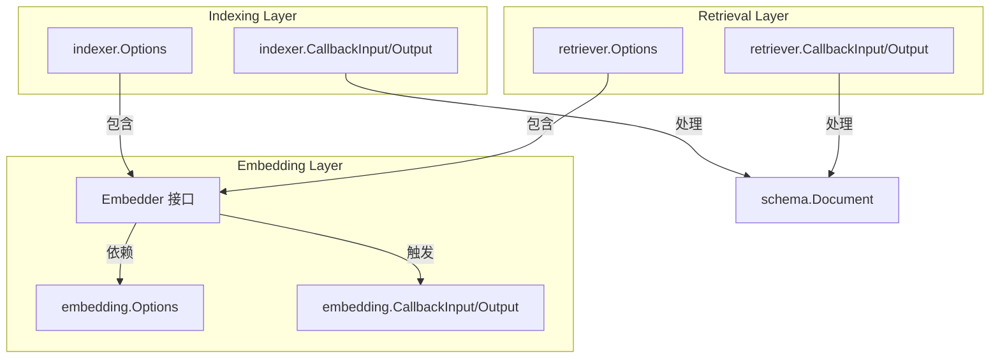

# Embedding Indexing and Retrieval Primitives

## 模块概述

这个模块是整个系统中的"向量基础设施核心"，它定义了三个关键抽象——嵌入（Embedding）、索引（Indexing）和检索（Retrieval）——的契约和元数据。想象一下，如果你要构建一个智能文档检索系统，你需要：
1. 将文本转换为向量表示（嵌入）
2. 将这些向量存储在可搜索的结构中（索引）
3. 根据查询向量找到最相关的文档（检索）

这个模块不提供具体的实现，而是定义了这些操作的"通用语言"——接口、选项类型和回调契约。它的作用就像一个标准化的插座，让不同的嵌入模型（如 OpenAI、Cohere）、向量数据库（如 Pinecone、Chroma）和检索策略可以无缝插拔，而不需要修改上层业务逻辑。

## 核心架构



### 架构详解

这个模块的设计遵循了"关注点分离"原则，将三个相关但独立的职责清晰划分：

1. **Embedding 层**：负责文本到向量的转换
   - `Embedder` 接口是核心，定义了 `EmbedStrings` 方法
   - 提供了标准化的选项（模型选择）和回调（输入文本、输出向量、Token 使用量）

2. **Indexing 层**：负责文档的向量存储
   - 虽然没有定义 Indexer 接口（留给具体实现），但定义了选项和回调契约
   - 选项中可以注入 Embedder，实现"即索引即嵌入"的模式
   - 回调处理文档输入和索引 ID 输出

3. **Retrieval 层**：负责根据查询检索相关文档
   - 同样没有定义 Retriever 接口，但定义了完整的选项和回调
   - 选项中可以注入 Embedder，实现"即检索即嵌入"的模式
   - 支持 TopK、分数阈值、过滤等常见检索参数

### 数据流动

典型的端到端流程如下：

1. **索引阶段**：
   - 上层应用将 `[]*schema.Document` 传递给 Indexer
   - Indexer 使用配置的 Embedder 将文档内容转换为向量
   - Indexer 将向量存储到向量数据库，返回文档 ID
   - 整个过程触发 `indexer.CallbackInput` 和 `indexer.CallbackOutput` 回调

2. **检索阶段**：
   - 上层应用将查询字符串传递给 Retriever
   - Retriever 使用配置的 Embedder 将查询转换为向量
   - Retriever 在向量数据库中搜索最相似的文档
   - Retriever 返回 `[]*schema.Document`
   - 整个过程触发 `retriever.CallbackInput` 和 `retriever.CallbackOutput` 回调

## 核心设计决策

### 1. 接口与契约分离

**决策**：只定义 Embedder 接口，而 Indexer 和 Retriever 只定义选项和回调契约。

**原因**：
- 嵌入操作相对标准化，就是"文本进，向量出"
- 索引和检索的实现差异巨大：有的是本地向量库，有的是云服务；有的支持批量操作，有的不支持；有的有复杂的索引管理功能
- 强行定义统一接口会限制实现的灵活性

**权衡**：
- ✅ 给予实现者最大的自由度
- ❌ 上层代码在使用不同 Indexer/Retriever 时可能需要适配

### 2. 选项模式 + 实现特定选项

**决策**：使用函数式选项模式，并同时支持通用选项和实现特定选项。

**原因**：
- 通用选项（如 Model、TopK）可以跨实现共享
- 实现特定选项（如 Viking 的 DSLInfo）不应该污染通用接口
- 函数式选项模式提供了良好的可读性和扩展性

**实现方式**：
```go
// 通用选项
func WithModel(model string) Option { ... }

// 实现特定选项
func WrapImplSpecificOptFn[T any](optFn func(*T)) Option { ... }
```

**权衡**：
- ✅ 既保持了通用性，又支持实现特定功能
- ❌ 类型安全性稍弱（实现特定选项使用 `any`）

### 3. 回调契约的兼容性转换

**决策**：在回调输入/输出中提供 `ConvCallbackInput` 和 `ConvCallbackOutput` 函数，支持从简单类型（如 `[]string`、`[][]float64`）到完整回调结构的自动转换。

**原因**：
- 简单场景下，用户只想传递核心数据，不想构造完整的回调结构
- 复杂场景下，用户需要传递额外的配置和元数据
- 这种设计让两种场景都能优雅处理

**权衡**：
- ✅ 提供了很好的灵活性和向后兼容性
- ❌ 转换逻辑增加了一点点复杂度

### 4. Embedder 作为 Indexer/Retriever 的选项

**决策**：在 Indexer 和 Retriever 的选项中包含 Embedder，而不是要求上层应用自己处理嵌入。

**原因**：
- 这是一个非常常见的模式：索引文档时需要嵌入，检索查询时也需要嵌入
- 将 Embedder 作为选项注入，可以让 Indexer/Retriever 内部处理嵌入逻辑，简化上层代码
- 同时也保持了灵活性：如果上层应用想自己控制嵌入过程，也可以不设置这个选项

**权衡**：
- ✅ 简化了常见用例
- ❌ 增加了 Indexer/Retriever 对 Embedder 的依赖

## 子模块说明

### embedding_contract_and_runtime_metadata
这个子模块定义了嵌入组件的核心契约和运行时元数据。它包含 `Embedder` 接口——整个嵌入系统的核心抽象——以及相关的选项类型和回调契约。这个子模块是连接不同嵌入模型实现的桥梁，让上层代码可以以统一的方式使用 OpenAI、Cohere、本地模型等不同的嵌入服务。

[查看详细文档](embedding_contract_and_runtime_metadata.md)

### indexer_options_and_callback_payloads
这个子模块定义了索引器的选项和回调负载。虽然它没有定义 Indexer 接口（因为索引实现差异太大），但它标准化了索引操作的配置方式和数据交换格式。特别值得注意的是，它支持通过选项注入 Embedder，实现"即索引即嵌入"的便捷模式。

[查看详细文档](embedding-indexing-and-retrieval-primitives-indexer-options-and-callback-payloads.md)

### retriever_options_and_callback_payloads
这个子模块定义了检索器的选项和回调负载。它标准化了检索操作的常见参数（TopK、分数阈值、过滤等），并同样支持通过选项注入 Embedder。这个子模块是构建各种检索策略（如多查询扩展、父文档检索）的基础。

[查看详细文档](retriever_options_and_callback_payloads.md)

## 与其他模块的关系

这个模块在整个系统中处于"基础设施"位置，被多个上层模块依赖：

1. **flow_agents_and_retrieval** 模块中的 [retriever_strategies_and_routing](flow_agents_and_retrieval-retriever_strategies_and_routing.md) 子模块构建在这些原语之上，实现了高级检索策略
2. **document_ingestion_and_parsing** 模块生成的 `schema.Document` 会被这个模块的 Indexer 处理
3. **internal_runtime_and_mocks** 模块提供了这个模块中接口的 mock 实现，用于测试

## 使用指南和注意事项

### 正确使用选项模式

当实现 Embedder、Indexer 或 Retriever 时，正确处理选项非常重要：

```go
// 1. 创建默认选项
defaultModel := "text-embedding-ada-002"
opts := &embedding.Options{
    Model: &defaultModel,
}

// 2. 应用通用选项
opts = embedding.GetCommonOptions(opts, options...)

// 3. 应用实现特定选项
type MyImplOptions struct {
    Timeout time.Duration
}
myOpts := &MyImplOptions{
    Timeout: 30 * time.Second,
}
myOpts = embedding.GetImplSpecificOptions(myOpts, options...)
```

### 回调转换的注意事项

使用 `ConvCallbackInput` 和 `ConvCallbackOutput` 时要注意：
- 这些函数会返回 `nil` 如果转换失败，一定要检查返回值
- 如果你需要传递额外的元数据，一定要构造完整的回调结构，而不是依赖自动转换

### Embedder 的注入时机

当在 Indexer 或 Retriever 中注入 Embedder 时：
- 确保 Embedder 是线程安全的（因为可能会被并发调用）
- 考虑 Embedder 的错误处理和重试策略——Indexer/Retriever 可能不会处理嵌入失败的情况

### 实现特定选项的类型安全

使用 `WrapImplSpecificOptFn` 时，要注意：
- 只有匹配类型的选项函数才会被应用，其他的会被静默忽略
- 建议在实现文档中清楚说明支持哪些实现特定选项
