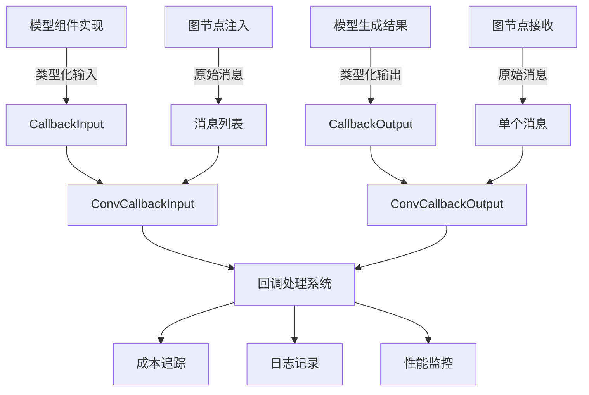

# model_callback_usage_and_metadata 模块技术深度解析

## 1. 为什么需要这个模块？

在构建基于大语言模型的应用时，我们经常需要监控模型的使用情况、跟踪成本、理解模型行为，以及在模型调用前后插入自定义逻辑。一个简单的模型调用接口可能只返回生成的消息，但实际生产环境中，我们需要更多的上下文信息：

- **成本追踪**：不同模型的 token 定价不同，需要精确记录每次调用的 token 使用量
- **行为分析**：需要知道模型何时使用了工具、何时因为 token 限制而停止生成
- **可观测性**：需要完整的输入输出来调试问题
- **可扩展性**：需要在不修改核心模型调用逻辑的情况下添加自定义处理

这个模块的核心洞察是：**将模型调用的元数据（token 使用、配置等）与实际的模型调用解耦，通过回调机制提供统一的观测和扩展点**。这样，模型实现只需要关注核心的模型交互逻辑，而监控、日志、成本追踪等横切关注点可以通过回调系统独立实现。

## 2. 核心抽象与心智模型

可以把这个模块想象成**模型调用的"飞行数据记录器"**：

- **CallbackInput** 是飞行前的检查清单：记录了要发送给模型的消息、可用的工具、选择工具的策略，以及模型配置
- **CallbackOutput** 是飞行后的报告：包含了模型生成的消息、实际使用的配置、token 消耗详情
- **TokenUsage** 是燃油消耗报告：详细记录了输入 token、输出 token，甚至缓存的 token 和推理 token
- **Config** 是飞行参数：记录了使用的模型、温度、最大 token 等配置

这种设计的关键在于：**这些数据结构不仅仅是信息容器，它们还是回调系统的契约**。通过 `ConvCallbackInput` 和 `ConvCallbackOutput` 函数，系统可以处理两种不同的调用场景：
1. 组件内部触发的回调（已经是类型化的 `*CallbackInput`/`*CallbackOutput`）
2. 图节点注入的回调（原始的 `[]*schema.Message`/`*schema.Message`）

## 3. 架构与数据流向



### 数据流向详解

1. **输入路径**：
   - 当模型组件内部触发回调时，直接传递 `*CallbackInput`，包含完整的上下文信息
   - 当通过图节点注入回调时，只传递原始的 `[]*schema.Message`
   - `ConvCallbackInput` 函数作为适配器，统一这两种输入格式

2. **输出路径**：
   - 类似地，模型组件内部传递 `*CallbackOutput`，图节点传递 `*schema.Message`
   - `ConvCallbackOutput` 函数统一输出格式

3. **处理路径**：
   - 统一格式后的输入/输出传递给回调处理系统
   - 回调系统可以提取 token 使用信息进行成本追踪
   - 可以记录完整的输入输出用于调试
   - 可以监控模型调用的性能指标

## 4. 核心组件深度解析

### 4.1 TokenUsage 结构体

```go
type TokenUsage struct {
    PromptTokens           int
    PromptTokenDetails     PromptTokenDetails
    CompletionTokens       int
    TotalTokens            int
    CompletionTokensDetails CompletionTokensDetails
}
```

**设计意图**：提供完整的 token 使用明细，而不仅仅是总数。这对于成本核算和模型行为分析至关重要。

**为什么这样设计**：
- 分离 `PromptTokens` 和 `CompletionTokens` 是因为它们通常有不同的定价
- `PromptTokenDetails.CachedTokens` 记录了缓存命中的 token，这对于评估缓存策略的效果很重要
- `CompletionTokensDetails.ReasoningTokens` 是专门为支持推理的模型设计的（如 OpenAI 的 o1 系列），这些模型的推理 token 可能有不同的定价

### 4.2 Config 结构体

```go
type Config struct {
    Model       string
    MaxTokens   int
    Temperature float32
    TopP        float32
    Stop        []string
}
```

**设计意图**：提取模型调用的核心配置参数，使其可以通过回调系统传递和记录。

**为什么只包含这些字段**：
- 这些是跨模型通用的核心参数
- 更特殊的模型参数可以通过 `CallbackInput.Extra` 或 `CallbackOutput.Extra` 传递
- 这种设计在通用性和完整性之间取得了平衡

### 4.3 CallbackInput 与 CallbackOutput

```go
type CallbackInput struct {
    Messages   []*schema.Message
    Tools      []*schema.ToolInfo
    ToolChoice *schema.ToolChoice
    Config     *Config
    Extra      map[string]any
}

type CallbackOutput struct {
    Message     *schema.Message
    Config      *Config
    TokenUsage  *TokenUsage
    Extra       map[string]any
}
```

**设计意图**：封装模型调用的完整上下文，包括输入、输出、配置和扩展字段。

**关键特性**：
- `Extra` 字段提供了无限的扩展性，可以传递任何模型特定的信息
- 同时包含输入和输出的 `Config`，可以检测配置是否被模型修改
- 完整的工具信息传递，使得回调系统可以分析工具使用模式

### 4.4 ConvCallbackInput 与 ConvCallbackOutput

```go
func ConvCallbackInput(src callbacks.CallbackInput) *CallbackInput {
    switch t := src.(type) {
    case *CallbackInput:
        return t
    case []*schema.Message:
        return &CallbackInput{
            Messages: t,
        }
    default:
        return nil
    }
}
```

**设计意图**：作为适配器，处理两种不同的回调触发场景。

**为什么需要这个**：
- 模型组件内部实现回调时，可以构造完整的 `*CallbackInput`
- 但在图节点级别注入回调时，可能只有原始的输入输出
- 这个函数使得两种场景可以统一处理，降低了回调系统的复杂度

## 5. 依赖关系分析

### 5.1 依赖的模块

- **[callbacks](callbacks_and_handler_templates.md)**：提供回调系统的基础接口
- **[schema](schema_models_and_streams.md)**：提供 `Message`、`ToolInfo`、`ToolChoice` 等核心数据结构

### 5.2 被依赖的模块

这个模块被以下模块依赖（基于模块树）：
- **model_interfaces_and_options**：模型接口定义可能会使用这些回调类型
- **chatmodel_react_and_retry_runtime**：运行时可能会注册回调来监控模型调用
- **graph_execution_runtime**：图执行引擎可能会在节点级别注入回调

### 5.3 数据契约

这个模块定义了几个重要的契约：
1. **CallbackInput 契约**：模型调用前的完整上下文
2. **CallbackOutput 契约**：模型调用后的完整结果
3. **TokenUsage 契约**：token 使用的标准化格式

这些契约确保了不同组件之间可以可靠地交换模型调用信息。

## 6. 设计权衡与决策

### 6.1 有限的 Config 字段 vs 无限的扩展性

**决策**：在 `Config` 中只包含最通用的字段，通过 `Extra` 字段处理特殊需求。

**权衡**：
- ✅ 优点：保持了接口的简洁性和跨模型的兼容性
- ❌ 缺点：特殊模型的参数不能得到类型安全的保障

**为什么这样选择**：在 AI 领域，不同模型的参数差异很大，试图在一个结构体中包含所有可能的参数是不现实的。这种设计允许核心参数保持类型安全，同时通过 `Extra` 字段提供灵活性。

### 6.2 两种输入格式的适配 vs 统一的输入格式

**决策**：通过 `ConvCallbackInput` 和 `ConvCallbackOutput` 适配两种不同的输入格式。

**权衡**：
- ✅ 优点：既支持组件内部的完整信息传递，又支持图节点级别的简单回调注入
- ❌ 缺点：增加了一定的复杂性，需要处理类型转换

**为什么这样选择**：这是一个典型的"机制与策略分离"的设计。回调系统提供了机制（类型转换），而具体的使用场景决定了策略（传递完整信息还是简单信息）。

### 6.3 指针字段 vs 值字段

**决策**：`Config`、`TokenUsage`、`ToolChoice` 等字段都是指针类型。

**权衡**：
- ✅ 优点：可以表示"不存在"的状态（nil），避免了零值的歧义
- ❌ 缺点：增加了空指针检查的负担

**为什么这样选择**：在回调场景中，这些信息可能是可选的。例如，某些简单的回调可能不需要 token 使用信息。使用指针可以清晰地区分"零值"和"不存在"。

## 7. 使用指南与最佳实践

### 7.1 注册模型回调

```go
// 假设有一个回调处理器
handler := callbacks.Handler{
    OnStart: func(ctx context.Context, input callbacks.CallbackInput) context.Context {
        if cbInput := model.ConvCallbackInput(input); cbInput != nil {
            // 记录输入消息
            log.Printf("Model input: %d messages", len(cbInput.Messages))
            // 记录配置
            if cbInput.Config != nil {
                log.Printf("Model: %s, Temperature: %.2f", cbInput.Config.Model, cbInput.Config.Temperature)
            }
        }
        return ctx
    },
    OnEnd: func(ctx context.Context, output callbacks.CallbackOutput) context.Context {
        if cbOutput := model.ConvCallbackOutput(output); cbOutput != nil {
            // 记录 token 使用
            if cbOutput.TokenUsage != nil {
                log.Printf("Tokens used: %d total, %d prompt, %d completion", 
                    cbOutput.TokenUsage.TotalTokens,
                    cbOutput.TokenUsage.PromptTokens,
                    cbOutput.TokenUsage.CompletionTokens)
            }
        }
        return ctx
    },
}
```

### 7.2 成本追踪实现

```go
type CostTracker struct {
    totalCost float64
    modelPrices map[string]ModelPrice
}

type ModelPrice struct {
    promptPricePerToken     float64
    completionPricePerToken float64
}

func (ct *CostTracker) OnEnd(ctx context.Context, output callbacks.CallbackOutput) context.Context {
    if cbOutput := model.ConvCallbackOutput(output); cbOutput != nil {
        if cbOutput.TokenUsage != nil && cbOutput.Config != nil {
            price, ok := ct.modelPrices[cbOutput.Config.Model]
            if ok {
                cost := float64(cbOutput.TokenUsage.PromptTokens)*price.promptPricePerToken +
                        float64(cbOutput.TokenUsage.CompletionTokens)*price.completionPricePerToken
                ct.totalCost += cost
                log.Printf("Request cost: $%.4f, Total cost: $%.4f", cost, ct.totalCost)
            }
        }
    }
    return ctx
}
```

### 7.3 最佳实践

1. **总是检查指针是否为 nil**：在使用 `Config`、`TokenUsage` 等指针字段前，务必检查它们是否为 nil。
2. **合理使用 Extra 字段**：只有当信息确实不属于核心字段时，才使用 `Extra` 字段。
3. **不要修改回调输入/输出**：回调处理器应该是只读的，修改输入/输出可能会导致不可预期的行为。
4. **性能考虑**：回调处理器会在每次模型调用时执行，避免在其中进行昂贵的操作。

## 8. 边缘情况与注意事项

### 8.1 类型转换失败

`ConvCallbackInput` 和 `ConvCallbackOutput` 在无法转换时会返回 nil，回调处理器必须优雅地处理这种情况。

### 8.2 TokenUsage 的不完整性

不是所有模型都提供完整的 token 使用明细，特别是 `CachedTokens` 和 `ReasoningTokens` 字段可能为 0，即使模型实际上使用了这些功能。

### 8.3 流式输出的处理

这个模块主要设计用于非流式的模型调用。对于流式输出，token 使用信息通常只在流结束时才可用，需要特殊处理。

### 8.4 Extra 字段的类型安全

`Extra` 字段是 `map[string]any` 类型，使用时需要进行类型断言，务必处理类型断言失败的情况。

## 9. 总结

`model_callback_usage_and_metadata` 模块是连接模型组件和回调系统的桥梁，它通过定义清晰的数据结构和转换函数，使得模型调用的元数据可以被可靠地传递和处理。

这个模块的设计体现了几个重要的原则：
- **关注点分离**：将模型调用的核心逻辑与监控、日志等横切关注点分离
- **灵活性与简洁性的平衡**：通过核心字段保证简洁性，通过 Extra 字段保证灵活性
- **适配不同场景**：通过转换函数支持组件内部和图节点两种不同的回调触发方式

对于新加入团队的开发者，理解这个模块的关键是：不要把它仅仅看作是数据结构的集合，而是要认识到它定义了一个**契约**，这个契约使得不同的组件可以在不紧密耦合的情况下，共享和处理模型调用的信息。
