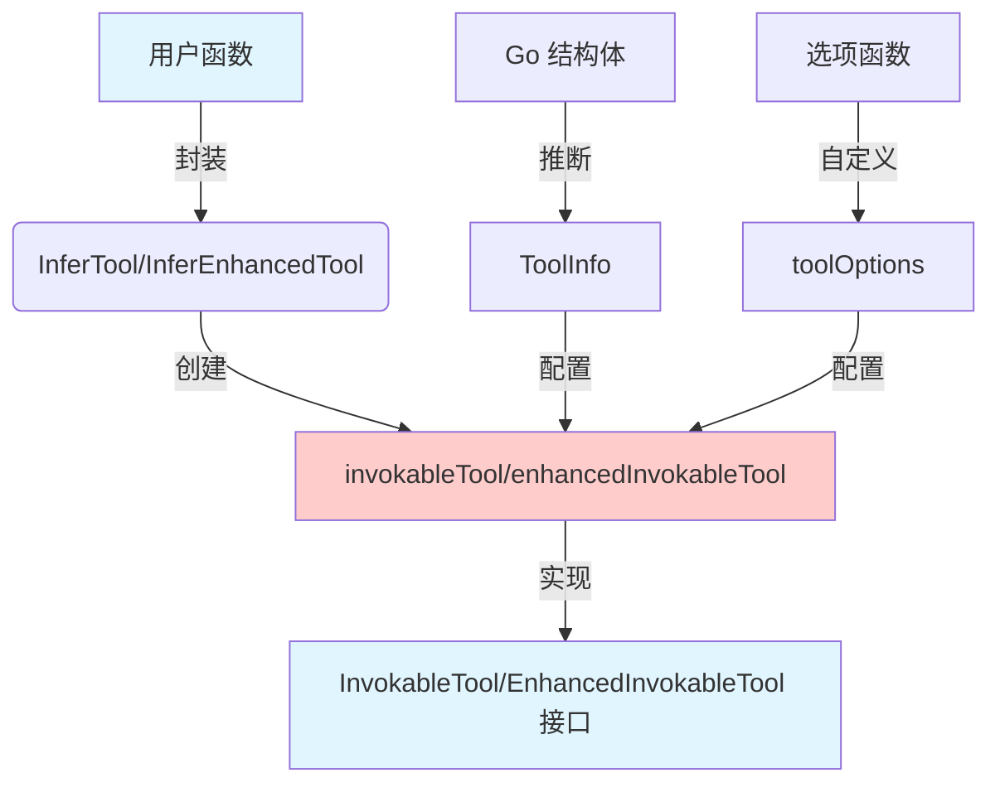

# invokable-func 模块技术深度解析

## 1. 模块概述

`invokable-func` 模块是 Eino 框架中用于将普通 Go 函数转换为符合工具接口规范的核心适配器。它解决了一个关键问题：如何让开发者用熟悉的 Go 函数签名定义工具，同时自动满足复杂的工具契约要求（包括 JSON Schema 生成、参数解析、结果序列化等）。

简单来说，这个模块的作用就像是一个"翻译器"——它把人类友好的 Go 函数转换成 AI 友好的工具接口，让开发者无需关心底层的协议细节，只需专注于工具的业务逻辑。

## 2. 核心问题与设计思想

### 2.1 问题空间

在 AI 应用开发中，工具调用面临几个挑战：

1. **接口标准化**：AI 模型需要工具以特定格式描述（JSON Schema）和调用（JSON 参数）
2. **类型安全**：Go 的强类型系统与 JSON 的动态类型系统需要适配
3. **扩展性**：不同工具可能需要自定义的参数解析和结果序列化方式
4. **类型推断**：从 Go 函数签名自动生成工具元数据（如参数结构、描述等）

一个朴素的解决方案是要求每个工具手动实现完整的接口，但这会导致大量重复代码和维护成本。

### 2.2 设计思想

本模块的核心设计思想是**"约定优于配置"**配合**"类型推断"**：

- 通过泛型函数参数捕获工具的输入输出类型
- 从 Go 结构体自动推断 JSON Schema
- 提供合理的默认行为（JSON 序列化/反序列化）
- 允许通过选项自定义关键环节（参数解析、结果序列化、Schema 定制）

这类似于 Go 标准库中的 `encoding/json` 包——默认行为足够好，同时提供了足够的扩展点。

## 3. 核心组件与数据流程

### 3.1 核心组件



模块的核心组件包括：

1. **`invokableTool[T, D]`**：基本工具实现，处理字符串参数和返回值
2. **`enhancedInvokableTool[T]`**：增强工具实现，处理结构化的 `ToolArgument` 和 `ToolResult`
3. **工厂函数**：`InferTool`、`NewTool`、`InferEnhancedTool`、`NewEnhancedTool` 等
4. **选项机制**：`WithUnmarshalArguments`、`WithMarshalOutput`、`WithSchemaModifier`

### 3.2 数据流程

以使用 `InferTool` 创建工具并调用为例，数据流程如下：

1. **工具创建阶段**：
   - 调用 `InferTool` 传入函数、名称和描述
   - `goStruct2ToolInfo` 从输入类型 `T` 推断 JSON Schema，生成 `ToolInfo`
   - 创建 `invokableTool` 实例，保存函数引用和配置

2. **工具调用阶段**：
   - 调用 `InvokableRun` 传入 JSON 字符串参数
   - 反序列化 JSON 为类型 `T` 的实例（使用自定义或默认的反序列化器）
   - 调用用户函数处理输入
   - 序列化返回值为 JSON 字符串（使用自定义或默认的序列化器）
   - 返回结果字符串

## 4. 关键组件深入分析

### 4.1 `invokableTool[T, D]` 结构体

`invokableTool` 是本模块的核心结构体，它实现了 `tool.InvokableTool` 接口。

```go
type invokableTool[T, D any] struct {
    info *schema.ToolInfo
    um   UnmarshalArguments
    m    MarshalOutput
    Fn   OptionableInvokeFunc[T, D]
}
```

- **`info`**：工具的元数据，包括名称、描述和参数 Schema
- **`um`**：可选的自定义参数反序列化函数
- **`m`**：可选的自定义结果序列化函数  
- **`Fn`**：实际执行工具逻辑的函数

关键点在于它使用了 Go 1.18+ 的泛型特性，使其能够适配任何输入输出类型的函数，同时保持类型安全。

### 4.2 `enhancedInvokableTool[T]` 结构体

`enhancedInvokableTool` 是 `invokableTool` 的增强版本，区别在于：

1. 输入不是简单的字符串，而是 `*schema.ToolArgument`
2. 输出不是简单的字符串，而是 `*schema.ToolResult`

这种设计允许工具传递更丰富的上下文信息和元数据，适用于更复杂的使用场景。

### 4.3 类型推断机制

模块最强大的特性之一是从 Go 类型自动推断工具信息，核心是 `goStruct2ParamsOneOf` 函数：

```go
func goStruct2ParamsOneOf[T any](opts ...Option) (*schema.ParamsOneOf, error) {
    options := getToolOptions(opts...)
    
    r := &jsonschema.Reflector{
        Anonymous:      true,
        DoNotReference: true,
        SchemaModifier: jsonschema.SchemaModifierFn(options.scModifier),
    }
    
    js := r.Reflect(generic.NewInstance[T]())
    js.Version = ""
    
    paramsOneOf := schema.NewParamsOneOfByJSONSchema(js)
    return paramsOneOf, nil
}
```

这里使用了 `jsonschema` 库从 Go 类型反射生成 JSON Schema，同时支持通过 `SchemaModifierFn` 自定义生成过程。`generic.NewInstance[T]()` 是一个巧妙的技巧，用于在不实际创建实例的情况下获取类型信息。

### 4.4 选项模式

模块使用了选项模式来提供扩展性，而不是使用复杂的配置结构体：

```go
type Option func(o *toolOptions)

func WithUnmarshalArguments(um UnmarshalArguments) Option {
    return func(o *toolOptions) {
        o.um = um
    }
}
```

这种模式有几个优点：
1. 向后兼容：添加新选项不需要修改现有代码
2. 可选配置：只需要设置需要自定义的部分
3. 可读性好：选项函数名本身就说明了用途

## 5. 依赖关系分析

### 5.1 内部依赖

本模块依赖同一包内的几个组件：
- `create_options.go`：定义了选项类型和函数
- `common.go`：提供了通用的序列化辅助函数

### 5.2 外部依赖

1. **`github.com/bytedance/sonic`**：高性能 JSON 库，用于默认的序列化/反序列化
2. **`github.com/eino-contrib/jsonschema`**：用于从 Go 类型生成 JSON Schema
3. **`github.com/cloudwego/eino/components/tool`**：定义了工具接口
4. **`github.com/cloudwego/eino/schema`**：定义了工具相关的数据结构

### 5.3 被依赖情况

从模块树结构可以看出，`invokable-func` 是 `tool_function_adapters` 的子模块，很可能被上层的工具适配器和运行时模块使用，作为将用户函数集成到 Eino 生态系统的桥梁。

## 6. 设计决策与权衡

### 6.1 泛型 vs 反射

**选择**：使用泛型作为主要机制，辅以反射

**原因**：
- 泛型提供了编译时类型安全，减少运行时错误
- 反射用于类型推断，这是泛型无法做到的
- 两者结合，既保持了类型安全，又提供了灵活性

**权衡**：
- 优点：类型安全、API 简洁、自动类型推断
- 缺点：代码复杂度增加，需要 Go 1.18+

### 6.2 单一职责 vs 功能丰富

**选择**：提供两种工具实现（基本和增强）

**原因**：
- 基本版本满足 80% 的简单使用场景
- 增强版本处理复杂场景，提供更多功能
- 分开实现避免单一实现过于复杂

**权衡**：
- 优点：API 分层清晰，用户可以按需选择
- 缺点：代码有一定重复，维护两个实现

### 6.3 默认行为 vs 可配置性

**选择**：提供合理默认行为，同时通过选项完全自定义

**原因**：
- 默认 JSON 序列化适合大多数情况
- 自定义选项处理特殊需求（如非 JSON 格式、加密等）
- 选项模式让配置变得优雅

**权衡**：
- 优点：开箱即用，同时足够灵活
- 缺点：选项增多时，学习曲线也会增加

## 7. 使用指南与最佳实践

### 7.1 基本使用

创建一个简单的工具：

```go
// 定义输入结构体
type AddInput struct {
    A int `json:"a" jsonschema:"description=第一个数字"`
    B int `json:"b" jsonschema:"description=第二个数字"`
}

// 定义工具函数
func Add(ctx context.Context, input AddInput) (int, error) {
    return input.A + input.B, nil
}

// 创建工具
tool, err := utils.InferTool("add", "加法工具", Add)
```

### 7.2 自定义序列化

当默认的 JSON 序列化不满足需求时：

```go
// 自定义反序列化
customUnmarshal := func(ctx context.Context, arguments string) (any, error) {
    // 自定义解析逻辑
    var input AddInput
    // ... 解析 arguments ...
    return input, nil
}

// 自定义序列化
customMarshal := func(ctx context.Context, output any) (string, error) {
    // 自定义序列化逻辑
    result := output.(int)
    return fmt.Sprintf("结果是: %d", result), nil
}

// 创建带自定义序列化的工具
tool, err := utils.InferTool("add", "加法工具", Add,
    utils.WithUnmarshalArguments(customUnmarshal),
    utils.WithMarshalOutput(customMarshal))
```

### 7.3 自定义 Schema

通过结构体标签和 Schema 修改器定制 JSON Schema：

```go
// 首先定义结构体标签
type SearchInput struct {
    Query string `json:"query" mytag:"required=true"`
    Limit int    `json:"limit" mytag:"min=1,max=100"`
}

// 然后创建 Schema 修改器
modifier := func(jsonTagName string, t reflect.Type, tag reflect.StructTag, schema *jsonschema.Schema) {
    if mytag, ok := tag.Lookup("mytag"); ok {
        // 解析 mytag 并修改 schema
        // ...
    }
}

// 创建工具时应用修改器
tool, err := utils.InferTool("search", "搜索工具", Search,
    utils.WithSchemaModifier(modifier))
```

## 8. 注意事项与陷阱

### 8.1 类型零值问题

当使用 `generic.NewInstance[T]()` 时，它会创建类型 `T` 的零值。对于指针类型或包含指针的结构体，需要确保它们在传递给用户函数前被正确初始化。

### 8.2 Schema 生成限制

自动生成的 JSON Schema 有一定限制：
- 不支持循环引用（会导致堆栈溢出）
- 某些复杂类型可能无法完全表达
- 结构体标签的支持取决于 `jsonschema` 库的实现

### 8.3 错误处理

所有可能失败的操作都被包装了额外的上下文信息（如工具名称），但需要注意：
- 自定义序列化函数返回的错误会直接传播
- 用户函数的错误也会被包装后返回
- 类型断言失败会返回明确的错误信息

### 8.4 并发安全

当前实现中，`invokableTool` 和 `enhancedInvokableTool` 结构体在创建后是不可变的，因此它们的方法是并发安全的。但如果用户函数本身不是并发安全的，那么调用这些工具也不会是并发安全的。

## 9. 总结

`invokable-func` 模块是 Eino 工具生态系统中的关键组件，它通过巧妙的设计将 Go 的强类型优势与 AI 工具的灵活需求结合起来。它的核心价值在于：

1. **简化工具开发**：让开发者用熟悉的 Go 函数定义工具
2. **类型安全**：利用泛型提供编译时类型检查
3. **灵活扩展**：通过选项模式支持各种自定义需求
4. **自动元数据**：从 Go 类型自动生成 JSON Schema

这个模块展示了如何在保持简洁 API 的同时，提供足够的灵活性和功能，是 Go 语言中现代库设计的一个很好的例子。
