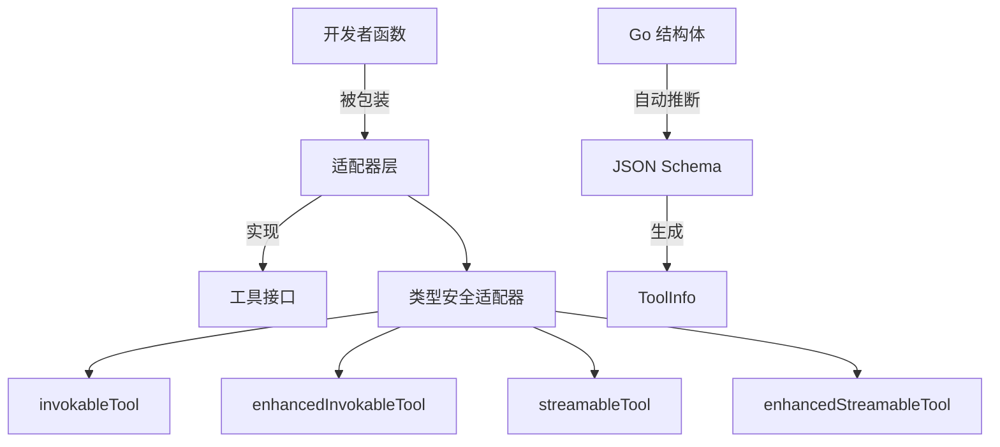

# tool_function_adapters 模块技术深度解析

## 为什么这个模块存在

在构建 AI 代理系统时，一个核心挑战是**将开发者熟悉的普通 Go 函数转换为符合工具契约的接口**。开发者不想每次定义工具时都手动处理 JSON 序列化、模式定义和类型转换这些繁琐工作。`tool_function_adapters` 模块就是为了解决这个问题而存在的——它充当了"函数适配器"的角色，让开发者可以用最自然的方式写函数，然后自动将其转换为系统可用的工具。

想象一下：你有一个普通的 Go 函数 `Add(a, b int) int`，但 AI 系统需要它以特定的接口形式工作，包括参数解析、JSON 序列化、模式生成等。这个模块就像是一个"翻译官"，让你的普通函数能与 AI 系统"对话"。

## 核心架构

这个模块的架构围绕着**类型化适配器**的概念设计。核心思想是：
1. **自动模式推断**：从 Go 结构体自动生成 JSON Schema
2. **函数包装**：将普通函数包装成符合工具接口的类型
3. **多模式支持**：支持调用型、增强型、流式等多种工具模式

## 核心设计决策

### 1. 泛型驱动的类型安全
**选择**：大量使用 Go 泛型（如 `InferTool[T, D any]`）
**权衡**：
- ✅ 编译时类型检查，减少运行时错误
- ✅ 自动类型转换，无需手动断言
- ❌ 泛型代码可读性稍差，对不熟悉泛型的开发者有学习曲线

### 2. 选项模式配置
**选择**：使用 `Option` 函数模式而非配置结构体
**权衡**：
- ✅ API 向前兼容性好，添加新选项不破坏现有代码
- ✅ 配置组合灵活，可以按需选择配置项
- ❌ 配置分散，不如结构体直观

### 3. 多层适配器设计
**选择**：提供普通工具、增强工具、流式工具等多种适配器
**权衡**：
- ✅ 满足不同场景需求（简单调用 vs 复杂结果 vs 流式输出）
- ✅ 接口职责清晰，每种适配器专注一种模式
- ❌ 代码有一定重复，维护成本稍高

## 子模块概览

### tool-options
负责工具的配置选项管理，提供自定义序列化、反序列化和模式修改的能力。
详见 [tool-options](components_core-tool_function_adapters-tool_options.md)

### invokable-func
提供调用型工具的适配器，支持普通调用和增强调用两种模式。
详见 [invokable-func](components_core-tool_function_adapters-invokable_func.md)

### streamable-func
提供流式工具的适配器，支持普通流式和增强流式两种模式。
详见 [streamable-func](components_core-tool_function_adapters-streamable_func.md)

## 数据流动

让我们追踪一个典型的工具调用流程：

1. **工具创建阶段**：开发者调用 `InferTool`，传入函数和描述
2. **模式推断阶段**：从输入类型 `T` 自动生成 JSON Schema 和 `ToolInfo`
3. **调用阶段**：
   - 接收 JSON 字符串参数
   - 反序列化为类型 `T` 的实例
   - 调用原始函数
   - 将结果序列化为 JSON 字符串返回

## 新贡献者注意事项

1. **类型断言的风险**：在自定义 `UnmarshalArguments` 时，务必确保类型断言正确，否则会导致运行时 panic
2. **Schema 修改器的复杂性**：`SchemaModifierFn` 的功能强大但使用复杂，特别是处理嵌套结构和数组时
3. **流式工具的资源管理**：使用流式工具时要注意 `StreamReader` 的生命周期管理，避免资源泄漏
4. **错误包装**：所有错误都会被包装并添加工具名称信息，便于调试

## 与其他模块的关系

- **依赖**：`schema_models_and_streams`（提供 `ToolInfo`、`ToolResult` 等类型）
- **依赖**：`components_core-tool_contracts_and_options`（定义工具接口）
- **被依赖**：`adk_prebuilt_agents` 等上层模块使用此模块创建工具

