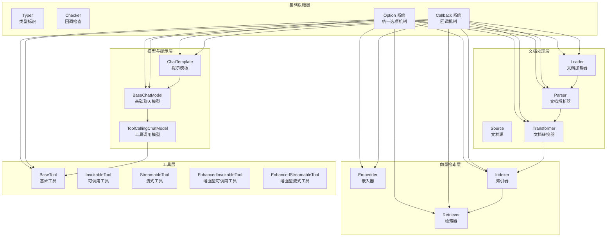

# components_core 模块技术文档

## 概述

`components_core` 是整个 Eino 框架的核心组件库，它定义了构建 AI 应用所需的所有核心抽象和接口契约。如果把 Eino 框架想象成一个电器城，那么 `components_core` 就是"插座标准"——它不生产具体的电器（如 OpenAI 模型、Pinecone 索引器），但定义了所有电器必须遵循的接口规范，确保任何符合标准的组件都能无缝接入系统。

这个模块解决的核心问题是**组件标准化**。在没有它的情况下，每个 AI 应用都需要重新发明轮子：直接耦合特定的模型 API、自定义文档加载逻辑、重复的工具调用代码。`components_core` 通过定义一组清晰的接口，让开发者可以像搭积木一样组合不同的组件，而不必担心底层实现细节。

## 架构概览



### 架构说明

`components_core` 采用分层设计，从底层基础设施到高层业务组件形成清晰的依赖关系：

1. **基础设施层**：提供两个核心能力
   - `Typer` 和 `Checker`：组件元数据和回调控制
   - **统一 Option 系统**：让所有组件都能用一致的方式处理配置
   - **统一 Callback 系统**：为所有组件提供标准化的钩子机制

2. **文档处理层**：负责文档的全生命周期管理
   - `Source`：定义文档来源（如 URI）
   - `Loader`：从来源加载原始数据
   - `Parser`：将原始数据解析为结构化文档
   - `Transformer`：对文档进行转换（如切分、过滤）

3. **模型与提示层**：处理与 LLM 的交互
   - `ChatTemplate`：将变量格式化为对话消息
   - `BaseChatModel`：基础的文本生成和流式输出能力
   - `ToolCallingChatModel`：扩展支持工具调用的模型接口

4. **向量检索层**：实现语义搜索能力
   - `Embedder`：将文本转换为向量
   - `Indexer`：将文档向量存入索引
   - `Retriever`：根据查询向量检索相关文档

5. **工具层**：让模型能够调用外部能力
   - 从简单的 `BaseTool` 到支持多模态输出的 `EnhancedStreamableTool`
   - 提供了从普通函数自动创建工具的适配器

## 核心设计决策

### 1. 接口优先，实现分离

**决策**：模块只定义接口和契约，不提供具体实现。

**为什么这样设计**：
- AI 生态系统正在快速演进，新的模型、向量数据库、文档格式层出不穷
- 将接口与实现分离，让用户可以根据需要切换底层技术栈而不改变业务逻辑
- 框架可以提供官方实现，社区也可以贡献兼容组件

**替代方案**：直接绑定特定实现（如只支持 OpenAI 模型），这会让框架在技术选型上变得僵化。

### 2. 统一的 Option 模式

**决策**：所有组件都使用相同的选项模式，包括通用选项和实现特定选项的分离。

**设计细节**：
```go
// 通用选项结构
type Options struct {
    Model *string
    Temperature *float32
}

// 选项类型
type Option struct {
    apply func(opts *Options)  // 用于通用选项
    implSpecificOptFn any       // 用于实现特定选项
}
```

**为什么这样设计**：
- 既保证了常见配置的标准化，又为实现者提供了灵活性
- 实现者可以通过 `WrapImplSpecificOptFn` 定义自己的选项，而不会破坏接口一致性
- 使用者可以用相同的模式配置所有组件，降低认知负担

**权衡**：这种设计增加了一定的复杂性（需要同时处理通用和特定选项），但换取了强大的扩展性。

### 3. 回调系统与组件解耦

**决策**：回调不是接口的一部分，而是通过独立的机制工作。

**设计细节**：
- 组件可以选择实现 `Checker` 接口来控制回调行为
- 每个组件都有对应的 `CallbackInput` 和 `CallbackOutput` 类型
- 提供转换函数让回调系统能处理原始类型或包装类型

**为什么这样设计**：
- 回调是横切关注点，不应该污染核心业务接口
- 组件可以自由决定是否支持回调，以及如何支持
- 即使组件不关心回调，框架也能通过包装类型注入回调能力

### 4. 工具接口的渐进式增强

**决策**：工具接口从简单到复杂分为多个层次，而不是一个大而全的接口。

**接口层次**：
1. `BaseTool`：仅提供工具元信息
2. `InvokableTool`：支持同步调用，返回字符串
3. `StreamableTool`：支持流式输出
4. `EnhancedInvokableTool`：支持结构化多模态输出
5. `EnhancedStreamableTool`：支持流式多模态输出

**为什么这样设计**：
- 简单工具不需要实现复杂接口
- 新需求可以通过添加新接口层来满足，而不破坏现有代码
- 提供适配器（如 `InferTool`）让用户可以从普通函数创建工具

### 5. 文档解析的扩展点设计

**决策**：`ExtParser` 通过文件扩展名路由到具体解析器，而不是内置所有解析逻辑。

**设计细节**：
```go
type ExtParser struct {
    parsers map[string]Parser  // 扩展名到解析器的映射
    fallbackParser Parser       // 未找到时的回退解析器
}
```

**为什么这样设计**：
- 不需要修改核心代码就能添加新的文档格式支持
- 用户可以根据需要只注册他们用到的解析器
- 回退机制保证了即使遇到未知格式也能有基本处理

## 子模块概览

### 1. [document_ingestion_and_parsing](components_core-document_ingestion_and_parsing.md)
负责文档的加载、解析和转换。定义了 `Loader`、`Parser`、`Transformer` 等核心接口，以及基于文件扩展名的解析器路由机制。

### 2. [model_and_prompting](components-model-and-prompting.md)
处理与语言模型的交互，包括提示模板、聊天模型接口和工具调用能力。定义了从基础生成到工具调用的模型接口层次。

### 3. [embedding_indexing_and_retrieval_primitives](components_core-embedding_indexing_and_retrieval_primitives.md)
提供向量检索的基础构件：嵌入器、索引器和检索器。这三个组件协同工作，实现语义搜索能力。

### 4. [tool_contracts_and_options](components-tool-contracts-and-options.md)
定义工具的接口契约和选项机制，包括从简单到复杂的工具接口层次。

### 5. [tool_function_adapters](components_core-tool_function_adapters.md)
提供将普通 Go 函数转换为工具的适配器，支持自动从结构体推断 JSON Schema，大大简化了工具创建过程。

### 6. [shared_type_introspection](components-shared-type-introspection.md)
提供组件类型标识和回调检查的基础设施，是所有组件的公共基础。

## 跨模块依赖关系

`components_core` 是一个**基础模块**，它被系统中的几乎所有其他模块依赖：

- **被依赖**：`adk_runtime`、`compose_graph_engine`、`flow_agents_and_retrieval` 等上层模块都依赖 `components_core` 定义的接口
- **依赖**：`components_core` 仅依赖 `schema_models_and_streams` 中的数据结构和 `callbacks_and_handler_templates` 中的回调基础设施

这种设计确保了核心接口的稳定性——上层模块可以放心地基于这些接口构建，而不必担心底层实现的频繁变更。

## 使用指南

### 实现自定义组件

实现 `components_core` 中的接口通常遵循以下模式：

1. **定义实现结构体**
2. **实现核心接口方法**
3. **提供配置选项（可选）**
4. **实现 `Typer` 和 `Checker`（可选）**

以自定义嵌入器为例：

```go
type MyEmbedder struct {
    apiKey string
    model  string
}

// 实现 Embedder 接口
func (e *MyEmbedder) EmbedStrings(ctx context.Context, texts []string, opts ...embedding.Option) ([][]float64, error) {
    // 提取选项
    options := embedding.GetCommonOptions(nil, opts...)
    // ... 实现嵌入逻辑
}

// 可选：实现 Typer 接口
func (e *MyEmbedder) GetType() string {
    return "MyEmbedder"
}

// 提供配置函数
func WithModel(model string) embedding.Option {
    return embedding.WrapImplSpecificOptFn(func(opts *myEmbedderOptions) {
        opts.model = model
    })
}
```

### 使用工具适配器

`tool_function_adapters` 子模块让创建工具变得极其简单：

```go
// 定义输入输出结构体
type SearchInput struct {
    Query string `json:"query" jsonschema:"description=搜索关键词"`
}

type SearchOutput struct {
    Results []string `json:"results"`
}

// 实现业务逻辑
func search(ctx context.Context, input *SearchInput) (*SearchOutput, error) {
    // ... 搜索逻辑
    return &SearchOutput{Results: []string{"结果1", "结果2"}}, nil
}

// 创建工具
tool, err := utils.InferTool("search", "搜索工具", search)
```

### 组合组件

虽然 `components_core` 只定义接口，但它设计时就考虑了组件的组合方式：

```
Source → Loader → Parser → Transformer → Indexer
                                           ↓
Query → Embedder → Retriever → ChatModel → Response
                     ↑
                  Tools
```

实际的组合逻辑由 `compose_graph_engine` 模块提供，但 `components_core` 定义的接口确保了这种组合是可能的。

## 注意事项和陷阱

### 1. Option 系统的类型安全

`WrapImplSpecificOptFn` 和 `GetImplSpecificOptions` 使用类型断言，在运行时才会发现类型不匹配。建议：
- 为每个组件的选项编写测试
- 在文档中明确说明选项类型

### 2. ExtParser 的 URI 要求

`ExtParser` 依赖 `filepath.Ext(opt.URI)` 来选择解析器，使用时必须：
- 通过 `parser.WithURI()` 传入 URI
- 确保 URI 包含正确的文件扩展名

### 3. 回调输入的类型转换

回调系统支持原始类型和包装类型，但转换函数 `ConvCallbackInput` 可能返回 `nil`。使用时应总是检查返回值。

### 4. ToolCallingChatModel 替代 ChatModel

旧的 `ChatModel` 接口有并发安全问题（`BindTools` 会改变实例状态），应始终使用新的 `ToolCallingChatModel` 接口。

### 5. 流式工具的资源管理

使用流式工具时，必须记得关闭返回的 `StreamReader`，否则可能导致资源泄漏。

## 总结

`components_core` 是 Eino 框架的"宪法"——它不直接解决业务问题，但定义了解决问题的规则和标准。通过接口抽象、统一选项模式、渐进式工具接口等设计，它在灵活性和一致性之间找到了良好的平衡点。

对于新加入的开发者，理解这个模块的关键是：不要把它看作一组孤立的接口，而要看作一个精心设计的组件生态系统蓝图。每一个接口、每一个设计决策，都是为了让 AI 应用的构建更加模块化、可组合和可维护。
