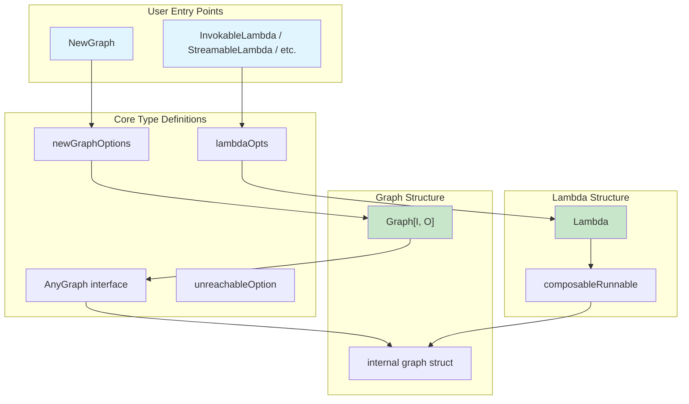

# composable_graph_types_and_lambda_options

## 模块概述

`composable_graph_types_and_lambda_options` 是 Eino 框架中**组合式工作流引擎**的核心模块。它定义了图（Graph）和链（Chain）的类型抽象，以及 Lambda 函数的创建和配置选项。

**这个模块解决什么问题？**

在构建 LLM 应用时，我们很少只调用一次模型——通常是**多步骤的流水线操作**：先检索文档，再构建 Prompt，调用模型，解析结果，可能还需要根据结果做条件分支或并行调用多个服务。如果每个步骤都独立编写，不仅代码难以复用，状态传递和错误处理也会变得混乱。

这个模块提供了**可组合的有向图抽象**，让你能够：
- 将多个组件（模型、检索器、工具等）和自定义函数（Lambda）组装成流水线
- 支持节点间的数据流和控制流（条件分支、并行执行）
- 在节点间共享状态，实现跨步骤的数据持久化
- 自动在四种调用模式（同步调用、流式输出、收集结果、流式转换）间适配

**心智模型：把图想象成一条装配流水线**

想象你有一条汽车装配流水线。每个工位（节点）是一个独立的工作单元：
- 有的工位是标准化设备（ChatModel、Retriever 等组件）
- 有的工位是自定义工位（Lambda 函数，由你定义具体做什么）
- 工位之间用传送带连接（数据流），有些工位还有条件开关（分支）
- 整个流水线有一个共享的物料箱（State），所有工位都能访问和修改

`NewGraph` 就是创建这条流水线，`AddNode` 是添加工位，`AddEdge` 是连接传送带，`Compile` 是把流水线组装好准备运行。

---

## 架构概览



### 核心组件职责

| 组件 | 文件 | 职责 |
|------|------|------|
| **AnyGraph** | `types_composable.go` | Graph/Chain 的统一接口，标识可组合、可编译的执行单元 |
| **newGraphOptions** | `generic_graph.go` | 创建 Graph 时的配置选项，主要用于状态管理 |
| **Graph[I, O]** | `generic_graph.go` | 泛型图结构，暴露 AddNode、AddEdge、Compile 等构建方法 |
| **lambdaOpts** | `types_lambda.go` | Lambda 函数的配置选项（回调开关、类型标识） |
| **unreachableOption** | `types_lambda.go` | 占位类型，用于在无选项版本函数中保持函数签名一致性 |
| **Lambda** | `types_lambda.go` | 包装用户函数的执行单元，支持四种调用模式 |
| **composableRunnable** | `runnable.go` | 底层执行器，封装 Invoke/Stream/Collect/Transform 能力 |

### 数据流路径

**构建阶段：**
```
用户代码 → NewGraph[I,O](opts...) → Graph[I,O]
       → AddNode/AddEdge → graph 内部结构
       → Compile(ctx, opts...) → Runnable[I,O]
```

**执行阶段：**
```
Runnable.Invoke(ctx, input)
    ↓
composableRunnable.i (invoke 函数)
    ↓
图遍历执行（根据 DAG/Pregel 模式）
    ↓
各节点输出 → 下一节点输入
```

---

## 设计决策与权衡

### 1. 四种调用模式的自动适配

**决策：** Lambda 支持 `Invoke`、`Stream`、`Collect`、`Transform` 四种模式，并且当用户只实现其中一种时，系统会自动推导其他三种。

**为什么这样做？**
- 在 LLM 应用中，不同组件的能力不同：有的只支持同步调用，有的只支持流式输出
- 如果强制要求用户实现所有模式，会大幅增加使用门槛
- 自动适配的代价是轻微的性能开销（需要内部转换），但换取的是极大的灵活性

**权衡分析：**
- **优点**：组件兼容性最大化，简化用户代码
- **缺点**：隐藏了实现细节，可能导致开发者在不了解的情况下产生意外的性能开销
- **替代方案**：要求所有组件实现全部四种模式（不推荐，会导致大量空实现）

### 2. 状态管理的侵入性设计

**决策：** 通过 `WithGenLocalState[S]` 选项显式启用状态管理，且状态类型必须在编译期确定。

```go
type testState struct {
    UserInfo *UserInfo
    KVs     map[string]any
}

genStateFunc := func(ctx context.Context) *testState {
    return &testState{}
}

graph := compose.NewGraph[string, string](WithGenLocalState(genStateFunc))
```

**为什么这样做？**
- 状态在图编译期确定类型，可以在节点添加时进行**静态类型检查**
- 避免运行时才发现状态类型不匹配的问题
- 每个节点可以声明对状态的读写（PreHandler/PostHandler）

**权衡分析：**
- **优点**：类型安全，编译期就能发现错误
- **缺点**：状态类型固定，灵活性受限
- **替代方案**：使用 `map[string]any` 动态状态（丢失类型安全，但更灵活）

### 3. Lambda 回调机制的粒度控制

**决策：** 通过 `WithLambdaCallbackEnable(bool)` 控制是否启用 Lambda 的回调切面。

```go
lambda := compose.InvokableLambda(
    func(ctx context.Context, input string) (string, error) {
        return input, nil
    },
    compose.WithLambdaCallbackEnable(true),  // 启用回调
)
```

**为什么这样做？**
- 回调机制（用于监控、日志、埋点等）有性能开销
- 某些场景下用户希望完全控制执行流程，不需要框架插入回调
- 这个选项让高级用户可以绕过框架的回调机制

**权衡分析：**
- **优点**：性能敏感场景可优化，灵活控制
- **缺点**：增加了 API 复杂度
- **替代方案**：始终启用回调（简单但无法优化）

### 4. unreachableOption 的巧妙运用

**决策：** 在无选项版本的 Lambda 创建函数中，使用一个**私有的空结构体** `unreachableOption` 作为可选参数类型的占位。

```go
// 无选项版本 - 内部使用 unreachableOption
func InvokableLambda[I, O any](i InvokeWOOpt[I, O], opts ...LambdaOpt) *Lambda {
    f := func(ctx context.Context, input I, opts_ ...unreachableOption) (output O, err error) {
        return i(ctx, input)  // 忽略 opts_
    }
    return anyLambda(f, nil, nil, nil, opts...)
}
```

**为什么这样做？**
- Go 语言没有可选参数，但 `InvokableLambda` 和 `InvokableLambdaWithOption` 需要保持一致的函数签名
- 使用 `...unreachableOption` 让两个版本都能接受可选参数，只是无选项版本内部忽略它们
- 这是 Go 中模拟"可选参数"的常用技巧

**权衡分析：**
- **优点**：保持 API 一致性，编译期安全
- **缺点**：代码略显晦涩，新人可能不理解
- **替代方案**：两个完全独立的函数名（已做到），但调用方需要根据场景选择

---

## 子模块说明

本模块包含以下子模块文档：

### 1. Graph 类型与编译 (compose_graph_types.md)

- **AnyGraph 接口**：Graph 和 Chain 的统一抽象
- **Graph[I, O] 结构**：泛型图定义，AddNode/AddEdge/Compile 方法
- **newGraphOptions**：图创建选项，状态管理配置

**关键函数：**
- `NewGraph[I, O any](opts ...NewGraphOption) *Graph[I, O]`
- `Graph[I, O].Compile(ctx context.Context, opts ...GraphCompileOption) (Runnable[I, O], error)`

### 2. Lambda 函数封装 (compose_lambda_functions.md)

- **四种调用模式**：Invoke / Stream / Collect / Transform
- **Lambda 结构**：包装用户函数的执行单元
- **lambdaOpts 配置**：回调开关、类型标识

**关键函数：**
- `InvokableLambda[I, O any](i InvokeWOOpt[I, O], opts ...LambdaOpt) *Lambda`
- `StreamableLambda[I, O any](s StreamWOOpt[I, O], opts ...LambdaOpt) *Lambda`
- `AnyLambda[I, O, TOption any](i Invoke, s Stream, c Collect, t Transform, opts ...LambdaOpt) (*Lambda, error)`
- `ToList[I any](opts ...LambdaOpt) *Lambda`
- `MessageParser[T any](p schema.MessageParser[T], opts ...LambdaOpt) *Lambda`

### 3. 可组合执行器 (compose_runnable_abstraction.md)

- **composableRunnable**：底层执行器封装
- **Runnable 接口**：四种调用模式的抽象
- **自动模式推导**：四种模式间的相互转换逻辑

---

## 与其他模块的关联

### 上游依赖

| 模块 | 关系说明 |
|------|----------|
| [components_core](../components_core/model_and_prompting.md) | Graph 节点可以添加各种组件（ChatModel、Retriever 等） |
| [schema_models_and_streams](../schema_models_and_streams/streaming_core_and_reader_writer_combinators.md) | StreamReader 用于流式数据处理 |
| [callbacks_and_handler_templates](../callbacks_and_handler_templates/interface.md) | 回调机制用于监控和切面编程 |

### 下游使用

| 模块 | 关系说明 |
|------|----------|
| [branch_and_parallel_chain_primitives](./branch_and_parallel_chain_primitives.md) | 基于 Graph 实现分支与并行执行 |
| [workflow_definition_primitives](./workflow_definition_primitives.md) | 基于 Graph 实现工作流 |
| [graph_execution_runtime](./graph_execution_runtime.md) | Graph 编译后的执行引擎 |

---

## 常见陷阱与注意事项

### 1. 图编译后无法修改

```go
graph, _ := compose.NewGraph[string, string]()
// 添加节点和边...
runnable, _ := graph.Compile(ctx)

// 这会返回 ErrGraphCompiled 错误
graph.AddNode("new_node", someNode)
```

**原因**：编译后的图会被优化和冻结，修改会导致状态不一致。

### 2. 状态类型必须在编译期匹配

```go
// 错误示例：状态类型不匹配
type StateA struct{ Value int }
type StateB struct{ Name string }

graph := compose.NewGraph[string, string](WithGenLocalState(func(ctx context.Context) *StateA {
    return &StateA{}
}))

// 这个节点的 PostHandler 使用了不同的状态类型，会在 AddNode 时报错
graph.AddNode("node1", someNode, compose.WithPostHandler(
    func(ctx context.Context, out string, state *StateB) (string, error) { // 类型不匹配！
        return out, nil
    }))
```

### 3. Lambda 的四种模式不能全为 nil

```go
// 错误：至少需要实现一种模式
lambda, err := compose.AnyLambda[string, string, any](nil, nil, nil, nil)
if err != nil {
    // 会返回错误：needs to have at least one of four lambda types
}
```

### 4. Stream 模式下处理 nil 输入

```go
// Lambda 函数中需要对 nil 进行处理
lambda := compose.StreamableLambda(func(ctx context.Context, input string) (*schema.StreamReader[string], error) {
    if input == "" {
        // 返回空的流而不是 nil
        return schema.StreamReaderFromArray([]string{}), nil
    }
    // ...
})
```

### 5. 回调机制与 Lambda 内部回调的二选一

```go
// 如果 Lambda 内部自己实现了回调，关闭节点的回调以避免重复
lambda := compose.InvokableLambda(invokeFunc, compose.WithLambdaCallbackEnable(true))
graph.AddNode("node", lambda, compose.WithNodeCallbackEnable(false))
```

---

## 扩展使用示例

### 示例 1：带状态的流水线

```go
type PipelineState struct {
    RequestID  string
    Retries    int
    UserContext map[string]any
}

graph := compose.NewGraph[string, string](
    compose.WithGenLocalState(func(ctx context.Context) *PipelineState {
        return &PipelineState{
            RequestID:   uuid.New().String(),
            UserContext: make(map[string]any),
        }
    }),
)

graph.AddNode("validate", validateNode, compose.WithPreHandler(
    func(ctx context.Context, in string, state *PipelineState) (string, error) {
        state.Retries = 0
        return in, nil
    },
))

graph.AddNode("process", processNode, compose.WithPostHandler(
    func(ctx context.Context, out string, state *PipelineState) (string, error) {
        state.UserContext["last_output"] = out
        return out, nil
    },
))
```

### 示例 2：条件分支

```go
condition := func(ctx context.Context, in string) (string, error) {
    if strings.HasPrefix(in, "error:") {
        return "error_handler", nil
    }
    return "success_handler", nil
}

branch := compose.NewGraphBranch(condition, map[string]bool{
    "error_handler": true,
    "success_handler": true,
})

graph.AddBranch("router", branch)
```

### 示例 3：流式处理流水线

```go
// 读取流 -> 处理流 -> 输出流
lambda1 := compose.TransformableLambda(transformFunc1)
lambda2 := compose.TransformableLambda(transformFunc2)

chain := compose.NewChain[*schema.StreamReader[byte], *schema.StreamReader[string]]()
chain.AppendLambda(lambda1)
chain.AppendLambda(lambda2)

runnable, _ := chain.Compile(ctx)
// 使用 Transform 模式处理流数据
result, _ := runnable.Transform(ctx, inputStream)
```

---

## 延伸阅读

- [Graph 执行模式： Pregel vs DAG](./graph_execution_runtime.md)
- [分支与并行执行](./branch_and_parallel_chain_primitives.md)
- [状态管理详解](./state_and_stream_reader_runtime_primitives.md)
- [回调机制原理](./callbacks_and_handler_templates.md)