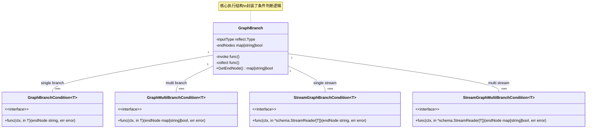

# compose-branch 模块技术深度分析

## 概述

`compose-branch` 模块是 compose 引擎的核心组件之一，它提供了一套完整的条件分支和流程控制机制。想象一下，这个模块就像是铁路的道岔系统——它不负责具体的运输工作（那是节点的职责），但它决定了数据流应该走哪条轨道，或者同时走哪几条轨道。

在构建复杂的工作流或代理系统时，我们经常需要根据条件进行决策，比如：
- 如果用户输入是关于技术问题的，我们应该走技术支持路径
- 如果是关于退款的，走退款处理路径
- 在某些高级场景下，我们可能需要同时触发多个路径（多分支）

简单的 if-else 语句在小规模代码中可能够用，但当系统变得复杂且需要可视化编排时，我们需要更结构化的方式来处理这些条件分支，这就是 `compose-branch` 模块要解决的问题。

## 核心架构

### 组成部分概览

这个模块由几个核心类型和工厂函数组成，它们之间的关系如下图所示：



### 组件详细分析

#### 1. `GraphBranch` - 核心执行结构

`GraphBranch` 是这个模块的核心结构体，它内部封装了分支执行所需的全部逻辑。

```go
type GraphBranch struct {
    invoke    func(ctx context.Context, input any) (output []string, err error)
    collect   func(ctx context.Context, input streamReader) (output []string, err error)
    inputType reflect.Type
    *genericHelper
    endNodes   map[string]bool
    idx        int // used to distinguish branches in parallel
    noDataFlow bool
}
```

**设计意图**：这个结构体采用了闭包模式，将类型检查、条件判断等复杂逻辑封装在内部函数中。这样做的好处是，外部使用者只需要提供简单的条件函数，而不需要关心类型安全、错误处理等底层细节。

**内部函数**：
- `invoke`: 处理普通（非流式）输入的条件判断
- `collect`: 处理流式输入的条件判断

这两个函数都在 `newGraphBranch` 中初始化，包含了类型断言和错误处理的逻辑。

**关键方法**：
- `GetEndNode()`: 返回这个分支所有可能的终点节点集合，这在编译阶段用于验证图的结构完整性。

#### 2. 条件函数类型

这个模块定义了四种条件函数类型，覆盖了不同的使用场景：

1. **`GraphBranchCondition[T any]`**: 单一选择分支，处理普通输入
2. **`StreamGraphBranchCondition[T any]`**: 单一选择分支，处理流式输入
3. **`GraphMultiBranchCondition[T any]`**: 多选择分支，处理普通输入
4. **`StreamGraphMultiBranchCondition[T any]`**: 多选择分支，处理流式输入

**设计意图**：提供四种不同的条件类型是为了满足不同的使用场景。有些时候我们只需要选择一条路径，有些时候我们需要同时选择多条路径；有些时候我们处理的是完整的输入，有些时候我们需要处理流式输入并可能根据第一个数据块就做出判断。

特别是对于流式处理，`StreamGraphBranchCondition` 提供了在流开始时就做出决策的能力，而不需要等待整个流结束。这在处理大量数据时特别有用。

#### 3. 工厂函数

这个模块提供了四个工厂函数来创建不同类型的分支：

1. **`NewGraphBranch[T any]`**: 创建单一选择分支
2. **`NewStreamGraphBranch[T any]`**: 创建单一选择流式分支
3. **`NewGraphMultiBranch[T any]`**: 创建多选择分支
4. **`NewStreamGraphMultiBranch[T any]`**: 创建多选择流式分支

**有趣的设计细节**：注意到 `NewGraphBranch` 和 `NewStreamGraphBranch` 实际上是通过调用对应的多分支版本来实现的。例如，`NewGraphBranch` 内部调用 `NewGraphMultiBranch`，并将返回的单个节点包装成 `map[string]bool{ret: true}`。

这种设计的好处是代码复用——单一选择分支只是多选择分支的一种特殊情况，不需要为它们分别实现一套逻辑。

## 数据流程

让我们通过一个简单的例子来理解数据如何通过 `GraphBranch` 流动：

1. **创建阶段**：
   - 用户定义一个条件函数
   - 用户调用 `NewGraphBranch`（或其他工厂函数）创建分支
   - 用户通过 `graph.AddBranch` 将分支添加到图中

2. **编译阶段**：
   - 图编译器验证分支的 `endNodes` 中的所有节点都存在于图中
   - 编译器验证起始节点的输出类型与分支的输入类型兼容

3. **执行阶段**：
   - 当执行到达分支的起始节点时，系统会调用分支的 `invoke` 或 `collect` 方法
   - 输入数据被类型检查并传递给条件函数
   - 条件函数返回目标节点（或节点集合）
   - 系统验证返回的节点是否在 `endNodes` 中
   - 数据流向选定的目标节点

**数据流程步骤**：

1. 用户创建图并添加分支
2. 图编译器验证所有节点和类型兼容性
3. 执行时将输入传给分支的条件函数
4. 条件函数返回目标节点
5. 系统验证节点有效性后路由数据

## 设计决策与权衡

### 1. 类型安全 vs 运行时检查

**问题**：Go 语言是一种静态类型语言，但图执行需要处理动态类型的数据。

**解决方案**：该模块采用了一种混合方案——使用泛型在创建阶段提供类型安全，然后在内部使用 `reflect` 包在运行时进行类型检查。

让我们看看这个例子：

```go
// 在创建时使用泛型确保类型安全
branch := NewGraphBranch(func(ctx context.Context, in string) (string, error) {
    // 这里 in 是 string 类型，编译器会检查类型
    return "target_node", nil
}, endNodes)

// 但在 GraphBranch 内部，数据被存储为 any 类型
invoke: func(ctx context.Context, input any) (output []string, err error) {
    // 运行时类型断言
    in, ok := input.(T)
    if !ok {
        // 特殊处理 nil 接口的情况
        if input == nil &amp;&amp; generic.TypeOf[T]().Kind() == reflect.Interface {
            var i T
            in = i
        } else {
            panic(newUnexpectedInputTypeErr(generic.TypeOf[T](), reflect.TypeOf(input)))
        }
    }
    // ...
}
```

**权衡**：
- ✅ 用户在编写条件函数时获得编译时类型检查
- ✅ 内部实现可以处理任意类型，保持灵活性
- ⚠️ 运行时类型检查有一定性能开销（但通常可以忽略）
- ⚠️ 类型错误在运行时才会暴露（但会有清晰的错误信息）

### 2. 单一分支 vs 多分支的统一实现

如前所述，`NewGraphBranch` 实际上是通过调用 `NewGraphMultiBranch` 来实现的。这是一个很好的组合设计示例。

**好处**：
- 减少代码重复
- 确保单一分支和多分支有一致的行为
- 更容易维护，修改一处即可影响两者

**唯一的小缺点**是，单一分支会有一点点额外的开销（创建 map、然后从 map 中提取），但这个开销非常小，几乎可以忽略不计。

### 3. 结束节点验证

注意，工厂函数接受 `endNodes` 参数，然后在执行阶段验证条件函数返回的节点是否在这个集合中。

```go
// 在 NewGraphMultiBranch 中
for end := range ends {
    if !endNodes[end] {
        return nil, fmt.Errorf("branch invocation returns unintended end node: %s", end)
    }
    ret = append(ret, end)
}
```

**为什么需要这个？**
1. **编译时验证**：允许图编译器在编译阶段验证所有可能的路径都是有效的
2. **安全保障**：防止条件函数返回一个不存在的节点，导致运行时错误
3. **文档作用**：`endNodes` 参数本身就是文档，说明了这个分支可能选择的路径

### 4. 流式处理支持

该模块专门为流式处理设计了对应的条件类型，这是一个重要的设计考虑。

对于普通的批处理，我们需要等待所有数据到达后才能做出判断，但对于流式处理，我们可能希望：
- 根据第一个数据块就做出判断（例如，检查流的开头部分）
- 不消费整个流，而是将流原样传递给下一个节点

在 `StreamGraphBranchCondition` 中，你可以这样做：
```go
condition := func(ctx context.Context, in *schema.StreamReader[string]) (string, error) {
    // 只读取第一个元素来做出判断
    firstChunk, err := in.Recv()
    if err != nil {
        return "", err
    }
    
    // 这里可以根据 firstChunk 做出判断
    
    // 但是要注意，这样会消费掉第一个元素
    // 如果需要，你可能需要创建一个新的流，把 firstChunk 放回去
    
    return "target_node", nil
}
```

## 使用示例

### 示例 1：基本的单一分支

```go
// 创建一个图
g := NewGraph[string, string]()

// 添加两个节点
err := g.AddLambdaNode("tech_support", 
    InvokableLambda(func(ctx context.Context, input string) (string, error) {
        return "处理技术问题: " + input, nil
    }),
)
// ... 错误处理

err = g.AddLambdaNode("refund", 
    InvokableLambda(func(ctx context.Context, input string) (string, error) {
        return "处理退款: " + input, nil
    }),
)
// ... 错误处理

// 创建分支
branch := NewGraphBranch(
    func(ctx context.Context, input string) (string, error) {
        if strings.Contains(input, "技术") || strings.Contains(input, "问题") {
            return "tech_support", nil
        }
        return "refund", nil
    },
    map[string]bool{"tech_support": true, "refund": true},
)

// 添加分支到图
err = g.AddBranch(START, branch)
// ... 错误处理

// 添加边到 END
err = g.AddEdge("tech_support", END)
err = g.AddEdge("refund", END)

// 编译和执行
r, err := g.Compile(ctx)
result, err := r.Invoke(ctx, "我的技术问题")
// 结果: "处理技术问题: 我的技术问题"
```

### 示例 2：多分支

```go
g := NewGraph[string, map[string]any]()

err := g.AddLambdaNode("analysis", ..., WithOutputKey("analysis"))
err = g.AddLambdaNode("archive", ..., WithOutputKey("archive"))
err = g.AddLambdaNode("notify", ..., WithOutputKey("notify"))

// 创建一个多分支，同时选择多个路径
branch := NewGraphMultiBranch(
    func(ctx context.Context, input string) (map[string]bool, error) {
        result := make(map[string]bool)
        
        // 总是进行分析
        result["analysis"] = true
        
        // 如果是重要的消息，同时存档和通知
        if strings.Contains(input, "重要") || strings.Contains(input, "紧急") {
            result["archive"] = true
            result["notify"] = true
        }
        
        return result, nil
    },
    map[string]bool{"analysis": true, "archive": true, "notify": true},
)

err = g.AddBranch(START, branch)
// ... 添加到 END 的边
```

## 注意事项和常见陷阱

### 1. nil 接口处理

注意 `newGraphBranch` 中这段特殊代码：

```go
if input == nil &amp;&amp; generic.TypeOf[T]().Kind() == reflect.Interface {
    var i T
    in = i
}
```

这是处理 Go 语言中一个常见陷阱的技巧——当你将一个类型化的 nil 赋值给 `any` 变量时，类型断言会失败，因为 `any` 变量保存了类型信息。这段代码确保在这种情况下能够正确处理。

### 2. 流式处理中的流消费

在使用 `StreamGraphBranchCondition` 时要小心，如果你从 `StreamReader` 中读取了数据，那么这些数据就被消费了，后续节点将不会再看到它们。

如果你需要先查看流然后再传递整个流，你需要自己缓存已经读取的数据并创建一个新的流。

### 3. 确保 endNodes 包含所有可能的返回值

你的条件函数可能返回的所有节点都必须在 `endNodes` 中列出，否则在运行时会出错。这也包括 `END` 常量。

### 4. 分支不会自动创建边

注意 `AddBranch` 只是告诉系统如何选择路径，但你仍然需要使用 `AddEdge` 来明确地连接节点。分支只是决定使用哪些已经存在的边。

### 5. 类型兼容性

确保起始节点的输出类型与分支条件的输入类型兼容。系统会在编译时检查这一点，但理解类型兼容性规则很重要。

## 与其他模块的关系

`compose-branch` 模块是 compose 引擎的一部分，主要与以下模块交互：

1. **compose 图模块**: 图模块使用 `GraphBranch` 来实现条件分支功能
2. **schema 流模块**: 为流式条件提供 `StreamReader` 类型
3. **internal generic 模块**: 提供泛型类型操作支持

## 总结

`compose-branch` 模块是一个简洁但功能强大的组件，它为工作流图提供了灵活的条件分支能力。通过精心的设计，它在保持类型安全的同时提供了灵活性，支持单分支和多分支场景，并且对普通输入和流式输入都有很好的支持。

该模块的设计展示了如何在 Go 语言中使用泛型、闭包和接口来创建强大而灵活的抽象，同时保持清晰的 API 和良好的错误处理。
