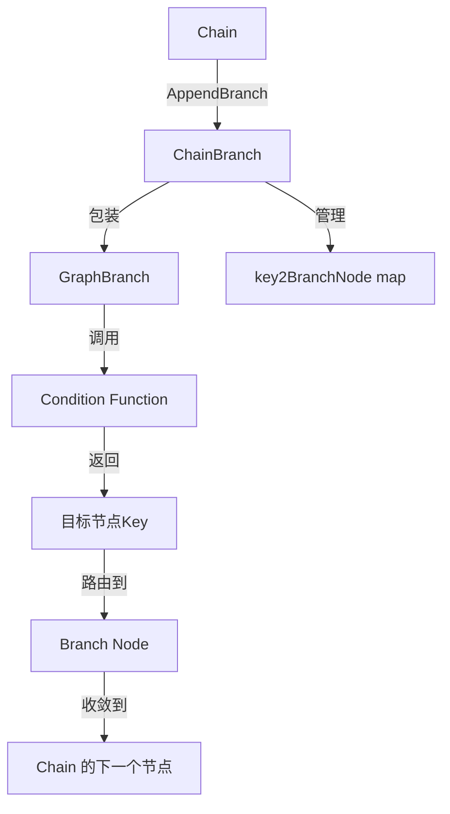

# compose-chain_branch 模块技术文档

## 1. 模块概述

`compose-chain_branch` 模块提供了在 Chain 中创建条件分支的能力。它允许开发者根据运行时输入动态选择不同的执行路径，为 LLM 应用提供了灵活的控制流支持。这个模块是 EINO 框架中 Chain 构建系统的关键扩展，使线性的执行流程能够转向更复杂的条件逻辑。

## 2. 架构设计

### 核心组件关系图



## 3. 核心组件详解

### 3.1 ChainBranch 结构体

```go
type ChainBranch struct {
    internalBranch *GraphBranch
    key2BranchNode map[string]nodeOptionsPair
    err            error
}
```

**设计意图**：`ChainBranch` 作为用户友好的条件分支构建器，封装了底层复杂的 `GraphBranch` 逻辑，提供了流畅的构建接口。它维护了一个从分支键到实际节点的映射，以及可能的构建错误。

### 3.2 构造函数族

#### NewChainBranch / NewStreamChainBranch

这两个函数用于创建单一路由的条件分支：

```go
func NewChainBranch[T any](cond GraphBranchCondition[T]) *ChainBranch
func NewStreamChainBranch[T any](cond StreamGraphBranchCondition[T]) *ChainBranch
```

**设计决策**：这两个函数内部都委托给了 `NewChainMultiBranch`，将单一路由转换为多选一路由。这种设计避免了代码重复，保持了接口的一致性。

#### NewChainMultiBranch / NewStreamChainMultiBranch

```go
func NewChainMultiBranch[T any](cond GraphMultiBranchCondition[T]) *ChainBranch
func NewStreamChainMultiBranch[T any](cond StreamGraphMultiBranchCondition[T]) *ChainBranch
```

**设计意图**：这两个构造函数支持同时选择多个分支，实现并行执行多条路径的能力。它们会创建包装好的 `GraphBranch` 内部实例，处理类型安全和错误检查。

### 3.3 节点添加方法

`ChainBranch` 提供了丰富的节点添加方法，支持所有主要的 EINO 组件类型：

- `AddChatModel`
- `AddChatTemplate` 
- `AddToolsNode`
- `AddLambda`
- `AddEmbedding`
- `AddRetriever`
- `AddLoader`
- `AddIndexer`
- `AddDocumentTransformer`
- `AddGraph`
- `AddPassthrough`

这些方法都遵循相同的模式，将不同类型的组件转换为统一的 `graphNode` 表示，并通过私有 `addNode` 方法管理。

**设计意图**：这种 API 设计保持了与 `Chain` 的一致性，允许开发者使用熟悉的模式构建复杂的分支逻辑。

### 3.4 私有 addNode 方法

```go
func (cb *ChainBranch) addNode(key string, node *graphNode, options *graphAddNodeOpts) *ChainBranch
```

**设计意图**：这个方法实现了防御性编程的最佳实践：
1. 先检查是否已有错误，有则直接返回
2. 初始化必要的数据结构
3. 检查键的唯一性，防止重复添加
4. 使用链式调用风格，支持流畅的 API

## 4. 数据流程

让我们追踪一下条件分支在 Chain 中的完整执行流程：

1. **构建阶段**：
   - 开发者创建 `Chain` 实例
   - 使用 `NewChainBranch` 或其变体创建 `ChainBranch`
   - 通过 `Add*` 方法添加各个分支节点
   - 调用 `Chain.AppendBranch` 将分支集成到链中

2. **集成阶段**（在 `AppendBranch` 中）：
   - 验证分支的有效性（至少两个节点，非空等）
   - 为每个分支节点分配唯一的键
   - 包装条件函数，将逻辑键映射到实际节点键
   - 调用 `Graph.AddBranch` 添加底层图分支

3. **执行阶段**：
   - 当执行到分支节点时，调用条件函数
   - 条件函数根据输入返回目标键
   - 系统将输入路由到对应的分支节点
   - 分支节点执行完成后，输出继续流向 Chain 的下一个节点

## 5. 设计决策与权衡

### 5.1 委托给 GraphBranch 而非直接实现

**决策**：`ChainBranch` 不直接实现条件逻辑，而是包装 `GraphBranch`

**原因**：
- 复用成熟的 `GraphBranch` 实现，减少重复代码
- 保持 API 分层：`Chain` 是高级构建器，`Graph` 是底层执行引擎
- 允许未来改进 `GraphBranch` 而无需修改 `ChainBranch`

**权衡**：增加了一层间接性，但获得了更好的模块化和可维护性。

### 5.2 单分支和多分支的统一抽象

**决策**：`NewChainBranch` 内部调用 `NewChainMultiBranch`，将单选择建模为多选一

**原因**：
- 减少代码重复
- 保持接口的一致性
- 更容易理解：单分支是多分支的特例

**权衡**：在简单情况下有轻微的性能开销，但代码简洁性收益更大。

### 5.3 错误延迟报告模式

**决策**：`ChainBranch` 内部存储错误状态，而不是立即返回错误

**原因**：
- 支持流畅的链式 API：`cb.AddX(...).AddY(...)`
- 将错误检查集中到最后编译阶段

**权衡**：错误发现延迟，但 API 体验更好。

### 5.4 分支节点键的双重映射

**决策**：在 `AppendBranch` 时，将用户指定的键映射到内部生成的唯一键

**原因**：
- 避免与 Chain 中其他节点的键冲突
- 允许用户使用有意义的键进行条件判断
- 提供命名空间隔离

**权衡**：增加了一层映射复杂性，但提供了更好的封装和安全性。

## 6. 使用指南与示例

### 6.1 基本用法：单条件分支

```go
// 1. 创建条件函数
condition := func(ctx context.Context, input string) (string, error) {
    if input == "happy" {
        return "positive", nil
    }
    return "negative", nil
}

// 2. 创建分支并添加节点
cb := compose.NewChainBranch(condition).
    AddLambda("positive", compose.InvokableLambda(func(ctx context.Context, in string) (string, error) {
        return "Great to hear you're happy!", nil
    })).
    AddLambda("negative", compose.InvokableLambda(func(ctx context.Context, in string) (string, error) {
        return "Sorry to hear that.", nil
    }))

// 3. 附加到链
chain := compose.NewChain[string, string]()
chain.AppendBranch(cb)

// 4. 编译并使用
runnable, _ := chain.Compile(context.Background())
result, _ := runnable.Invoke(context.Background(), "happy")
// result: "Great to hear you're happy!"
```

### 6.2 多分支选择

```go
// 创建多选条件
multiCondition := func(ctx context.Context, input string) (map[string]bool, error) {
    // 同时选择两个分支
    return map[string]bool{
        "analysis": true,
        "summary": true,
    }, nil
}

cb := compose.NewChainMultiBranch(multiCondition).
    AddLambda("analysis", analysisLambda, compose.WithOutputKey("analysis")).
    AddLambda("summary", summaryLambda, compose.WithOutputKey("summary"))

// 结果会是一个包含 "analysis" 和 "summary" 键的 map
```

### 6.3 流式条件分支

```go
// 基于流的条件 - 可以读取流的第一部分来决定
streamCondition := func(ctx context.Context, sr *schema.StreamReader[string]) (string, error) {
    // 读取第一个元素来决定
    firstChunk, err := sr.Recv()
    if err != nil {
        return "", err
    }
    
    if strings.HasPrefix(firstChunk, "query:") {
        return "query_handler", nil
    }
    return "command_handler", nil
}

cb := compose.NewStreamChainBranch(streamCondition).
    AddLambda("query_handler", queryHandler).
    AddLambda("command_handler", commandHandler)
```

## 7. 注意事项与常见陷阱

### 7.1 分支节点必须收敛

**重要**：所有分支路径要么直接结束 Chain，要么必须收敛到 Chain 的同一个后续节点。

如果在分支之后没有添加共同的后续节点，且分支节点没有直接结束 Chain，会导致编译错误。

### 7.2 条件函数必须返回有效键

条件函数返回的键必须与添加到 `ChainBranch` 的键完全匹配，否则会导致运行时错误。

### 7.3 类型一致性

所有分支节点的输入类型必须与 Chain 的当前输入类型兼容，且它们的输出类型必须与 Chain 的下一个节点的输入类型兼容。

### 7.4 至少两个分支

`ChainBranch` 必须至少包含两个分支节点，否则 `AppendBranch` 会报告错误。

### 7.5 键的唯一性

在同一个 `ChainBranch` 中，每个节点的键必须唯一。

### 7.6 编译后不可修改

与 Chain 一样，一旦 Chain 被编译，就不能再修改其结构，包括添加分支。

## 8. 与其他模块的关系

- **[compose](compose.md)**：`ChainBranch` 是 compose 包的一部分，与 `Chain`、`Parallel` 等共同构成高级构建 API。
- **[compose-branch](compose-branch.md)**：`ChainBranch` 内部使用 `GraphBranch`，后者提供了底层图分支实现。
- **[compose-chain](compose-chain.md)**：`ChainBranch` 被设计为与 `Chain` 一起使用，通过 `AppendBranch` 方法集成。

## 9. 总结

`compose-chain_branch` 模块为 EINO 框架的 Chain 构建系统提供了强大的条件分支能力。它通过优雅的 API 设计，将复杂的图操作包装为用户友好的接口，使开发者能够轻松构建具有动态路由逻辑的 LLM 应用。该模块的设计体现了良好的软件工程实践：分层抽象、代码复用、防御性编程和流畅的 API 设计。
