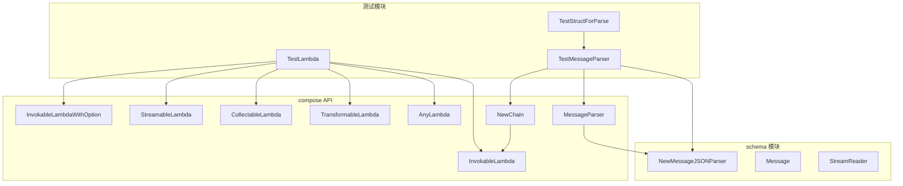

# Lambda 选项解析测试夹具技术深度解析

## 1. 模块概述

`lambda_option_parsing_test_fixture` 模块是 compose 图引擎测试套件中的核心组件，专门负责测试 lambda 函数选项解析和消息解析器的功能。这个模块通过提供测试基础设施，验证了 compose 引擎中各种类型 lambda 函数的选项配置和消息处理能力的正确性。

## 2. 问题空间与设计意图

### 2.1 解决的核心问题

在 compose 图引擎中，lambda 函数作为工作流的基本构建块，支持多种不同的输入输出模式：
- 单次调用 (Invokable)
- 流式输出 (Streamable)
- 流式输入收集 (Collectable)
- 流式输入输出转换 (Transformable)

同时，这些 lambda 函数需要支持统一的选项配置机制，如回调开关、组件类型标识等。这个测试模块确保了：

1. 所有类型的 lambda 函数正确处理选项配置
2. 消息解析器能够正确从不同来源解析结构化数据
3. lambda 函数与 compose 链的集成工作正常

### 2.2 设计洞察

模块采用了**测试作为规范**的设计理念，通过全面的测试用例定义了 lambda 选项解析和消息处理的预期行为。这种方法确保了：
- 行为一致性：所有 lambda 类型遵循相同的选项处理模式
- 可扩展性：新增 lambda 类型时可以复用现有测试框架
- 文档化：测试用例本身就是功能规范的最佳文档

## 3. 核心组件解析

### 3.1 TestStructForParse - 测试数据结构

```go
type TestStructForParse struct {
    ID int `json:"id"`
}
```

这个简单的结构体专门用于测试消息解析功能，它包含一个带有 JSON 标签的 `ID` 字段，模拟了实际应用中常见的结构化数据类型。

### 3.2 TestLambda - Lambda 选项解析测试

这是模块的核心测试函数，它包含五个子测试，分别验证不同类型 lambda 的行为：

#### 3.2.1 InvokableLambda 测试

验证两种创建可调用 lambda 的方式：
- `InvokableLambdaWithOption`：接受带选项参数的函数签名
- `InvokableLambda`：接受不带选项参数的函数签名

两种方式都能正确应用选项配置，特别是：
- 回调启用状态 (`isComponentCallbackEnabled`)
- 组件类型标识 (`component`)
- 组件实现类型 (`componentImplType`)

#### 3.2.2 StreamableLambda 测试

类似于 InvokableLambda，但测试的是返回流式输出的 lambda 函数。验证了：
- 流处理 lambda 也能正确应用选项配置
- 元数据设置与非流式 lambda 保持一致

#### 3.2.3 CollectableLambda 测试

测试接受流式输入并生成非流式输出的 lambda 函数。注意到这个测试特意没有设置 `componentImplType`，这反映了不同 lambda 类型的元数据配置策略差异。

#### 3.2.4 TransformableLambda 测试

验证同时接受流式输入并产生流式输出的转换型 lambda。与 CollectableLambda 类似，这个测试也不设置 `componentImplType`。

#### 3.2.5 AnyLambda 测试

这是最全面的测试，验证了同时提供所有四种 lambda 实现的 `AnyLambda` 函数。测试确保：
- 所有 lambda 实现可以协同工作
- 选项配置被正确传播到组合的 lambda 中
- 类型安全得到保证

### 3.3 TestMessageParser - 消息解析测试

这个测试验证 `MessageParser` 函数的功能，它包含两个子测试：

#### 3.3.1 从内容解析测试

验证解析器可以从消息的 `Content` 字段提取 JSON 数据并反序列化为目标类型。测试流程：
1. 创建配置为从 `Content` 解析的解析器
2. 将解析器包装为 lambda
3. 构建 compose 链并编译
4. 调用链并传入包含 JSON 的消息
5. 验证解析结果正确

#### 3.3.2 从工具调用解析测试

验证解析器可以从消息的 `ToolCalls` 字段提取函数调用参数并反序列化。流程与前一个测试类似，但输入数据位于不同位置。

## 4. 架构与数据流

### 4.1 组件关系



### 4.2 数据流分析

#### Lambda 选项测试数据流

1. **测试初始化**：`TestLambda` 创建各种类型的测试 lambda 函数
2. **选项应用**：选项函数（如 `WithLambdaCallbackEnable`）被传递给 lambda 创建函数
3. **内部状态设置**：lambda 创建函数将选项应用到内部 executor 元数据
4. **验证检查**：测试直接检查 lambda 内部状态以确认选项正确应用

#### 消息解析测试数据流

1. **解析器创建**：使用 `schema.NewMessageJSONParser` 创建配置好的解析器
2. **Lambda 包装**：`MessageParser` 将解析器转换为 compose lambda
3. **链构建**：`NewChain` 创建类型安全的 compose 链，添加解析器 lambda
4. **链编译**：`Compile` 准备链执行
5. **调用与处理**：
   - 输入 `schema.Message` 传递给编译后的链
   - 链调用解析器 lambda
   - 解析器从消息中提取 JSON 并反序列化为 `TestStructForParse`
6. **结果验证**：测试检查解析结果是否符合预期

## 5. 设计决策与权衡

### 5.1 白盒测试策略

**决策**：测试直接访问 lambda 内部状态（如 `ld.executor.meta`）进行验证。

**权衡**：
- **优点**：能够精确验证内部状态，测试更全面
- **缺点**：测试与实现细节耦合，重构时可能需要更新测试

**理由**：对于核心基础设施组件，确保内部状态正确比测试独立性更重要。

### 5.2 测试结构体设计

**决策**：创建专用的 `TestStructForParse` 而非复用现有类型。

**权衡**：
- **优点**：测试自包含，不依赖外部类型定义
- **缺点**：增加了少量代码重复

**理由**：保持测试的独立性和可靠性，避免因外部类型变化导致测试失败。

### 5.3 选项应用一致性

**决策**：所有 lambda 类型使用相同的选项应用机制。

**权衡**：
- **优点**：API 一致性好，用户学习成本低
- **缺点**：某些 lambda 类型可能不需要所有选项

**理由**：统一的 API 设计比微优化更重要，便于用户理解和使用。

## 6. 使用指南与示例

### 6.1 基本使用模式

模块主要作为测试基础设施使用，但通过分析测试用例，我们可以了解如何正确使用 compose 的 lambda 功能：

```go
// 创建带选项的可调用 lambda
ld := InvokableLambdaWithOption(
    func(ctx context.Context, input string, opts ...any) (output string, err error) {
        return "result", nil
    },
    WithLambdaCallbackEnable(false),
    WithLambdaType("MyCustomType"),
)

// 创建消息解析 lambda
parser := schema.NewMessageJSONParser[MyStruct](&schema.MessageJSONParseConfig{
    ParseFrom: schema.MessageParseFromContent,
})
parserLambda := MessageParser(parser)

// 在链中使用
chain := NewChain[*schema.Message, MyStruct]()
chain.AppendLambda(parserLambda)
```

### 6.2 扩展点

虽然这是一个测试模块，但它展示了几个扩展点：

1. **自定义解析器**：通过实现类似 `MessageParser` 的函数，可以将任何解析逻辑包装为 compose lambda
2. **新 lambda 类型**：可以参照现有测试模式，为新的 lambda 类型编写测试
3. **自定义选项**：通过创建新的 `WithXxx` 函数，可以扩展 lambda 的配置选项

## 7. 注意事项与潜在问题

### 7.1 测试维护

- **内部状态访问**：测试直接访问 `ld.executor.meta`，如果内部结构重构，这些测试需要更新
- **类型安全**：使用 `AnyLambda` 时要特别注意类型一致性，测试用例提供了良好的参考

### 7.2 实现细节

- 不是所有 lambda 类型都设置 `componentImplType`，这是设计决策而非错误
- `CollectableLambda` 和 `TransformableLambda` 默认启用回调，而其他类型默认禁用

### 7.3 消息解析边界情况

- 当 JSON 解析失败时，错误处理机制依赖于 `schema.MessageJSONParser` 的实现
- 从 `ToolCalls` 解析时，如果有多个工具调用，解析器会使用第一个

## 8. 相关模块

- [compose-graph_and_workflow_test_harnesses-graph_invocation_and_chain_option_test_fixtures](compose-graph_and_workflow_test_harnesses-graph_invocation_and_chain_option_test_fixtures.md) - 相关的链选项测试
- [compose-composition_api_and_workflow_primitives-composable_graph_types_and_lambda_options](compose-composition_api_and_workflow_primitives-composable_graph_types_and_lambda_options.md) - Lambda 类型定义
- [schema_models_and_streams](schema_models_and_streams.md) - 消息和流处理基础类型
