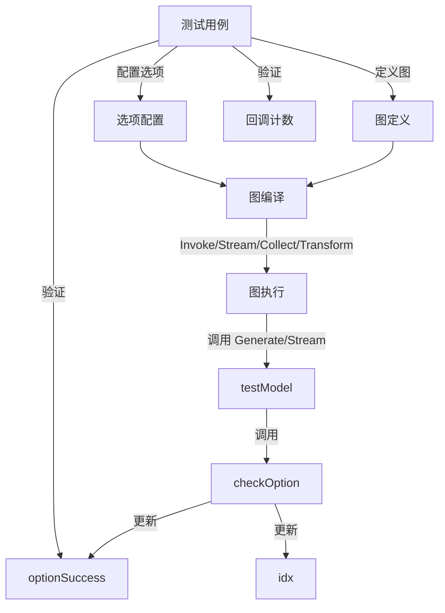

# model_test_infrastructure 模块技术深度解析

## 1. 模块概览

`model_test_infrastructure` 模块是 `compose_graph_engine` 测试框架的核心组件，专门用于测试图执行引擎中模型相关选项的传递和应用机制。简单来说，它解决的问题是：**如何验证在复杂的图执行流程中，模型调用选项能够正确地从调用端传递到目标模型节点，并且在不同的调用模式（Invoke/Stream/Collect/Transform）和图结构（普通图/子图）下都能正常工作**。

## 2. 核心问题与设计洞察

### 问题背景

在图执行引擎中，我们面临一个挑战：当用户构建一个包含多个节点（尤其是多个模型节点）的复杂图时，如何确保：

1. **选项的精确传递**：用户可以为不同的模型节点指定不同的选项
2. **选项的全局应用**：用户可以为所有模型节点指定通用选项
3. **选项的层级继承**：在嵌套子图结构中，选项能够正确地从父图传递到子图
4. **调用模式的一致性**：无论使用 `Invoke`、`Stream`、`Collect` 还是 `Transform` 方法，选项都能正常工作

一个简单的解决方案是直接在图定义时将选项硬编码到每个节点中，但这会导致：
- 图的定义与调用参数耦合
- 无法在运行时动态调整选项
- 测试困难（需要为每种选项组合创建不同的图）

### 设计洞察

本模块的核心设计洞察是：**将选项的指定延迟到调用时刻，并通过节点标识（节点名称或节点路径）来精确控制选项的应用对象**。这种设计实现了：

- 图定义与选项配置的解耦
- 运行时动态配置选项的灵活性
- 支持全局选项与节点特定选项的组合
- 支持子图中选项的精准定位

## 3. 核心组件深度解析

### 3.1 testModel 结构体

`testModel` 是模块的核心组件，它是一个测试用的模型实现，用于验证选项是否正确传递。

```go
type testModel struct{}
```

**设计意图**：
`testModel` 不是一个真正的模型，而是一个**选项验证器**。它的存在是为了在不依赖真实模型实现的情况下，验证图执行引擎是否正确地将选项传递到了模型节点。

**核心方法**：

#### BindTools
```go
func (t *testModel) BindTools(tools []*schema.ToolInfo) error {
    return nil
}
```
这是一个空实现，因为在选项测试中我们不需要测试工具绑定功能。

#### Generate
```go
func (t *testModel) Generate(ctx context.Context, input []*schema.Message, opts ...model.Option) (*schema.Message, error) {
    if !checkOption(opts...) {
        optionSuccess = false
    }
    return &schema.Message{}, nil
}
```

**设计解析**：
- 不实际生成消息，只验证选项
- 通过调用 `checkOption` 来验证传入的选项是否符合预期
- 使用全局变量 `optionSuccess` 来记录验证结果（这是测试代码中常用的模式）

#### Stream
```go
func (t *testModel) Stream(ctx context.Context, input []*schema.Message, opts ...model.Option) (*schema.StreamReader[*schema.Message], error) {
    if !checkOption(opts...) {
        optionSuccess = false
    }
    sr, sw := schema.Pipe[*schema.Message](1)
    sw.Send(nil, nil)
    sw.Close()
    return sr, nil
}
```

**设计解析**：
- 与 `Generate` 类似，但用于流式调用
- 创建一个简单的管道，发送一个空消息后立即关闭，模拟流式响应
- 同样验证选项并更新 `optionSuccess`

### 3.2 checkOption 函数

```go
func checkOption(opts ...model.Option) bool {
    if len(opts) != 2 {
        return false
    }
    o := model.GetCommonOptions(&model.Options{}, opts...)
    if o.TopP == nil || *o.TopP != 1.0 {
        return false
    }
    if o.Model == nil {
        return false
    }
    if idx == 0 {
        idx = 1
        if o.Model == nil || *o.Model != "123" {
            return false
        }
    } else {
        idx = 0
        if o.Model == nil || *o.Model != "456" {
            return false
        }
    }

    return true
}
```

**设计意图**：
这是一个**状态化的选项验证器**，它通过全局变量 `idx` 来跟踪调用顺序，从而验证不同的节点是否接收到了正确的选项。

**验证逻辑**：
1. 检查选项数量是否为 2（一个通用选项 + 一个节点特定选项）
2. 检查 `TopP` 是否为 1.0（通用选项）
3. 根据调用顺序检查 `Model` 名称是否正确（第一个节点应该是 "123"，第二个节点应该是 "456"）

**设计解析**：
- 使用全局变量 `idx` 来维护状态是测试代码中的常见做法，虽然在生产代码中不推荐，但在测试中可以简化验证逻辑
- 通过交替检查 "123" 和 "456"，可以验证图中两个不同的模型节点都接收到了正确的选项
- 同时验证通用选项（`TopP`）和节点特定选项（`Model`），确保两者都能正确传递

## 4. 数据流程与架构角色

### 4.1 架构定位

`model_test_infrastructure` 模块在整个系统中的架构角色是**测试基础设施**，它位于：
- **上游**：`compose_graph_engine` 的图执行核心
- **下游**：各种模型组件的接口定义

它不直接参与生产环境的图执行，而是用于验证图执行引擎的选项传递机制是否正确。

### 4.2 数据流程

让我们通过 `TestCallOption` 测试用例来追踪数据流程：

1. **图定义阶段**：
   - 创建一个包含 5 个节点的图：START → "1" (Lambda) → "2" (ChatModel) → "-" (Lambda) → "3" (ChatModel) → END
   - 节点 "2" 和 "3" 都使用 `testModel` 实例

2. **选项配置阶段**：
   ```go
   opts := []Option{
       WithChatModelOption(model.WithModel("123")).DesignateNode("2"),
       WithChatModelOption(model.WithModel("456")).DesignateNode("3"),
       WithChatModelOption(model.WithTopP(1.0)),
       // ... 其他选项
   }
   ```
   这里配置了：
   - 为节点 "2" 指定模型名称 "123"
   - 为节点 "3" 指定模型名称 "456"
   - 为所有模型节点指定 `TopP` 为 1.0

3. **图执行阶段**（以 `Invoke` 为例）：
   - 调用 `r.Invoke(ctx, []*schema.Message{}, opts...)`
   - 图执行引擎按顺序执行节点
   - 当执行到节点 "2" 时，调用 `testModel.Generate`，传入选项 `[model.WithTopP(1.0), model.WithModel("123")]`
   - `checkOption` 验证选项，设置 `idx` 为 1
   - 当执行到节点 "3" 时，调用 `testModel.Generate`，传入选项 `[model.WithTopP(1.0), model.WithModel("456")]`
   - `checkOption` 验证选项，设置 `idx` 为 0

4. **验证阶段**：
   - 检查 `optionSuccess` 是否为 `true`
   - 检查回调是否正确触发

### 4.3 Mermaid 流程图



## 5. 设计决策与权衡

### 5.1 使用全局变量维护状态

**决策**：使用全局变量 `optionSuccess` 和 `idx` 来维护测试状态。

**权衡分析**：
- **优点**：
  - 简化了测试代码的结构，不需要在多个组件之间传递状态
  - 使得 `testModel` 和 `checkOption` 可以独立工作，不需要额外的依赖注入
- **缺点**：
  - 全局变量使得测试不是完全独立的，一个测试的失败可能会影响另一个测试
  - 不适合并行测试
- **为什么这个选择是合理的**：
  - 这是一个测试模块，不是生产代码
  - 测试用例都是串行执行的，不会有并发问题
  - 简化的代码结构使得测试逻辑更清晰，更容易理解和维护

### 5.2 延迟选项配置到调用时刻

**决策**：不在图定义时配置选项，而是在调用时通过 `WithChatModelOption` 等方法配置。

**权衡分析**：
- **优点**：
  - 图定义与选项配置解耦，同一个图可以用于不同的选项配置
  - 支持运行时动态调整选项
  - 更灵活，可以为不同的调用场景指定不同的选项
- **缺点**：
  - 增加了调用时的复杂度，需要传递更多的参数
  - 选项的验证延迟到调用时刻，而不是图定义时刻
- **为什么这个选择是合理的**：
  - 这是图执行引擎的核心设计理念之一，提供了极大的灵活性
  - 在实际应用中，用户经常需要根据不同的场景调整模型参数
  - 这种设计使得图可以被复用，提高了代码的可维护性

### 5.3 通过节点标识精确控制选项应用

**决策**：使用 `DesignateNode` 和 `DesignateNodeWithPath` 来精确控制选项应用到哪个节点。

**权衡分析**：
- **优点**：
  - 可以为不同的节点指定不同的选项
  - 支持全局选项和节点特定选项的组合
  - 在嵌套子图结构中也能精确定位节点
- **缺点**：
  - 需要节点有唯一的标识，增加了图定义的复杂度
  - 节点路径的概念对于新手来说可能不太直观
- **为什么这个选择是合理的**：
  - 在复杂的图结构中，精确控制是必须的
  - 这种设计与图执行引擎的整体架构保持一致
  - 提供了足够的灵活性，同时保持了使用的简洁性（大多数情况下只需要使用 `DesignateNode`）

## 6. 使用指南与最佳实践

### 6.1 基本使用模式

以下是使用 `model_test_infrastructure` 的基本模式：

```go
// 1. 创建测试模型
tm := &testModel{}

// 2. 创建图并添加模型节点
g := NewGraph[[]*schema.Message, *schema.Message]()
err := g.AddChatModelNode("model1", tm)
err = g.AddChatModelNode("model2", tm)

// 3. 编译图
r, err := g.Compile(ctx)

// 4. 配置选项
opts := []Option{
    WithChatModelOption(model.WithModel("model1-name")).DesignateNode("model1"),
    WithChatModelOption(model.WithModel("model2-name")).DesignateNode("model2"),
    WithChatModelOption(model.WithTopP(1.0)), // 全局选项
}

// 5. 执行图
_, err = r.Invoke(ctx, []*schema.Message{}, opts...)

// 6. 验证结果
if !optionSuccess {
    t.Fatal("选项传递失败")
}
```

### 6.2 子图中的选项配置

在嵌套子图结构中，使用 `DesignateNodeWithPath` 来精确定位节点：

```go
// 配置子图中的节点
opts := []Option{
    WithLambdaOption(childOption("child-value")).DesignateNodeWithPath(NewNodePath("parent-node", "child-node", "grandchild-node")),
}
```

### 6.3 测试不同的调用模式

`model_test_infrastructure` 支持测试所有四种调用模式：

```go
// Invoke
_, err = r.Invoke(ctx, []*schema.Message{}, opts...)

// Stream
_, err = r.Stream(ctx, []*schema.Message{}, opts...)

// Collect
srOfCollect, swOfCollect := schema.Pipe[[]*schema.Message](1)
swOfCollect.Send([]*schema.Message{}, nil)
swOfCollect.Close()
_, err = r.Collect(ctx, srOfCollect, opts...)

// Transform
srOfTransform, swOfTransform := schema.Pipe[[]*schema.Message](1)
swOfTransform.Send([]*schema.Message{}, nil)
swOfTransform.Close()
_, err = r.Transform(ctx, srOfTransform, opts...)
```

## 7. 注意事项与常见陷阱

### 7.1 全局变量的状态重置

**问题**：由于 `optionSuccess` 和 `idx` 是全局变量，一个测试用例的执行会影响另一个测试用例。

**解决方案**：在每个测试用例开始时重置这些变量：

```go
func TestMyTest(t *testing.T) {
    optionSuccess = true
    idx = 0
    // ... 测试代码
}
```

### 7.2 节点标识的唯一性

**问题**：如果图中有多个节点具有相同的名称，选项可能会应用到错误的节点。

**解决方案**：确保每个节点都有唯一的名称，或者使用 `WithNodeName` 来明确指定节点名称。

### 7.3 子图节点路径的正确性

**问题**：在嵌套子图结构中，节点路径容易出错。

**解决方案**：
- 使用 `NewNodePath` 来构建节点路径
- 确保路径的每一部分都正确对应图的嵌套结构
- 在测试中打印出实际的节点路径，以便调试

### 7.4 选项的应用顺序

**问题**：如果同时指定了全局选项和节点特定选项，它们的应用顺序可能会影响结果。

**解决方案**：
- 节点特定选项会覆盖全局选项
- 在 `checkOption` 中，选项的顺序是：全局选项在前，节点特定选项在后

## 8. 依赖关系分析

### 8.1 依赖的模块

`model_test_infrastructure` 模块依赖以下模块：

- **[model_interface](../components_core-model_and_prompting-model_interfaces_and_options-model_interface.md)**：定义了模型组件的接口
- **[schema](../schema_models_and_streams.md)**：定义了消息、文档等核心数据结构
- **[callbacks](../callbacks_and_handler_templates.md)**：定义了回调机制
- **[compose](../compose_graph_engine.md)**：图执行引擎的核心定义

### 8.2 被依赖的模块

`model_test_infrastructure` 是一个测试模块，主要被以下模块使用：

- **[graph_invocation_and_chain_option_test_fixtures](./compose-graph_engine-graph_and_workflow_test_harnesses-graph_invocation_and_chain_option_test_fixtures.md)**：图调用和链选项测试的基础设施
- 其他需要测试模型选项传递的测试模块

## 9. 总结

`model_test_infrastructure` 模块是一个专门的测试基础设施，用于验证图执行引擎中模型选项的传递机制。它的核心设计思想是：

1. **使用测试替身**：通过 `testModel` 来替代真实模型，专注于验证选项传递
2. **状态化验证**：通过全局变量维护状态，验证不同节点接收到的选项
3. **延迟配置**：将选项配置延迟到调用时刻，提供灵活性
4. **精确控制**：通过节点标识精确控制选项的应用对象

这个模块虽然简单，但它确保了图执行引擎的一个核心功能——选项传递——在各种复杂场景下都能正常工作。它的设计思路和实现方式也为其他组件的测试提供了很好的参考。
