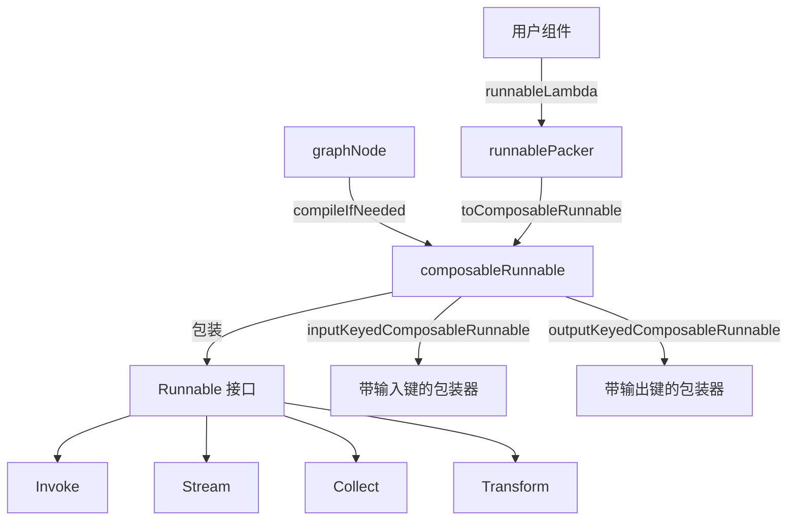

# node_execution_and_runnable_abstractions 模块深度解析

## 概述

想象一下，你正在构建一个智能工作流编排系统，需要处理各种不同的组件：有些组件只能一次处理一个输入并返回完整输出（同步调用），有些组件能流式输出结果，还有些组件只能处理流式输入。如果没有一个统一的抽象层，你需要为每一种组合写特殊的适配代码，这会导致系统变得极其复杂且难以维护。

`node_execution_and_runnable_abstractions` 模块就是为了解决这个问题而设计的。它提供了一套统一的抽象，让你可以用相同的方式处理不同类型的可执行组件，无论它们是同步的、流式的、还是混合的。这个模块是整个 `compose_graph_engine` 的核心执行层，负责将图节点转换为可执行单元，并处理它们之间的数据流转。

## 核心概念与心智模型

### Runnable 接口：四种执行模式

在深入代码之前，让我们先理解这个模块的核心抽象——`Runnable` 接口。它定义了四种执行模式：

```go
type Runnable[I, O any] interface {
    Invoke(ctx context.Context, input I, opts ...Option) (output O, err error)
    Stream(ctx context.Context, input I, opts ...Option) (output *schema.StreamReader[O], err error)
    Collect(ctx context.Context, input *schema.StreamReader[I], opts ...Option) (output O, err error)
    Transform(ctx context.Context, input *schema.StreamReader[I], opts ...Option) (output *schema.StreamReader[O], err error)
}
```

这四种模式可以用一个简单的比喻来理解：

- **Invoke**：像打电话——你说一句话（输入），对方听完后给你一个完整的回复（输出）
- **Stream**：像视频通话——你说一句话，对方一边说你一边听（流式输出）
- **Collect**：像听语音留言——对方留了一段语音（流式输入），你听完后给一个回复
- **Transform**：像实时翻译——对方一边说（流式输入），你一边翻译（流式输出）

### composableRunnable：统一的执行包装器

现在，想象一下你有一个组件只实现了 Stream 方法，但你想用 Invoke 的方式调用它。这就是 `composableRunnable` 发挥作用的地方。它是一个智能的包装器，能够：

1. 接受用户提供的任何可执行对象
2. 自动填充缺失的执行方法（比如用 Stream 实现 Invoke）
3. 处理类型转换和泛型逻辑
4. 管理回调和元数据

### graphNode：图中的执行节点

在图的世界里，`graphNode` 代表了图中的一个节点。它包含了：
- 可执行的组件（可以是另一个图，也可以是一个简单的组件）
- 节点的元信息（名称、输入输出键、预处理/后处理器）
- 执行器的元数据（组件类型、回调支持等）

## 架构与数据流

让我们用一个 Mermaid 图来展示这个模块的核心架构：



### 典型的数据流路径

让我们追踪一个图节点从定义到执行的完整生命周期：

1. **节点创建阶段**：用户通过 `addNode` 将一个组件添加到图中，系统创建一个 `graphNode` 实例，包含 `nodeInfo`（从选项中解析）和 `executorMeta`（从组件中解析）。

2. **编译阶段**：当图被编译时，`graphNode.compileIfNeeded()` 被调用：
   - 如果节点包含子图，先编译子图得到 `composableRunnable`
   - 应用输出键包装器（如果有）
   - 应用输入键包装器（如果有）
   - 返回最终的 `composableRunnable`

3. **执行阶段**：调用 `composableRunnable` 的四种执行方法之一：
   - 根据可用的实现，选择最优的执行路径
   - 处理类型转换和错误
   - 执行回调（如果启用）

## 关键设计决策

### 1. 四种执行模式的自动适配

**决策**：实现了完整的四种执行模式之间的自动转换逻辑。

**为什么这样设计**：
- 灵活性：用户只需要实现他们组件最自然的执行方式，其他方式自动获得
- 兼容性：可以轻松集成各种不同的组件，无论它们支持哪种执行模式
- 性能优化：系统会优先使用组件原生支持的方式，避免不必要的转换开销

**权衡**：
- 优点：极大提高了系统的灵活性和易用性
- 缺点：增加了代码的复杂性，需要维护大量的转换逻辑
- 注意：某些转换可能会有性能开销，比如用 Invoke 实现 Stream 会失去真正的流式特性

### 2. 类型安全与反射的平衡

**决策**：使用泛型定义接口，但在内部使用反射进行类型处理。

**为什么这样设计**：
- 公共 API 使用泛型，提供了类型安全和良好的开发者体验
- 内部使用反射，避免了泛型带来的代码膨胀，同时保持了灵活性

**权衡**：
- 优点：兼顾了类型安全和灵活性
- 缺点：反射代码难以理解和调试
- 特殊处理：代码中有专门处理 nil 接口类型的逻辑，这是 Go 语言中一个常见的陷阱

### 3. 图节点与可执行对象的分离

**决策**：将 `graphNode`（图结构层面的节点）与 `composableRunnable`（执行层面的包装器）分离。

**为什么这样设计**：
- 关注点分离：`graphNode` 负责图结构的信息，`composableRunnable` 负责执行逻辑
- 编译时优化：可以在编译阶段对 `composableRunnable` 进行各种包装和优化
- 递归支持：`graphNode` 可以包含子图，支持图的嵌套结构

**权衡**：
- 优点：结构清晰，易于扩展和维护
- 缺点：增加了一层间接性，理解起来稍微复杂一些

## 核心组件详解

本模块包含两个主要子模块，分别处理图节点抽象和可执行接口包装：
- [图节点抽象](compose_graph_engine-graph_execution_runtime-node_execution_and_runnable_abstractions-graph_node_abstractions.md)：详细介绍 `graphNode`、`nodeInfo` 和 `executorMeta` 的设计与实现
- [Runnable 接口与包装器](compose_graph_engine-graph_execution_runtime-node_execution_and_runnable_abstractions-runnable_interface_and_wrappers.md)：深入解析 `Runnable` 接口、`composableRunnable` 和 `runnablePacker`

### graphNode：图中的执行节点

`graphNode` 是图结构中的基本执行单元，它封装了用户提供的可执行对象及其相关配置。

**主要职责**：
- 存储节点的元信息（名称、输入输出键等）
- 管理可执行对象（可以是组件或子图）
- 在编译时将自身转换为 `composableRunnable`

**关键方法**：
- `compileIfNeeded`：编译节点，返回可执行的 `composableRunnable`
- `inputType`/`outputType`：获取节点的输入输出类型

**使用场景**：当你需要在图中添加一个可执行单元时，系统会创建一个 `graphNode` 来表示它。

### composableRunnable：统一的执行包装器

`composableRunnable` 是这个模块的核心，它将各种不同的可执行对象包装成统一的接口。

**主要职责**：
- 提供四种执行模式的实现
- 处理类型转换和泛型逻辑
- 管理执行器的元数据和节点信息

**关键特性**：
- 自动填充缺失的执行方法
- 支持输入输出键的包装
- 可以作为透传节点（passthrough）使用

**内部机制**：`composableRunnable` 内部只保存了 `invoke` 和 `transform` 两个函数，其他方法都是通过这两个方法组合实现的。

### runnablePacker：执行方法的打包器

`runnablePacker` 是一个辅助结构，负责将用户提供的执行方法打包成完整的四种模式。

**主要职责**：
- 根据用户提供的方法，自动填充缺失的方法
- 应用回调包装器（如果启用）
- 转换为 `composableRunnable`

**方法填充策略**：
- Invoke：优先使用用户提供的 Invoke，否则依次尝试 Stream、Collect、Transform
- Stream：优先使用用户提供的 Stream，否则依次尝试 Transform、Invoke、Collect
- Collect：优先使用用户提供的 Collect，否则依次尝试 Transform、Invoke、Stream
- Transform：优先使用用户提供的 Transform，否则依次尝试 Stream、Collect、Invoke

## 使用指南与最佳实践

### 1. 创建自定义 Runnable

如果你想创建一个自定义的可执行组件，最简单的方式是只实现你需要的方法，系统会自动处理其他方法。

```go
// 只实现 Invoke 方法
myInvoke := func(ctx context.Context, input string, opts ...Option) (string, error) {
    return "Hello, " + input, nil
}

// 系统会自动生成其他三种方法
runnable := runnableLambda(myInvoke, nil, nil, nil, true)
```

### 2. 使用输入输出键

输入输出键允许你在图中灵活地路由数据：

```go
// 假设你有一个处理用户信息的节点
// 使用 inputKey 从 map 中提取 "user" 字段作为输入
// 使用 outputKey 将输出放入 map 的 "greeting" 字段
node := graphNode{
    nodeInfo: &nodeInfo{
        inputKey: "user",
        outputKey: "greeting",
    },
    // ...
}
```

### 3. 透传节点的使用

透传节点（passthrough）是一个特殊的节点，它将输入直接传递给输出：

```go
passthrough := composablePassthrough()
// 可以用于数据路由、占位符等场景
```

## 常见陷阱与注意事项

### 1. nil 接口类型的处理

代码中有一个专门处理 nil 接口类型的逻辑，这是因为在 Go 中，一个 nil 接口值和一个类型为 nil 的接口值是不同的。当你将一个 nil 作为 `any` 类型传递时，它的类型信息会丢失，导致类型断言失败。

### 2. 流式转换的性能考虑

虽然系统可以自动在各种执行模式之间转换，但某些转换可能会有性能开销。例如，用 Invoke 实现 Stream 会将整个输出缓冲在内存中，然后再流式返回，这失去了真正的流式特性。

### 3. 回调的启用与禁用

`executorMeta` 中有一个 `isComponentCallbackEnabled` 字段，用于指示组件是否自己处理回调。如果组件自己处理回调，那么图节点级别的回调将不会被执行。这是一个重要的优化点，但也可能导致混淆。

### 4. 类型断言的 panic

代码中使用了 panic 来处理类型不匹配的情况，而不是返回错误。这意味着在调用这些方法之前，你需要确保类型是正确的，或者使用 recover 来捕获 panic。

## 与其他模块的关系

这个模块是 `compose_graph_engine` 的核心执行层，它与其他模块的关系如下：

- **上游依赖**：
  - [graph_definition_and_compile_configuration](compose-graph_engine-graph_execution_runtime-graph_definition_and_compile_configuration.md)：提供图的定义和编译配置
  - [composition_api_and_workflow_primitives](compose-graph_engine-composition_api_and_workflow_primitives.md)：提供图的构建 API

- **下游依赖**：
  - [runtime_scheduling_channels_and_handlers](compose-graph_engine-graph_execution_runtime-runtime_scheduling_channels_and_handlers.md)：负责运行时调度
  - [graph_run_and_interrupt_execution_flow](compose-graph_engine-graph_execution_runtime-graph_run_and_interrupt_execution_flow.md)：处理图的执行和中断

## 扩展点与定制化

这个模块设计了几个关键的扩展点，允许你根据需要定制行为：

1. **自定义执行方法包装**：通过 `runnablePacker.wrapRunnableCtx`，你可以为所有执行方法添加自定义的上下文包装逻辑。

2. **输入输出键处理**：`inputKeyedComposableRunnable` 和 `outputKeyedComposableRunnable` 展示了如何包装 `composableRunnable` 来改变其输入输出行为。

3. **透传节点**：`composablePassthrough` 是一个特殊的 `composableRunnable`，你可以创建类似的特殊节点来满足特定需求。

## 性能考虑

在使用这个模块时，有几个性能方面的考虑：

1. **优先使用原生支持的执行模式**：虽然系统可以自动转换，但原生支持的模式总是更高效的。

2. **避免不必要的包装**：每次包装都会增加一定的开销，只在真正需要时使用输入输出键等功能。

3. **理解流式转换的代价**：某些转换（如 Invoke 到 Stream）会失去真正的流式特性，可能导致内存使用增加。

## 总结

`node_execution_and_runnable_abstractions` 模块是整个图执行引擎的核心，它通过一套优雅的抽象解决了不同类型可执行组件的统一执行问题。它的设计体现了灵活性与实用性的平衡：

- 通过四种执行模式的自动适配，提供了极大的灵活性
- 通过类型安全的公共 API 和内部反射的结合，兼顾了易用性和性能
- 通过清晰的职责分离，使得代码结构清晰且易于扩展

理解这个模块的关键是掌握 `Runnable` 接口的四种执行模式，以及 `composableRunnable` 如何自动适配这些模式。一旦你理解了这些核心概念，整个图执行引擎的工作原理就会变得清晰起来。

要深入了解具体组件的实现细节，请参考我们的子模块文档：
- [图节点抽象](compose_graph_engine-graph_execution_runtime-node_execution_and_runnable_abstractions-graph_node_abstractions.md)
- [Runnable 接口与包装器](compose_graph_engine-graph_execution_runtime-node_execution_and_runnable_abstractions-runnable_interface_and_wrappers.md)
