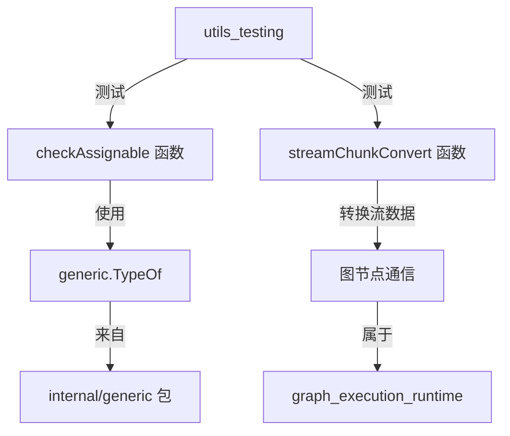

# utils_testing 模块技术深度解析

## 1. 模块概述

`utils_testing` 是 `compose_graph_engine` 框架中的一个测试辅助模块，位于 `checkpoint_state_and_utils_test_harnesses` 子树中。它的主要功能是**提供类型兼容性检查和流块转换的测试基础设施**，帮助开发者确保类型系统在复杂的图执行环境中能够正确工作。

虽然这个模块主要用于内部测试，但它体现了框架对类型安全的严格要求和深思熟虑的设计理念，这些理念贯穿整个 `compose_graph_engine` 的实现。

## 2. 问题空间与设计意图

在图执行引擎这样的复杂系统中，类型兼容性是一个核心挑战。当节点之间传递数据时，需要确保：
- 类型匹配（完全相同的类型）
- 类型兼容（可以相互赋值）
- 接口实现关系正确

一个简单的 `==` 比较无法处理这些复杂的类型关系，尤其是在处理接口类型和实现类型之间的关系时。`utils_testing` 模块就是为了解决这些问题而设计的，它通过 `checkAssignable` 函数提供了更精细的类型兼容性判断。

## 3. 核心组件与设计模式

### 3.1 测试接口与实现

模块定义了几个简单的测试接口和实现：

```go
type good interface {
    ThisIsGood() bool
}

type good2 interface {
    ThisIsGood2() bool
}

type good3 interface {
    ThisIsGood() bool
}

type goodImpl struct{}
func (g *goodImpl) ThisIsGood() bool { return true }

type goodNotImpl struct{}
```

这些看似简单的接口和实现实际上是精心设计的测试用例：
- `good` 和 `good3` 具有相同的方法签名，用于测试接口等价性
- `goodImpl` 实现了 `good` 接口，用于测试实现关系
- `goodNotImpl` 没有实现任何接口，用于测试负面情况

### 3.2 类型兼容性检查

模块的核心功能是通过 `checkAssignable` 函数实现的，该函数判断两个类型是否可以相互赋值，并返回三种可能的结果：
- `assignableTypeMust`：一定可以赋值
- `assignableTypeMustNot`：一定不能赋值  
- `assignableTypeMay`：可能可以赋值（通常发生在接口类型赋值给具体类型时）

## 4. 架构与数据流

虽然这是一个测试模块，但它的设计与 `compose_graph_engine` 的类型系统紧密相关。以下是该模块在整体架构中的位置：



### 4.1 类型检查流程

当调用 `checkAssignable(input, arg)` 时：
1. 函数首先比较两个类型是否完全相等
2. 如果不相等，检查是否存在实现关系或兼容性
3. 根据检查结果返回相应的赋值可能性

### 4.2 流块转换

`streamChunkConvertForCBInput` 和 `streamChunkConvertForCBOutput` 函数用于处理图节点之间的流数据转换，确保数据在节点之间正确传递。

## 5. 设计决策与权衡

### 5.1 三态类型兼容性判断

**决策**：使用三态（Must、MustNot、May）而非简单的布尔值来表示类型兼容性。

**原因**：在图执行环境中，有时我们无法在编译时确定类型兼容性（例如接口到具体类型的赋值），但我们仍然需要做出安全的判断。三态判断提供了更丰富的信息，帮助框架在不同场景下做出正确的决策。

**权衡**：增加了逻辑复杂度，但提供了更精确的类型检查能力。

### 5.2 接口等价性检查

**决策**：不仅检查类型是否完全相等，还检查接口是否具有相同的方法集。

**原因**：在 Go 中，两个具有相同方法集的接口是等价的，即使它们有不同的名称。这对于图节点之间的类型兼容性检查非常重要。

**权衡**：需要更复杂的类型比较逻辑，但符合 Go 语言的接口设计理念。

## 6. 使用场景与示例

虽然这个模块主要用于内部测试，但它的设计理念贯穿整个 `compose_graph_engine`：

### 6.1 节点连接时的类型检查

当连接两个图节点时，框架会使用类似 `checkAssignable` 的逻辑来确保节点之间的数据可以正确传递：

```go
// 假设这是框架中的代码
outputType := node1.OutputType()
inputType := node2.InputType()

compatibility := checkAssignable(outputType, inputType)
if compatibility == assignableTypeMustNot {
    return errors.New("nodes are not type compatible")
}
```

### 6.2 流数据转换

在处理流式数据时，框架会使用类似 `streamChunkConvertForCBInput` 的函数来确保数据块正确转换：

```go
chunk, err := streamChunkConvertForCBInput(rawData)
if err != nil {
    // 处理转换错误
}
```

## 7. 注意事项与潜在陷阱

### 7.1 接口与具体类型的兼容性

当从接口类型赋值给具体类型时，`checkAssignable` 会返回 `assignableTypeMay`，这意味着：
- 它可能在运行时成功（如果接口实际持有该具体类型）
- 也可能在运行时失败（如果接口持有其他类型）

框架需要额外的运行时检查来处理这种情况。

### 7.2 接口等价性与命名

虽然 `good` 和 `good3` 具有相同的方法集，但它们是不同的命名类型。在某些情况下，这种命名差异可能会影响类型检查，尽管它们的方法集是等价的。

## 8. 与其他模块的关系

`utils_testing` 模块与以下模块紧密相关：
- [internal/generic](schema_models_and_streams.md)：提供类型操作的基础函数
- [graph_execution_runtime](compose_graph_engine-graph_execution_runtime.md)：使用类型兼容性检查来确保节点正确连接
- [graph_and_workflow_test_harnesses](compose_graph_engine-graph_and_workflow_test_harnesses.md)：与 `utils_testing` 一起构成测试基础设施

## 9. 总结

`utils_testing` 模块虽然主要是一个测试辅助模块，但它深刻体现了 `compose_graph_engine` 对类型安全的重视。通过三态类型兼容性判断和接口等价性检查，它为框架提供了坚实的类型安全基础，确保图节点之间的数据能够正确传递。这些设计理念不仅在测试中有用，也在实际的图执行引擎中发挥着重要作用。
