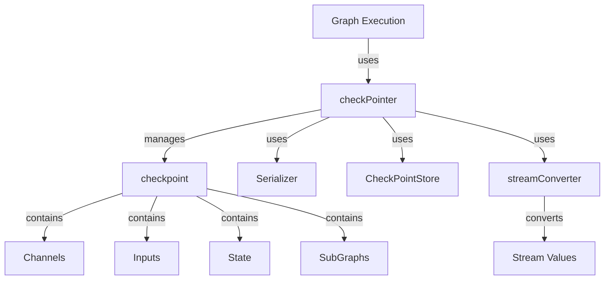

# Checkpointing and Rerun Persistence 模块技术深度解析

## 1. 什么是 Checkpointing 与 Rerun Persistence？

在分布式系统和工作流引擎中，执行长时间运行的图（Graph）或工作流时，容错和可恢复性是关键挑战。`checkpointing_and_rerun_persistence` 模块提供了一套完整的机制，用于：
- **保存图执行的状态**（checkpoint），以便在发生故障或中断后能够恢复执行
- **支持从任意点重新运行**（rerun），而无需重新执行整个图
- **处理流式数据的序列化与反序列化**

这个模块解决的核心问题是：**当图执行过程中发生中断时，如何安全、高效地恢复到中断点并继续执行**，以及如何**在不重新执行整个图的情况下重新运行某些节点**。

## 2. 核心概念与架构

### 2.1 核心抽象

让我们首先了解几个核心组件，它们构成了整个 checkpoint 系统的骨架：



#### 主要组件角色：
1. **checkPointer** - 整个 checkpoint 系统的协调者，负责保存和加载 checkpoint
2. **checkpoint** - 存储图执行状态的核心数据结构
3. **streamConverter** - 处理流式数据的序列化和反序列化
4. **Serializer** - 定义了序列化和反序列化的接口
5. **CheckPointStore** - 持久化存储 checkpoint 的接口（来自 core 包）

### 2.2 设计思维模型

可以把这个模块想象成**"图执行的时间机器"**：
- **checkpoint** 是图执行在某个时刻的"快照"，包含了重建该时刻状态所需的所有信息
- **checkPointer** 是操作这台时间机器的"工程师"，负责拍摄快照（保存）和从快照恢复（加载）
- **streamConverter** 是处理特殊数据类型的"专家"，确保流式数据也能被正确保存和恢复

## 3. 核心组件详解

### 3.1 checkpoint 结构体

```go
type checkpoint struct {
    Channels       map[string]channel
    Inputs         map[string]any
    State          any
    SkipPreHandler map[string]bool
    RerunNodes     []string

    SubGraphs map[string]*checkpoint

    InterruptID2Addr  map[string]Address
    InterruptID2State map[string]core.InterruptState
}
```

#### 设计意图分析：

这个结构体是整个模块的核心，它存储了重建图执行状态所需的所有信息：

1. **Channels** - 存储图中各个通道的状态，这些通道是节点之间通信的桥梁
2. **Inputs** - 存储各个节点的输入数据，以便在恢复时可以重新提供给节点
3. **State** - 存储图的整体状态
4. **SkipPreHandler** - 标记哪些节点的预处理程序应该被跳过（在恢复时）
5. **RerunNodes** - 指定需要重新运行的节点列表
6. **SubGraphs** - 支持嵌套图（subgraph）的 checkpoint，这是一个重要的设计，允许递归处理图
7. **InterruptID2Addr** 和 **InterruptID2State** - 处理中断相关的信息，支持图执行的中断和恢复

### 3.2 checkPointer 结构体

```go
type checkPointer struct {
    sc         *streamConverter
    store      CheckPointStore
    serializer Serializer
}
```

#### 主要功能：

1. **get()** - 从存储中加载 checkpoint
2. **set()** - 将 checkpoint 保存到存储中
3. **convertCheckPoint()** - 在保存 checkpoint 时转换流式数据
4. **restoreCheckPoint()** - 在加载 checkpoint 时恢复流式数据

#### 设计亮点：

- **分离关注点**：checkPointer 不直接处理存储细节，而是通过 `CheckPointStore` 接口抽象存储操作
- **可插拔的序列化**：通过 `Serializer` 接口允许使用不同的序列化实现
- **流式数据处理**：专门处理流式数据的转换，确保这些数据也能被正确序列化

### 3.3 streamConverter 结构体

```go
type streamConverter struct {
    inputPairs, outputPairs map[string]streamConvertPair
}
```

#### 设计意图：

流式数据在图执行中很常见，但它们通常不适合直接序列化。`streamConverter` 解决了这个问题：

1. **convertInputs/convertOutputs** - 将流式数据转换为可序列化的格式
2. **restoreInputs/restoreOutputs** - 从序列化格式恢复流式数据

这种设计允许图在执行过程中使用流式数据，同时仍然能够被 checkpoint 和恢复。

### 3.4 状态修改器（StateModifier）

```go
type StateModifier func(ctx context.Context, path NodePath, state any) error
```

这是一个强大的扩展点，允许用户在 checkpoint 读取或写入时修改状态。这对于：
- 在恢复时调整状态
- 在保存时清理敏感信息
- 实现自定义的状态转换逻辑

## 4. 数据流向与执行流程

### 4.1 保存 Checkpoint 流程

```
1. 图执行引擎决定保存 checkpoint
2. 创建 checkpoint 结构体，填充当前状态
3. checkPointer.convertCheckPoint() 转换流式数据
4. Serializer.Marshal() 序列化 checkpoint
5. CheckPointStore.Set() 保存到持久化存储
```

### 4.2 加载 Checkpoint 流程

```
1. 图执行引擎决定从 checkpoint 恢复
2. CheckPointStore.Get() 从持久化存储加载
3. Serializer.Unmarshal() 反序列化 checkpoint
4. checkPointer.restoreCheckPoint() 恢复流式数据
5. 图执行引擎使用 checkpoint 重建状态并继续执行
```

### 4.3 与其他模块的关系

这个模块与以下模块紧密协作：
- [graph_execution_runtime](compose_graph_engine-graph_execution_runtime.md) - 使用 checkpoint 机制实现图执行的容错
- [tool_node_execution_and_interrupt_control](compose_graph_engine-tool_node_execution_and_interrupt_control.md) - 与中断机制集成
- [internal_runtime_and_mocks](internal_runtime_and_mocks.md) - 提供核心的 CheckPointStore 接口

## 5. 设计决策与权衡

### 5.1 为什么使用独立的 checkpoint 结构体？

**决策**：创建了专门的 `checkpoint` 结构体来存储状态，而不是直接使用图的内部状态。

**权衡**：
- ✅ **优点**：解耦了图的内部表示和持久化格式，使得图的内部结构可以演变而不影响 checkpoint 兼容性
- ❌ **缺点**：需要维护两套状态表示，增加了内存开销和转换复杂性

**原因**：这是一个典型的**关注点分离**设计，确保持久化层不会过度耦合到执行层的内部细节。

### 5.2 为什么支持 SubGraphs？

**决策**：checkpoint 结构体中包含了 `SubGraphs` 字段，支持嵌套图的 checkpoint。

**权衡**：
- ✅ **优点**：使得复杂的图结构可以被分解为子图，每个子图可以独立 checkpoint
- ❌ **缺点**：增加了实现的复杂性，需要递归处理子图

**原因**：图的组合性是 compose_graph_engine 的核心特性，checkpoint 机制必须支持这一特性才能发挥完整威力。

### 5.3 为什么需要 streamConverter？

**决策**：专门设计了 streamConverter 来处理流式数据。

**权衡**：
- ✅ **优点**：允许图中使用流式数据，同时保持 checkpoint 能力
- ❌ **缺点**：增加了系统的复杂性，需要为每个流式节点注册转换函数

**原因**：流式处理是现代 AI 应用的常见需求，checkpoint 机制必须支持这一使用场景。

## 6. 使用指南与最佳实践

### 6.1 基本配置

```go
// 创建图时配置 checkpoint 存储
graph := compose.NewGraph(
    compose.WithCheckPointStore(myCheckPointStore),
    compose.WithSerializer(mySerializer),
)

// 执行图时指定 checkpoint ID
result, err := graph.Invoke(
    ctx, input,
    compose.WithCheckPointID("my-checkpoint-id"),
)
```

### 6.2 高级用法：状态修改

```go
// 使用状态修改器在恢复时调整状态
result, err := graph.Invoke(
    ctx, input,
    compose.WithCheckPointID("my-checkpoint-id"),
    compose.WithStateModifier(func(ctx context.Context, path compose.NodePath, state any) error {
        // 在这里修改状态...
        return nil
    }),
)
```

### 6.3 从特定 checkpoint 分支新执行

```go
// 从现有 checkpoint 读取，但保存到新的 checkpoint ID
result, err := graph.Invoke(
    ctx, input,
    compose.WithCheckPointID("original-checkpoint"),
    compose.WithWriteToCheckPointID("new-branch-checkpoint"),
)
```

## 7. 常见陷阱与注意事项

### 7.1 序列化兼容性

**陷阱**：如果修改了图中使用的数据类型结构，旧的 checkpoint 可能无法正确反序列化。

**建议**：
- 对于长期运行的图，考虑使用版本化的数据结构
- 在修改数据结构前，确保有迁移策略

### 7.2 流式数据处理

**陷阱**：忘记为流式节点注册转换函数，导致 checkpoint 失败。

**建议**：
- 在开发使用流式数据的节点时，始终考虑 checkpoint 兼容性
- 测试包含流式数据的图的 checkpoint 和恢复流程

### 7.3 子图与 Checkpoint 交互

**陷阱**：子图的 checkpoint 可能与父图的 checkpoint 产生意外交互。

**建议**：
- 谨慎设计包含子图的复杂图结构
- 测试子图单独 checkpoint 和与父图一起 checkpoint 的场景

## 8. 总结

`checkpointing_and_rerun_persistence` 模块是 compose_graph_engine 的关键组件，它为图执行提供了强大的容错和可恢复性能力。通过精心设计的 checkpoint 结构体、灵活的 checkPointer 和专门的 streamConverter，这个模块解决了复杂图执行中的状态持久化问题，同时支持嵌套图、流式数据和自定义状态修改等高级特性。

理解这个模块的设计思想和实现细节，对于构建可靠、可恢复的图执行系统至关重要。
