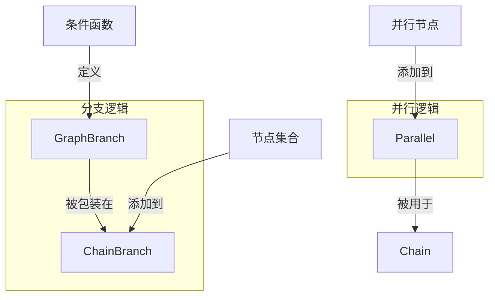

# 分支与并行链原语 (branch_and_parallel_chain_primitives)

## 概述

在构建复杂的工作流和代理系统时，我们经常需要处理两种核心场景：**条件分支**（根据输入选择不同的执行路径）和**并行执行**（同时运行多个任务以提高效率）。这个模块提供了一套优雅的原语，让开发者能够以声明式的方式定义这些控制流，而不必手动处理复杂的并发逻辑和状态管理。

想象一下，你正在构建一个客服机器人：
- 当用户输入"退款"时，需要走退款处理流程
- 当用户输入"查询订单"时，需要走订单查询流程
- 有时，你可能需要同时查询多个数据源来获取完整信息

这个模块就是为了让这些场景的实现变得简单、直观且不易出错。

## 架构概览



这个模块的设计遵循了**组合优于继承**的原则：
- `GraphBranch` 是底层的分支原语，负责根据条件选择执行路径
- `ChainBranch` 是 `GraphBranch` 的高级封装，专门为链式调用场景优化，提供了更友好的 API
- `Parallel` 是独立的并行执行原语，用于在链中同时运行多个节点

## 核心组件详解

本模块包含三个主要子模块，每个子模块都有详细的文档：

- [GraphBranch：底层分支原语](compose_graph_engine-composition_api_and_workflow_primitives-branch_and_parallel_chain_primitives-compose_branch.md)
- [ChainBranch：面向链的分支封装](compose_graph_engine-composition_api_and_workflow_primitives-branch_and_parallel_chain_primitives-compose_chain_branch.md)
- [Parallel：并行执行原语](compose_graph_engine-composition_api_and_workflow_primitives-branch_and_parallel_chain_primitives-compose_chain_parallel.md)

### GraphBranch：底层分支原语

`GraphBranch` 是整个分支系统的基石。它的核心思想是：**根据输入数据，动态选择下一个或多个执行节点**。

#### 为什么这样设计？

在工作流系统中，硬编码的 `if-else` 语句会让流程变得脆弱且难以维护。`GraphBranch` 通过将条件逻辑和节点选择分离，实现了：
- **声明式定义**：你只需要说"在什么情况下走哪条路"，而不需要关心如何路由
- **类型安全**：通过泛型确保条件函数接收正确类型的输入
- **流式支持**：可以基于流数据的前几个 chunk 就做出决策，而不需要等待整个流结束

#### 关键特性

1. **多种分支类型**：
   - 单选分支 (`NewGraphBranch`)：选择一条路径
   - 多选分支 (`NewGraphMultiBranch`)：同时选择多条路径
   - 流式分支 (`NewStreamGraphBranch` / `NewStreamGraphMultiBranch`)：基于流数据做决策

2. **输入类型安全**：
   ```go
   // 这个分支只能接收 string 类型的输入
   branch := NewGraphBranch(func(ctx context.Context, in string) (string, error) {
       if in == "refund" {
           return "refund_path", nil
       }
       return "default_path", nil
   }, map[string]bool{"refund_path": true, "default_path": true})
   ```

3. **结束节点验证**：
   条件函数返回的节点必须在预先定义的 `endNodes` 集合中，这提供了编译时之外的另一层安全保障。

### ChainBranch：面向链的分支封装

`ChainBranch` 是 `GraphBranch` 的高级封装，它专门为链式调用场景设计。如果你把工作流想象成一条生产线，`ChainBranch` 就是生产线上的"分流器"。

#### 设计理念

`ChainBranch` 的设计体现了**流式 API** 的思想：
- 你可以链式调用 `AddChatModel`、`AddLambda` 等方法来添加分支节点
- 每个分支节点都有一个唯一的 key，条件函数通过返回这个 key 来选择路径
- 所有分支最终应该汇聚到同一个点，或者结束链的执行

#### 使用示例

```go
// 创建一个基于用户输入的分支
branch := NewChainBranch(func(ctx context.Context, in string) (string, error) {
    if strings.Contains(in, "退款") {
        return "refund", nil
    }
    return "general", nil
})

// 添加退款处理分支
branch.AddChatTemplate("refund", refundTemplate).
       AddChatModel("refund", refundModel).
       AddToolsNode("refund", refundTools)

// 添加通用咨询分支
branch.AddChatTemplate("general", generalTemplate).
       AddChatModel("general", generalModel)
```

### Parallel：并行执行原语

`Parallel` 用于在链中同时执行多个节点。它的设计灵感来自于**分而治之**的思想：将一个大任务拆分成多个小任务，并行执行，最后合并结果。

#### 为什么需要 Parallel？

在 AI 应用中，我们经常需要：
- 同时调用多个模型进行比较
- 并行查询多个数据源
- 同时执行多个独立的工具调用

手动处理这些并发逻辑（goroutine、channel、错误处理）会让代码变得复杂且易出错。`Parallel` 封装了这些细节，让你可以专注于业务逻辑。

#### 输出键的设计

每个添加到 `Parallel` 的节点都需要一个 `outputKey`，这是因为：
- 并行执行的多个节点会产生多个输出
- 需要一种方式来区分和引用这些输出
- 后续节点可以通过这些 key 来获取特定的输出结果

```go
parallel := NewParallel()
parallel.AddChatModel("gpt4", gpt4Model)  // 输出会放在 "gpt4" 键下
parallel.AddChatModel("claude", claudeModel)  // 输出会放在 "claude" 键下

// 后续节点可以通过 map 获取这两个输出
// 例如: {"gpt4": "GPT-4 的回答", "claude": "Claude 的回答"}
```

## 设计决策与权衡

### 1. 泛型 vs 反射

**选择**：广泛使用泛型来确保类型安全

**权衡**：
- ✅ 优点：编译时类型检查，减少运行时错误；IDE 支持更好，代码补全更准确
- ❌ 缺点：API 稍微复杂一些；需要为不同类型创建多个构造函数

**为什么这样选择**：在工作流系统中，类型错误往往会导致难以调试的问题。泛型带来的类型安全值得稍微增加的 API 复杂度。

### 2. GraphBranch 与 ChainBranch 的分离

**选择**：将底层原语和高级封装分离

**权衡**：
- ✅ 优点：关注点分离；`GraphBranch` 可以在非链场景下复用；`ChainBranch` 可以提供更友好的 API
- ❌ 缺点：概念数量增加；需要理解两层抽象

**为什么这样选择**：这是典型的"机制与策略分离"设计模式。`GraphBranch` 提供机制（如何分支），`ChainBranch` 提供策略（如何在链中使用分支）。

### 3. 流式分支的设计

**选择**：允许基于流数据做决策，而不需要等待整个流结束

**权衡**：
- ✅ 优点：低延迟；可以处理无限流；内存效率高
- ❌ 缺点：条件函数需要谨慎处理流数据（消费后无法重新消费）；可能需要缓冲流数据

**为什么这样选择**：在 AI 应用中，流式处理越来越重要。用户往往希望看到模型的输出尽快显示，而不是等待完整响应。

### 4. 结束节点的验证

**选择**：在创建分支时预先定义允许的结束节点，并在运行时验证

**权衡**：
- ✅ 优点：早期发现错误；文档化可能的执行路径
- ❌ 缺点：需要预先知道所有可能的路径；动态路径场景下不够灵活

**为什么这样选择**：在大多数工作流场景中，可能的执行路径是已知的。这种验证可以防止条件函数返回意外的节点 key，从而避免难以调试的问题。

## 与其他模块的关系

这个模块是 `compose_graph_engine` 的一部分，它与其他模块的关系如下：

1. **依赖于**：
   - `schema_models_and_streams`：提供流处理的基础类型
   - `components_core`：提供各种组件的接口定义
   - `internal_runtime_and_mocks`：提供内部运行时支持

2. **被使用于**：
   - `composition_api_and_workflow_primitives`：更高级的工作流原语
   - `graph_execution_runtime`：实际执行图的运行时

## 使用指南与最佳实践

详细的使用示例和 API 参考请查看各子模块的文档：
- [GraphBranch 使用指南](compose_graph_engine-composition_api_and_workflow_primitives-branch_and_parallel_chain_primitives-compose_branch.md)
- [ChainBranch 使用指南](compose_graph_engine-composition_api_and_workflow_primitives-branch_and_parallel_chain_primitives-compose_chain_branch.md)
- [Parallel 使用指南](compose_graph_engine-composition_api_and_workflow_primitives-branch_and_parallel_chain_primitives-compose_chain_parallel.md)

### 使用 GraphBranch

```go
// 创建一个多选分支
branch := NewGraphMultiBranch(func(ctx context.Context, in UserQuery) (map[string]bool, error) {
    paths := make(map[string]bool)
    
    if in.NeedRefund {
        paths["refund"] = true
    }
    if in.NeedInfo {
        paths["info"] = true
    }
    
    return paths, nil
}, map[string]bool{"refund": true, "info": true, "default": true})
```

### 使用 ChainBranch

```go
// 创建分支
branch := NewChainBranch(func(ctx context.Context, in string) (string, error) {
    switch {
    case strings.Contains(in, "退款"):
        return "refund", nil
    case strings.Contains(in, "查询"):
        return "query", nil
    default:
        return "general", nil
    }
})

// 添加各分支的节点
branch.AddChatTemplate("refund", refundTemplate).
       AddChatModel("refund", gpt4)
       
branch.AddChatTemplate("query", queryTemplate).
       AddRetriever("query", orderRetriever).
       AddChatModel("query", gpt4)
       
branch.AddChatTemplate("general", generalTemplate).
       AddChatModel("general", gpt4)

// 将分支添加到链中
chain.AppendBranch(branch)
```

### 使用 Parallel

```go
// 创建并行执行器
parallel := NewParallel()

// 添加多个并行节点
parallel.AddChatModel("gpt4", gpt4Model)
parallel.AddChatModel("claude", claudeModel)
parallel.AddLambda("analysis", compose.InvokeLambda(func(ctx context.Context, in string) (string, error) {
    return analyzeInput(in), nil
}))

// 将并行执行器添加到链中
chain.AppendParallel(parallel)
```

## 常见陷阱与注意事项

1. **流式分支中的流消费**：
   - 在流式分支条件函数中消费流数据时要小心，因为流数据一旦被消费就无法重新获取
   - 如果需要在后续节点中使用完整的流数据，考虑在条件函数中缓冲流数据

2. **并行节点的错误处理**：
   - 如果并行节点中的任何一个失败，整个并行执行会失败
   - 考虑在并行节点内部处理可恢复的错误

3. **分支节点的类型一致性**：
   - 确保所有分支路径的输出类型一致，否则后续节点可能会遇到类型错误
   - 如果不同分支需要产生不同类型的输出，考虑使用中间的 Lambda 节点进行类型转换

4. **避免过深的嵌套**：
   - 虽然可以在分支中添加图节点（`AddGraph`），但过深的嵌套会让流程难以理解
   - 考虑将复杂的子流程提取为独立的链或图

## 总结

`branch_and_parallel_chain_primitives` 模块提供了一套强大而灵活的原语，用于构建复杂的工作流。它的设计体现了**声明式编程**、**类型安全**和**关注点分离**等优秀的软件工程原则。

通过使用这个模块，你可以：
- 轻松实现条件分支逻辑，而不需要手动处理路由
- 并行执行多个任务，提高系统效率
- 构建清晰、可维护的工作流定义

希望这份文档能帮助你理解这个模块的设计思想和使用方法。如果你有任何问题或建议，欢迎与团队交流！
