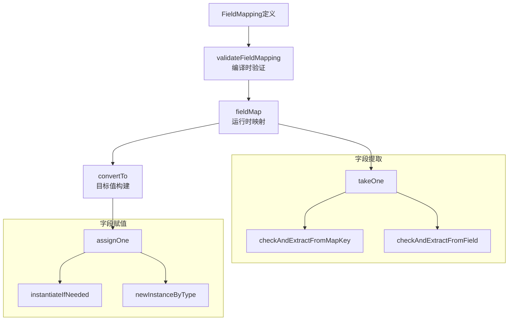

# field_mapping_core 模块技术深度解析

## 1. 模块概述

在构建复杂的工作流和图计算系统时，节点之间的数据传递往往不是简单的类型匹配。不同节点可能期望不同的数据结构，需要将一个节点的输出字段映射到另一个节点的输入字段。`field_mapping_core` 模块正是为了解决这一问题而设计的，它提供了一套灵活、类型安全的字段映射机制，能够在编译时进行静态类型检查，同时支持运行时的动态映射。

想象一下，你正在搭建一个数据处理流水线，上游节点输出的是 `{User: {Name: "Alice", Age: 30}}`，而下游节点需要的是 `{UserName: "Alice", UserAge: 30}`。这个模块就是帮助你优雅地完成这种转换的工具，而且它能在编译时就告诉你："嘿，`User.Age` 字段不存在"或者"你不能把字符串赋值给整数类型"。

## 2. 核心架构与数据流程

### 2.1 架构概览



### 2.2 数据流程

整个字段映射过程分为两个主要阶段：

1. **编译时验证阶段**：通过 `validateFieldMapping` 函数对映射配置进行静态类型检查，确保源字段存在且类型可赋值给目标字段。
2. **运行时映射阶段**：当实际数据流经时，`fieldMap` 函数负责从源数据中提取字段值，然后通过 `convertTo` 和 `assignOne` 将这些值赋值到目标结构中。

数据流可以概括为：
```
源数据 → fieldMap (提取字段) → 中间映射表 → convertTo (构建目标) → 目标数据
```

## 3. 核心组件详解

### 3.1 FieldMapping 结构体

`FieldMapping` 是整个模块的核心，它定义了从源到目标的字段映射关系。

```go
type FieldMapping struct {
    fromNodeKey string
    from        string
    to          string
    customExtractor func(input any) (any, error)
}
```

**设计意图**：
- `fromNodeKey`：记录来源节点的标识，用于错误定位和调试
- `from` 和 `to`：使用特殊分隔符连接的字段路径字符串，支持嵌套字段访问
- `customExtractor`：允许用户自定义提取逻辑，提供最大的灵活性

**关键方法**：
- `FromField/ToField/MapFields`：创建单级字段映射的便捷方法
- `FromFieldPath/ToFieldPath/MapFieldPaths`：创建嵌套字段映射的方法
- `WithCustomExtractor`：配置自定义提取器的选项

### 3.2 FieldPath 类型

`FieldPath` 是 `[]string` 的类型别名，用于表示嵌套字段的访问路径。

```go
type FieldPath []string
```

**设计亮点**：
- 使用罕见的 Unit Separator 字符 (`\x1F`) 作为路径分隔符，几乎不可能与用户定义的字段名冲突
- 支持通过 `FromFieldPath` 等方法直接使用字符串切片定义路径，提高可读性

### 3.3 编译时验证：validateFieldMapping

这是模块的关键函数之一，它在工作流编译阶段对字段映射进行静态检查。

```go
func validateFieldMapping(predecessorType reflect.Type, successorType reflect.Type, mappings []*FieldMapping) (
    typeHandler *handlerPair,
    uncheckedSourcePath map[string]FieldPath,
    err error,
)
```

**核心逻辑**：
1. 验证映射组合的合法性（例如不允许同时"从所有字段映射"和"映射到所有字段"）
2. 对每个映射，使用 `checkAndExtractFieldType` 遍历源和目标的字段路径，验证字段存在性和可导出性
3. 检查类型赋值兼容性，分为三种情况：
   - `assignableTypeMust`：确定可赋值
   - `assignableTypeMay`：可能可赋值（如接口类型），需要运行时检查
   - `assignableTypeMustNot`：确定不可赋值，编译失败

**设计权衡**：
- 对于接口类型的中间路径，选择延迟到运行时检查，这是灵活性与安全性的权衡
- 通过 `uncheckedSourcePath` 记录未完全检查的路径，在运行时提供更精确的错误信息

### 3.4 运行时映射：fieldMap

`fieldMap` 函数是运行时的核心，它负责从源数据中提取字段值并构建中间映射表。

```go
func fieldMap(mappings []*FieldMapping, allowMapKeyNotFound bool, uncheckedSourcePaths map[string]FieldPath) func(any) (map[string]any, error)
```

**处理流程**：
1. 遍历每个映射配置
2. 如果有自定义提取器，直接使用它提取值
3. 否则，通过 `takeOne` 逐层提取字段值
4. 对于错误处理，区分几种情况：
   - 接口类型不合法：直接返回错误
   - 映射键未找到：根据 `allowMapKeyNotFound` 决定是跳过还是报错
   - 其他错误：如果在未检查路径上则返回错误，否则 panic（因为编译时应该已经检查过）

### 3.5 目标值构建：convertTo 与 assignOne

`convertTo` 函数接收中间映射表，构建并填充目标类型的值。

```go
func convertTo(mappings map[string]any, typ reflect.Type) any
```

**assignOne 的递归逻辑**：
这是最复杂的函数之一，它递归地处理嵌套字段赋值：
1. 如果目标路径为空，直接赋值整个值
2. 否则，逐层遍历目标路径
3. 对于每一层：
   - 如果是 `any` 类型，自动转换为 `map[string]any`
   - 如果是映射，确保键存在并创建必要的中间值
   - 如果是结构体，确保指针字段已初始化
4. 最终将值赋给目标字段

**设计亮点**：
- 自动处理指针解引用和初始化
- 对于 `any` 类型的灵活处理，使其在运行时可以像 map 一样使用
- 支持映射键类型的自动转换

## 4. 依赖分析

### 4.1 被依赖关系

`field_mapping_core` 模块主要被其兄弟模块 [value_merging_system](compose_graph_engine-composition_api_and_workflow_primitives-field_mapping_and_value_merging-value_merging_system.md) 以及上层的 [composition_api_and_workflow_primitives](compose_graph_engine-composition_api_and_workflow_primitives.md) 模块使用。这些模块在构建图节点连接时，会使用 `FieldMapping` 来定义节点之间的数据流转。

### 4.2 内部依赖

该模块依赖一些内部工具包：
- `github.com/cloudwego/eino/internal/generic`：提供泛型类型操作支持
- `github.com/cloudwego/eino/internal/safe`：提供安全的 panic 包装
- `github.com/cloudwego/eino/schema`：提供流处理的核心接口

## 5. 设计决策与权衡

### 5.1 编译时检查 vs 运行时检查

**决策**：尽可能在编译时进行类型检查，只将必要的检查延迟到运行时。

**原因**：
- 提前发现错误可以提供更好的开发体验
- 运行时检查会有性能开销，但对于接口类型等无法在编译时确定的情况，运行时检查是必要的

**权衡点**：
- 当源路径包含接口类型时，无法在编译时确定最终类型，因此延迟到运行时检查
- 通过 `uncheckedSourcePath` 记录这些情况，确保运行时错误信息的准确性

### 5.2 特殊分隔符的选择

**决策**：使用 Unit Separator 字符 (`\x1F`) 作为路径分隔符。

**原因**：
- 这是一个 ASCII 控制字符，几乎不可能出现在用户定义的字段名或映射键中
- 避免了使用 `.` 等常见字符可能导致的冲突问题

**权衡点**：
- 虽然罕见，但如果用户确实使用了这个字符作为字段名，会导致问题
- 提供了 `FieldPath` 切片类型作为替代方案，用户可以直接使用切片而不必担心分隔符问题

### 5.3 自动初始化 vs 显式初始化

**决策**：在赋值过程中自动初始化指针和映射字段。

**原因**：
- 提高使用便利性，用户不必预先初始化整个嵌套结构
- 符合"安全默认"的设计原则

**权衡点**：
- 可能会意外创建空的映射或结构体，这在某些情况下可能不是期望的行为
- 但在字段映射场景中，这种行为通常是合理的

### 5.4 自定义提取器的设计

**决策**：提供 `WithCustomExtractor` 选项，允许用户完全自定义字段提取逻辑。

**原因**：
- 提供最大的灵活性，处理预定义映射无法覆盖的复杂场景
- 允许用户在提取过程中进行数据转换或计算

**权衡点**：
- 自定义提取器无法进行编译时类型检查，只能在运行时验证
- 增加了模块的复杂性，但这是为灵活性付出的合理代价

## 6. 使用指南与示例

### 6.1 基本字段映射

```go
// 单个字段映射到整个输入
fm1 := compose.FromField("User")

// 整个输出映射到单个字段
fm2 := compose.ToField("Result")

// 字段到字段的映射
fm3 := compose.MapFields("User.Name", "UserName")
```

### 6.2 嵌套字段映射

```go
// 使用 FieldPath 定义嵌套路径
fm1 := compose.FromFieldPath(compose.FieldPath{"User", "Profile", "Name"})
fm2 := compose.ToFieldPath(compose.FieldPath{"Response", "Data", "UserName"})
fm3 := compose.MapFieldPaths(
    compose.FieldPath{"User", "Profile", "Name"},
    compose.FieldPath{"Response", "Data", "UserName"},
)
```

### 6.3 自定义提取器

```go
fm := compose.ToField("FullName",
    compose.WithCustomExtractor(func(input any) (any, error) {
        user, ok := input.(*User)
        if !ok {
            return nil, fmt.Errorf("unexpected input type")
        }
        return user.FirstName + " " + user.LastName, nil
    }),
)
```

## 7. 注意事项与常见陷阱

### 7.1 字段可导出性

**陷阱**：结构体字段必须是可导出的（首字母大写）才能被映射。

```go
type User struct {
    name string // 不可导出，映射会失败
    Name string // 可导出，可以映射
}
```

### 7.2 路径分隔符

**陷阱**：避免在字段名中使用 `\x1F` 字符，虽然这很少见。

**建议**：优先使用 `FieldPath` 切片而不是字符串路径，这样更安全且更易读。

### 7.3 接口类型的运行时检查

**注意**：当源路径包含接口类型时，编译时检查会跳过，错误只会在运行时出现。

**建议**：在测试中覆盖这些路径，确保类型正确性。

### 7.4 自定义提取器的类型安全

**注意**：自定义提取器完全绕过了编译时类型检查。

**建议**：在自定义提取器内部进行严格的类型断言，并提供清晰的错误信息。

### 7.5 映射键不存在的处理

**行为**：默认情况下，映射键不存在会导致错误，但可以通过 `allowMapKeyNotFound` 参数控制。

**注意**：在流处理场景中，这个参数默认是 `true`，因为流数据可能不完整。

## 8. 总结

`field_mapping_core` 模块是一个设计精巧的字段映射系统，它在类型安全和灵活性之间找到了很好的平衡。通过编译时的静态检查，它能提前捕获大多数错误；通过运行时的动态处理，它又能应对复杂的实际场景。其递归的字段访问和赋值逻辑、自动初始化机制、以及自定义提取器的支持，使得它能够处理各种复杂的数据转换需求。

对于新加入团队的开发者来说，理解这个模块的关键在于把握其"编译时验证，运行时执行"的两阶段设计思想，以及它如何通过反射来实现类型安全的动态操作。
