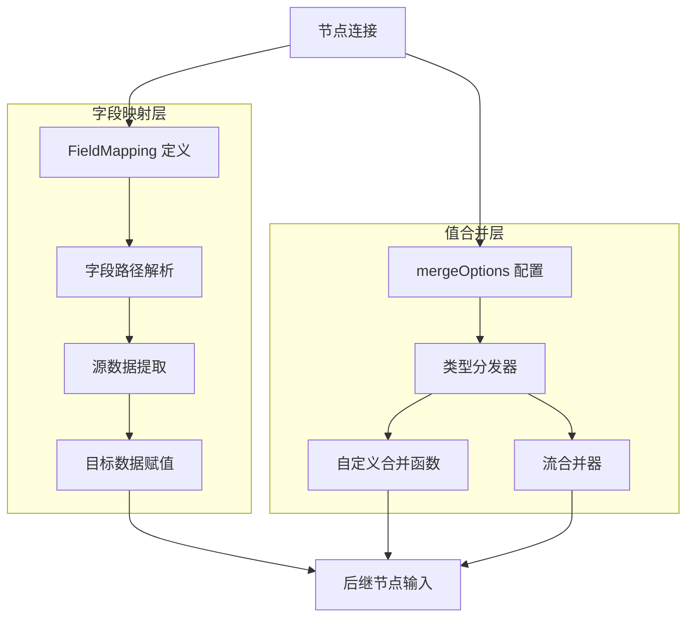

# field_mapping_and_value_merging 模块深度解析

## 1. 问题空间与模块定位

在构建复杂的工作流和计算图时，一个核心挑战是**数据格式不匹配**问题：
- 前一个节点的输出结构不一定完全符合后一个节点的输入期望
- 多个前驱节点的输出需要合并后传递给一个后继节点
- 数据需要在不同的抽象层次之间转换（如从完整对象到单个字段，或反之）

想象一下，你有一个处理用户请求的工作流：
1. 用户验证节点输出 `{user: {id: 123, name: "Alice"}, valid: true}`
2. 但下一个数据处理节点只需要 `user.name` 字段
3. 同时还有另一个节点输出 `{timestamp: "2024-01-01"}` 需要合并进去

这就是 `field_mapping_and_value_merging` 模块要解决的问题——它就像工作流中的**数据转换枢纽**，负责在节点之间搭建数据桥梁。

## 2. 核心架构与数据流程

### 2.1 架构概览



### 2.2 核心组件职责

#### 2.2.1 FieldMapping：字段映射的核心抽象

`FieldMapping` 结构体是整个模块的基石，它定义了**数据从哪里来，到哪里去**的规则：

```go
type FieldMapping struct {
    fromNodeKey string      // 源节点标识
    from        string      // 源字段路径（如 "user.profile.name"）
    to          string      // 目标字段路径
    customExtractor func(input any) (any, error)  // 自定义提取器
}
```

**设计意图**：这个结构体采用了声明式设计——你告诉它"要什么"，而不是"怎么获取"。这种设计使得映射规则可以在编译时进行静态检查，而不必等到运行时才发现错误。

#### 2.2.2 字段路径系统

模块使用 `FieldPath` 类型来表示嵌套字段的访问路径：

```go
type FieldPath []string
```

路径元素可以是：
- 结构体字段名（如 `"user"`, `"name"`）
- 映射键（如 `"users"`, `"admin"`）

路径使用内部特殊字符 `\x1F`（单元分隔符）进行连接，这种字符几乎不可能出现在用户定义的字段名中，从而避免了转义问题。

### 2.3 数据流程详解

#### 2.3.1 字段映射流程

当数据从一个节点流向另一个节点时，映射过程如下：

1. **路径解析**：将 `"user.profile.name"` 这样的字符串拆分为 `["user", "profile", "name"]`
2. **源数据提取**：从输入对象中逐级提取值，支持：
   - 结构体字段访问（需要字段导出）
   - 映射键访问
   - 指针自动解引用
3. **类型检查**：编译时尽可能验证类型兼容性，运行时进行最终确认
4. **目标数据赋值**：将提取的值赋值到目标位置，必要时自动初始化中间结构

#### 2.3.2 值合并流程

当多个前驱节点连接到一个后继节点时：

1. **类型识别**：检查第一个值的类型
2. **合并函数查找**：在内部注册表中查找对应类型的合并函数
3. **合并执行**：
   - 如果是 `streamReader`，使用流合并器
   - 否则使用注册的自定义合并函数
4. **结果传递**：将合并后的值传递给后继节点

## 3. 关键设计决策与权衡

### 3.1 静态检查 vs 运行时灵活性

**决策**：尽可能在编译时验证字段映射，但对于接口类型等无法静态确定的情况，延迟到运行时检查。

**权衡分析**：
- ✅ **优点**：大多数错误可以在编译阶段发现，提高开发效率
- ✅ **优点**：接口类型仍然保持灵活性，适应动态场景
- ⚠️ **缺点**：代码复杂度增加，需要维护两套检查逻辑
- ⚠️ **缺点**：某些错误只能在运行时发现，需要仔细测试

**实现体现**：`validateFieldMapping` 函数返回 `uncheckedSourcePath`，记录那些无法在编译时检查的路径，这些路径会在运行时通过 `fieldMap` 函数进行验证。

### 3.2 声明式 API vs 命令式 API

**决策**：采用声明式 API 设计，通过 `FromField`、`ToField`、`MapFields` 等构造函数创建映射规则。

**权衡分析**：
- ✅ **优点**：代码可读性强，意图清晰
- ✅ **优点**：便于静态分析和优化
- ✅ **优点**：支持链式调用和组合
- ⚠️ **缺点**：对于极端复杂的转换，可能不够灵活
- ⚠️ **缺点**：需要学习特定的 DSL（领域特定语言）

**缓解措施**：提供 `WithCustomExtractor` 选项，允许用户注入自定义的提取逻辑，在保持声明式风格的同时提供逃逸 hatch。

### 3.3 自动初始化 vs 显式初始化

**决策**：在赋值过程中自动初始化中间的指针、映射等结构。

**权衡分析**：
- ✅ **优点**：用户体验好，不需要手动准备嵌套结构
- ✅ **优点**：减少空指针异常
- ⚠️ **缺点**：可能隐藏数据缺失的问题
- ⚠️ **缺点**：自动创建的结构可能不符合用户期望

**实现体现**：`instantiateIfNeeded` 函数和 `assignOne` 函数中的自动初始化逻辑。

### 3.4 类型注册机制 vs 直接函数传递

**决策**：使用全局注册表存储类型合并函数，通过 `RegisterValuesMergeFunc` 注册。

**权衡分析**：
- ✅ **优点**：使用方便，注册一次全局可用
- ✅ **优点**：支持类型分发，自动选择正确的合并函数
- ⚠️ **缺点**：全局状态，可能导致测试隔离问题
- ⚠️ **缺点**：类型擦除，失去了一些编译时类型安全

**实现体现**：`internal.RegisterValuesMergeFunc` 和 `internal.GetMergeFunc` 的使用。

## 4. 子模块详解

### 4.1 字段映射核心（field_mapping_core）

字段映射核心子模块包含了所有与字段映射相关的核心类型和实现，包括 `FieldMapping` 结构体、错误类型定义，以及所有的映射执行逻辑。

详细内容请参考：[field_mapping_core 子模块文档](compose_graph_engine-composition_api_and_workflow_primitives-field_mapping_and_value_merging-field_mapping_core.md)

### 4.2 值合并系统（value_merging_system）

值合并系统子模块负责处理多个前驱节点输出的合并逻辑，包括合并选项的定义、自定义合并函数的注册机制，以及流数据的合并处理。

详细内容请参考：[value_merging_system 子模块文档](compose_graph_engine-composition_api_and_workflow_primitives-field_mapping_and_value_merging-value_merging_system.md)

## 5. 核心 API 与使用模式

### 5.1 字段映射 API

#### 基础映射模式

```go
// 1. 将前驱的单个字段映射到后继的整个输入
FromField("user")

// 2. 将前驱的整个输出映射到后继的单个字段
ToField("result")

// 3. 字段到字段的映射
MapFields("user.name", "userName")
```

#### 路径映射模式

```go
// 使用 FieldPath 进行嵌套字段映射
FromFieldPath(FieldPath{"user", "profile", "name"})
ToFieldPath(FieldPath{"response", "data", "userName"})
MapFieldPaths(
    FieldPath{"user", "profile", "name"},
    FieldPath{"response", "userName"},
)
```

#### 自定义提取器

```go
ToField("result", WithCustomExtractor(func(input any) (any, error) {
    // 自定义转换逻辑
    user := input.(*User)
    return user.Profile.Name, nil
}))
```

### 5.2 值合并 API

```go
// 注册自定义合并函数
RegisterValuesMergeFunc(func(items []*User) (*User, error) {
    // 自定义合并逻辑
    merged := &User{}
    for _, item := range items {
        // 合并字段...
    }
    return merged, nil
})
```

## 6. 常见陷阱与注意事项

### 6.1 字段访问限制

**陷阱**：尝试映射未导出的结构体字段会导致错误。

```go
// ❌ 错误：name 字段未导出
type User struct {
    name string  // 小写开头，未导出
}
MapFields("user.name", "userName")  // 运行时会失败
```

**解决方案**：确保所有要映射的字段都是导出的（首字母大写），或者使用自定义提取器。

### 6.2 接口类型的延迟检查

**陷阱**：当路径中包含接口类型时，编译时无法检查，错误会延迟到运行时。

```go
type Data interface{}
type Response struct {
    Data Data  // 接口类型
}

// 编译时不会报错，但如果运行时 Data 的实际类型不包含 "name" 字段，会失败
MapFields("data.name", "userName")
```

**解决方案**：
1. 尽可能使用具体类型而非接口类型
2. 在测试中覆盖各种可能的接口实现
3. 考虑使用自定义提取器进行更安全的处理

### 6.3 映射键缺失的处理

**陷阱**：默认情况下，映射键缺失会导致错误。

**解决方案**：使用 `allowMapKeyNotFound` 参数（内部使用），或者在自定义提取器中处理缺失情况。

### 6.4 全局合并函数注册

**陷阱**：在测试中注册的合并函数会影响其他测试。

**解决方案**：
1. 在测试后清理注册状态（如果支持）
2. 使用不同的类型进行不同的测试
3. 考虑使用测试辅助函数隔离状态

### 6.5 路径分隔符冲突

**陷阱**：虽然极其罕见，但如果字段名中包含 `\x1F` 字符，会导致路径解析错误。

**解决方案**：避免在字段名或映射键中使用控制字符。

## 7. 与其他模块的关系

### 7.1 依赖关系

这个模块是 `composition_api_and_workflow_primitives` 的子模块，它为上层的工作流定义提供数据转换能力：

- 被 [graph_node_addition_options](compose_graph_engine-composition_api_and_workflow_primitives-graph_node_addition_options.md) 使用，用于定义节点之间的连接
- 被 [graph_execution_runtime](compose_graph_engine-graph_execution_runtime.md) 使用，在运行时执行实际的映射和合并操作
- 依赖 `internal` 包提供合并函数注册表
- 依赖 `schema` 包提供流处理能力

### 7.2 在更大架构中的位置

在整个 `compose_graph_engine` 中，这个模块扮演着**数据适配器**的角色：

1. **graph_definition_and_compile_configuration** 定义图结构
2. **field_mapping_and_value_merging** 处理节点间的数据转换
3. **node_execution_and_runnable_abstractions** 执行节点逻辑
4. **runtime_scheduling_channels_and_handlers** 调度执行流程

没有这个模块，每个节点都需要自己处理数据格式转换，导致代码重复和耦合度增加。

## 8. 总结

`field_mapping_and_value_merging` 模块是构建灵活、可组合工作流的关键基础设施。它通过声明式的字段映射和可扩展的值合并机制，解决了节点间数据格式不匹配的问题。

模块的设计体现了几个重要的软件工程原则：
- **关注点分离**：映射逻辑与业务逻辑分离
- **声明式优于命令式**：描述意图而非实现细节
- **静态检查与动态灵活性平衡**：尽可能早地发现错误，同时保持适应性
- **可扩展性**：通过自定义提取器和合并函数支持各种场景

对于新加入团队的开发者，理解这个模块的设计意图和权衡，将帮助你更有效地使用工作流引擎，避免常见陷阱，并在需要时进行正确的扩展。
