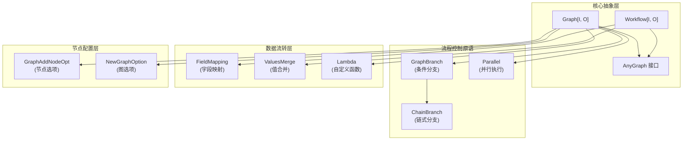

# composition_api_and_workflow_primitives 模块技术详解

## 概述

`composition_api_and_workflow_primitives` 模块是整个 Eino 框架的核心编排层，它提供了一套高级抽象，让开发者能够以声明式的方式构建复杂的 AI 工作流。想象一下，如果你需要构建一个包含多个步骤的 AI 应用：用户输入 → 意图识别 → 根据意图选择不同的处理路径 → 并行调用多个模型 → 合并结果 → 最终输出。这个模块就是专门为解决这类问题而设计的。

在没有这个模块之前，你可能需要手动编写大量的胶水代码来处理数据流转、错误处理、并发控制等问题。而通过这个模块提供的 Graph、Workflow、Branch、Parallel 等抽象，你可以用一种更直观、更可维护的方式来构建这些复杂流程。

## 架构总览



这个模块的架构可以分为四个主要层次：

1. **核心抽象层**：定义了 Graph 和 Workflow 两个主要的编排容器，以及 AnyGraph 接口来统一它们的行为。Graph 是更底层的抽象，提供了最大的灵活性；Workflow 则在 Graph 之上提供了更声明式的 API。

2. **流程控制原语**：提供了 Branch（条件分支）、ChainBranch（链式分支）和 Parallel（并行执行）等组件，让你能够控制工作流的执行路径。

3. **数据流转层**：处理节点之间的数据传递，包括 FieldMapping（字段映射）、ValuesMerge（值合并）和 Lambda（自定义函数）等组件。

4. **节点配置层**：提供了各种选项来配置图和节点的行为，比如状态管理、输入输出键等。

## 核心设计思想

### 1. 声明式 vs 命令式

这个模块的一个核心设计选择是提供声明式的 API。与其告诉计算机"先做 A，再做 B，如果 X 则做 C"，你只需要描述"节点 A 的输出是节点 B 的输入，节点 C 依赖于节点 B"。这种方式让代码更接近问题域，也更容易理解和维护。

### 2. 类型安全与灵活性的平衡

模块大量使用了 Go 的泛型来提供类型安全，比如 `Graph[I, O]` 明确指定了输入类型 I 和输出类型 O。但同时，它也通过 `AnyGraph` 接口和 `map[string]any` 等机制提供了灵活性，让你能够处理动态类型的场景。

### 3. 组合优于继承

整个模块的设计遵循"组合优于继承"的原则。你不会看到复杂的继承层次结构，而是通过组合各种小的、单一职责的组件来构建复杂的工作流。比如，你可以把一个 Graph 作为另一个 Graph 的节点，或者把多个 Parallel 组合在一起。

## 子模块概览

这个模块可以进一步细分为以下几个子模块：

1. **[composable_graph_types_and_lambda_options](compose_graph_engine-composition_api_and_workflow_primitives-composable_graph_types_and_lambda_options.md)**：定义了核心的图类型和 Lambda 函数的选项
2. **[branch_and_parallel_chain_primitives](compose_graph_engine-composition_api_and_workflow_primitives-branch_and_parallel_chain_primitives.md)**：提供了分支和并行执行的原语
3. **[workflow_definition_primitives](compose_graph_engine-composition_api_and_workflow_primitives-workflow_definition_primitives.md)**：提供了工作流定义的原语
4. **[graph_node_addition_options](compose_graph_engine-composition_api_and_workflow_primitives-graph_node_addition_options.md)**：定义了图节点添加的选项
5. **[field_mapping_and_value_merging](compose_graph_engine-composition_api_and_workflow_primitives-field_mapping_and_value_merging.md)**：处理字段映射和值合并

下面我们将逐一深入这些子模块。

## 关键组件详解

### Graph：最灵活的编排容器

`Graph[I, O]` 是模块中最基础的编排容器。你可以把它想象成一个有向图，节点是各种处理单元（模型、函数、子图等），边是数据流转的路径。

```go
// 创建一个字符串输入和字符串输出的图
graph := compose.NewGraph[string, string]()

// 添加节点
graph.AddNode("start", compose.NewPassthroughNode())
graph.AddNode("process", someProcessingNode)
graph.AddNode("end", compose.NewPassthroughNode())

// 添加边定义数据流转
graph.AddEdge("start", "process")
graph.AddEdge("process", "end")

// 编译成可执行的单元
runnable, _ := graph.Compile(ctx)
result, _ := runnable.Invoke(ctx, "input")
```

Graph 的设计非常灵活，你可以：
- 添加任意类型的节点（模型、函数、子图等）
- 定义任意的边连接
- 使用分支来条件性地选择路径
- 使用并行来同时执行多个节点

### Workflow：更声明式的选择

如果你觉得 Graph 还是太底层，Workflow 提供了一个更高级的抽象。Workflow 的核心理念是"通过声明依赖关系来定义流程"，而不是手动添加边。

```go
// 创建工作流
workflow := compose.NewWorkflow[string, string]()

// 添加节点
start := workflow.AddPassthroughNode("start")
process := workflow.AddLambdaNode("process", someLambda)
end := workflow.End()

// 声明依赖关系
process.AddInput("start")  // process 依赖 start
end.AddInput("process")    // end 依赖 process

// 编译和执行
runnable, _ := workflow.Compile(ctx)
result, _ := runnable.Invoke(ctx, "input")
```

Workflow 的一个关键优势是它可以很好地处理字段映射：

```go
// 只传递特定字段
process.AddInput("userNode", compose.MapFields("user.name", "displayName"))

// 使用静态值
process.SetStaticValue(compose.FieldPath{"config"}, someConfig)
```

### Branch：条件路由的核心

Branch 组件让你能够根据条件动态选择执行路径。你可以把它想象成工作流中的"if-else"语句。

```go
// 创建分支条件
condition := func(ctx context.Context, in string) (string, error) {
    if in == "a" {
        return "path_a", nil
    }
    return "path_b", nil
}

// 定义可能的结束节点
endNodes := map[string]bool{"path_a": true, "path_b": true}

// 创建分支
branch := compose.NewGraphBranch(condition, endNodes)

// 添加到图中
graph.AddBranch("decision_point", branch)
```

Branch 有几个变体：
- `NewGraphBranch`：单一路径选择
- `NewGraphMultiBranch`：多路径选择
- `NewStreamGraphBranch`：基于流输入的选择

### Parallel：并行执行的利器

Parallel 组件让你能够同时执行多个节点，并将它们的结果合并。这对于需要调用多个模型或服务的场景非常有用。

```go
// 创建并行容器
parallel := compose.NewParallel()

// 添加并行节点
parallel.AddChatModel("result_gpt4", gpt4Model)
parallel.AddChatModel("result_claude", claudeModel)
parallel.AddRetriever("result_retrieval", retriever)

// 添加到链中
chain.AppendParallel(parallel)
```

并行执行的结果会被组织成一个 `map[string]any`，其中键是你指定的输出键，值是对应节点的输出。

### FieldMapping：灵活的数据转换

FieldMapping 组件处理节点之间的数据转换。它让你能够精确控制如何从前驱节点的输出中提取数据，并映射到后继节点的输入中。

```go
// 整个前驱输出 -> 整个后继输入
//（默认行为，不需要显式映射）

// 前驱字段 -> 整个后继输入
compose.FromField("user.name")

// 整个前驱输出 -> 后继字段
compose.ToField("displayName")

// 前驱字段 -> 后继字段
compose.MapFields("user.name", "displayName")

// 嵌套字段映射
compose.MapFieldPaths(
    compose.FieldPath{"user", "profile", "name"},
    compose.FieldPath{"response", "userName"},
)
```

FieldMapping 非常强大，它可以处理：
- 结构体字段
- 映射键
- 嵌套路径
- 自定义提取器

### Lambda：自定义逻辑的入口

Lambda 组件让你能够将自定义函数作为图中的节点。这是将你的业务逻辑集成到工作流中的主要方式。

```go
// 创建一个简单的 Lambda
lambda := compose.InvokableLambda(func(ctx context.Context, in string) (string, error) {
    return "processed: " + in, nil
})

// 创建一个流式 Lambda
streamLambda := compose.StreamableLambda(func(ctx context.Context, in string) (*schema.StreamReader[string], error) {
    // 返回一个流
})

// 创建一个完整的 Lambda，支持多种执行模式
fullLambda, _ := compose.AnyLambda(
    invokeFunc,
    streamFunc,
    collectFunc,
    transformFunc,
)
```

Lambda 组件的设计非常灵活，你可以只实现你需要的执行模式（Invoke、Stream、Collect 或 Transform）。

## 设计决策与权衡

### 1. 编译时类型检查 vs 运行时类型检查

这个模块在设计时做了一个重要的权衡：它使用泛型提供了编译时类型检查，但对于字段映射等动态操作，它会在运行时进行额外的检查。

**选择**：混合使用编译时和运行时类型检查。

**原因**：
- 编译时检查可以捕获大多数常见错误
- 运行时检查可以处理动态场景（如字段映射）
- 这样的组合既提供了类型安全，又保持了灵活性

**权衡**：
- 优点：早期错误捕获，更好的开发体验
- 缺点：一些错误只能在运行时发现，需要更全面的测试

### 2. 显式依赖 vs 隐式依赖

在设计 Workflow API 时，团队考虑了两种方式：隐式依赖（通过变量作用域）和显式依赖（通过 AddInput 方法）。

**选择**：显式依赖。

**原因**：
- 显式依赖让流程更清晰，更容易理解
- 它避免了"幽灵依赖"的问题
- 它让工具能够分析和验证流程

**权衡**：
- 优点：代码更自文档化，更容易调试
- 缺点：需要写更多的代码

### 3. 单一责任 vs 便利 API

在设计组件时，团队面临一个选择：是让每个组件只做一件事，还是提供便利的 API 让常见场景更容易。

**选择**：两者都提供 - 核心组件保持单一责任，同时提供便利的包装器。

**例子**：
- `Graph` 是底层的、灵活的核心组件
- `Workflow` 是在 `Graph` 之上的便利包装器
- `ChainBranch` 是在 `GraphBranch` 之上的便利包装器

**原因**：
- 核心组件的单一责任让它们更容易测试和维护
- 便利 API 让常见场景的代码更简洁
- 用户可以根据需要选择合适的抽象级别

## 数据流详解

让我们通过一个典型的例子来追踪数据在这个模块中的流动：

```
用户输入 → Graph → 节点 A → Branch → [节点 B1, 节点 B2] → Parallel → 节点 C → 输出
```

1. **输入阶段**：用户输入被传递给 Graph 的 Invoke 方法
2. **节点 A**：处理输入，可能修改或增强它
3. **Branch**：根据节点 A 的输出，选择路径 B1 或 B2
4. **Parallel**：如果路径中有 Parallel，多个节点会同时执行
5. **合并阶段**：Parallel 的结果会被合并成一个 map
6. **节点 C**：处理合并后的结果
7. **输出阶段**：最终结果返回给用户

在这个过程中，FieldMapping 组件会在每个边连接处工作，确保数据正确地从一个节点传递到下一个节点。

## 与其他模块的关系

这个模块是整个 Eino 框架的"粘合剂"，它与其他模块的关系如下：

- **graph_execution_runtime**：这个模块定义的 Graph 和 Workflow 需要由 graph_execution_runtime 来实际执行
- **tool_node_execution_and_interrupt_control**：工具节点的执行和中断控制与这个模块密切相关
- **components_core**：这个模块编排的各种组件（模型、检索器等）都来自 components_core

## 使用指南与最佳实践

### 何时使用 Graph vs Workflow

- **使用 Graph**：当你需要最大的灵活性，或者你正在构建一个可能有循环的流程
- **使用 Workflow**：当你想要更声明式的 API，或者你的流程是一个无环的依赖图

### 字段映射的最佳实践

- 优先使用显式的字段映射，而不是依赖整个对象的传递
- 对于嵌套结构，使用 `MapFieldPaths` 而不是手动解构
- 避免过度使用自定义提取器，它们会让类型检查变得困难

### 错误处理

- 每个节点的错误会向上传播，除非你显式处理
- 你可以使用 Lambda 来包装节点并处理错误
- 对于分支，确保你的条件函数能够优雅地处理错误输入

## 新贡献者指南

### 常见陷阱

1. **忘记调用 Compile**：Graph 和 Workflow 必须先编译才能执行
2. **类型不匹配**：确保节点之间的输入输出类型兼容
3. **循环依赖**：Workflow 不支持循环依赖，Graph 虽然支持但要小心
4. **字段映射错误**：确保字段名和路径正确，特别是对于嵌套结构

### 调试技巧

- 使用 `WithNodeName` 给节点起有意义的名字，这对调试很有帮助
- 在关键位置插入 Lambda 节点来记录日志或检查数据
- 从简单的流程开始，逐步增加复杂性

### 扩展点

这个模块设计了几个扩展点：

- **自定义 Lambda**：你可以实现自己的 Lambda 函数来处理自定义逻辑
- **自定义字段提取器**：通过 `WithCustomExtractor` 你可以实现自定义的字段提取逻辑
- **自定义值合并函数**：通过 `RegisterValuesMergeFunc` 你可以注册自定义的值合并逻辑

## 总结

`composition_api_and_workflow_primitives` 模块是 Eino 框架的核心编排层，它提供了一套强大而灵活的抽象来构建复杂的 AI 工作流。通过 Graph、Workflow、Branch、Parallel 等组件，你可以以声明式的方式定义工作流，而不需要编写大量的胶水代码。

这个模块的设计哲学是"组合优于继承"，通过组合小的、单一职责的组件来构建复杂的系统。它在类型安全和灵活性之间做了很好的权衡，既提供了编译时类型检查，又支持运行时的动态操作。

如果你是刚加入团队的开发者，建议你从简单的 Workflow 例子开始，逐步探索更高级的特性。记住，这个模块的设计目的是让复杂的工作流变得更容易构建和理解，所以不要害怕尝试不同的组合方式！
