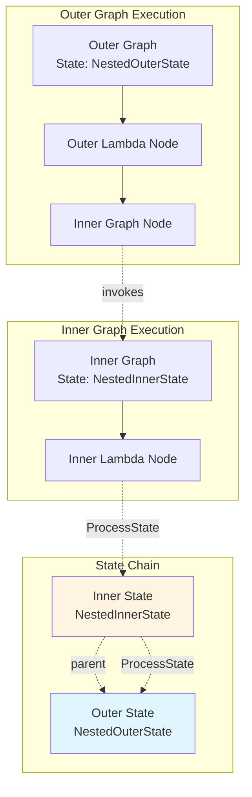

# state_testing 模块深度解析

## 问题场景

在构建嵌套的工作流图时，如何安全且正确地处理状态管理是一个关键挑战。当内部图节点需要访问外部图的状态，或者在中断恢复后需要重新建立状态关系时，传统的状态管理方式往往会遇到以下问题：

- 状态可见性问题：内部图如何访问外部图的状态
- 状态遮蔽问题：当内外图有相同类型的状态时，如何处理
- 中断恢复问题：当工作流从检查点恢复时，如何正确重建状态链
- 并发安全问题：如何在多 goroutine 环境下安全地访问嵌套状态

`state_testing` 模块正是为了解决这些问题而设计的，它通过一组精心设计的测试用例，验证并展示了 `compose` 包中状态管理系统的工作原理。

## 核心抽象与心智模型

### 嵌套状态链

想象状态管理就像一个洋葱，每一层嵌套图都为这个洋葱增加一层。当你需要访问状态时，系统会从最内层开始向外层查找，直到找到匹配的类型。

```
Outer Graph (NestedOuterState)
    ↓
Inner Graph (NestedInnerState)
    ↓
Node Execution
```

### 关键抽象

- **状态链 (State Chain)**: 一种链表结构，内部图的状态持有对外部图状态的引用
- **词法作用域 (Lexical Scoping)**: 内部状态优先于外部状态，类似于编程语言中的变量遮蔽
- **类型安全访问**: 通过 `ProcessState` 函数提供类型安全的状态访问方式

## 架构与数据流动

### 嵌套状态链架构

下面是嵌套图状态管理的整体架构：



### 状态查找流程

```
ProcessState<T>(ctx, handler)
    ↓
从 context 中获取 internalState
    ↓
检查当前状态类型是否匹配 T
    ↓
    ├─ 匹配 → 调用 handler，加锁保护
    └─ 不匹配 → 查找父状态链，重复检查
```

### ProcessState 的内部工作原理

从测试代码 `TestStateGraphUtils` 中，我们可以看到 `ProcessState` 的关键行为：

```go
// 成功获取状态的场景
ctx = context.WithValue(ctx, stateKey{}, &internalState{
    state: &testStruct{UserID: 10},
})

err := ProcessState[*testStruct](ctx, func(_ context.Context, state *testStruct) error {
    userID = state.UserID
    return nil
})

// 类型不匹配的场景
err := ProcessState[string](ctx, func(_ context.Context, state string) error {
    return nil
})
// 错误信息: "cannot find state with type: string in states chain, current state type: *compose.testStruct"
```

**核心机制**：
1. **Context 存储**：状态通过 `context.WithValue` 存储在 Context 中，使用私有 `stateKey{}` 作为键
2. **类型安全检查**：通过 Go 的泛型机制确保类型安全
3. **状态链遍历**：如果当前状态类型不匹配，会沿着父状态链继续查找
4. **错误反馈**：提供详细的错误信息，包含当前状态类型和期望类型

### 关键组件

让我们看看用于测试的状态结构：

```go
// NestedOuterState 代表外层图的状态
type NestedOuterState struct {
    Value   string  // 存储字符串值
    Counter int     // 计数器，用于演示并发安全
}

// NestedInnerState 代表内层图的状态
type NestedInnerState struct {
    Value string  // 内层状态的值
}
```

这些状态结构被注册到 schema 系统中，以便在序列化和反序列化时能够正确识别：

```go
func init() {
    schema.RegisterName[*NestedOuterState]("NestedOuterState")
    schema.RegisterName[*NestedInnerState]("NestedInnerState")
}
```

## 核心功能详解

### 1. 嵌套状态访问

`TestNestedGraphStateAccess` 测试展示了内部图节点如何同时访问内外层状态：

```go
innerNode := func(ctx context.Context, input string) (string, error) {
    // 访问外层状态
    var outerValue string
    err := ProcessState(ctx, func(ctx context.Context, s *NestedOuterState) error {
        outerValue = s.Value
        return nil
    })
    
    // 访问内层状态
    var innerValue string
    err = ProcessState(ctx, func(ctx context.Context, s *NestedInnerState) error {
        innerValue = s.Value
        return nil
    })
    
    return fmt.Sprintf("%s_inner=%s_outer=%s", input, innerValue, outerValue), nil
}
```

**设计意图**：状态链机制允许内部图无缝访问外部图的状态，这对于构建可组合的工作流至关重要。每个内部图不需要知道外部图的具体结构，只需要通过类型安全的方式访问需要的状态。

### 2. 状态遮蔽

`TestNestedGraphStateShadowing` 测试验证了当内外层有相同类型状态时的行为：

```go
type CommonState struct {
    Value string
}

innerNode := func(ctx context.Context, input string) (string, error) {
    var value string
    err := ProcessState(ctx, func(ctx context.Context, s *CommonState) error {
        // 应该看到 "inner" 而不是 "outer"
        value = s.Value
        return nil
    })
    return input + "_" + value, nil
}
```

**设计意图**：采用词法作用域规则，内部状态遮蔽外部状态，这样内部图可以安全地使用自己的状态类型，而不必担心与外部图的状态冲突。这提供了良好的封装性。

### 3. 中断恢复后的状态链接

`TestNestedGraphStateAfterResume` 测试验证了从检查点恢复后状态链的正确性：

```go
// 首先修改外层状态
outerNode := func(ctx context.Context, input string) (string, error) {
    err := ProcessState(ctx, func(ctx context.Context, s *NestedOuterState) error {
        s.Counter = 42  // 修改状态
        return nil
    })
    return input, nil
}

// 然后内层图读取这个修改后的状态
innerNode := func(ctx context.Context, input string) (string, error) {
    var outerCounter int
    err := ProcessState(ctx, func(ctx context.Context, s *NestedOuterState) error {
        outerCounter = s.Counter  // 应该读取到 42
        return nil
    })
    return fmt.Sprintf("%s_counter=%d", input, outerCounter), nil
}
```

**设计意图**：当从检查点恢复时，系统需要正确重建状态链。即使外层状态是从存储中重新加载的新实例，内层图仍然能够正确链接到它，这确保了中断恢复后工作流的一致性。

### 4. Lambda 调用内部图的状态访问

`TestLambdaNestedGraphStateAccess` 测试展示了通过 Lambda 节点调用内部图时的状态传递：

```go
// 将内部图编译为可运行对象
innerRunnable, err := innerGraph.Compile(context.Background())

// Lambda 节点调用内部图
lambdaNode := InvokableLambda(func(ctx context.Context, input string) (string, error) {
    // 状态上下文通过 ctx 自动传递
    return innerRunnable.Invoke(ctx, input)
})
```

**设计意图**：状态通过 Context 传递，这种设计使得 Lambda 节点可以像调用普通函数一样调用内部图，而不需要显式地传递状态。这大大简化了嵌套图的使用。

### 5. 并发安全

`TestNestedGraphStateConcurrency` 测试验证了多 goroutine 环境下状态访问的安全性：

```go
// 启动 10 个 goroutine 并发修改外层状态
for i := 0; i < 10; i++ {
    wg.Add(1)
    go func() {
        defer wg.Done()
        err := ProcessState(ctx, func(ctx context.Context, s *NestedOuterState) error {
            current := s.Counter
            time.Sleep(time.Millisecond)  // 模拟工作
            s.Counter = current + 1
            return nil
        })
    }()
}
```

**设计意图**：`ProcessState` 函数在执行 handler 期间会持有状态的锁，这确保了在 handler 执行期间状态不会被其他 goroutine 修改。这种设计使得并发访问状态变得安全。

## 设计权衡与决策

### 1. 类型安全 vs 动态访问

**选择**：通过泛型函数 `ProcessState[T]` 提供类型安全的访问方式

**权衡**：
- ✅ 编译时类型检查，避免运行时错误
- ✅ IDE 自动补全支持
- ❌ 需要预先知道状态类型
- ❌ 对于动态类型场景不够灵活

**理由**：在工作流系统中，状态类型通常是已知的，类型安全带来的好处远远超过灵活性的损失。

### 2. 隐式状态传递 vs 显式参数

**选择**：通过 Context 隐式传递状态

**权衡**：
- ✅ 简化 API，不需要在每个函数调用中传递状态
- ✅ 支持深度嵌套的调用链
- ❌ 状态依赖不明显，降低了代码可读性
- ❌ 测试时需要设置 Context

**理由**：在图执行引擎中，状态需要在多个节点之间传递，使用 Context 是最自然的方式。

### 3. 词法作用域 vs 全局访问

**选择**：采用词法作用域，内部状态遮蔽外部状态

**权衡**：
- ✅ 符合程序员的直觉
- ✅ 提供了良好的封装性
- ❌ 可能导致意外的遮蔽行为

**理由**：这是大多数编程语言采用的方式，开发者已经熟悉这种行为。

### 4. 粗粒度锁 vs 细粒度锁

**选择**：在整个 handler 执行期间持有锁

**权衡**：
- ✅ 简化了使用，不需要手动管理锁
- ✅ 避免了死锁风险
- ❌ 可能降低并发性能
- ❌ handler 执行时间过长会影响其他 goroutine

**理由**：在大多数场景下，状态访问 handler 都是短时间运行的，粗粒度锁带来的简单性是值得的。

## 使用指南与最佳实践

### 基本模式

访问状态的标准模式是：

```go
err := ProcessState(ctx, func(ctx context.Context, state *MyState) error {
    // 在这里安全地访问和修改 state
    state.Field = value
    return nil
})
if err != nil {
    // 处理错误，通常是找不到匹配类型的状态
}
```

### 嵌套图的状态管理

当构建嵌套图时：

1. 在外部图中定义外部状态
2. 在内部图中定义内部状态（如果需要）
3. 内部图可以通过 `ProcessState` 访问外部状态
4. 如果需要遮蔽外部状态，使用相同的类型

### 中断恢复的注意事项

1. 确保所有状态类型都通过 `schema.RegisterName` 注册
2. 状态应该是可序列化的（公共字段，支持 JSON 编码）
3. 从检查点恢复后，状态链会自动重建，不需要额外处理

### 并发访问的最佳实践

1. 保持 `ProcessState` 的 handler 函数简短
2. 避免在 handler 中进行 I/O 操作或长时间计算
3. 如果需要复杂的并发模式，考虑在 handler 外部进行

## 常见陷阱与注意事项

### 1. 状态类型必须匹配

`ProcessState` 使用精确的类型匹配，因此：

```go
// 这样不会工作，因为类型不匹配
err := ProcessState[MyState](ctx, ...)  // 假设实际状态是 *MyState

// 必须使用指针类型
err := ProcessState[*MyState](ctx, ...)
```

### 2. 状态遮蔽可能导致意外行为

当内部图和外部图有相同类型的状态时，内部图会遮蔽外部图：

```go
// 外部图状态
type Config struct { Timeout int }

// 内部图也有相同类型
// 内部图中访问 Config 会得到内部的，而不是外部的
```

如果需要访问外部状态，需要重新组织状态结构。

### 3. Context 必须正确传递

状态是通过 Context 传递的，因此必须确保 Context 在调用链中正确传递：

```go
// 错误：创建了新的 Context
innerRunnable.Invoke(context.Background(), input)

// 正确：传递现有的 Context
innerRunnable.Invoke(ctx, input)
```

### 4. 状态修改应该在 handler 中进行

所有对状态的修改都应该在 `ProcessState` 的 handler 函数中进行：

```go
// 错误：先获取状态，然后在外部修改
var state *MyState
ProcessState(ctx, func(ctx context.Context, s *MyState) error {
    state = s
    return nil
})
state.Field = value  // 不安全！

// 正确：在 handler 中修改
ProcessState(ctx, func(ctx context.Context, s *MyState) error {
    s.Field = value
    return nil
})
```

## 相关模块

- [graph_execution_runtime](compose_graph_engine-graph_execution_runtime.md) - 图执行引擎核心
- [checkpointing_and_rerun_persistence](compose_graph_engine-checkpointing_and_rerun_persistence.md) - 检查点持久化
- [tool_node_execution_and_interrupt_control](compose_graph_engine-tool_node_execution_and_interrupt_control.md) - 中断控制

## 总结

`state_testing` 模块通过一系列全面的测试用例，展示了 `compose` 包中嵌套状态管理系统的强大功能。该系统支持：

- ✅ 类型安全的状态访问
- ✅ 嵌套图的状态链
- ✅ 词法作用域的状态遮蔽
- ✅ 中断恢复后的状态重建
- ✅ 并发安全的状态访问

这些功能使得构建复杂、可组合、可靠的工作流系统变得更加容易。通过理解这些测试用例，开发者可以更好地使用和扩展状态管理系统。
