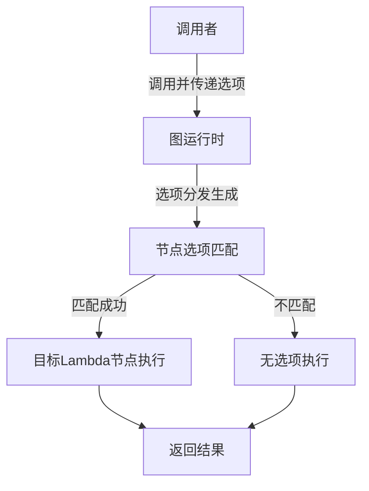

# lambda_options_test_infrastructure 模块深度解析

## 1. 模块概述

`lambda_options_test_infrastructure` 模块是 Eino 框架中用于支持 Lambda 函数选项测试的基础设施。该模块解决了在复杂的图计算流程中，如何将调用时的选项精准地路由到特定的 Lambda 节点的问题。

想象一下，你有一个包含多个处理节点的流水线，每个节点可能需要不同的配置参数。传统方法可能需要在构建图时就硬编码这些配置，或者需要一个复杂的配置传递机制。而这个模块提供了一种优雅的解决方案：在调用时动态地向特定节点传递选项。

## 2. 架构与核心概念

### 2.1 核心架构

这是一个典型的"选项路由"系统，它的工作原理可以用下面这个流程图来理解：



### 2.2 关键抽象

在深入代码之前，理解以下核心抽象非常重要：

1. **Lambda 函数**：可以接收选项的可执行单元，有四种类型：Invoke、Stream、Collect、Transform
2. **选项（Option）**：传递给 Lambda 的配置参数，可以是任意类型
3. **节点标识（NodeKey）**：用于唯一标识图中的节点
4. **节点路径（NodePath）**：支持在嵌套子图中定位节点的路径结构

## 3. 核心组件深度解析

### 3.1 Lambda 类型定义

首先，Lambda 相关的核心类型定义：

```go
// Invoke 是可调用 lambda 函数的类型
type Invoke[I, O, TOption any] func(ctx context.Context, input I, opts ...TOption) (output O, err error)

// InvokableLambdaWithOption 创建一个带有选项的可调用 Lambda
func InvokableLambdaWithOption[I, O, TOption any](i Invoke[I, O, TOption], opts ...LambdaOpt) *Lambda {
    return anyLambda(i, nil, nil, nil, opts...)
}
```

**设计意图解析**：
- 泛型参数 `TOption` 允许每个 Lambda 定义自己特定的选项类型
- 通过 `opts ...TOption` 的可变参数模式，保持了选项传递的灵活性

### 3.2 选项路由核心机制

选项路由的核心实现：

```go
// Option 是调用图时的函数选项类型
type Option struct {
    options []any
    handler []callbacks.Handler
    paths   []*NodePath
    // ... 其他字段
}

// DesignateNode 设置选项将应用到的节点键
func (o Option) DesignateNode(nodeKey ...string) Option {
    nKeys := make([]*NodePath, len(nodeKey))
    for i, k := range nodeKey {
        nKeys[i] = NewNodePath(k)
    }
    return o.DesignateNodeWithPath(nKeys...)
}

// WithLambdaOption 是 lambda 组件的函数选项类型
func WithLambdaOption(opts ...any) Option {
    return Option{
        options: opts,
        paths:   make([]*NodePath, 0),
    }
}
```

**设计意图解析**：
- `Option` 结构体是一个容器，保存选项值和目标节点信息
- `DesignateNode` 方法返回一个新的配置了目标节点的选项
- `WithLambdaOption` 使用 `any` 类型，提供极大的灵活性

### 3.3 FakeLambdaOptions：测试基础设施

在测试中使用的示例实现：

```go
type FakeLambdaOptions struct {
    Info string
}

type FakeLambdaOption func(opt *FakeLambdaOptions)

func FakeWithLambdaInfo(info string) FakeLambdaOption {
    return func(opt *FakeLambdaOptions) {
        opt.Info = info
    }
}
```

这是典型的"函数式选项"模式实现，优点包括 API 稳定、易于扩展、支持默认值等。

## 4. 数据流程分析

### 4.1 完整流程示例

测试场景示例：

```go
// 1. 创建带有选项的 Lambda
b.AddLambda("lambda_02", InvokableLambdaWithOption(func(ctx context.Context, kvs map[string]any, opts ...FakeLambdaOption) (map[string]any, error) {
    opt := &FakeLambdaOptions{}
    for _, optFn := range opts {
        optFn(opt)
    }
    kvs["lambda_02"] = opt.Info
    return kvs, nil
}), WithNodeKey("lambda_02"))

// 2. 编译并调用
res, err := r.Invoke(ctx, map[string]any{},
    WithLambdaOption(FakeWithLambdaInfo("normal")),
    WithLambdaOption(FakeWithLambdaInfo("info_lambda_02")).DesignateNode("lambda_02"),
)
```

### 4.2 数据流详解

1. **创建阶段**：使用 `InvokableLambdaWithOption` 创建 Lambda，用 `WithNodeKey` 分配唯一标识
2. **调用准备阶段**：创建选项并绑定到特定节点
3. **选项分发阶段**：图运行时遍历选项并与节点匹配
4. **执行阶段**：匹配到选项后，转换类型并调用 Lambda

## 5. 设计决策与权衡

### 5.1 使用 `any` 类型而非具体接口

- **优点**：极大的灵活性
- **缺点**：失去编译时类型安全
- **原因**：考虑到 Lambda 选项的多样性，灵活性更重要

### 5.2 节点标识和路径系统

- **优点**：可以精确地将选项传递到特定节点，甚至子图中的节点
- **缺点**：需要用户了解图的结构和节点的键
- **原因**：复杂工作流需要精确控制

### 5.3 调用时传递选项而非构建时

- **优点**：同一图可以在不同调用中使用不同配置，支持动态配置
- **缺点**：增加运行时复杂性
- **原因**：A/B 测试、动态调整参数等场景需要这种灵活性

## 6. 注意事项与常见陷阱

1. **类型安全问题**：由于使用 `any` 类型，容易传递错误类型的选项，建议编写测试验证
2. **节点键匹配问题**：确保 `WithNodeKey` 和 `DesignateNode` 使用相同的键
3. **选项不会传播到子图**：默认选项不自动传播到子图，需明确指定

## 7. 总结

`lambda_options_test_infrastructure` 模块提供了强大而灵活的机制，用于在调用图时向特定节点传递选项。设计原则包括灵活性优先、精确控制、函数式设计和测试友好。虽然在类型安全方面有所妥协，但为复杂工作流配置提供了无与伦比的灵活性。
